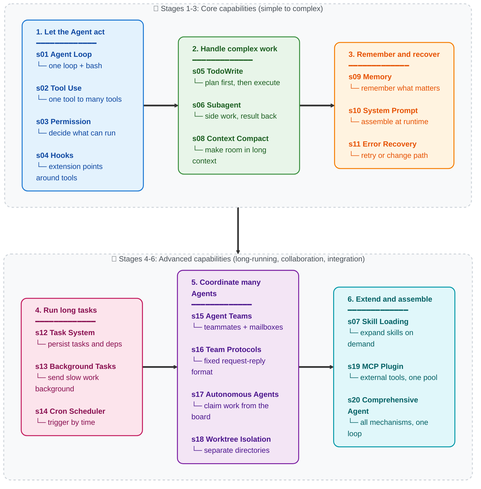

[English](./README.md) | [中文](./README-zh.md) | [日本語](./README-ja.md)

<a href="https://trendshift.io/repositories/19746" target="_blank"></a>

# Learn Claude Code -- Harness Engineering for Real Agents

## Agency Comes from the Model. An Agent Product = Model + Harness.

Before we write any code, one thing needs to be clear.

**Agency -- the capacity to perceive, reason, and act -- comes from model training, not from external code orchestration.** But a working agent product needs both the model and the harness. The model is the driver. The harness is the vehicle. This repository teaches you how to build the vehicle.

### Where Agency Comes From

At the core of every agent is a neural network -- a Transformer, an RNN, a trained function -- shaped by billions of gradient updates on sequences of perception, reasoning, and action. Agency was never bestowed by the surrounding code. It was learned during training.

Humans are the original proof. A biological neural network, refined by millions of years of evolutionary pressure, perceives the world through senses, reasons through a brain, and acts through a body. When DeepMind, OpenAI, or Anthropic say "agent," they all mean the same core thing: **a model that learned to act through training, plus the infrastructure that lets it operate in a specific environment.**

The historical record is unambiguous:

- **2013 -- DeepMind DQN plays Atari.** A single neural network, receiving only raw pixels and game scores, learned 7 Atari 2600 games -- surpassing prior algorithms and beating human experts in 3 of them. By 2015, scaled to [49 games at professional tester level](https://www.nature.com/articles/nature14236), published in *Nature*. No game-specific rules. One model, learning from experience.

- **2019 -- OpenAI Five conquers Dota 2.** Five neural networks played [45,000 years of Dota 2 against themselves](https://openai.com/index/openai-five-defeats-dota-2-world-champions/) over 10 months, then defeated **OG** -- the TI8 world champions -- 2-0 in a live match. In the public arena, the AI won 99.4% of 42,729 games. No scripted strategies. Models learned teamwork through self-play.

- **2019 -- DeepMind AlphaStar masters StarCraft II.** AlphaStar [beat a professional player 10-1](https://deepmind.google/blog/alphastar-mastering-the-real-time-strategy-game-starcraft-ii/) in closed matches, then reached [Grandmaster rank](https://www.nature.com/articles/d41586-019-03298-6) on the European server -- top 0.15% of 90,000 players. An incomplete-information, real-time game with a combinatorial action space far exceeding chess or Go.

- **2019 -- Tencent Jueyu dominates Honor of Kings.** Tencent AI Lab's "Jueyu" system [defeated KPL professional players in full 5v5](https://www.jiemian.com/article/3371171.html) at the World Champion Cup semifinal. In 1v1 mode, pros [won just 1 out of 15 matches, lasting under 8 minutes at best](https://developer.aliyun.com/article/851058). Training intensity: one day equaled 440 human years. A model that learned the entire game from scratch through self-play.

- **2024-2025 -- LLM agents reshape software engineering.** Claude, GPT, Gemini -- large language models trained on the full breadth of human code and reasoning -- are deployed as coding agents. They read codebases, write implementations, debug failures, and coordinate as teams. The architecture is identical to every previous agent: a trained model, placed in an environment, given tools for perception and action.

Every milestone points to the same fact: **Agency -- the ability to perceive, reason, and act -- is trained, not coded.** But every agent also needs an environment to operate in: an Atari emulator, the Dota 2 client, the StarCraft II engine, an IDE and a terminal. The model supplies the intelligence. The environment supplies the action space. Together they form a complete agent.

### What an Agent Is NOT

The word "agent" has been hijacked by an entire prompt-plumbing industry.

Drag-and-drop workflow builders. No-code "AI Agent" platforms. Prompt-chain orchestration libraries. They share a single delusion: that stringing LLM API calls together with if-else branches, node graphs, and hardcoded routing logic constitutes "building an agent."

It does not. What they produce are Rube Goldberg machines -- over-engineered, brittle, procedural rule pipelines with an LLM wedged in as a glorified text-completion node. That is not an agent. That is a shell script with grandiose pretensions.

You cannot brute-force intelligence by stacking procedural logic -- sprawling rule trees, node graphs, chained prompt waterfalls -- and praying that enough glue code will spontaneously produce autonomous behavior. It will not. You cannot engineer agency into existence. Agency is learned, not coded.

### The Mindshift: From "Building Agents" to Building Harnesses

When someone says "I am building an agent," they can only mean one of two things:

**1. Training a model.** Adjusting weights through reinforcement learning, fine-tuning, RLHF, or another gradient-based method. Collecting trajectory data -- real-world sequences of perception, reasoning, and action in a target domain -- and using it to shape the model's behavior. This is what DeepMind, OpenAI, Tencent AI Lab, and Anthropic do.

**2. Building a harness.** Writing the code that gives a model an operational environment. This is what most of us do, and it is the core of this repository.

A harness is everything an agent needs to work in a specific domain:

```
Harness = Tools + Knowledge + Observation + Action Interfaces + Permissions

    Tools:          file I/O, shell, network, database, browser
    Knowledge:      product docs, domain references, API specs, style guides
    Observation:    git diff, error logs, browser state, sensor data
    Action:         CLI commands, API calls, UI interactions
    Permissions:    sandbox isolation, approval workflows, trust boundaries
```

The model decides. The harness executes. The model reasons. The harness provides context. The model is the driver. The harness is the vehicle.

This repository teaches you to build the vehicle. A vehicle for coding. But the design patterns generalize to any domain.

### What Harness Engineers Actually Do

If you are reading this repository, you are most likely a harness engineer. Here is what the job actually entails:

- **Implement tools.** Give the agent hands. File read/write, shell execution, API calls, browser control, database queries. Each tool is one action the agent can take in its environment. Design them atomic, composable, and clearly described.

- **Curate knowledge.** Give the agent domain expertise. Product documentation, architecture decision records, style guides, compliance requirements. Load on demand, not upfront.

- **Manage context.** Give the agent clean memory. Subagent isolation prevents noise leakage. Context compaction prevents history from drowning the present. Task systems let goals persist beyond a single conversation.

- **Control permissions.** Give the agent boundaries. Sandbox file access. Require approval for destructive operations. Enforce trust boundaries between the agent and external systems.

- **Collect trajectory data.** Every action sequence the agent executes in your harness is training signal. Real deployment trajectories are the raw material for fine-tuning the next generation of agent models.

You are not writing intelligence. You are building the world that intelligence inhabits. The quality of that world directly determines how effectively the intelligence can express itself.

**Build the harness well. The model will do the rest.**

### Why Claude Code

Because Claude Code is the most elegant, most complete agent harness implementation we have seen. Not because of any clever trick, but because of what it *does not* do: it does not try to be the agent. It does not impose rigid workflows. It does not substitute hand-crafted decision trees for the model's own judgment. It gives the model tools, knowledge, context management, and permission boundaries -- then gets out of the way.

Strip Claude Code down to its essence:

```
Claude Code = one agent loop
            + tools (bash, read, write, edit, glob, grep, browser...)
            + on-demand skill loading
            + context compaction
            + subagent spawning
            + task system with dependency graphs
            + async mailbox team coordination
            + worktree-isolated parallel execution
            + permission governance
            + hooks extension system
            + memory persistence
            + MCP external capability routing
```

That is it. The agent itself? Claude. A model. Trained by Anthropic on the full breadth of human reasoning and code. The harness did not make Claude smart. Claude was already smart. The harness gave Claude hands, eyes, and a workspace.

The takeaway is not "copy Claude Code." The takeaway is: **the best agent products come from engineers who understand that their job is the harness, not the intelligence.**

---

```
                    THE AGENT PATTERN
                    =================

    User --> messages[] --> LLM --> response
                                      |
                            stop_reason == "tool_use"?
                           /                          \
                         yes                           no
                          |                             |
                    execute tools                    return text
                    append results
                    loop back -----------------> messages[]


    The model decides when to call tools and when to stop.
    The code just executes what the model asks for.
    This repo teaches you to build everything around this loop --
    the harness that makes the agent effective in a specific domain.
```

## Core Pattern

```python
def agent_loop(messages):
    while True:
        response = client.messages.create(
            model=MODEL, system=SYSTEM,
            messages=messages, tools=TOOLS,
        )
        messages.append({"role": "assistant",
                         "content": response.content})

        if response.stop_reason != "tool_use":
            return

        results = []
        for block in response.content:
            if block.type == "tool_use":
                output = TOOL_HANDLERS[block.name](**block.input)
                results.append({
                    "type": "tool_result",
                    "tool_use_id": block.id,
                    "content": output,
                })
        messages.append({"role": "user", "content": results})
```

Every lesson layers one harness mechanism on top of this loop -- the loop itself never changes. The loop belongs to the agent. The mechanisms belong to the harness.

The loop is constant. Tools, knowledge, and permissions change. Agent = Model (LLM) + a generalized operational environment (Harness).

---

## Version Status

This repository currently contains two tutorial tracks:

- **Current track: root-level `s01-s20`**
  The root-level `s01_*` ... `s20_*` folders are the new canonical version. Each chapter contains a full narrative README, translations, runnable `code.py`, and diagrams where needed.
- **Legacy transition track: `docs/`, `agents/`, and the current `web/` app**
  These still preserve the older 12-lesson version. They are kept temporarily for existing readers, old links, and the web platform while the new 20-lesson track settles.

If you are starting now, read the root-level `s01_agent_loop/` through `s20_comprehensive/` chapters. If you are following an older link or using the current web app, you are likely reading the legacy 12-lesson track. The legacy and current chapter numbers do not always match, so avoid mixing chapter numbers across tracks.

### Legacy-to-Current Mapping

| Legacy 12-lesson track | Current 20-lesson track | Topic |
|---|---|---|
| old s01 | new s01 | Agent Loop |
| old s02 | new s02 | Tool Use |
| old s03 | new s05 | TodoWrite |
| old s04 | new s06 | Subagent |
| old s05 | new s07 | Skill Loading |
| old s06 | new s08 | Context Compact |
| old s07 | new s12 | Task System |
| old s08 | new s13 | Background Tasks |
| old s09 | new s15 | Agent Teams |
| old s10 | new s16 | Team Protocols |
| old s11 | new s17 | Autonomous Agents |
| old s12 | new s18 | Worktree Isolation |
| new only | s03, s04, s09, s10, s11, s14, s19, s20 | Permission, Hooks, Memory, System Prompt, Error Recovery, Cron, MCP, Comprehensive Agent |

---

## Scope

This repository is a 0-to-1 harness engineering learning project: it teaches how to build the working environment around an agent model. To keep the learning path clear, some production mechanisms are intentionally simplified or omitted:

- Full event / hook bus behavior, such as `PreToolUse`, `SessionStart/End`, and `ConfigChange`.
  The teaching code uses minimal lifecycle events where needed.
- Rule-based permission governance and full trust workflows.
- Session lifecycle controls such as resume/fork, plus more complete worktree lifecycle handling.
- Full MCP runtime details such as transport, OAuth, resource subscription, and polling.

The JSONL mailbox protocol in this repository is a teaching implementation, not a claim about any specific production internal implementation.

---

## 20 Progressive Lessons

**Each lesson adds one harness mechanism. Each mechanism has a motto.**

> **s01** &nbsp; *"One loop & Bash is all you need"* &mdash; one tool + one loop = one agent
>
> **s02** &nbsp; *"Adding a tool means adding one handler"* &mdash; the loop stays untouched; new tools register into the dispatch map
>
> **s03** &nbsp; *"Set boundaries first, then grant freedom"* &mdash; check what can run, what must stop, and what needs approval
>
> **s04** &nbsp; *"Hook around the loop, never rewrite the loop"* &mdash; add extension points without changing the main loop
>
> **s05** &nbsp; *"An agent without a plan drifts"* &mdash; list the steps before starting; completion rate doubles
>
> **s06** &nbsp; *"Big tasks split small, each subtask gets clean context"* &mdash; subagents do the side work and bring back only the result
>
> **s07** &nbsp; *"Load knowledge on demand, not upfront"* &mdash; list skills first, expand them only when needed
>
> **s08** &nbsp; *"Context always fills up -- have a way to make room"* &mdash; multi-layer compaction strategies buy you infinite sessions
>
> **s09** &nbsp; *"Remember what matters, forget what doesn't"* &mdash; three subsystems: selection, extraction, consolidation
>
> **s10** &nbsp; *"Prompts are assembled at runtime, not hardcoded"* &mdash; section-based concatenation, loaded on demand
>
> **s11** &nbsp; *"Errors aren't the end, they're the start of a retry"* &mdash; retry, make room, or take another path when things fail
>
> **s12** &nbsp; *"Big goals break into small tasks, ordered, persisted to disk"* &mdash; a file-backed task graph that lays the groundwork for multi-agent coordination
>
> **s13** &nbsp; *"Slow ops go background, agent keeps thinking"* &mdash; background threads run commands; notifications inject on completion
>
> **s14** &nbsp; *"Fire on schedule, no human kick needed"* &mdash; trigger tasks automatically by time
>
> **s15** &nbsp; *"Too big for one agent -- delegate to teammates"* &mdash; persistent teammates + async mailboxes
>
> **s16** &nbsp; *"Teammates need shared communication rules"* &mdash; use a fixed request-reply format for coordination
>
> **s17** &nbsp; *"Teammates check the board, claim work themselves"* &mdash; no leader assigning one by one; self-organizing
>
> **s18** &nbsp; *"Each works in its own directory, no interference"* &mdash; tasks own goals, worktrees own directories, bound by ID
>
> **s19** &nbsp; *"Not enough capability? Plug in more via MCP"* &mdash; connect external tools into the same tool pool
>
> **s20** &nbsp; *"Many mechanisms, one loop"* &mdash; all previous mechanisms return to one complete harness

---

## Learning Path

Main line: act → handle complex work → remember and recover → run long tasks → collaborate → extend and assemble.



---

## All Chapters

| Chapter | Topic | Key Concepts |
|---|---|---|
| [s01](./s01_agent_loop/) | Agent Loop | `messages` / `while True` / `stop_reason` |
| [s02](./s02_tool_use/) | Tool Use | `TOOL_HANDLERS` / dispatch map / concurrency |
| [s03](./s03_permission/) | Permission System | `PermissionRule` / approval pipeline |
| [s04](./s04_hooks/) | Hook System | `PreToolUse` / `PostToolUse` / extension points |
| [s05](./s05_todo_write/) | TodoWrite | `TodoItem` / plan-then-execute |
| [s06](./s06_subagent/) | Subagent | `fresh messages[]` / context isolation |
| [s07](./s07_skill_loading/) | Skill Loading | `SkillManifest` / on-demand injection |
| [s08](./s08_context_compact/) | Context Compact | snipCompact / microCompact / toolResultBudget / autoCompact |
| [s09](./s09_memory/) | Memory System | selection / extraction / consolidation |
| [s10](./s10_system_prompt/) | System Prompt | runtime assembly / section concatenation |
| [s11](./s11_error_recovery/) | Error Recovery | token escalation / fallback model / retry strategies |
| [s12](./s12_task_system/) | Task System | `TaskRecord` / `blockedBy` / disk persistence |
| [s13](./s13_background_tasks/) | Background Tasks | threaded execution / notification queue |
| [s14](./s14_cron_scheduler/) | Cron Scheduler | durable scheduling / session-scoped triggers |
| [s15](./s15_agent_teams/) | Agent Teams | `MessageBus` / inbox / permission bubbling |
| [s16](./s16_team_protocols/) | Team Protocols | shutdown handshake / plan approval |
| [s17](./s17_autonomous_agents/) | Autonomous Agents | idle cycle / auto-claim / self-organization |
| [s18](./s18_worktree_isolation/) | Worktree Isolation | `WorktreeRecord` / task-directory binding |
| [s19](./s19_mcp_plugin/) | MCP Plugin | multi-transport / channel routing / tool pool assembly |
| [s20](./s20_comprehensive/) | Comprehensive Agent | all mechanisms around one loop |

---

## How to Read

Each chapter is a folder. Open one and you will find:

```
s08_context_compact/
  README.md              # full narrative with inline code
  README.en.md           # English translation
  README.ja.md           # Japanese translation
  code.py                # standalone runnable implementation
  images/                # SVG diagrams (where needed)
```

Read the `README.md` for the core idea and work through the code. Complex chapters have `<details>` folds for deep dives -- open them when you want to go deeper. Simple chapters have 0-1 diagrams, complex chapters have more.

Read from s01 through s20 in order. Each chapter assumes you've read the previous ones and ends with a hook into the next.

---

## Quick Start

### Current 20-Lesson Track

```sh
git clone https://github.com/shareAI-lab/learn-claude-code
cd learn-claude-code
pip install -r requirements.txt
cp .env.example .env   # configure ANTHROPIC_API_KEY

python s01_agent_loop/code.py        # Start here -- one loop + bash
python s08_context_compact/code.py   # Context compaction (complex)
python s20_comprehensive/code.py     # Endpoint: all mechanisms in one loop
```

### Legacy 12-Lesson Track

```sh
python agents/s01_agent_loop.py
python agents/s12_worktree_task_isolation.py
python agents/s_full.py
```

### Web Platform

The current web app still renders the legacy `docs/` s01-s12 track. Use the root-level folders for the new s01-s20 track.

```sh
cd web && npm install && npm run dev   # http://localhost:3000
```

---

## Project Structure

```
learn-claude-code/
  s01_agent_loop/          # one folder per chapter
    README.md              #   Chinese source (complete narrative)
    README.en.md           #   English translation
    README.ja.md           #   Japanese translation
    code.py                #   standalone runnable code
    images/                #   SVG diagrams
  s02_tool_use/
  ...
  s19_mcp_plugin/
  s20_comprehensive/       # endpoint chapter
  agents/                  # legacy 12 runnable copies + s_full.py
  skills/                  # skill files used by s07
  docs/                    # legacy 12-lesson docs, kept during transition
  web/                     # currently renders the legacy docs/ track
  tests/
```

---

## What's Next

After 20 lessons, you understand harness engineering from the inside out. Two paths to turn that knowledge into product:

### Kode Agent CLI -- Open-Source Coding Agent CLI

> `npm i -g @shareai-lab/kode`

Skill and LSP support, Windows compatible, works with GLM / MiniMax / DeepSeek and other open models. Install and go.

GitHub: **[shareAI-lab/Kode-Agent](https://github.com/shareAI-lab/Kode-Agent)**

### Kode Agent SDK -- Embed Agent Capabilities in Your Application

A standalone library with no per-user process overhead. Embed it in backends, browser extensions, embedded devices, or any runtime.

GitHub: **[shareAI-lab/kode-agent-sdk](https://github.com/shareAI-lab/kode-agent-sdk)**

---

## Sister Tutorial: From Passive Sessions to Always-On Assistants

The harness taught in this repository is the **use-and-discard** kind -- open a terminal, give the agent a task, close when done, next session starts fresh. Claude Code works this way.

But [OpenClaw](https://github.com/openclaw/openclaw) proves another possibility: on the same agent core, two additional harness mechanisms turn an agent from "poke it and it moves" into "wakes itself every 30 seconds to look for work":

- **Heartbeat** -- every 30 seconds the harness sends the agent a message, letting it check for pending work. Nothing to do? Keep sleeping. Something appeared? Act immediately.
- **Cron** -- the agent can schedule its own future tasks, which fire automatically when the time arrives.

Add IM multi-channel routing (WhatsApp / Telegram / Slack / Discord and 13+ other platforms), persistent context memory, and a Soul personality system, and the agent transforms from a disposable tool into an always-on personal AI assistant.

**[claw0](https://github.com/shareAI-lab/claw0)** is our sister teaching repository, breaking down these harness mechanisms from scratch:

```
claw agent = agent core + heartbeat + cron + IM chat + memory + soul
```

```
learn-claude-code                   claw0
(agent harness internals:            (always-on harness:
 loop, tools, planning,               heartbeat, cron, IM channels,
 teams, worktree isolation)            memory, Soul personality)
```

## License

MIT

---

**Agency comes from the model. The harness gives agency a place to land. Build the harness well, and the model will do the rest.**

**Bash is all you need. Real agents are all the universe needs.**

**This is not "copy the source code." This is "grasp the key designs and build it yourself."**
