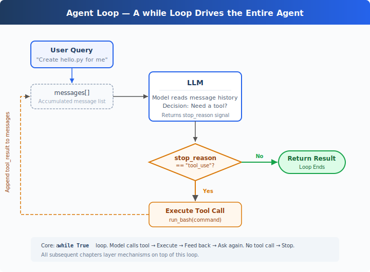

# s01: The Agent Loop — One Loop Is All You Need

[中文](README.md) · [English](README.en.md) · [日本語](README.ja.md)

`s01` → [s02](../s02_tool_use/) → s03 → s04 → ... → s20
> *"One loop & Bash is all you need"* — One tool + one loop = one Agent.
>
> **Harness Layer**: The Loop — the first bridge between the model and the real world.

---

## The Problem

You ask the model: "List the files in my directory and run XXX.py."

The model can output a bash command, but once it's done outputting, it stops — it won't execute the command on its own, and it won't keep reasoning based on the result.

You could run it manually, paste the output back into the chat, and let it continue. Next command comes out, you run it again, paste it back.

Every round-trip, you're the middle layer. Automating that is what this chapter is about.

---

## The Solution



A `while True` loop: keep going when the model calls a tool, stop when it doesn't. The entire process hinges on two signals:

| Signal | Meaning | Loop Action |
|--------|---------|-------------|
| `stop_reason == "tool_use"` | Model raises hand: "I need a tool" | Execute → feed result back → continue |
| `stop_reason != "tool_use"` | Model says: "I'm done" | Exit loop |

---

## How It Works

Let's translate this process into code. Step by step:

**Step 1**: Start with the user's question as the first message.

```python
messages = [{"role": "user", "content": query}]
```

**Step 2**: Send the messages and tool definitions to the LLM.

```python
response = client.messages.create(
    model=MODEL, system=SYSTEM, messages=messages,
    tools=TOOLS, max_tokens=8000,
)
```

**Step 3**: Append the model's response and check whether it called a tool. No tool call → done.

```python
messages.append({"role": "assistant", "content": response.content})
if response.stop_reason != "tool_use":
    return
```

**Step 4**: Execute the tool the model requested and collect the results.

```python
results = []
for block in response.content:
    if block.type == "tool_use":
        output = run_bash(block.input["command"])
        results.append({
            "type": "tool_result",
            "tool_use_id": block.id,
            "content": output,
        })
```

**Step 5**: Append the tool results as a new message and go back to Step 2.

```python
messages.append({"role": "user", "content": results})
```

Assembled into a complete function:

```python
def agent_loop(messages):
    while True:
        response = client.messages.create(
            model=MODEL, system=SYSTEM, messages=messages,
            tools=TOOLS, max_tokens=8000,
        )
        messages.append({"role": "assistant", "content": response.content})

        if response.stop_reason != "tool_use":
            return

        results = []
        for block in response.content:
            if block.type == "tool_use":
                output = run_bash(block.input["command"])
                results.append({
                    "type": "tool_result",
                    "tool_use_id": block.id,
                    "content": output,
                })
        messages.append({"role": "user", "content": results})
```

Under 30 lines — that's the minimal runnable agent harness kernel. It's not intelligence itself, but the smallest runtime framework that lets the model keep acting. The model decides (whether to call a tool, which one), the harness executes (if called, run it, feed the result back). The next 18 chapters all add mechanisms on top of this loop. The loop itself never changes.

---

## Try It

> **Teaching demo notice**: The code executes shell commands generated by the model. Run it in a temporary test directory to avoid affecting your project files. s03 covers the real permission system.

**Setup** (first run):

```sh
pip install -r requirements.txt
cp .env.example .env
# Edit .env, fill in ANTHROPIC_API_KEY and MODEL_ID
```

**Run**:

```sh
python s01_agent_loop/code.py
```

Try these prompts:

1. `Create a file called hello.py that prints "Hello, World!"`
2. `List all Python files in this directory`
3. `What is the current git branch?`

What to watch for: When does the model call a tool (loop continues), and when does it not (loop ends)?

---

## What's Next

Right now the model only has bash — reading files requires `cat`, writing files requires `echo ... >`, finding files requires `find`. Ugly and error-prone.

→ s02 Tool Use: What happens when we give it 5 proper tools? Will the model call multiple tools at once? Will parallel tool executions step on each other?

<details>
<summary>Dive into CC Source Code</summary>

> The following is based on a review of CC source code `src/query.ts` (1729 lines). The core differences are twofold: CC doesn't rely on the `stop_reason` field to decide whether to continue the loop — instead it checks whether the content contains `tool_use` blocks (because `stop_reason` is unreliable in streaming responses); CC has more exit paths and recovery strategies for production-grade protection.

**The 30-line `while True` from the teaching version IS the core of CC's 1729 lines.** Everything below is a protection mechanism layered on top of that core.

<details>
<summary>1. Loop Structure Differences</summary>

The teaching version checks `response.stop_reason`. CC doesn't use it as the sole signal for loop continuation — in streaming responses, `stop_reason` may not have updated yet even though `tool_use` blocks are already present. CC uses a `needsFollowUp` flag: during streaming message reception (`query.ts:830-834`), it's set to `true` whenever a `tool_use` block is detected. `QueryEngine.ts` captures the real `stop_reason` from `message_delta` for other logic, but the query loop itself relies on `needsFollowUp`.

```typescript
// query.ts:554-558
// stop_reason === 'tool_use' is unreliable.
// Set during streaming whenever a tool_use block arrives.
let needsFollowUp = false
```

</details>

<details>
<summary>2. State Object — 10 Fields (Teaching Version Only Uses messages)</summary>

| # | Field | Purpose | Chapter |
|---|-------|---------|---------|
| 1 | `messages` | Message array for the current iteration | s01 |
| 2 | `toolUseContext` | Tool, signal, and permission context | s02 |
| 3 | `autoCompactTracking` | Compaction state tracking | s08 |
| 4 | `maxOutputTokensRecoveryCount` | Token recovery attempt count (max 3) | s11 |
| 5 | `hasAttemptedReactiveCompact` | Whether reactive compaction was attempted this round | s08 |
| 6 | `maxOutputTokensOverride` | 8K→64K upgrade override | s11 |
| 7 | `pendingToolUseSummary` | Background Haiku-generated tool use summary | s08 |
| 8 | `stopHookActive` | Whether the stop hook produced a blocking error | s04 |
| 9 | `turnCount` | Turn count (for maxTurns check) | s01 |
| 10 | `transition` | Last continue reason | s11 |

> Note: `taskBudgetRemaining` (`query.ts:291`) is a loop-local variable, not on State. The source comment explicitly says "Loop-local (not on State)".

</details>

<details>
<summary>3. Multiple Exit and Continue Paths</summary>

The teaching version has only 1 exit path (model doesn't call a tool → done). The production version has multiple exit and continue paths, covering blocking limit, prompt too long, model error, abort, hook stop, max turns, token budget continuation, reactive compact retry, and more. Each scenario has a corresponding recovery or exit strategy.

</details>

<details>
<summary>4. Streaming Tool Execution and QueryEngine</summary>

CC's `StreamingToolExecutor` (`query.ts:561`) allows tools to begin parallel execution while the model is still generating (concurrency-safe tools run in parallel, others run exclusively). `QueryEngine.ts` adds additional protections for cost overruns, structured output validation failures, and more. The teaching version doesn't implement these — the goal is conceptual clarity, not peak performance.

</details>

**In one sentence**: The core of query.ts's 1729 lines is a 30-line `while True`. All the complex fields and exit paths are protection mechanisms. Understand the core loop first, and everything that follows unfolds naturally.

</details>

<!-- translation-sync: zh@v1, en@v1, ja@v1 -->
