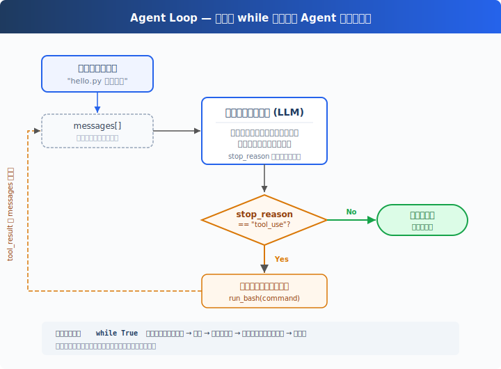

# s01: Agent Loop — ループ一つで十分

[中文](README.md) · [English](README.en.md) · [日本語](README.ja.md)

`s01` → [s02](../s02_tool_use/) → s03 → s04 → ... → s20
> *"One loop & Bash is all you need"* — ツール一つ + ループ一つ = 一つの Agent。
>
> **Harness レイヤー**: ループ — モデルと現実世界をつなぐ最初の架け橋。

---

## 課題

モデルにこう頼んだとする：「ディレクトリ内のファイル一覧を取得して、XXX.py を実行して」。

モデルは bash コマンドを出力できるが、出力が終わると止まってしまう — 自分で実行することも、結果を見て推論を続けることもない。

手動で実行し、出力をチャットに貼り付ければ、モデルは続きを生成できる。次のコマンドが出たら、また実行して貼り付ける。

毎回の往復で、あなたが中間層になっている。これを自動化するのが、この章の目的だ。

---

## ソリューション



一つの `while True` ループ — モデルがツールを呼べば続き、呼ばなければ停止。全体でたった 2 つのシグナル：

| シグナル | 意味 | ループの動作 |
|----------|------|-------------|
| `stop_reason == "tool_use"` | モデルが「ツールが必要」と挙手 | 実行 → 結果を戻す → 続行 |
| `stop_reason != "tool_use"` | モデルが「完了」と宣言 | ループ終了 |

---

## 仕組み

このプロセスをコードに変換してみよう。ステップごとに：

**ステップ 1**：ユーザーの質問を最初のメッセージとして設定する。

```python
messages = [{"role": "user", "content": query}]
```

**ステップ 2**：メッセージとツール定義を一緒に LLM に送信する。

```python
response = client.messages.create(
    model=MODEL, system=SYSTEM, messages=messages,
    tools=TOOLS, max_tokens=8000,
)
```

**ステップ 3**：モデルの応答を追加し、ツールを呼び出したか確認する。呼び出しなし → 終了。

```python
messages.append({"role": "assistant", "content": response.content})
if response.stop_reason != "tool_use":
    return
```

**ステップ 4**：モデルが要求したツールを実行し、結果を収集する。

```python
results = []
for block in response.content:
    if block.type == "tool_use":
        output = run_bash(block.input["command"])
        results.append({
            "type": "tool_result",
            "tool_use_id": block.id,
            "content": output,
        })
```

**ステップ 5**：ツールの結果を新しいメッセージとして追加し、ステップ 2 に戻る。

```python
messages.append({"role": "user", "content": results})
```

完全な関数に組み立てる：

```python
def agent_loop(messages):
    while True:
        response = client.messages.create(
            model=MODEL, system=SYSTEM, messages=messages,
            tools=TOOLS, max_tokens=8000,
        )
        messages.append({"role": "assistant", "content": response.content})

        if response.stop_reason != "tool_use":
            return

        results = []
        for block in response.content:
            if block.type == "tool_use":
                output = run_bash(block.input["command"])
                results.append({
                    "type": "tool_result",
                    "tool_use_id": block.id,
                    "content": output,
                })
        messages.append({"role": "user", "content": results})
```

30 行未満 — これが最小実行可能な agent harness のカーネルだ。これは知能そのものではなく、モデルが継続的に行動できるための最小ランタイムフレームワーク。モデルが決定し（ツールを呼ぶか、どれを呼ぶか）、harness が実行する（呼ばれたら実行し、結果を戻す）。次の 18 章はすべてこのループの上に仕組みを積み重ねていく。ループ自体は永遠に変わらない。

---

## 試してみよう

> **教育デモの注意**: このコードはモデルが生成したシェルコマンドを実行します。プロジェクトファイルへの影響を避けるため、一時テストディレクトリで実行してください。s03 で本格的な権限システムを説明します。

**準備**（初回のみ）：

```sh
pip install -r requirements.txt
cp .env.example .env
# .env を編集し、ANTHROPIC_API_KEY と MODEL_ID を入力
```

**実行**：

```sh
python s01_agent_loop/code.py
```

以下のプロンプトを試してみよう：

1. `Create a file called hello.py that prints "Hello, World!"`
2. `List all Python files in this directory`
3. `What is the current git branch?`

観察のポイント：モデルがツールを呼び出すとき（ループ継続）、呼び出さないとき（ループ終了）の違い。

---

## 次へ

現在、モデルが持っているのは bash だけだ — ファイルを読むには `cat`、書くには `echo ... >`、探すには `find`。不便でエラーも起きやすい。

→ s02 Tool Use：5 つの本格的なツールを与えたらどうなる？ モデルは複数のツールを同時に呼び出すか？ 並列実行で競合は起きないか？

<details>
<summary>CC ソースコードを深掘り</summary>

> 以下は CC ソースコード `src/query.ts`（1729 行）の検証に基づく。核心的な違いは二つ：CC はループ継続の判断に `stop_reason` フィールドを頼らず、コンテンツに `tool_use` ブロックが含まれるかをチェックする（ストリーミングレスポンスでは `stop_reason` が信頼できないため）。CC には本番環境向けのより多くの終了パスとリカバリ戦略がある。

**教育版の 30 行 `while True` が CC の 1729 行の核心。** 以下の各項目は、すべてその核心の上に積み重ねられた保護機構である。

<details>
<summary>一、ループ構造の違い</summary>

教育版は `response.stop_reason` をチェックする。CC はこれをループ継続の唯一の根拠として使わない — ストリーミングレスポンスでは、`stop_reason` がまだ更新されていなくても、コンテンツに既に `tool_use` ブロックが含まれている可能性がある。CC は `needsFollowUp` フラグを使用する：ストリーミングメッセージの受信時（`query.ts:830-834`）に、`tool_use` ブロックが検出されると `true` に設定される。`QueryEngine.ts` は `message_delta` から実際の `stop_reason` を取得して他の処理に利用するが、query loop 自体は `needsFollowUp` に依存する。

```typescript
// query.ts:554-558
// stop_reason === 'tool_use' is unreliable.
// Set during streaming whenever a tool_use block arrives.
let needsFollowUp = false
```

</details>

<details>
<summary>二、State オブジェクト 10 フィールド（教育版は messages のみ使用）</summary>

| # | フィールド | 用途 | 対応章 |
|---|-----------|------|--------|
| 1 | `messages` | 現在のイテレーションのメッセージ配列 | s01 |
| 2 | `toolUseContext` | ツール、シグナル、権限コンテキスト | s02 |
| 3 | `autoCompactTracking` | 圧縮状態の追跡 | s08 |
| 4 | `maxOutputTokensRecoveryCount` | トークンリカバリ試行回数（上限 3） | s11 |
| 5 | `hasAttemptedReactiveCompact` | 今回のラウンドでリアクティブ圧縮を試みたか | s08 |
| 6 | `maxOutputTokensOverride` | 8K→64K へのアップグレード上書き | s11 |
| 7 | `pendingToolUseSummary` | バックグラウンド Haiku 生成のツール使用要約 | s08 |
| 8 | `stopHookActive` | 停止フックがブロッキングエラーを発生させたか | s04 |
| 9 | `turnCount` | ターン数（maxTurns チェック用） | s01 |
| 10 | `transition` | 前回の継続理由 | s11 |

> 注：`taskBudgetRemaining`（`query.ts:291`）は loop-local のローカル変数であり、State には含まれない。ソースコメントには明確に "Loop-local (not on State)" と書かれている。

</details>

<details>
<summary>三、複数の終了パスと継続パス</summary>

教育版には 1 つの終了パスしかない（モデルがツールを呼ばなければ終了）。本番版には複数の終了・継続パスがあり、blocking limit、prompt too long、model error、abort、hook stop、max turns、token budget continuation、reactive compact retry など多くのシナリオをカバーしている。各シナリオには対応するリカバリまたは終了戦略がある。

</details>

<details>
<summary>四、ストリーミングツール実行と QueryEngine</summary>

CC の `StreamingToolExecutor`（`query.ts:561`）は、モデルがまだ生成中にツールの実行を開始できる（concurrency-safe なツールは並列、それ以外は排他実行）。`QueryEngine.ts` はさらに、コスト超過や構造化出力の検証失敗などの保護を追加する。教育版はこれらを実装しない — 目標は概念の明確さであり、極限のパフォーマンスではない。

</details>

**一言で**: query.ts の 1729 行の核心は 30 行の `while True`。複雑なフィールドや終了パスはすべて保護機構だ。まず核心のループを理解すれば、その後のすべては自然に理解できる。

</details>

<!-- translation-sync: zh@v1, en@v1, ja@v1 -->
