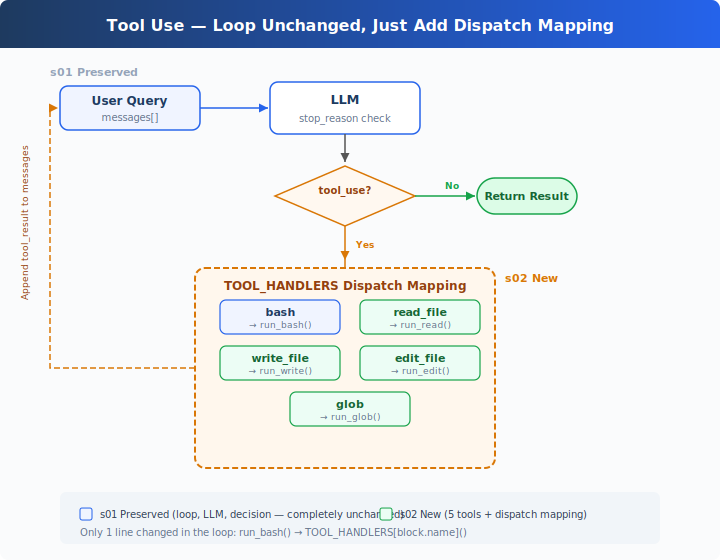
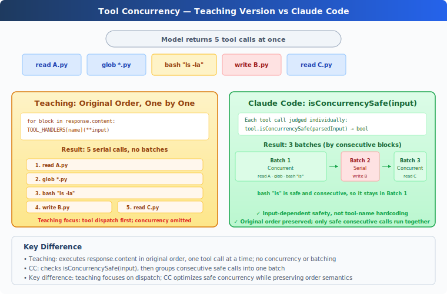

# s02: Tool Use — Add a Tool, Add Just One Line

[中文](README.md) · [English](README.en.md) · [日本語](README.ja.md)

s01 → `s02` → [s03](../s03_permission/) → s04 → ... → s20
> *"Add a tool, add just one handler"* — The loop stays the same. Register the new tool in the dispatch map and you're done.
>
> **Harness Layer**: Tool Dispatch — Expanding the model's reach.

---

## Only One Tool: Bash

The s01 Agent has only one tool: bash. To read a file, `cat`; to write, `echo "..." > file.py`; to edit, `sed`.

The model thinks "read this file" but has to spell out `cat path/to/file`. An extra layer of translation that wastes tokens and invites errors.

---

## Overview: Tool Dispatch



The s01 loop is fully preserved (LLM call, stop_reason check, message append — not a single word changed). The only change is in that one line of tool execution: `run_bash()` is replaced with `TOOL_HANDLERS[block.name]()` dispatch lookup.

Adding a tool to the Agent requires just two things:

1. **Define the tool**: Add one entry to the `TOOLS` array
2. **Register the handler**: Add one mapping in the `TOOL_HANDLERS` dict

---

## From 1 Tool to 5 Tools

s01 had only bash:

```python
TOOLS = [{"name": "bash", ...}]

def run_bash(command): ...
```

s02 expands to 5 tools, each independently defined:

```python
TOOLS = [
    {"name": "bash",       "description": "Run a shell command.", ...},
    {"name": "read_file",  "description": "Read file contents.",  ...},
    {"name": "write_file", "description": "Write content to file.", ...},
    {"name": "edit_file",  "description": "Replace text in file once.", ...},
    {"name": "glob",       "description": "Find files by pattern.", ...},
]
```

Each tool has its own implementation function:

```python
def run_read(path, limit=None):
    lines = safe_path(path).read_text().splitlines()
    if limit:
        lines = lines[:limit]
    return "\n".join(lines)

def run_write(path, content):
    safe_path(path).write_text(content)
    return f"Wrote {len(content)} bytes to {path}"

def run_edit(path, old_text, new_text):
    text = safe_path(path).read_text()
    if old_text not in text:
        return "Error: text not found"
    safe_path(path).write_text(text.replace(old_text, new_text, 1))
    return f"Edited {path}"

def run_glob(pattern):
    import glob as g
    return "\n".join(g.glob(pattern, root_dir=WORKDIR))
```

---

## Tool Dispatch

```python
TOOL_HANDLERS = {
    "bash":       run_bash,
    "read_file":  run_read,
    "write_file": run_write,
    "edit_file":  run_edit,
    "glob":       run_glob,
}

# Only one line changed in the loop — from hardcoded run_bash to dispatch lookup:
for block in response.content:
    if block.type == "tool_use":
        handler = TOOL_HANDLERS[block.name]    # lookup
        output = handler(**block.input)         # call
        results.append(...)
```

Adding a tool = one entry in `TOOLS` array + one line in `TOOL_HANDLERS` dict. The loop stays the same.

---

## Multiple Tool Calls

The model often returns multiple tool_use calls at once — "read a.py and b.py, then list all .py files".

The teaching version executes them one by one in the original `response.content` order. CC's approach is more complex: it slices the original order into consecutive batches, where concurrency-safe tools within a batch run in parallel, and batches are strictly sequential (see appendix).

---

## Quick Reference

| Concept | One-Liner |
|---------|-----------|
| TOOL_HANDLERS | Tool name → handler function dict. Add a tool = add one mapping line |
| Tool Definition | JSON schema telling the model "what I can do" |
| Multiple tool calls | Model may return multiple tool_use at once; teaching version executes them in original order |
| Loop Unchanged | s01's `while True` loop — not a single line changed |

---

## Changes from s01

| Component | Before (s01) | After (s02) |
|-----------|-------------|-------------|
| Tool count | 1 (bash) | 5 (+read, write, edit, glob) |
| Tool execution | Hardcoded `run_bash()` | TOOL_HANDLERS dispatch lookup |
| Path safety | None | safe_path validation (file tools only) |
| Loop | `while True` + `stop_reason` | Identical to s01 |

---

## Try It

```sh
cd learn-claude-code
python s02_tool_use/code.py
```

Try these prompts:

1. `Read the file README.md and tell me what this project is about`
2. `Create a file called test.py that prints "hello", then read it back`
3. `Find all Python files in this directory`
4. `Read both README.md and requirements.txt, then create a summary file`

What to watch for: When does the model call just one tool, and when does it call multiple at once? Are multiple tool calls executed in the correct order?

---

## What's Next

The Agent now has 5 specialized tools. File tools are protected by `safe_path`, but bash is unrestricted — `rm -rf /` still runs.

→ s03 Permission: Add a gate before tool execution — is this operation safe? Does it need user approval?

<details>
<summary>Dive into CC Source Code</summary>

> The following is based on a review of CC source code `Tool.ts`, `tools.ts`, `toolOrchestration.ts`, `toolExecution.ts`, and `StreamingToolExecutor.ts`.

### 1. Tool Definition Approach

**Teaching version**: `TOOLS` array + `TOOL_HANDLERS` dict. Definition and implementation are separate.
**CC**: Each tool is an independent object created by `buildTool()`, containing schema, validation, permissions, and execution. `getAllBaseTools()` aggregates all tools.

The teaching version's separation is clearer for teaching — readers immediately see "add a tool = two definitions".

### 2. Concurrency Safety: isConcurrencySafe()



The teaching version executes tools one by one in original order, without concurrency. CC uses `isConcurrencySafe(input)` to determine concurrency — note this isn't simply "read-only vs write", but judges by specific input:

| | isReadOnly | isConcurrencySafe |
|---|---|---|
| FileRead | true | true |
| Glob | true | true |
| Bash `ls` | true | **true** ← key difference |
| Bash `rm` | false | false |
| TaskCreate | false | **true** ← modifies state but can be concurrent (introduced in s12) |

CC's Bash tool's `isConcurrencySafe` equals `isReadOnly` — read-only commands can be concurrent, write commands cannot. TaskCreate modifies task files, but each writes a different file, so it can be concurrent.

### 3. Partition Algorithm

CC's `partitionToolCalls()` (`toolOrchestration.ts:91-115`) doesn't split into two groups — it batches tool calls **by consecutive blocks**:

```
[read A, read B, glob *.py, bash "rm x", read C]
  → batch1(concurrent): [read A, read B, glob *.py]
  → batch2(serial): [bash "rm x"]
  → batch3(concurrent): [read C]
```

Consecutive concurrency-safe calls are grouped into the same batch for truly concurrent execution (`toolOrchestration.ts:152-176`, with a concurrency limit). When a non-concurrency-safe call is encountered, a new batch starts for serial execution. Batches are strictly sequential.

### 4. Validation Pipeline

Each tool call in CC goes through a strict 5-step validation (`toolExecution.ts`):

1. **Zod schema validation** (`614-680`, teaching version uses JSON Schema): parameter type/structure check
2. **Tool-level validateInput()** (`682-733`): parameter value validation (e.g., is the path within the working directory)
3. **PreToolUse hooks** (`800-862`, covered in s04): hooks can return messages, modify input, or block execution
4. **Permission check** (`921-931`, core topic of s03): canUseTool + checkPermissions → allow/deny/ask
5. **Execute tool.call()** (`1207-1222`)

The teaching version omits Zod (uses JSON Schema), omits validateInput (uses safety functions), but preserves the permission check and hook concepts.

### 5. Streaming Tool Execution

CC's `StreamingToolExecutor` (`StreamingToolExecutor.ts`) starts tools while the model is still generating — no waiting for the model to finish. `read_file` might complete while the model is still outputting "Let me analyze". The teaching version doesn't implement this, consistent with s01's goal — conceptual clarity, not peak performance.

### 6. Tool Result Persistence

Each tool has a `maxResultSizeChars` field. Results exceeding this threshold are persisted to disk, and the model sees a preview + file path. FileRead is special — set to `Infinity`, preventing file read output from being persisted again. Specifically, if FileRead's result exceeds the threshold and gets persisted, the model's next read of that persisted file would trigger another persistence → infinite loop (read file → persist → re-read → re-persist → ...).

</details>

<!-- translation-sync: zh@v1, en@v1, ja@v1 -->
