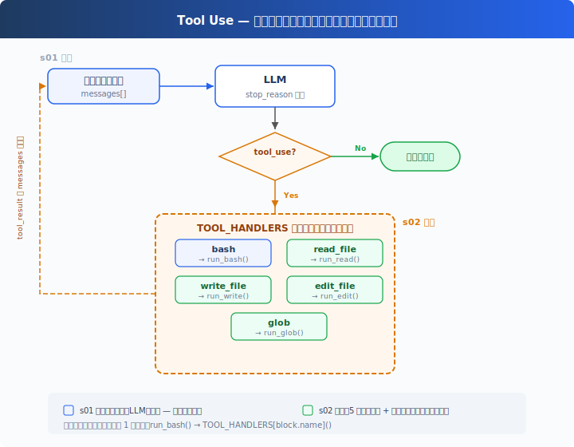
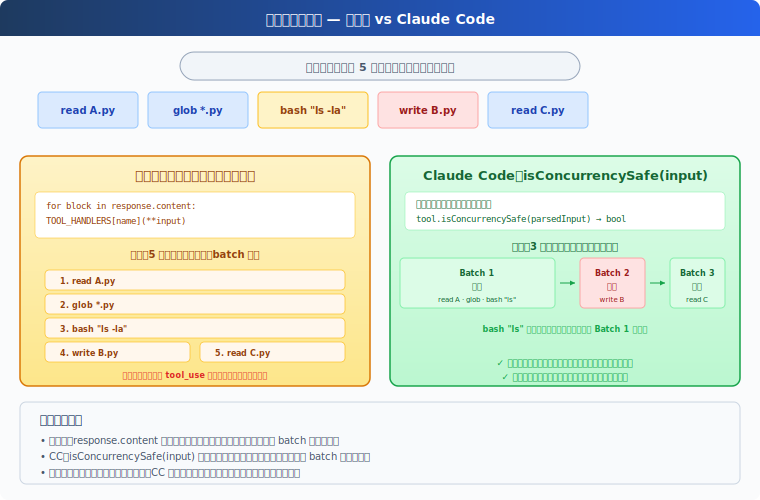

# s02: Tool Use — ツール一つ追加、一行追加だけ

[中文](README.md) · [English](README.en.md) · [日本語](README.ja.md)

s01 → `s02` → [s03](../s03_permission/) → s04 → ... → s20
> *"ツールを一つ追加、ハンドラを一つ追加"* — ループはそのまま。新しいツールをディスパッチマップに登録するだけ。
>
> **Harness レイヤー**: ツールディスパッチ — モデルが触れる範囲を拡張。

---

## ツールは bash 一つだけ

s01 の Agent には bash 一つのツールしかない。ファイルを読むには `cat`、書くには `echo "..." > file.py`、編集するには `sed`。

モデルは「このファイルを読みたい」と考えながら、`cat path/to/file` と組み立てなければならない。翻訳の層が一つ増え、トークンを無駄にし、エラーも起きやすい。

---

## 概要：ツールディスパッチ



s01 のループは完全に保持される（LLM 呼び出し、stop_reason 判定、メッセージ追加 — 一文字も変更なし）。唯一の変更点はツール実行の 1 行：`run_bash()` が `TOOL_HANDLERS[block.name]()` の検索ディスパッチに置き換わる。

Agent にツールを追加するには、たった二つ：

1. **ツールを定義**：`TOOLS` 配列に一条を追加
2. **ハンドラを登録**：`TOOL_HANDLERS` 辞書に一つのマッピングを追加

---

## 1 つのツールから 5 つのツールへ

s01 には bash だけだった：

```python
TOOLS = [{"name": "bash", ...}]

def run_bash(command): ...
```

s02 では 5 つに増え、各ツールは独立して定義される：

```python
TOOLS = [
    {"name": "bash",       "description": "Run a shell command.", ...},
    {"name": "read_file",  "description": "Read file contents.",  ...},
    {"name": "write_file", "description": "Write content to file.", ...},
    {"name": "edit_file",  "description": "Replace text in file once.", ...},
    {"name": "glob",       "description": "Find files by pattern.", ...},
]
```

各ツールには専用の実装関数がある：

```python
def run_read(path, limit=None):
    lines = safe_path(path).read_text().splitlines()
    if limit:
        lines = lines[:limit]
    return "\n".join(lines)

def run_write(path, content):
    safe_path(path).write_text(content)
    return f"Wrote {len(content)} bytes to {path}"

def run_edit(path, old_text, new_text):
    text = safe_path(path).read_text()
    if old_text not in text:
        return "Error: text not found"
    safe_path(path).write_text(text.replace(old_text, new_text, 1))
    return f"Edited {path}"

def run_glob(pattern):
    import glob as g
    return "\n".join(g.glob(pattern, root_dir=WORKDIR))
```

---

## ツールディスパッチ

```python
TOOL_HANDLERS = {
    "bash":       run_bash,
    "read_file":  run_read,
    "write_file": run_write,
    "edit_file":  run_edit,
    "glob":       run_glob,
}

# ループ内で変更されたのは一行だけ — ハードコードの run_bash から検索ディスパッチへ：
for block in response.content:
    if block.type == "tool_use":
        handler = TOOL_HANDLERS[block.name]    # 検索
        output = handler(**block.input)         # 呼び出し
        results.append(...)
```

ツールの追加 = `TOOLS` 配列に一条 + `TOOL_HANDLERS` 辞書に一行。ループは変わらない。

---

## 複数のツール呼び出し

モデルはよく一度に複数の tool_use を返す — 「a.py と b.py を読んで、全 .py ファイルを列挙して」。

教育版は `response.content` の元の順序で一つずつ実行する。CC のやり方はより複雑：元の順序を保ったまま連続バッチに分割し、バッチ内の並列安全なツールを並行実行し、バッチ間は厳密に順次（付録を参照）。

---

## 速查

| 概念 | 一言で |
|------|--------|
| TOOL_HANDLERS | ツール名 → ハンドラ関数の辞書。ツール追加 = マッピング一行追加 |
| ツール定義 | モデルに「何ができるか」を伝える JSON schema |
| 複数ツール呼び出し | モデルは一度に複数の tool_use を返す可能性がある。教育版は元の順序で一つずつ実行 |
| ループ不変 | s01 の `while True` ループ — 一行も変更なし |

---

## s01 からの変更

| コンポーネント | 変更前 (s01) | 変更後 (s02) |
|--------------|-------------|-------------|
| ツール数 | 1 (bash) | 5 (+read, write, edit, glob) |
| ツール実行 | ハードコード `run_bash()` | TOOL_HANDLERS 検索ディスパッチ |
| パス安全性 | なし | safe_path 検証（file tools のみ） |
| ループ | `while True` + `stop_reason` | s01 と完全に同一 |

---

## 試してみよう

```sh
cd learn-claude-code
python s02_tool_use/code.py
```

以下のプロンプトを試してみよう：

1. `Read the file README.md and tell me what this project is about`
2. `Create a file called test.py that prints "hello", then read it back`
3. `Find all Python files in this directory`
4. `Read both README.md and requirements.txt, then create a summary file`

観察のポイント：モデルがツールを一つだけ呼び出すときと、複数同時に呼び出すときの違い。複数のツール呼び出しは正しい順序で実行されているか？

---

## 次へ

Agent は 5 つの専用ツールを持つようになった。file tools は `safe_path` で保護されるが、bash は制限なし — `rm -rf /` はまだ実行できる。

→ s03 Permission：ツール実行前にゲートを追加 — この操作は安全か？ ユーザーの承認が必要か？

<details>
<summary>CC ソースコードを深掘り</summary>

> 以下は CC ソースコード `Tool.ts`、`tools.ts`、`toolOrchestration.ts`、`toolExecution.ts`、`StreamingToolExecutor.ts` の検証に基づく。

### 一、ツール定義方式

**教育版**：`TOOLS` 配列 + `TOOL_HANDLERS` 辞書。定義と実装が分離。
**CC**：各ツールは `buildTool()` で作成された独立オブジェクトで、schema、バリデーション、権限、実行を含む。`getAllBaseTools()` が全ツールを集約。

教育版の分離方式は教学に適している — 読者は「ツール追加 = 二つの定義」と一目で分かる。

### 二、並列安全性：isConcurrencySafe()



教育版は元の順序で一つずつ実行し、並列処理は行わない。CC は `isConcurrencySafe(input)` で並列可否を判断する — これは単なる「読み取り専用 vs 書き込み」ではなく、具体的な入力で判断する：

| | isReadOnly | isConcurrencySafe |
|---|---|---|
| FileRead | true | true |
| Glob | true | true |
| Bash `ls` | true | **true** ← 重要な違い |
| Bash `rm` | false | false |
| TaskCreate | false | **true** ← 状態変更するが並列可能（s12 で紹介） |

CC の Bash ツールの `isConcurrencySafe` は `isReadOnly` と同じ — 読み取り専用コマンドは並列可能、書き込みコマンドは不可。TaskCreate はタスクファイルを変更するが、毎回異なるファイルに書き込むため並列可能。

### 三、パーティションアルゴリズム

CC の `partitionToolCalls()`（`toolOrchestration.ts:91-115`）は二つのグループに分けるのではなく、ツール呼び出しを**連続ブロックごとにバッチ化**する：

```
[read A, read B, glob *.py, bash "rm x", read C]
  → batch1(並列): [read A, read B, glob *.py]
  → batch2(直列): [bash "rm x"]
  → batch3(並列): [read C]
```

連続する並列安全な呼び出しを同じバッチにまとめ、真の並列実行を行う（`toolOrchestration.ts:152-176`、並列数上限あり）。非並列安全な呼び出しに遭遇すると新しいバッチを開始して直列実行。バッチ間は厳密に順次。

### 四、バリデーションパイプライン

CC の各ツール呼び出しは厳格な 5 段階のバリデーションを経る（`toolExecution.ts`）：

1. **Zod schema バリデーション**（`614-680`、教育版は JSON Schema で代替）：パラメータの型/構造チェック
2. **ツールレベル validateInput()**（`682-733`）：パラメータ値の検証（例：パスが作業ディレクトリ内か）
3. **PreToolUse フック**（`800-862`、s04 で詳解）：フックはメッセージの返却、入力の変更、実行のブロックが可能
4. **権限チェック**（`921-931`、s03 の核心）：canUseTool + checkPermissions → allow/deny/ask
5. **tool.call() の実行**（`1207-1222`）

教育版は Zod を省略（JSON Schema を使用）、validateInput を省略（安全関数を使用）、権限チェックとフック概念は保持。

### 五、ストリーミングツール実行

CC の `StreamingToolExecutor`（`StreamingToolExecutor.ts`）はモデルがまだ生成中にツールを起動する — モデルの完了を待たない。`read_file` はモデルが「分析します」と出力中に完了するかもしれない。教育版はこれを実装しない。s01 と同じ目標 — 概念の明確さ、極限のパフォーマンスではない。

### 六、ツール結果の永続化

各ツールには `maxResultSizeChars` フィールドがある。この閾値を超える結果はディスクに保存され、モデルにはプレビュー + ファイルパスが表示される。FileRead は特殊 — `Infinity` に設定され、ファイル読み出し結果の再永続化を防ぐ。具体的には、FileRead の結果が閾値を超えて永続化されると、モデルがその永続化ファイルを次に読むときにまた永続化がトリガーされ → 無限ループ（ファイル読む → 永続化 → 再読み → 再永続化 → ...）になる。

</details>

<!-- translation-sync: zh@v1, en@v1, ja@v1 -->
