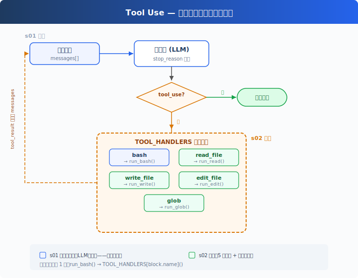
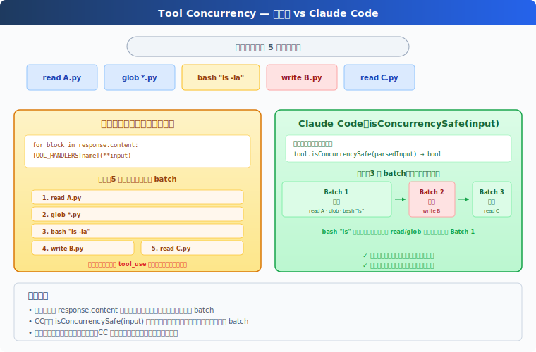

# s02: Tool Use — 多加一个工具，只加一行

[中文](README.md) · [English](README.en.md) · [日本語](README.ja.md)

s01 → `s02` → [s03](../s03_permission/) → s04 → ... → s20
> *"加一个工具, 只加一个 handler"* — 循环不用动, 新工具注册进 dispatch map 就行。
>
> **Harness 层**: 工具分发 — 扩展模型能触达的边界。

---

## 只有 bash 一个工具

s01 的 Agent 只有一个 bash 工具。读文件要 `cat`，写文件要 `echo "..." > file.py`，改文件要 `sed`。

模型想的是"读这个文件"，却要拼出 `cat path/to/file`。多了一层翻译，浪费 token，还容易拼错。

---

## 全局视角：工具分发



s01 的循环完全保留（LLM 调用、stop_reason 判断、消息追加）。唯一的变动在工具执行那 1 行：`run_bash()` 替换为 `TOOL_HANDLERS[block.name]()` 查表分发。

给 Agent 加一个工具只需要做两件事：

1. **定义工具**：在 `TOOLS` 数组里加一条描述
2. **注册处理函数**：在 `TOOL_HANDLERS` 字典里加一个映射

---

## 从 1 个工具到 5 个工具

s01 只有一个 bash：

```python
TOOLS = [{"name": "bash", ...}]

def run_bash(command): ...
```

s02 加到 5 个，每个工具都是独立定义：

```python
TOOLS = [
    {"name": "bash",       "description": "Run a shell command.", ...},
    {"name": "read_file",  "description": "Read file contents.",  ...},
    {"name": "write_file", "description": "Write content to file.", ...},
    {"name": "edit_file",  "description": "Replace text in file once.", ...},
    {"name": "glob",       "description": "Find files by pattern.", ...},
]
```

每个工具有自己的实现函数：

```python
def run_read(path, limit=None):
    lines = safe_path(path).read_text().splitlines()
    if limit:
        lines = lines[:limit]
    return "\n".join(lines)

def run_write(path, content):
    safe_path(path).write_text(content)
    return f"Wrote {len(content)} bytes to {path}"

def run_edit(path, old_text, new_text):
    text = safe_path(path).read_text()
    if old_text not in text:
        return "Error: text not found"
    safe_path(path).write_text(text.replace(old_text, new_text, 1))
    return f"Edited {path}"

def run_glob(pattern):
    import glob as g
    return "\n".join(g.glob(pattern, root_dir=WORKDIR))
```

---

## 工具分发

```python
TOOL_HANDLERS = {
    "bash":       run_bash,
    "read_file":  run_read,
    "write_file": run_write,
    "edit_file":  run_edit,
    "glob":       run_glob,
}

# 循环里只改了一行——从硬编码 run_bash 变成查表：
for block in response.content:
    if block.type == "tool_use":
        handler = TOOL_HANDLERS[block.name]    # 查表
        output = handler(**block.input)         # 调用
        results.append(...)
```

加一个工具 = 在 `TOOLS` 数组加一条 + 在 `TOOL_HANDLERS` 字典加一行。循环不变。

---

## 多个工具调用

模型经常一次返回多个 tool_use："读一下 a.py 和 b.py，然后列出所有 .py 文件"。

教学版按 `response.content` 原始顺序逐个执行。CC 的做法更复杂：按原始顺序切成连续 batch，batch 内并发安全的工具并行执行，batch 间严格顺序（见附录）。

---

## 速查

| 概念 | 一句话 |
|------|--------|
| TOOL_HANDLERS | 工具名 → 处理函数的字典。加工具 = 加一行映射 |
| 工具定义 | 告诉模型"我能做什么"的 JSON schema |
| 多工具调用 | 模型可一次返回多个 tool_use，教学版按原始顺序逐个执行 |
| 循环不变 | s01 的 `while True` 循环一行都没改 |

---

## 相对 s01 的变更

| 组件 | 之前 (s01) | 之后 (s02) |
|------|-----------|-----------|
| 工具数量 | 1 (bash) | 5 (+read, write, edit, glob) |
| 工具执行 | 硬编码 `run_bash()` | TOOL_HANDLERS 查表分发 |
| 路径安全 | 无 | safe_path 校验（仅 file tools） |
| 循环 | `while True` + `stop_reason` | 与 s01 完全一致 |

---

## 试一下

```sh
cd learn-claude-code
python s02_tool_use/code.py
```

试试这些 prompt：

1. `Read the file README.md and tell me what this project is about`
2. `Create a file called test.py that prints "hello", then read it back`
3. `Find all Python files in this directory`
4. `Read both README.md and requirements.txt, then create a summary file`

观察重点：模型什么时候只调一个工具，什么时候一次调多个？多个工具调用的顺序和结果是否正确？

---

## 接下来

现在 Agent 有 5 个专用工具。file tools 受 `safe_path` 保护，但 bash 不受限制，`rm -rf /` 还是能跑。

s03 Permission → 在工具执行之前加一道门：这个操作安全吗？需要用户批准吗？

<details>
<summary>深入 CC 源码</summary>

> 以下基于 CC 源码 `Tool.ts`、`tools.ts`、`toolOrchestration.ts`、`toolExecution.ts`、`StreamingToolExecutor.ts` 的核查。

### 一、工具定义方式

**教学版**：`TOOLS` 数组 + `TOOL_HANDLERS` 字典。定义和实现分开。
**CC**：每个工具是 `buildTool()` 创建的独立对象，包含 schema、验证、权限、执行。`getAllBaseTools()` 汇总所有工具。

教学版的分离方式对教学更清晰——读者一眼看到"加一个工具 = 两条定义"。

### 二、并发安全判断：isConcurrencySafe()



教学版按原始顺序逐个执行，不做并发。CC 用 `isConcurrencySafe(input)` 判断能否并发——注意这不是简单的"只读 vs 写"，而是按具体输入判断：

| | isReadOnly | isConcurrencySafe |
|---|---|---|
| FileRead | true | true |
| Glob | true | true |
| Bash `ls` | true | **true** ← 关键差异 |
| Bash `rm` | false | false |
| TaskCreate | false | **true** ← 改状态但可并发（TaskCreate 在 s12 介绍） |

CC 的 Bash tool 的 `isConcurrencySafe` 等于 `isReadOnly`——只读命令可并发，写命令不可。TaskCreate 虽然改了任务文件，但每次都写不同的文件，所以可以并发。

### 三、分区算法

CC 的 `partitionToolCalls()`（`toolOrchestration.ts:91-115`）不是分两组，而是把工具调用**按连续块分批**：

```
[read A, read B, glob *.py, bash "rm x", read C]
  → batch1(并发): [read A, read B, glob *.py]
  → batch2(串行): [bash "rm x"]
  → batch3(并发): [read C]
```

并发安全的连续块编入同一个 batch，batch 内真正并发执行（`toolOrchestration.ts:152-176`，有并发上限）。遇到非并发安全的就开新 batch 串行执行。batch 之间严格顺序。

### 四、验证管线

CC 的每个工具调用经过严格的 5 步验证（`toolExecution.ts`）：

1. **Zod schema 验证**（`614-680`，教学版用 JSON Schema 替代）：参数类型/结构检查
2. **工具级 validateInput()**（`682-733`）：参数值验证（如路径是否在工作区内）
3. **PreToolUse hooks**（`800-862`，s04 详细介绍）：钩子可以返回消息、修改输入、阻止执行
4. **权限检查**（`921-931`，s03 的核心内容）：canUseTool + checkPermissions → allow/deny/ask
5. **执行 tool.call()**（`1207-1222`）

教学版省略了 Zod（用 JSON Schema）、省略了 validateInput（用安全函数）、保留了权限检查和钩子概念。

### 五、流式工具执行

CC 的 `StreamingToolExecutor`（`StreamingToolExecutor.ts`）让工具在模型还在生成时就启动——不等模型说完。`read_file` 可能在模型还在输出"我来分析"的时候就跑完了。教学版不实现这个，目标和 s01 一致——概念清晰，不追求性能极致。

### 六、工具结果持久化

每个工具有一个 `maxResultSizeChars` 字段。结果超过这个值就落盘，模型看到的是预览 + 文件路径。FileRead 特殊——设为 `Infinity`，防止读文件的输出又被当成文件落盘。具体来说，如果 FileRead 的结果超过阈值被落盘，模型下次读那个落盘文件时又会触发落盘 → 无限循环（读文件 → 落盘 → 再读 → 再落盘 → ...）。

</details>

<!-- translation-sync: zh@v1, en@v0, ja@v0 -->
