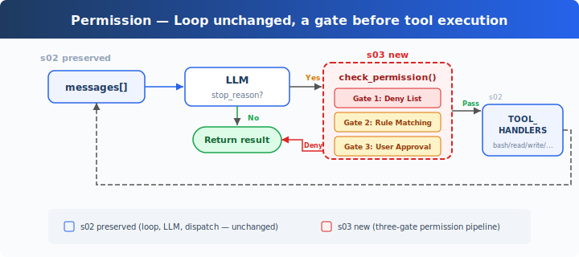
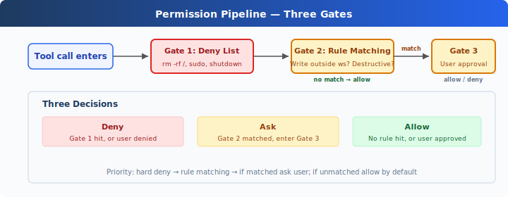

# s03: Permission — Check Permissions Before Execution

[中文](README.md) · [English](README.en.md) · [日本語](README.ja.md)

s01 → s02 → `s03` → [s04](../s04_hooks/) → s05 → ... → s20
> *"Check permissions before executing"* — The permission pipeline decides which operations need approval.
>
> **Harness Layer**: Permission — a gate before tool execution.

---

## The Problem

s02's Agent has 5 tools. File tools are protected by `safe_path`, but bash is unrestricted. Ask it to "clean up the project," and it might run `rm -rf /`.

Safety can't rely on trusting the model — it needs code: a check before every tool execution.

---

## The Solution



s02's loop is fully preserved. The only change is inserting `check_permission()` before tool execution — each tool call passes through three gates in a fixed order: hard deny first, then soft ask, and if neither matches, allow.

The three gates correspond to three decisions:

| Gate | Purpose | On Match |
|------|---------|----------|
| 1. Deny List | Permanently forbidden operations (`rm -rf /`, `sudo`) | Denied immediately, not executed |
| 2. Rule Matching | Context-dependent operations (writing outside workspace, `rm` files) | Passed to Gate 3 |
| 3. User Approval | After Gate 2 matches, pauses for user confirmation | User decides allow or deny |

None of the three gates match → execute directly. Most routine operations take this path.

---

## How It Works



**Gate 1**: A hard deny list. Check first; if matched, return a block message. (Teaching demo: simple string matching is not a reliable security mechanism — command variants and shell expansion can bypass it. CC's approach is in the appendix.)

```python
DENY_LIST = [
    "rm -rf /", "sudo", "shutdown", "reboot",
    "mkfs", "dd if=", "> /dev/sda",
]

def check_deny_list(command: str) -> str | None:
    for pattern in DENY_LIST:
        if pattern in command:
            return f"Blocked: '{pattern}' is on the deny list"
    return None
```

**Gate 2**: Rule matching — describes "when to ask the user." Each rule specifies a tool and a check condition.

```python
PERMISSION_RULES = [
    {
        "tools": ["write_file", "edit_file"],
        "check": lambda args: not (WORKDIR / args.get("path", "")).resolve().is_relative_to(WORKDIR),
        "message": "Writing outside workspace",
    },
    {
        "tools": ["bash"],
        "check": lambda args: any(kw in args.get("command", "") for kw in ["rm ", "> /etc/", "chmod 777"]),
        "message": "Potentially destructive command",
    },
]

def check_rules(tool_name: str, args: dict) -> str | None:
    for rule in PERMISSION_RULES:
        if tool_name in rule["tools"] and rule["check"](args):
            return rule["message"]
    return None
```

**Gate 3**: After a rule matches, pause for user input.

```python
def ask_user(tool_name: str, args: dict, reason: str) -> str:
    print(f"\n⚠  {reason}")
    print(f"   Tool: {tool_name}({args})")
    choice = input("   Allow? [y/N] ").strip().lower()
    return "allow" if choice in ("y", "yes") else "deny"
```

**All three gates chained together**, inserted before tool execution:

```python
def check_permission(block) -> bool:
    # Gate 1: Hard deny
    if block.name == "bash":
        reason = check_deny_list(block.input.get("command", ""))
        if reason:
            print(f"\n⛔ {reason}")
            return False

    # Gate 2 + 3: Rule matching → User approval
    reason = check_rules(block.name, block.input)
    if reason:
        decision = ask_user(block.name, block.input, reason)
        if decision == "deny":
            return False

    return True

# In agent_loop — s02's loop with just one line added:
for block in response.content:
    if block.type == "tool_use":
        if not check_permission(block):           # ← NEW
            results.append({... "content": "Permission denied."})
            continue
        output = TOOL_HANDLERS[block.name](**block.input)  # s02 original
        results.append(...)
```

---

## Changes from s02

| Component | Before (s02) | After (s03) |
|-----------|-------------|-------------|
| Security model | None (trust the model) | Three-gate permission pipeline |
| New functions | — | check_deny_list, check_rules, ask_user, check_permission |
| Loop | Executes all tools directly | Inserts check_permission() before execution |

---

## Try It

```sh
cd learn-claude-code
python s03_permission/code.py
```

Try these prompts:

1. `Create a file called test.txt in the current directory` (should pass through)
2. `Delete all temporary files in /tmp` (bash + rm triggers Gate 2)
3. `What files are in the current directory?` (read-only, all pass)
4. `Try to write a file to /etc/something` (writing outside workspace triggers Gate 2)

What to watch for: Which operations pass through? Which need your confirmation? Which are denied outright?

---

## What's Next

Permission checks are in place — but every check is hardcoded as `check_permission()` inside the loop. What if you want to add logging before and after each tool execution? What if you want to auto-trigger a git commit after certain operations? Scattering this extension logic throughout the loop makes it bloat.

→ s04 Hooks: Add hooks to the loop. Extension logic hangs on hooks; the loop stays clean.

<details>
<summary>Dive into CC Source Code</summary>

> The following is based on a review of CC source code `types/permissions.ts`, `utils/permissions/permissions.ts`, `toolExecution.ts`, `utils/permissions/yoloClassifier.ts`, `tools/AgentTool/forkSubagent.ts`.

### 1. PermissionResult: Not 3, but 4

The teaching version's three gates (deny → ask → allow) don't fully correspond to CC. CC's `PermissionResult` has 4 behaviors (`types/permissions.ts:241-266`):

| behavior | Meaning | Teaching Version Equivalent |
|----------|---------|---------------------------|
| `allow` | Allow directly | Gate 3 passes |
| `deny` | Deny directly | Gate 1 matches |
| `ask` | Show dialog to user | Gate 2 matches |
| `passthrough` | Tool doesn't express opinion, passes to generic pipeline | Not in teaching version |

### 2. Production Verification Stages

CC's tool calls don't go through three gates — they go through multiple stages distributed across `checkPermissionsAndCallTool()` (`toolExecution.ts:599-1745`), hooks, `hasPermissionsToUseToolInner()` (`utils/permissions/permissions.ts:1158-1310`), and classifier logic:

1. **Zod schema validation** (`toolExecution.ts:614-680`) — parameter type checking
2. **validateInput()** (`toolExecution.ts:682-733`) — tool-level semantic validation
3. **backfillObservableInput()** (`toolExecution.ts:784`) — backfill legacy fields
4. **PreToolUse hooks** (`toolExecution.ts:800-862`) — hooks can return allow/deny/ask
5. **resolveHookPermissionDecision()** (`toolExecution.ts:921-931`) — coordinate hook + pipeline decisions
6. **hasPermissionsToUseToolInner()** (`permissions.ts:1158-1310`) — multi-layer rule check:
   - Entire tool disabled by deny rule → `deny`
   - Entire tool flagged by ask rule → `ask`
   - `tool.checkPermissions()` tool's own judgment
   - Tool itself returns deny → `deny`
   - `requiresUserInteraction()` → `ask`
   - Content-related ask rules → `ask` (not bypassable)
   - Security check violation → `ask` (not bypassable)
   - bypassPermissions mode → `allow`
   - Entire tool allowed by allow rule → `allow`
   - passthrough → converted to `ask`

### 3. Deny List: Not One File, but 8 Sources

CC doesn't have a single deny list. Permission rules come from 8 sources (`types/permissions.ts:54-62`):

| Source | Configuration Location |
|--------|----------------------|
| `userSettings` | `~/.claude/settings.json` |
| `projectSettings` | `.claude/settings.json` |
| `localSettings` | `settings.local.json` |
| `flagSettings` | Feature flags |
| `policySettings` | Enterprise management policy |
| `cliArg` | `--allowedTools` / `--deniedTools` |
| `command` | Inline command |
| `session` | In-session temporary authorization |

Each rule format: `{ toolName: "Bash", ruleBehavior: "deny", ruleContent: "npm publish:*" }`. Rules from multiple sources are merged, with higher-priority sources overriding lower ones (low to high: user < project < local < flag < policy, plus cliArg, command, session).

### 4. What is isDestructive()

In CC, `isDestructive` (`Tool.ts:405-406`) is **purely for UI display** — showing a `[destructive]` label in the tool list. It doesn't participate in permission decisions. All tools return `false` by default. Only ExitWorktree (on remove) and MCP tools (depending on `annotations.destructiveHint`) override it.

### 5. YoloClassifier (Auto-Approval)

In CC's auto mode, it doesn't pop a dialog every time. `classifyYoloAction` (`utils/permissions/yoloClassifier.ts:1012`) sends the tool call + conversation context to a classifier LLM to judge safety. It first tries acceptEdits mode simulation (`permissions.ts:620-656`, if acceptEdits allows → auto-approve), then checks the safe tool whitelist (`permissions.ts:658-686`), and finally calls the classifier. If the classifier rejects too many times in a row → falls back to manual approval.

### 6. Permission Bubbling

A sub-Agent's (forked via AgentTool) `permissionMode` is set to `'bubble'` (`forkSubagent.ts:50`). This means permission dialogs **bubble up to the parent Agent's terminal**, rather than being silently denied in the sub-Agent. The Bash classifier continues running during this process — displaying the permission dialog while judging in the background whether auto-approval is possible.

### The Teaching Version's Simplification Is Intentional

- Multi-stage pipeline → 3 gates: dramatically lower barrier to understanding
- 8 rule sources → 1 local DENY_LIST: manageable concept count
- isDestructive → omitted (teaching version has no UI layer, and it doesn't participate in permission decisions in CC either)
- YoloClassifier → omitted (depends on additional LLM calls and telemetry)
- Permission bubbling → omitted (s15 covers multi-Agent)

</details>

<!-- translation-sync: zh@v1, en@v1, ja@v1 -->
