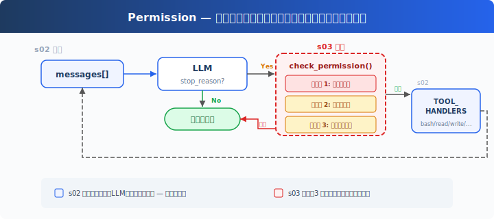
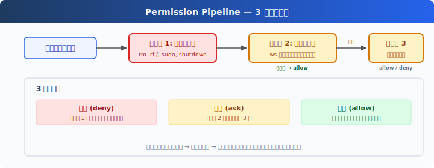

# s03: Permission — 実行前に権限を判断する

[中文](README.md) · [English](README.en.md) · [日本語](README.ja.md)

s01 → s02 → `s03` → [s04](../s04_hooks/) → s05 → ... → s20
> *"ツール実行前に権限を判断"* — 権限パイプラインは、どの操作に承認が必要かを決める。
>
> **Harness レイヤー**: 権限 — ツール実行前に一つのゲートを追加。

---

## 課題

s02 の Agent は 5 つのツールを持つ。file tools は `safe_path` で保護されるが、bash は制限なし。「プロジェクトを掃除して」と頼むと、`rm -rf /` を実行しかねない。

安全性はモデルを信頼することではなく、コードに頼る — ツール実行前に判断を挟む。

---

## ソリューション



s02 のループは完全に維持される。唯一の変更は、ツール実行前に `check_permission()` を挿入すること — 各ツール呼び出しは 3 つのゲートを固定順序で通過する：ハード拒否が最優先、次にソフト確認、どちらも一致しなければ許可。

3 つのゲートは 3 つの決定に対応する：

| ゲート | 役割 | 一致時 |
|--------|------|--------|
| 1. 拒否リスト | 常に禁止される操作（`rm -rf /`、`sudo`） | 即座に拒否、実行しない |
| 2. ルールマッチング | コンテキスト依存の操作（作業ディレクトリ外への書き込み、`rm` ファイル） | ゲート 3 へ |
| 3. ユーザー承認 | ゲート 2 が一致した場合、ユーザー確認を待機 | ユーザーが許可または拒否を決定 |

3 つのゲートのどれにも一致しない → 直接実行。日常の操作の大部分はこの経路を通る。

---

## 仕組み



**ゲート 1**：ハード拒否リスト。最初に確認し、一致すればブロックメッセージを返す。（教育デモ：単純な文字列マッチングは信頼できるセキュリティ機構ではない — コマンドの変種やシェル展開で回避される可能性がある。CC のアプローチは付録を参照。）

```python
DENY_LIST = [
    "rm -rf /", "sudo", "shutdown", "reboot",
    "mkfs", "dd if=", "> /dev/sda",
]

def check_deny_list(command: str) -> str | None:
    for pattern in DENY_LIST:
        if pattern in command:
            return f"Blocked: '{pattern}' is on the deny list"
    return None
```

**ゲート 2**：ルールマッチング — 「いつユーザーに聞くべきか」を記述する。各ルールはツールとチェック条件を指定する。

```python
PERMISSION_RULES = [
    {
        "tools": ["write_file", "edit_file"],
        "check": lambda args: not (WORKDIR / args.get("path", "")).resolve().is_relative_to(WORKDIR),
        "message": "Writing outside workspace",
    },
    {
        "tools": ["bash"],
        "check": lambda args: any(kw in args.get("command", "") for kw in ["rm ", "> /etc/", "chmod 777"]),
        "message": "Potentially destructive command",
    },
]

def check_rules(tool_name: str, args: dict) -> str | None:
    for rule in PERMISSION_RULES:
        if tool_name in rule["tools"] and rule["check"](args):
            return rule["message"]
    return None
```

**ゲート 3**：ルールが一致した後、ユーザー入力を待機。

```python
def ask_user(tool_name: str, args: dict, reason: str) -> str:
    print(f"\n⚠  {reason}")
    print(f"   Tool: {tool_name}({args})")
    choice = input("   Allow? [y/N] ").strip().lower()
    return "allow" if choice in ("y", "yes") else "deny"
```

**3 つのゲートを直列に接続**、ツール実行前に挿入する：

```python
def check_permission(block) -> bool:
    # ゲート 1: ハード拒否
    if block.name == "bash":
        reason = check_deny_list(block.input.get("command", ""))
        if reason:
            print(f"\n⛔ {reason}")
            return False

    # ゲート 2 + 3: ルールマッチング → ユーザー承認
    reason = check_rules(block.name, block.input)
    if reason:
        decision = ask_user(block.name, block.input, reason)
        if decision == "deny":
            return False

    return True

# agent_loop で — s02 のループに 1 行追加するだけ：
for block in response.content:
    if block.type == "tool_use":
        if not check_permission(block):           # ← 新規
            results.append({... "content": "Permission denied."})
            continue
        output = TOOL_HANDLERS[block.name](**block.input)  # s02 既存
        results.append(...)
```

---

## s02 からの変更点

| コンポーネント | 変更前 (s02) | 変更後 (s03) |
|---------------|-------------|-------------|
| セキュリティモデル | なし（モデルを信頼） | 3 ゲート権限パイプライン |
| 新規関数 | — | check_deny_list, check_rules, ask_user, check_permission |
| ループ | すべてのツールを直接実行 | 実行前に check_permission() を挿入 |

---

## 試してみよう

```sh
cd learn-claude-code
python s03_permission/code.py
```

以下のプロンプトを試してみよう：

1. `Create a file called test.txt in the current directory`（そのまま通過するはず）
2. `Delete all temporary files in /tmp`（bash + rm でゲート 2 が発動）
3. `What files are in the current directory?`（読み取り専用、すべて通過）
4. `Try to write a file to /etc/something`（作業ディレクトリ外への書き込みでゲート 2 が発動）

観察のポイント：どの操作がそのまま通過するか？ どれに確認が必要か？ どれが即座に拒否されるか？

---

## 次へ

権限チェックは実装された — しかし、毎回ループ内に `check_permission()` をハードコードしている。ツール実行の前後にログを追加したい場合は？ 特定の操作後に自動的に git commit をトリガーしたい場合は？ このような拡張ロジックがループ内に散らばると、ループはすぐに膨張する。

→ s04 Hooks：ループにフックを追加する。拡張ロジックはフックにぶら下げ、ループはクリーンに保つ。

<details>
<summary>CC ソースコードを深掘り</summary>

> 以下は CC ソースコード `types/permissions.ts`、`utils/permissions/permissions.ts`、`toolExecution.ts`、`utils/permissions/yoloClassifier.ts`、`tools/AgentTool/forkSubagent.ts` の検証に基づく。

### 一、PermissionResult：3 種ではなく、4 種

教育版の 3 つのゲート（deny → ask → allow）は CC と完全には対応しない。CC の `PermissionResult` には 4 つの behavior がある（`types/permissions.ts:241-266`）：

| behavior | 意味 | 教育版の対応 |
|----------|------|-------------|
| `allow` | 直接許可 | ゲート 3 通過 |
| `deny` | 直接拒否 | ゲート 1 一致 |
| `ask` | ユーザーにダイアログを表示 | ゲート 2 一致 |
| `passthrough` | ツールが意見を表明せず、汎用パイプラインに委ねる | 教育版にはなし |

### 二、本番環境の検証段階

CC のツール呼び出しは 3 つのゲートを通るのではなく、`checkPermissionsAndCallTool()`（`toolExecution.ts:599-1745`）、hooks、`hasPermissionsToUseToolInner()`（`utils/permissions/permissions.ts:1158-1310`）、classifier ロジックに分散する複数の段階を経る：

1. **Zod schema 検証**（`toolExecution.ts:614-680`）— パラメータの型チェック
2. **validateInput()**（`toolExecution.ts:682-733`）— ツールレベルの意味的検証
3. **backfillObservableInput()**（`toolExecution.ts:784`）— レガシーフィールドの補完
4. **PreToolUse hooks**（`toolExecution.ts:800-862`）— フックが allow/deny/ask を返す
5. **resolveHookPermissionDecision()**（`toolExecution.ts:921-931`）— フック + パイプラインの決定を調整
6. **hasPermissionsToUseToolInner()**（`permissions.ts:1158-1310`）— 多層ルールチェック：
   - ツール全体が deny rule で無効 → `deny`
   - ツール全体が ask rule でマーク → `ask`
   - `tool.checkPermissions()` ツール自身の判断
   - ツール自身が deny を返す → `deny`
   - `requiresUserInteraction()` → `ask`
   - コンテンツ関連の ask ルール → `ask`（バイパス不可）
   - セキュリティチェック違反 → `ask`（バイパス不可）
   - bypassPermissions モード → `allow`
   - ツール全体が allow rule で許可 → `allow`
   - passthrough → `ask` に変換

### 三、拒否リスト：1 つのファイルではなく、8 つのソース

CC には単一の deny list はない。権限ルールは 8 つのソースから来る（`types/permissions.ts:54-62`）：

| ソース | 設定場所 |
|--------|---------|
| `userSettings` | `~/.claude/settings.json` |
| `projectSettings` | `.claude/settings.json` |
| `localSettings` | `settings.local.json` |
| `flagSettings` | フィーチャーフラグ |
| `policySettings` | 企業管理ポリシー |
| `cliArg` | `--allowedTools` / `--deniedTools` |
| `command` | インラインコマンド |
| `session` | セッション内一時承認 |

各ルールの形式：`{ toolName: "Bash", ruleBehavior: "deny", ruleContent: "npm publish:*" }`。複数ソースのルールは統合され、高優先度ソースが低優先度を上書きする（低→高：user < project < local < flag < policy、さらに cliArg、command、session）。

### 四、isDestructive() とは

CC では `isDestructive`（`Tool.ts:405-406`）は**純粋に UI 表示用** — ツール一覧に `[destructive]` ラベルを表示するだけ。権限決定には参加しない。デフォルトではすべてのツールが `false` を返す。ExitWorktree（remove 時）と MCP ツール（`annotations.destructiveHint` に依存）のみがオーバーライドする。

### 五、YoloClassifier（自動承認）

CC の auto モードでは、毎回ダイアログを表示するわけではない。`classifyYoloAction`（`utils/permissions/yoloClassifier.ts:1012`）はツール呼び出し + 会話コンテキストを分類器 LLM に送って安全性を判断する。まず acceptEdits モードのシミュレーションを試み（`permissions.ts:620-656`、acceptEdits が許可すれば → 自動承認）、次にセーフツールホワイトリストを確認し（`permissions.ts:658-686`）、最後に分類器を呼び出す。分類器が連続して拒否しすぎた場合 → 手動承認にフォールバック。

### 六、権限バブリング

サブ Agent（AgentTool 経由でフォークされたもの）の `permissionMode` は `'bubble'` に設定される（`forkSubagent.ts:50`）。これは権限ダイアログが**親 Agent のターミナルにバブルアップ**することを意味する。サブ Agent で黙って拒否されるのではない。Bash 分類器はこの過程で引き続き実行され — 権限ダイアログを表示しつつ、バックグラウンドで自動承認可能か判断する。

### 教育版の単純化は意図的

- 多段階パイプライン → 3 ゲート：理解のハードルが大幅に下がる
- 8 ルールソース → 1 つのローカル DENY_LIST：概念量を制御可能
- isDestructive → 省略（教育版には UI レイヤーがなく、CC でも権限決定には参加しない）
- YoloClassifier → 省略（追加の LLM 呼び出しとテレメトリに依存）
- 権限バブリング → 省略（s15 でマルチ Agent を扱う）

</details>

<!-- translation-sync: zh@v1, en@v1, ja@v1 -->
