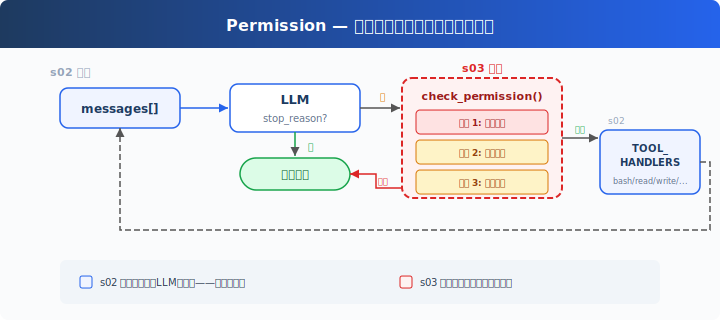
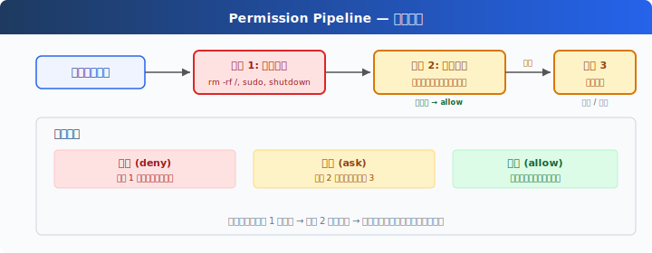

# s03: Permission — 执行前做权限判断

[中文](README.md) · [English](README.en.md) · [日本語](README.ja.md)

s01 → s02 → `s03` → [s04](../s04_hooks/) → s05 → ... → s20
> *"工具执行前先做权限判断"* — 权限管线决定哪些操作需要审批。
>
> **Harness 层**: 权限 — 在工具执行前加一道门。

---

## 问题

s02 的 Agent 有 5 个工具。file tools 受 `safe_path` 保护，但 bash 不受限制。让它"清理一下项目"，可能执行 `rm -rf /`。

安全不能靠信任模型，要靠代码——在工具执行之前做判断。

---

## 解决方案



s02 的循环完全保留。唯一的变动在工具执行前插入 `check_permission()`——每个工具调用经过三道闸门，顺序固定：硬拒绝优先，软询问次之，都没命中就放行。

三道闸门对应三种决策：

| 闸门 | 作用 | 命中后 |
|------|------|--------|
| 1. 拒绝列表 | 永远禁止的操作（`rm -rf /`、`sudo`） | 直接拒绝，不执行 |
| 2. 规则匹配 | 取决于上下文的操作（写工作区外、`rm` 文件） | 交给闸门 3 |
| 3. 用户审批 | 闸门 2 命中后，暂停等用户确认 | 用户决定允许或拒绝 |

三道都没命中 → 直接执行。大部分日常操作走这条路。

---

## 工作原理



**闸门 1**：一张硬拒绝表，先查，命中就返回阻止信息。（教学示意：简单字符串匹配不是可靠安全机制，命令变体和 shell 展开可能绕过。CC 的做法见附录。）

```python
DENY_LIST = [
    "rm -rf /", "sudo", "shutdown", "reboot",
    "mkfs", "dd if=", "> /dev/sda",
]

def check_deny_list(command: str) -> str | None:
    for pattern in DENY_LIST:
        if pattern in command:
            return f"Blocked: '{pattern}' is on the deny list"
    return None
```

**闸门 2**：规则匹配——描述"什么时候需要问用户"。每条规则指定工具和检查条件。

```python
PERMISSION_RULES = [
    {
        "tools": ["write_file", "edit_file"],
        "check": lambda args: not (WORKDIR / args.get("path", "")).resolve().is_relative_to(WORKDIR),
        "message": "Writing outside workspace",
    },
    {
        "tools": ["bash"],
        "check": lambda args: any(kw in args.get("command", "") for kw in ["rm ", "> /etc/", "chmod 777"]),
        "message": "Potentially destructive command",
    },
]

def check_rules(tool_name: str, args: dict) -> str | None:
    for rule in PERMISSION_RULES:
        if tool_name in rule["tools"] and rule["check"](args):
            return rule["message"]
    return None
```

**闸门 3**：规则命中后，暂停等用户输入。

```python
def ask_user(tool_name: str, args: dict, reason: str) -> str:
    print(f"\n⚠  {reason}")
    print(f"   Tool: {tool_name}({args})")
    choice = input("   Allow? [y/N] ").strip().lower()
    return "allow" if choice in ("y", "yes") else "deny"
```

**三道闸门串在一起**，插在工具执行之前：

```python
def check_permission(block) -> bool:
    # 闸门 1: 硬拒绝
    if block.name == "bash":
        reason = check_deny_list(block.input.get("command", ""))
        if reason:
            print(f"\n⛔ {reason}")
            return False

    # 闸门 2 + 3: 规则匹配 → 用户审批
    reason = check_rules(block.name, block.input)
    if reason:
        decision = ask_user(block.name, block.input, reason)
        if decision == "deny":
            return False

    return True

# 在 agent_loop 中——s02 的循环只加了一行：
for block in response.content:
    if block.type == "tool_use":
        if not check_permission(block):           # ← 新增
            results.append({... "content": "Permission denied."})
            continue
        output = TOOL_HANDLERS[block.name](**block.input)  # s02 原有
        results.append(...)
```

---

## 相对 s02 的变更

| 组件 | 之前 (s02) | 之后 (s03) |
|------|-----------|-----------|
| 安全模型 | 无（信任模型） | 三道闸门权限管线 |
| 新函数 | — | check_deny_list, check_rules, ask_user, check_permission |
| 循环 | 直接执行所有工具 | 执行前插入 check_permission() |

---

## 试一下

```sh
cd learn-claude-code
python s03_permission/code.py
```

试试这些 prompt：

1. `Create a file called test.txt in the current directory`（应该直接通过）
2. `Delete all temporary files in /tmp`（bash + rm 会触发闸门 2）
3. `What files are in the current directory?`（只读，全部通过）
4. `Try to write a file to /etc/something`（写工作区外，触发闸门 2）

观察重点：哪些操作直接通过？哪些需要你确认？哪些被直接拒绝？

---

## 接下来

权限检查做了——但每次都在循环里硬编码 `check_permission()`。如果我想在每次工具执行前后加日志？如果想在某些操作后自动触发 git commit？这些扩展逻辑散落在 loop 里，循环很快就会膨胀。

s04 Hooks → 给循环加钩子，扩展逻辑挂在钩子上，循环保持干净。

<details>
<summary>深入 CC 源码</summary>

> 以下基于 CC 源码 `types/permissions.ts`、`utils/permissions/permissions.ts`、`toolExecution.ts`、`utils/permissions/yoloClassifier.ts`、`tools/AgentTool/forkSubagent.ts` 的核查。

### 一、PermissionResult：不是 3 种，是 4 种

教学版的三道闸门（deny → ask → allow）和 CC 不完全对应。CC 的 `PermissionResult` 有 4 个 behavior（`types/permissions.ts:241-266`）：

| behavior | 含义 | 教学版对应 |
|----------|------|-----------|
| `allow` | 直接允许 | 闸门 3 通过 |
| `deny` | 直接拒绝 | 闸门 1 命中 |
| `ask` | 弹出对话框问用户 | 闸门 2 命中 |
| `passthrough` | 工具不表态，交给通用管线决定 | 教学版无 |

### 二、生产版的验证阶段

CC 的工具调用不是经过三道闸门，而是经过多个阶段，分布在 `checkPermissionsAndCallTool()`（`toolExecution.ts:599-1745`）、hooks、`hasPermissionsToUseToolInner()`（`utils/permissions/permissions.ts:1158-1310`）和 classifier 逻辑里：

1. **Zod schema 验证**（`toolExecution.ts:614-680`）— 参数类型检查
2. **validateInput()**（`toolExecution.ts:682-733`）— 工具级语义验证
3. **backfillObservableInput()**（`toolExecution.ts:784`）— 补全遗留字段
4. **PreToolUse hooks**（`toolExecution.ts:800-862`）— 钩子可以返回 allow/deny/ask
5. **resolveHookPermissionDecision()**（`toolExecution.ts:921-931`）— 协调钩子+管线决策
6. **hasPermissionsToUseToolInner()**（`permissions.ts:1158-1310`）— 多层规则检查：
   - 整个工具被 deny rule 禁用 → `deny`
   - 整个工具被 ask rule 标记 → `ask`
   - `tool.checkPermissions()` 工具自己的判断
   - 工具自己返回 deny → `deny`
   - `requiresUserInteraction()` → `ask`
   - 内容相关的 ask 规则 → `ask`（不可绕过）
   - 安全检查违规 → `ask`（不可绕过）
   - bypassPermissions 模式 → `allow`
   - 整个工具被 allow rule 放行 → `allow`
   - passthrough → 转为 `ask`

### 三、拒绝列表：不是一个文件，是 8 个来源

CC 没有单一的 deny list。权限规则来自 8 个来源（`types/permissions.ts:54-62`）：

| 来源 | 配置位置 |
|------|---------|
| `userSettings` | `~/.claude/settings.json` |
| `projectSettings` | `.claude/settings.json` |
| `localSettings` | `settings.local.json` |
| `flagSettings` | Feature flags |
| `policySettings` | 企业管理策略 |
| `cliArg` | `--allowedTools` / `--deniedTools` |
| `command` | 内联命令 |
| `session` | 会话内临时授权 |

每条规则格式：`{ toolName: "Bash", ruleBehavior: "deny", ruleContent: "npm publish:*" }`。多个来源的规则合并，高优先级来源覆盖低优先级（从低到高：user < project < local < flag < policy，加上 cliArg、command、session）。

### 四、isDestructive() 是什么

CC 中 `isDestructive`（`Tool.ts:405-406`）**纯粹是 UI 展示用的**——在工具列表里显示 `[destructive]` 标签。它不参与权限决策。默认所有工具都返回 `false`。只有 ExitWorktree（remove 时）和 MCP 工具（依赖 `annotations.destructiveHint`）覆写了它。

### 五、YoloClassifier（自动审批）

CC 的 auto 模式下，不会每次都弹对话框。`classifyYoloAction`（`utils/permissions/yoloClassifier.ts:1012`）把工具调用 + 对话上下文发给一个分类器 LLM 判断是否安全。先尝试 acceptEdits 模式模拟（`permissions.ts:620-656`，如果 acceptEdits 允许 → 直接批准），再查安全工具白名单（`permissions.ts:658-686`），最后才调分类器。分类器连续拒绝太多次 → 回退到人工审批。

### 六、权限冒泡

子 Agent（通过 AgentTool fork 出来的）的 `permissionMode` 设为 `'bubble'`（`forkSubagent.ts:50`）。意思是权限弹窗**冒泡到父 Agent 的终端**，而不是在子 Agent 里静默拒绝。Bash 分类器在这个过程中继续跑——给权限对话框显示的同时在后台判断是否可以自动批准。

### 教学版的简化是刻意的

- 多阶段管线 → 3 道闸门：理解门槛大幅降低
- 8 个规则来源 → 1 个本地 DENY_LIST：概念量可控
- isDestructive → 忽略（教学版没有 UI 层，CC 里它也不参与权限决策）
- YoloClassifier → 省略（依赖于额外的 LLM 调用和遥测系统）
- 权限冒泡 → 省略（s15 才涉及多 Agent）

</details>

<!-- translation-sync: zh@v1, en@v1, ja@v1 -->
