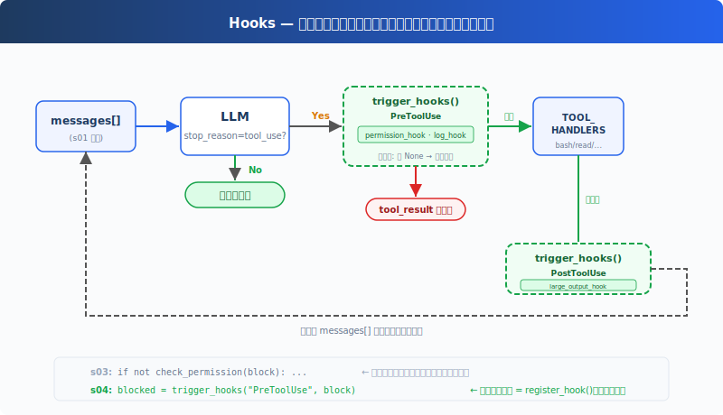

# s04: Hooks — ループに掛ける、ループには書き込まない

[中文](README.md) · [English](README.en.md) · [日本語](README.ja.md)

s01 → s02 → s03 → `s04` → [s05](../s05_todo_write/) → s06 → ... → s20

> *"ループに掛ける、ループには書き込まない"* — フックがツール実行の前後に拡張ロジックを注入する。
>
> **Harness レイヤー**: フック — ループを侵襲しない拡張ポイント。

---

## 課題

s03 の Agent には権限チェックがある。しかし新しいチェックを追加するたび、「bash 呼び出しを毎回ログに記録」「操作後に自動 git add」、`agent_loop` 関数を修正する必要がある。

ループはすぐにこうなる：

```python
def agent_loop(messages):
    while True:
        # ... LLM call ...
        for block in response.content:
            if block.type == "tool_use":
                log_to_file(block)          # 一行追加
                check_permission(block)     # 一行追加
                notify_slack(block)         # さらに一行追加
                output = execute(block)
                auto_git_add(block)         # さらに一行追加
                # ... もうループが見えない
```

拡張したいのは Agent の振る舞いなのに、変更しているのはループそのもの。ループは安定した核心であるべき。拡張は外側に掛ける。

---

## ソリューション



s03 のループと権限ロジックは完全に保持される。唯一の変更点は `check_permission()` をループ本体内からフックに移動したこと。ループはもうチェック関数を直接呼び出さず、代わりに `trigger_hooks("PreToolUse", block)` を呼び、登録済みのフックが何を実行するかを決める。

4 つのイベントで、完全な agent cycle をカバー：

| イベント | 発火タイミング | 典型的な用途 |
|----------|--------------|-------------|
| UserPromptSubmit | ユーザー入力後、LLM に入る前 | 入力バリデーション、コンテキスト注入 |
| PreToolUse | ツール実行前 | 権限チェック、ログ記録 |
| PostToolUse | ツール実行後 | 副作用（自動 git add など）、出力チェック |
| Stop | ループが終了する直前 | クリーンアップ（CC は強制続行もサポート） |

拡張は `register_hook()` で追加する。ループは `trigger_hooks()` を呼ぶだけ。

---

## 仕組み

**フック登録簿**：イベント名をコールバックリストにマッピングする辞書。

```python
HOOKS = {
    "UserPromptSubmit": [],
    "PreToolUse": [],
    "PostToolUse": [],
    "Stop": [],
}

def register_hook(event: str, callback):
    HOOKS[event].append(callback)

def trigger_hooks(event: str, *args):
    for callback in HOOKS[event]:
        result = callback(*args)
        if result is not None:   # 戻り値 ≠ None → フックが「止め」と指示
            return result
    return None
```

教学版では、PreToolUse の非 None 戻り値は実行阻止を意味し、Stop の非 None 戻り値は強制続行を意味する。UserPromptSubmit と PostToolUse の戻り値は未使用。

**UserPromptSubmit**、ユーザー入力後、LLM に入る前に発火。CC では入力の横取りや変更が可能、教学版はログ出力のみ：

```python
def context_inject_hook(query: str) -> str | None:
    """Inject current working directory info into every prompt."""
    print(f"\033[90m[HOOK] UserPromptSubmit: working in {WORKDIR}\033[0m")
    return None   # return None = 変更なし、プロンプトを通す

register_hook("UserPromptSubmit", context_inject_hook)
```

メインループでは、ユーザー入力直後に発火：

```python
query = input("s04 >> ")
trigger_hooks("UserPromptSubmit", query)   # ← LLM に入る前
history.append({"role": "user", "content": query})
agent_loop(history)
```

**PreToolUse / PostToolUse**、ツール実行の前後のフック。s03 の権限チェックロジックは PreToolUse フックに包まれ、さらにログフックと大出力リマインダーが追加される：

```python
# PreToolUse: 権限チェック（s03 のロジック、ループからフックに移動）
def permission_hook(block):
    if block.name == "bash":
        for pattern in DENY_LIST:
            if pattern in block.input.get("command", ""):
                return "Permission denied by deny list"
    if block.name in ("write_file", "edit_file"):
        path = block.input.get("path", "")
        if not (WORKDIR / path).resolve().is_relative_to(WORKDIR):
            choice = input("   Allow? [y/N] ").strip().lower()
            if choice not in ("y", "yes"):
                return "Permission denied by user"
    return None

# PreToolUse: ログ
def log_hook(block):
    print(f"[HOOK] {block.name}(...)")

# PostToolUse: 大ファイルリマインダー
def large_output_hook(block, output):
    if len(str(output)) > 100000:
        print(f"[HOOK] ⚠ Large output from {block.name}")

register_hook("PreToolUse", permission_hook)
register_hook("PreToolUse", log_hook)
register_hook("PostToolUse", large_output_hook)
```

**Stop**、ループが終了する直前に発火（`stop_reason != "tool_use"`）。教学版ではクリーンアップ統計を印刷：

```python
def summary_hook(messages: list) -> str | None:
    """Print a summary when the loop is about to stop."""
    tool_count = sum(1 for m in messages
                     for b in (m.get("content") if isinstance(m.get("content"), list) else [])
                     if isinstance(b, dict) and b.get("type") == "tool_result")
    print(f"\033[90m[HOOK] Stop: session used {tool_count} tool calls\033[0m")
    return None   # return None = 終了を許可、return 文字列 = 強制続行

register_hook("Stop", summary_hook)
```

agent_loop 内では、終了前に発火：

```python
if response.stop_reason != "tool_use":
    force = trigger_hooks("Stop", messages)   # ← 終了する前に
    if force:
        # フックがメッセージを返した → 注入して続行
        messages.append({"role": "user", "content": force})
        continue
    return
```

**ループ内で変更されたのは一箇所だけ**：s03 は直接 `check_permission(block)` を呼び出していたが、s04 は `trigger_hooks("PreToolUse", block)` に置き換えた：

```python
for block in response.content:
    if block.type != "tool_use":
        continue

    # s03: if not check_permission(block): ...
    # s04: フックがハードコードを代替
    blocked = trigger_hooks("PreToolUse", block)
    if blocked:
        results.append({"type": "tool_result", "tool_use_id": block.id,
                        "content": str(blocked)})
        continue

    handler = TOOL_HANDLERS.get(block.name)
    output = handler(**block.input) if handler else f"Unknown: {block.name}"

    trigger_hooks("PostToolUse", block, output)

    results.append({"type": "tool_result", "tool_use_id": block.id,
                    "content": output})
```

4 つのフックが agent cycle の重要ノードをカバー：入力→実行前→実行後→終了。ループは trigger_hooks() を呼ぶだけで、具体的なロジックは全てフックコールバックにある。

---

## s03 からの変更

| コンポーネント | 変更前 (s03) | 変更後 (s04) |
|--------------|-------------|-------------|
| 拡張方式 | check_permission() をループ内にハードコード | HOOKS 登録簿 + trigger_hooks() |
| 新規関数 | — | register_hook, trigger_hooks |
| フックコールバック | — | context_inject_hook, permission_hook, log_hook, large_output_hook, summary_hook |
| ループ | check_permission() を直接呼び出し | trigger_hooks("PreToolUse", ...) を呼び出し |
| 終了制御 | なし | trigger_hooks("Stop", ...) が終了を阻止可能 |
| 入力横取り | なし | trigger_hooks("UserPromptSubmit", ...) がコンテキスト注入可能 |

---

## 試してみよう

```sh
cd learn-claude-code
python s04_hooks/code.py
```

以下のプロンプトを試してみよう：

1. `Read the file README.md`（そのまま通過するはず、フックログを観察）
2. `Create a file called test.txt`（作成後、PostToolUse が発火するか観察）
3. `Delete all temporary files in /tmp`（bash + rm で権限フックが発動）

観察のポイント：各ツール実行前に `[HOOK]` ログが表示されるか？ 権限が拒否されたとき、フックが拦截したのか、ループ内のハードコードが拦截したのか？

---

## 次へ

Agent は安全に操作を実行できるようになった。しかし「まず何をして、次に何をすべきか」を立ち止まって考えたことはあるか？ 複雑なタスクを与えたとき、すぐに取り掛かるのか、まず計画を立てるのか？

→ s05 TodoWrite：Agent に計画ツールを与える。まずリストを作り、それから実行。

<details>
<summary>CC ソースコードを深掘り</summary>

> 以下は CC ソースコード `toolHooks.ts`（650 行）、`hooks.ts`、`stopHooks.ts`、`coreTypes.ts` の完全分析に基づく。

### 一、Hook イベント：4 つではなく 27 個

教育版は PreToolUse と PostToolUse のみを取り上げる。CC には実際に 27 のフックイベントがある（`coreTypes.ts:25-53`）：

| カテゴリ | イベント |
|----------|---------|
| ツール関連 | `PreToolUse`, `PostToolUse`, `PostToolUseFailure` |
| セッション関連 | `SessionStart`, `SessionEnd`, `Stop`, `StopFailure`, `Setup` |
| ユーザー対話 | `UserPromptSubmit`, `Notification`, `PermissionRequest`, `PermissionDenied` |
| サブエージェント | `SubagentStart`, `SubagentStop` |
| 圧縮関連 | `PreCompact`, `PostCompact` |
| チーム関連 | `TeammateIdle`, `TaskCreated`, `TaskCompleted` |
| その他 | `Elicitation`, `ElicitationResult`, `ConfigChange`, `WorktreeCreate`, `WorktreeRemove`, `InstructionsLoaded`, `CwdChanged`, `FileChanged` |

教育版は 4 つのコアイベント（UserPromptSubmit、PreToolUse、PostToolUse、Stop）のみを取り上げる。これらで agent cycle の重要ノードを全てカバーできる。残り 23 個は同じパターン。

### 二、HookResult よく使うフィールド抜粋

CC の `HookResult`（`types/hooks.ts:260-275`）には 14 のフィールドがある。よく使うもの：

| フィールド | 型 | 用途 |
|-----------|-----|------|
| `message` | Message | オプションの UI メッセージ |
| `blockingError` | HookBlockingError | ブロッキングエラー → 会話に注入してモデルが自己修正 |
| `outcome` | success/blocking/non_blocking_error/cancelled | 実行結果 |
| `preventContinuation` | boolean | 後続実行を阻止 |
| `stopReason` | string | 停止理由の説明 |
| `permissionBehavior` | allow/deny/ask/passthrough | フックが権限決定を返す |
| `updatedInput` | Record | ツール入力の変更 |
| `additionalContext` | string | 追加コンテキスト |
| `updatedMCPToolOutput` | unknown | MCP ツール出力の変更 |

### 三、重要な不変条件：Hook 'allow' は deny/ask ルールをバイパスできない

これは CC 権限システムで最も重要なセキュリティ設計（`toolHooks.ts:325-331`）：**フックが allow を返しても、settings.json の deny/ask ルールをチェックする。** ユーザーのフックスクリプトが「許可」と言っても、settings.json でそのツールが無効になっていれば、操作は阻止される。

教育版にはこの階層がない。フックが非 None を返せば直接中断。教育目的では十分だが、本番環境ではセキュリティホールになる。

### 四、stopHookActive 機構

CC の Stop フックには無限ループ防止機構がある（`query.ts:212,1300`）：`stopHookActive` 状態フィールド。Stop フックが blockingError を発生させると、ループは `stopHookActive: true` で次のラウンドに再入する。後続のイテレーションではこのフラグを見て Stop フックを再トリガーしない。これで「永久に止まらない」バグを防ぐ：モデルが自己修正 → Stop フックが再度エラー → モデルが再修正 → Stop フックが再度エラー... を防止。

### 五、hook_stopped_continuation

PostToolUse フックが `preventContinuation: true` を返すと、`hook_stopped_continuation` アタッチメントが生成される（`toolHooks.ts:117-130`）。query.ts（L1388-1393）はそれを検出して `shouldPreventContinuation = true` を設定し、ループが終了する。これは「フックが Agent を優雅に停止させる」機構 — クラッシュではなく、完了。

### 教育版の簡略化は意図的

- 27 イベント → 4（UserPromptSubmit/PreToolUse/PostToolUse/Stop）：agent cycle の重要ノードをカバー
- 14 フィールド → 単純な戻り値（None = 続行、非 None = 中断/続行）：認知負荷を最小限に
- Hook allow vs deny/ask の不変条件 → 省略：教育版に settings.json 層はない
- stopHookActive → 省略：教育版の Stop フックは単純な続行のみ、無限ループ防止は不要

</details>

<!-- translation-sync: zh@v1, en@v1, ja@v1 -->
