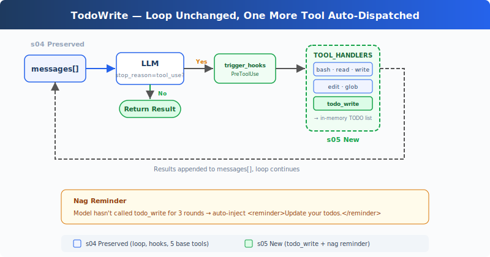

# s05: TodoWrite — An Agent Without a Plan Drifts Off Course

[中文](README.md) · [English](README.en.md) · [日本語](README.ja.md)

s01 → s02 → s03 → s04 → `s05` → [s06](../s06_subagent/) → s07 → ... → s20

> *"An agent without a plan goes wherever the wind blows"* — List the steps first, then execute. Complex tasks are less likely to miss steps.
>
> **Harness Layer**: Planning — Let the Agent think before it acts.

---

## The Problem

Give the Agent a complex task: "Rename all Python files to snake_case, run tests, and fix failures."

The Agent starts working, renames 3 files, runs a test, finds 2 failures, starts fixing. While fixing, it forgets the original goal was "rename to snake_case", the test failures have consumed all its attention.

The longer the conversation, the worse it gets: tool results keep filling the context, diluting the system prompt's influence. A 10-step refactoring: after steps 1-3, the Agent starts improvising because steps 4-10 have been pushed out of its attention.

---

## The Solution



The minimal hook structure from the previous chapter is preserved, focusing on the new `todo_write` tool and reminder mechanism. `todo_write` does no actual work, can't read files or run commands, it simply lets the Agent organize its thoughts before diving in.

The dispatch mechanism is unchanged; the new tool is still routed through `TOOL_HANDLERS[block.name]`. However, to demonstrate the todo reminder, a counter was added to the loop: after 3 consecutive rounds without calling `todo_write`, a reminder is injected.

---

## How It Works

**The todo_write tool** accepts a list with statuses, keeps it in the current process memory, and displays progress in the terminal:

```python
CURRENT_TODOS: list[dict] = []

def run_todo_write(todos: list) -> str:
    global CURRENT_TODOS
    CURRENT_TODOS = todos

    lines = ["\n## Current Tasks"]
    for t in CURRENT_TODOS:
        icon = {"pending": " ", "in_progress": "▸", "completed": "✓"}[t["status"]]
        lines.append(f"  [{icon}] {t['content']}")
    print("\n".join(lines))
    return f"Updated {len(CURRENT_TODOS)} tasks"
```

The tool definition joins the other 5 in the dispatch map:

```python
TOOLS = [
    {"name": "bash",       ...},
    {"name": "read_file",  ...},
    {"name": "write_file", ...},
    {"name": "edit_file",  ...},
    {"name": "glob",       ...},
    # s05: new entry
    {"name": "todo_write", "description": "Create and manage a task list ...",
     "input_schema": {
         "type": "object",
         "properties": {
             "todos": {
                 "type": "array",
                 "items": {
                     "type": "object",
                     "properties": {
                         "content": {"type": "string"},
                         "status": {"type": "string", "enum": ["pending", "in_progress", "completed"]},
                     },
                 },
             },
         },
     },
    },
]

TOOL_HANDLERS["todo_write"] = run_todo_write
```

**Nag reminder**, when the model hasn't called `todo_write` for 3 consecutive rounds, a reminder is automatically injected (teaching mechanism; CC source has no fixed round-count logic):

```python
if rounds_since_todo >= 3 and messages:
    messages.append({
        "role": "user",
        "content": "<reminder>Update your todos.</reminder>",
    })
    rounds_since_todo = 0
```

Typical flow when the Agent receives a task: first call `todo_write` to list all steps (all `pending`) → pick one step, set it to `in_progress` → complete it, set to `completed` → look at the next `pending` → continue. After 3 rounds without `todo_write`, the loop appends a reminder before the next LLM call.

**Key insight**: todo_write doesn't give the Agent any additional **execution capability**. What it adds is **planning capability**.

---

## Changes from s04

| Component | Before (s04) | After (s05) |
|-----------|-------------|-------------|
| Tool count | 5 (bash, read, write, edit, glob) | 6 (+todo_write) |
| Planning | None | Stateful TODO list + nag reminder |
| SYSTEM prompt | Generic prompt | Added "plan before executing" guidance |
| Loop | Unchanged | Dispatch unchanged, added rounds_since_todo counter and reminder injection |

---

## Try It

```sh
cd learn-claude-code
python s05_todo_write/code.py
```

Try these prompts:

1. `Refactor s05_todo_write/example/hello.py: add type hints, docstrings, and a main guard` (should list 3 steps first, then execute)
2. `Create a Python package under s05_todo_write/example/demo_pkg with __init__.py, utils.py, and tests/test_utils.py`
3. `Review Python files under s05_todo_write/example and fix any style issues`

What to watch for: Was the first tool call `todo_write`? How many TODO steps were listed? Did statuses move from `pending` to `in_progress` / `completed` during execution?

---

## What's Next

The Agent can plan now. But if a task is too large, say "refactor the entire auth module", a TODO list alone isn't enough. That task is itself a collection of dozens of subtasks that would drown in a single conversation's context.

→ s06 Subagent: Break large tasks into subtasks, each handled by an independent Agent with its own clean context, no cross-contamination.

<details>
<summary>Dive into CC Source Code</summary>

CC has two task systems coexisting (`tasks.ts:133-139`):

- **TodoWrite (V1)**: A simple list tool, data maintained in memory AppState (`TodoWriteTool.ts:65-103`). The teaching version also keeps it in process memory and clears it on exit.
- **Task System (V2 = s12)**: File-persisted, dependency graph, concurrency locks, ownership.

The switch is controlled by `isTodoV2Enabled()`. In the current source: V2 is enabled by default in interactive sessions, V1 in non-interactive (SDK) sessions; setting `CLAUDE_CODE_ENABLE_TASKS` forces V2 regardless. Note the source comment "Force-enable tasks in non-interactive mode" describes the env var path's purpose, not the default branch's return semantics.

The teaching version omits the `activeForm` field from the real source (`utils/todo/types.ts:8-15`). CC uses it for the UI spinner to show "what's being done"; the teaching version only has terminal output and doesn't need this field.

The teaching version's nag reminder (3 rounds without update triggers injection) is an educational mechanism. The CC source has no fixed "3 rounds" logic; the closest is `TodoWriteTool.ts:72-107` which appends a verification nudge when 3+ todos are all completed without a verification item.

Core increments of the Task System over TodoWrite:
- File persistence (Claude config directory `tasks/{taskListId}/{taskId}.json`) instead of in-memory list
- `blockedBy` dependency graph instead of flat list
- `proper-lockfile` concurrency safety instead of no locking
- Four separate tools (Create/Get/Update/List) instead of one
- TaskCreated / TaskCompleted hooks (`TaskCreateTool.ts:80-129`, `TaskUpdateTool.ts:231-260`) for external system integration

</details>

<!-- translation-sync: zh@v1, en@v1, ja@v1 -->
