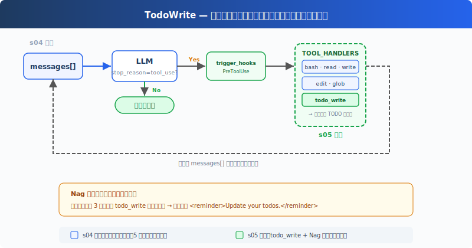

# s05: TodoWrite — 計画なき Agent は途中で道を外れる

[中文](README.md) · [English](README.en.md) · [日本語](README.ja.md)

s01 → s02 → s03 → s04 → `s05` → [s06](../s06_subagent/) → s07 → ... → s20

> *"計画なき agent は風の向くままに"* — まず手順を列挙してから実行。長いタスクで見落としが減る。
>
> **Harness レイヤー**: 計画 — Agent が行動する前に考えさせる。

---

## 課題

Agent に複雑なタスクを与える：「全 Python ファイルを snake_case にリネームし、テストを実行し、失敗を修正して。」

Agent は作業を開始する。3 つのファイルをリネーム、テストを実行、2 つの失敗を発見、修正を開始。修正しているうちに、本来の目的が「snake_case にリネーム」だったことを忘れる。テストの失敗に注意を全て持っていかれる。

会話が長くなるほど悪化する：ツールの結果がコンテキストを埋め続け、システムプロンプトの影響力が希釈される。10 ステップのリファクタリング：ステップ 1-3 を終えた時点で Agent は即興で動き始める。ステップ 4-10 は既に注意の外に追い出されているから。

---

## ソリューション



前章の最小フック構造を保持し、本章では新規の `todo_write` ツールとリマインダー機構に注目する。`todo_write` は実際の作業を何もしない。ファイルを読めない、コマンドを実行できない。Agent が手を動かす前に思考を整理できるようにするだけ。

ディスパッチ機構は変わらず、新ツールも `TOOL_HANDLERS[block.name]` を経由する。ただし、todo リマインダーのデモのため、ループにカウンターを追加した：連続 3 ラウンド `todo_write` を呼び出さないとリマインダーが注入される。

---

## 仕組み

**todo_write ツール**は、ステータス付きのリストを受け取り、現在のプロセスメモリに保持し、端末に進捗を表示する：

```python
CURRENT_TODOS: list[dict] = []

def run_todo_write(todos: list) -> str:
    global CURRENT_TODOS
    CURRENT_TODOS = todos

    lines = ["\n## Current Tasks"]
    for t in CURRENT_TODOS:
        icon = {"pending": " ", "in_progress": "▸", "completed": "✓"}[t["status"]]
        lines.append(f"  [{icon}] {t['content']}")
    print("\n".join(lines))
    return f"Updated {len(CURRENT_TODOS)} tasks"
```

ツール定義は他の 5 つと一緒にディスパッチマップに追加される：

```python
TOOLS = [
    {"name": "bash",       ...},
    {"name": "read_file",  ...},
    {"name": "write_file", ...},
    {"name": "edit_file",  ...},
    {"name": "glob",       ...},
    # s05: 新規追加
    {"name": "todo_write", "description": "Create and manage a task list ...",
     "input_schema": {
         "type": "object",
         "properties": {
             "todos": {
                 "type": "array",
                 "items": {
                     "type": "object",
                     "properties": {
                         "content": {"type": "string"},
                         "status": {"type": "string", "enum": ["pending", "in_progress", "completed"]},
                     },
                 },
             },
         },
     },
    },
]

TOOL_HANDLERS["todo_write"] = run_todo_write
```

**Nag リマインダー**、モデルが連続 3 ラウンド `todo_write` を呼び出さないとき、リマインダーが自動的に注入される（教育用機構、CC ソースコードに固定ラウンド数のロジックはない）：

```python
if rounds_since_todo >= 3 and messages:
    messages.append({
        "role": "user",
        "content": "<reminder>Update your todos.</reminder>",
    })
    rounds_since_todo = 0
```

Agent がタスクを受け取った後の典型的な流れ：まず `todo_write` を呼び出して全手順を列挙（全て `pending`）→ 一つの手順に取り掛かり、`in_progress` に変更 → 完了したら `completed` に変更 → 次の `pending` を見る → 続行。3 ラウンド `todo_write` がない場合、次の LLM 呼び出し前にリマインダーが追加される。

**重要な洞察**：todo_write は Agent に**実行能力**を何も追加しない。追加するのは**計画能力**だ。

---

## s04 からの変更

| コンポーネント | 変更前 (s04) | 変更後 (s05) |
|--------------|-------------|-------------|
| ツール数 | 5 (bash, read, write, edit, glob) | 6 (+todo_write) |
| 計画能力 | なし | ステータス付き TODO リスト + Nag リマインダー |
| SYSTEM プロンプト | 汎用プロンプト | 「先に計画してから実行」のガイダンスを追加 |
| ループ | 不変 | ディスパッチは不変、rounds_since_todo カウンターとリマインダー注入を追加 |

---

## 試してみよう

```sh
cd learn-claude-code
python s05_todo_write/code.py
```

以下のプロンプトを試してみよう：

1. `Refactor s05_todo_write/example/hello.py: add type hints, docstrings, and a main guard`（まず 3 手順を列挙してから実行するはず）
2. `Create a Python package under s05_todo_write/example/demo_pkg with __init__.py, utils.py, and tests/test_utils.py`
3. `Review Python files under s05_todo_write/example and fix any style issues`

観察のポイント：最初のツール呼び出しは `todo_write` か？ TODO は何手順列挙されたか？ 実行中にステータスが `pending` から `in_progress` / `completed` に変わったか？

---

## 次へ

Agent は計画できるようになった。しかしタスクが大きすぎる場合、例えば「認証モジュール全体をリファクタリング」、TODO リストだけでは不十分。そのタスク自体が数十のサブタスクの集合体で、同じ会話のコンテキストに押し込めると溢れてしまう。

→ s06 Subagent：大きなタスクをサブタスクに分割し、それぞれを独立した Agent に任せる。それぞれが独自のクリーンなコンテキストを持ち、相互汚染がない。

<details>
<summary>CC ソースコードを深掘り</summary>

CC には二つのタスクシステムが共存している（`tasks.ts:133-139`）：

- **TodoWrite（V1）**：シンプルなリストツール、データはメモリ AppState で管理（`TodoWriteTool.ts:65-103`）。教育版もプロセスメモリに保持し、終了時に消える
- **Task System（V2 = s12）**：ファイル永続化、依存グラフ、並行ロック、ownership

切り替えは `isTodoV2Enabled()` で制御される。現在のソースコードの実装：対話型セッションでは V2 がデフォルトで有効、非対話型セッション（SDK）では V1 がデフォルトで有効。`CLAUDE_CODE_ENABLE_TASKS` 環境変数を設定するとセッション種別に関わらず V2 が強制有効になる。ソースコメント「Force-enable tasks in non-interactive mode」は環境変数パスの用途を説明しており、デフォルト分岐の戻り値のセマンティクスとは異なるため注意。

教育版は実際のソースコードにある `activeForm` フィールドを省略している（`utils/todo/types.ts:8-15`）。CC は UI スピナーに「何をしているか」を表示するために使用するが、教育版は端末出力のみでこのフィールドは不要。

教育版の Nag リマインダー（3 ラウンド未更新で注入）は教育用機構。CC ソースコードに固定「3 ラウンド」のロジックはなく、最も近いのは `TodoWriteTool.ts:72-107` で 3 つ以上の todo が全て完了しているのに verification 項目がない場合に verification nudge を追加する処理。

Task System の TodoWrite に対する核心的な増分：
- メモリリストではなくファイル永続化（Claude 設定ディレクトリ下 `tasks/{taskListId}/{taskId}.json`）
- 平坦なリストではなく `blockedBy` 依存グラフ
- ロックなしではなく `proper-lockfile` による並行安全性
- 一つのツールではなく四つの独立ツール（Create/Get/Update/List）
- TaskCreated / TaskCompleted フック（`TaskCreateTool.ts:80-129`、`TaskUpdateTool.ts:231-260`）による外部システム統合

</details>

<!-- translation-sync: zh@v1, en@v1, ja@v1 -->
