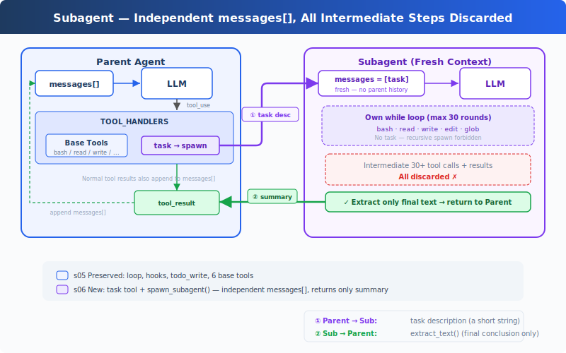

# s06: Subagent — Break Large Tasks into Small Ones with Clean Context

[中文](README.md) · [English](README.en.md) · [日本語](README.ja.md)

s01 → s02 → s03 → s04 → s05 → `s06` → [s07](../s07_skill_loading/) → s08 → ... → s20

> *"Break large tasks small, each with clean context"* — Subagent uses an independent messages[], no pollution in the main conversation.
>
> **Harness Layer**: Sub-Agent — Context isolation, attention doesn't drift.

---

## The Problem

The Agent is fixing a bug. It reads 30 files to trace the call chain, chatting for 60 rounds along the way. The messages list grows to 120 entries, most of which are intermediate steps from "tracing the call chain" — unrelated to the final goal of "fixing the bug."

These intermediate steps occupy context space, making the Agent increasingly "forgetful" — it can no longer remember what the original problem was.

Think of it differently: when you fix a bug, you'd "open a new terminal" to trace the call chain. When done, close the terminal, write the result into your notes, and return to the original terminal to keep fixing. The Agent needs this ability too — **open an independent sub-process, give it an independent message list, let it focus on one thing.**

---

## The Solution



The minimal hook structure and `todo_write` tool from the previous chapter are preserved; this chapter focuses on the new `task` tool. When called, it spawns a sub-Agent with a fresh `messages[]`, running its own loop, and returning only a summary text to the main Agent. Conversation context is discarded, but file system side effects (writes, edits, commands) remain in the working directory.

The sub-Agent's tools are restricted: it has bash/read/write/edit/glob, but no task, preventing recursive spawning. The sub-Agent's tool calls still go through permission hooks; context isolation does not bypass security.

---

## How It Works

**spawn_subagent**, gives the sub-Agent a fresh messages list, runs its own loop, returns only the conclusion:

```python
def spawn_subagent(description: str) -> str:
    # Sub-Agent tools: base tools, but no task (no recursion)
    sub_tools = [...]
    messages = [{"role": "user", "content": description}]  # fresh messages[]

    for _ in range(30):  # safety limit
        response = client.messages.create(
            model=MODEL, system=SUB_SYSTEM,
            messages=messages, tools=sub_tools, max_tokens=8000,
        )
        messages.append({"role": "assistant", "content": response.content})
        if response.stop_reason != "tool_use":
            break
        results = []
        for block in response.content:
            if block.type == "tool_use":
                blocked = trigger_hooks("PreToolUse", block)
                if blocked:
                    results.append({... "content": str(blocked)})
                    continue
                handler = SUB_HANDLERS.get(block.name)
                output = handler(**block.input) if handler else f"Unknown"
                trigger_hooks("PostToolUse", block, output)
                results.append({... "content": output})
        messages.append({"role": "user", "content": results})

    # Return only the final text conclusion, all intermediate steps discarded
    return extract_text(messages[-1]["content"])
```

The main Agent calls it just like any other tool:

```python
TOOLS = [
    {"name": "bash", ...},
    {"name": "read_file", ...},
    {"name": "write_file", ...},
    {"name": "edit_file", ...},
    {"name": "glob", ...},
    {"name": "todo_write", ...},
    # s06: new task tool
    {"name": "task",
     "description": "Launch a subagent to handle a complex subtask. Returns only the final conclusion.",
     "input_schema": {"type": "object", "properties": {"description": {"type": "string"}}, "required": ["description"]}},
]

TOOL_HANDLERS["task"] = spawn_subagent
```

Three key design decisions:

| Decision | Choice | Reason |
|----------|--------|--------|
| Context isolation | Fresh `messages[]` | Sub-Agent's intermediate steps don't pollute main Agent's context |
| Return only conclusion | `extract_text(last_message)` | Not returning the entire messages list |
| No recursion | Sub-Agent has no task tool | Prevents sub-Agent from spawning further sub-Agents |
| Security not bypassed | Sub-Agent tool calls go through PreToolUse hook | Context isolation does not mean permission isolation |

The dispatch mechanism is unchanged; the task tool is routed through `TOOL_HANDLERS[block.name]`. The sub-Agent has its own `SUB_SYSTEM` prompt, explicitly instructing "complete the task, do not delegate further."

---

## Changes from s05

| Component | Before (s05) | After (s06) |
|-----------|-------------|-------------|
| Tool count | 6 (bash, read, write, edit, glob, todo_write) | 7 (+task) |
| New function | — | spawn_subagent (independent messages[] + 30-round safety limit) |
| Context isolation | Everything in the main conversation | Sub-Agent uses fresh messages[] |
| Loop | Unchanged | Dispatch unchanged, sub-Agent has independent SUB_SYSTEM and hook-protected loop |

---

## Try It

```sh
cd learn-claude-code
python s06_subagent/code.py
```

Try these prompts:

1. `Use a subtask to find what testing framework this project uses` (sub-Agent reads files, main Agent receives only the conclusion)
2. `Delegate: read all .py files in agents/ and summarize what each one does`
3. `Use a task to create s06_subagent/example/string_tools.py with a slugify(text: str) function, then verify it from the parent agent`

What to watch for: Do `[Subagent spawned]` / `[Subagent done]` appear? Do sub-Agent tool calls print as `[sub] ...`? Does the parent Agent continue with only the summary returned by the sub-Agent?

---

## What's Next

The Agent can now break tasks apart. But different tasks require different knowledge: editing frontend components needs React conventions, writing SQL needs table schemas. Stuffing all this knowledge into the system prompt would blow up the context.

→ s07 Skill Loading: Inject skills on demand instead of piling documents into the system prompt. Load only when needed, as natural as reading a file.

<details>
<summary>Dive into CC Source Code</summary>

> The following is based on a complete analysis of CC source code `AgentTool.tsx`, `runAgent.ts`, `forkSubagent.ts`, and `forkedAgent.ts`.

### 1. Not One Pattern, but Three

The teaching version covers only "fresh messages[]". CC actually has three execution modes:

| Mode | Trigger | Context |
|------|---------|---------|
| **Normal Subagent** | `subagent_type` specified (normal path) | Truly fresh messages[], only the prompt |
| **Fork Subagent** | No `subagent_type`, fork gate enabled | Constructs cache-friendly prefix via `buildForkedMessages()`, shares prompt cache |
| **General-Purpose** | No `subagent_type`, fork gate disabled | Same as Normal |

### 2. Fork Mode: Sharing Prompt Cache

This is a core concept the teaching version omits. Fork mode (`forkSubagent.ts:60-71`) doesn't create a fresh context. Instead, it constructs a cache-friendly message prefix via `buildForkedMessages()` (`forkSubagent.ts:107-168`), preserving the parent assistant message and generating placeholder tool results. The goal isn't isolation, but making the Anthropic API's prompt cache hit: parent and child Agent's system prompt, tools, and message prefix are byte-identical, so the API doesn't need to recompute.

Five key components for cache hit (`forkedAgent.ts:57-68`): system prompt, tools, model, message prefix, thinking config, must be byte-identical.

### 3. Context Isolation's Precise Granularity

`createSubagentContext()` (`forkedAgent.ts:345-462`) creates the sub-Agent's `ToolUseContext`:

| Field | Behavior |
|-------|----------|
| `abortController` | New child controller; parent abort propagates down |
| `setAppState` | Default no-op; but sync agents share via `shareSetAppState` (`runAgent.ts:697-714`) |
| `readFileState` | **Cloned from parent** (avoids re-reading same files) |
| `queryTracking` | New chainId, `depth = parentDepth + 1` |

The sub-Agent isn't fully isolated: file read state is shared. The degree of UI and notification isolation varies by execution path (sync/async/fork/teammate differ).

### 4. Recursive Fork Protection

The teaching version uses "sub-Agent has no task tool" for recursion protection. The real implementation is more nuanced: `isInForkChild()` (`forkSubagent.ts:78-89`) checks for `FORK_BOILERPLATE_TAG` in history. But `constants/tools.ts:36-46` defaults `Agent` to all agents' disabled set (with `USER_TYPE === 'ant'` exception); `forkSubagent.ts:73-89` has fork-child-specific recursion protection; `agentToolUtils.ts:100-110` has special allowances in teammate scenarios. Not simply "no further sub-Agents."

### 5. Permission Bubbling

Fork Agent's `permissionMode: 'bubble'` (`forkSubagent.ts:67`) means the sub-Agent's permission prompts bubble up to the parent terminal: the user approves sub-Agent operations in the main terminal.

### 6. Async vs Sync

The teaching version only shows synchronous sub-Agents (parent waits for child to finish). CC also supports async paths (`AgentTool.tsx:686-764`): when `run_in_background: true`, the sub-Agent launches asynchronously, returning `{ status: 'async_launched' }` immediately to the parent, and notifies the parent when complete. Actual triggers go beyond `run_in_background`, including auto-background, assistant force async, and coordinator/proactive paths.

### Teaching Version Simplifications Are Intentional

- Three modes → one (fresh messages): conceptually clear
- Prompt cache sharing → omitted: teaching version doesn't involve API-layer optimization
- Recursive fork protection → simplified to "sub-Agent has no task tool"
- Async → omitted (left for s13): s06 focuses on the synchronous model first

</details>

<!-- translation-sync: zh@v1, en@v1, ja@v1 -->
