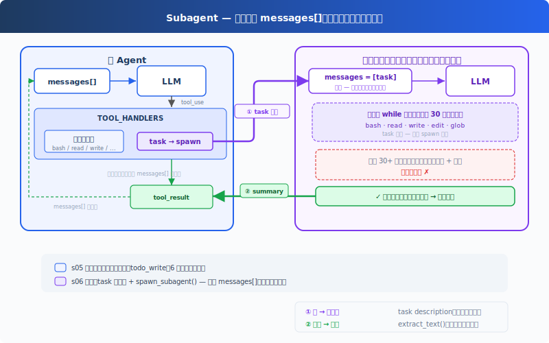

# s06: Subagent — 大きなタスクを分割、それぞれがクリーンなコンテキストを取得

[中文](README.md) · [English](README.en.md) · [日本語](README.ja.md)

s01 → s02 → s03 → s04 → s05 → `s06` → [s07](../s07_skill_loading/) → s08 → ... → s20

> *"大きなタスクは小さく、小さなタスクごとにクリーンなコンテキスト"* — Subagent は独立した messages[] を使い、メイン会話を汚染しない。
>
> **Harness レイヤー**: サブエージェント — コンテキストの隔離、注意の散漫を防ぐ。

---

## 課題

Agent がバグを修正している。呼び出しチェーンを追跡するために 30 のファイルを読み、途中で 60 ラウンドやり取りした。messages リストは 120 件に膨らみ、その大部分は「呼び出しチェーンの追跡」という中間過程 — 「バグ修正」という最終目標とは無関係。

この中間過程がコンテキストの席を占め、Agent はますます「健忘」になる — 最初の問題が何だったか覚えていられない。

別の見方をすると：バグを修正するとき、あなたは「新しいターミナルを開いて」呼び出しチェーンを追跡するだろう。追跡が終わったらターミナルを閉じ、結果をメモに書き、元のターミナルに戻ってバグ修正を続ける。Agent にもこの能力が必要 — **独立したサブプロセスを開き、独立したメッセージリストを与え、一つのことに集中させる。**

---

## ソリューション



前章の最小フック構造と `todo_write` ツールを保持し、本章は新規の `task` ツールに注目する。呼び出されると、サブエージェントを spawn する。新しい `messages[]` を持ち、自分自身のループを実行し、終了後に要約テキストのみをメイン Agent に返す。会話コンテキストは破棄されるが、ファイルシステムの副作用（書き込み、編集、コマンド実行）は作業ディレクトリに残る。

サブエージェントのツールは制限される：bash/read/write/edit/glob を持つが、task はない。再帰 spawn を防止する。サブエージェントのツール呼び出しも権限フックを経由する。コンテキスト分離は権限のバイパスではない。

---

## 仕組み

**spawn_subagent**、サブエージェントに新しいメッセージリストを与え、自分自身のループを実行し、結論のみを返す：

```python
def spawn_subagent(description: str) -> str:
    # サブエージェントのツール：基本ツールのみ、task なし（再帰禁止）
    sub_tools = [...]
    messages = [{"role": "user", "content": description}]  # 新規 messages[]

    for _ in range(30):  # safety limit
        response = client.messages.create(
            model=MODEL, system=SUB_SYSTEM,
            messages=messages, tools=sub_tools, max_tokens=8000,
        )
        messages.append({"role": "assistant", "content": response.content})
        if response.stop_reason != "tool_use":
            break
        results = []
        for block in response.content:
            if block.type == "tool_use":
                blocked = trigger_hooks("PreToolUse", block)
                if blocked:
                    results.append({... "content": str(blocked)})
                    continue
                handler = SUB_HANDLERS.get(block.name)
                output = handler(**block.input) if handler else f"Unknown"
                trigger_hooks("PostToolUse", block, output)
                results.append({... "content": output})
        messages.append({"role": "user", "content": results})

    # 最後のテキスト結論のみを返す、中間過程はすべて破棄
    return extract_text(messages[-1]["content"])
```

メイン Agent の呼び出しは、他のツールと同じ：

```python
TOOLS = [
    {"name": "bash", ...},
    {"name": "read_file", ...},
    {"name": "write_file", ...},
    {"name": "edit_file", ...},
    {"name": "glob", ...},
    {"name": "todo_write", ...},
    # s06: 新規 task ツール
    {"name": "task",
     "description": "Launch a subagent to handle a complex subtask. Returns only the final conclusion.",
     "input_schema": {"type": "object", "properties": {"description": {"type": "string"}}, "required": ["description"]}},
]

TOOL_HANDLERS["task"] = spawn_subagent
```

三つの重要な設計決定：

| 決定 | 選択 | 理由 |
|------|------|------|
| コンテキスト隔離 | 新規 `messages[]` | サブエージェントの中間過程がメイン Agent のコンテキストを汚染しない |
| 結論のみ返却 | `extract_text(last_message)` | messages リスト全体を返すのではない |
| 再帰禁止 | サブエージェントに task ツールなし | サブエージェントがさらにサブエージェントを spawn するのを防止 |
| セキュリティのバイパスなし | サブエージェントのツール呼び出しも PreToolUse フックを経由 | コンテキスト分離は権限分離ではない |

ディスパッチ機構は変わらず、task ツールは `TOOL_HANDLERS[block.name]` を経由する。サブエージェントは独立した `SUB_SYSTEM` プロンプトを持ち、「タスクを完了し、さらに委託しない」と明示される。

---

## s05 からの変更

| コンポーネント | 変更前 (s05) | 変更後 (s06) |
|--------------|-------------|-------------|
| ツール数 | 6 (bash, read, write, edit, glob, todo_write) | 7 (+task) |
| 新規関数 | — | spawn_subagent（独立 messages[] + 30 ラウンド安全制限） |
| コンテキスト隔離 | すべてメイン会話内 | サブエージェントが新規 messages[] を使用 |
| ループ | 不変 | ディスパッチは不変、サブエージェントに独立した SUB_SYSTEM とフック保護されたループ |

---

## 試してみよう

```sh
cd learn-claude-code
python s06_subagent/code.py
```

以下のプロンプトを試してみよう：

1. `Use a subtask to find what testing framework this project uses`（サブエージェントがファイルを読み、メイン Agent は結論のみ受け取る）
2. `Delegate: read all .py files in agents/ and summarize what each one does`
3. `Use a task to create s06_subagent/example/string_tools.py with a slugify(text: str) function, then verify it from the parent agent`

観察のポイント：`[Subagent spawned]` / `[Subagent done]` が表示されるか？ サブエージェントのツール呼び出しが `[sub] ...` として出力されるか？ 親 Agent はサブエージェントが返した要約だけを受け取って続行するか？

---

## 次へ

Agent はタスクを分割できるようになった。しかし各タスクに必要な知識は異なる。フロントエンドコンポーネントの変更には React 規約が必要で、SQL を書くにはテーブル構造を知る必要がある。これらの知識をすべて system prompt に詰め込むと、コンテキストが溢れてしまう。

→ s07 Skill Loading：スキルをオンデマンドで注入する。system prompt にドキュメントを積み上げるのではなく、必要なときだけ読み込む。ファイルを読むのと同じくらい自然に。

<details>
<summary>CC ソースコードを深掘り</summary>

> 以下は CC ソースコード `AgentTool.tsx`、`runAgent.ts`、`forkSubagent.ts`、`forkedAgent.ts` の完全分析に基づく。

### 一、一つのパターンではなく三つ

教育版は「新規 messages[]」のみを取り上げる。CC には実際に三つの実行モードがある：

| モード | トリガー | コンテキスト |
|--------|---------|-------------|
| **Normal Subagent** | `subagent_type` 指定時（normal path） | 新規 messages[]、プロンプトのみ |
| **Fork Subagent** | `subagent_type` 未指定、fork gate 有効時 | `buildForkedMessages()` でキャッシュフレンドリーなプレフィックスを構築、プロンプトキャッシュを共有 |
| **General-Purpose** | `subagent_type` 未指定、fork gate 無効時 | Normal と同じ |

### 二、Fork モード：プロンプトキャッシュの共有のため

これは教育版にはない核心概念。Fork モード（`forkSubagent.ts:60-71`）は新規コンテキストを作成せず、`buildForkedMessages()`（`forkSubagent.ts:107-168`）でキャッシュフレンドリーなメッセージプレフィックスを構築する。親の assistant message を保持し、placeholder tool results を生成する。目的は隔離ではなく、Anthropic API のプロンプトキャッシュをヒットさせること：親子 Agent の system prompt、tools、messages プレフィックスがバイトレベルで一致するため、API 側で再計算が不要になる。

キャッシュヒットの五つの重要コンポーネント（`forkedAgent.ts:57-68`）：system prompt、tools、model、messages プレフィックス、thinking config、バイトレベルで一致する必要がある。

### 三、コンテキスト隔離の精密な粒度

`createSubagentContext()`（`forkedAgent.ts:345-462`）はサブエージェントの `ToolUseContext` を作成：

| フィールド | 挙動 |
|-----------|------|
| `abortController` | 新しい子コントローラ、親の abort は下に伝播 |
| `setAppState` | デフォルトは no-op、ただし sync agent は `shareSetAppState` で共有（`runAgent.ts:697-714`） |
| `readFileState` | **親からクローン**（同じファイルの再読み込みを回避） |
| `queryTracking` | 新しい chainId、`depth = parentDepth + 1` |

サブエージェントは完全に隔離されているわけではない。ファイル読み取り状態は共有される。UI と通知の隔離度は実行パスにより異なる（sync/async/fork/teammate でそれぞれ異なる）。

### 四、再帰 Fork 防護

教育版は「サブエージェントに task ツールなし」で再帰防止を表現する。実際の実装はより精密：`isInForkChild()`（`forkSubagent.ts:78-89`）が会話履歴内の `FORK_BOILERPLATE_TAG` をチェックする。しかし `constants/tools.ts:36-46` では `Agent` ツールが全エージェントの無効セットにデフォルト設定（`USER_TYPE === 'ant'` 時は例外）、`forkSubagent.ts:73-89` は fork child 向けの専用再帰保護があり、`agentToolUtils.ts:100-110` は teammate シナリオで特別な許可がある。単純な「サブエージェントの再 spawn 禁止」ではない。

### 五、Permission Bubbling

Fork Agent の `permissionMode: 'bubble'`（`forkSubagent.ts:67`）は、サブエージェントの権限プロンプトが親ターミナルにバブルアップすることを意味する。ユーザーはメインターミナルでサブエージェントの操作を承認する。

### 六、Async vs Sync

教育版は同期サブエージェントのみ（親が子の完了を待つ）を示す。CC は非同期パスもサポート（`AgentTool.tsx:686-764`）：`run_in_background: true` の場合、サブエージェントは非同期で起動し、`{ status: 'async_launched' }` を直ちに親に返し、完了時に通知機構で親に知らせる。実際のトリガーは `run_in_background` だけでなく、auto-background、assistant force async、coordinator/proactive パスもある。

### 教育版の簡略化は意図的

- 三つのモード → 一つ（新規 messages）：概念的に明確
- プロンプトキャッシュ共有 → 省略：教育版は API 層の最適化を扱わない
- 再帰 fork 防護 → 「サブエージェントに task ツールなし」に簡略化
- Async → 省略（s13 に委ねる）：s06 はまず同期モデルを理解する

</details>

<!-- translation-sync: zh@v1, en@v1, ja@v1 -->
