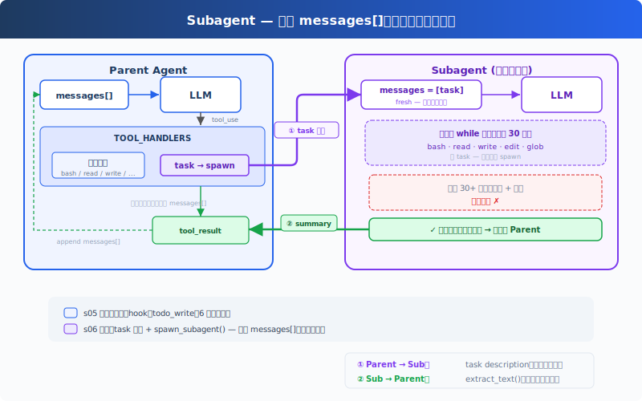

# s06: Subagent — 大任务拆小，每个拿到的都是干净上下文

[中文](README.md) · [English](README.en.md) · [日本語](README.ja.md)

s01 → s02 → s03 → s04 → s05 → `s06` → [s07](../s07_skill_loading/) → s08 → ... → s20

> *"大任务拆小, 每个小任务干净的上下文"* — Subagent 用独立 messages[], 不污染主对话。
>
> **Harness 层**: 子 Agent — 上下文隔离, 注意力不漂移。

---

## 问题

Agent 在修一个 bug。它读了 30 个文件来追踪调用链，中间聊了 60 轮。messages 列表涨到 120 条，其中大部分是"追踪调用链"的中间过程，和"修 bug"这个最终目标无关。

这些中间过程占着上下文位置，让 Agent 越来越"健忘"，它记不住最初的问题是什么了。

换个角度：你修 bug 的时候，会"开一个新终端"来追踪调用链。追踪完了，终端关掉，结果写进笔记，回到原来的终端继续修 bug。Agent 也需要这个能力：开一个独立的子进程，给它一个独立的消息列表，让它专心做一件事。

---

## 解决方案



保留上一章的最小 hook 结构和 `todo_write` 工具，本章重点转向新增的 `task` 工具。调用它时，spawn 一个子 Agent，拥有全新的 `messages[]`，跑自己的循环，结束后只把摘要文本回传给主 Agent。对话上下文被丢弃，但文件系统的副作用（写文件、改文件、跑命令）保留在工作目录中。

子 Agent 的工具受限：有 bash/read/write/edit/glob，但没有 task，不能递归 spawn 新的子 Agent。子 Agent 的工具调用仍经过权限 hook，安全策略不因上下文隔离而跳过。

---

## 工作原理

**spawn_subagent**，给子 Agent 一个全新的 messages 列表，跑自己的循环，只回传结论：

```python
def spawn_subagent(description: str) -> str:
    # 子 Agent 的工具：基础工具，但没有 task（禁止递归）
    sub_tools = [
        {"name": "bash", ...}, {"name": "read_file", ...},
        {"name": "write_file", ...}, {"name": "edit_file", ...},
        {"name": "glob", ...},
    ]
    messages = [{"role": "user", "content": description}]  # 全新 messages[]

    for _ in range(30):  # safety limit
        response = client.messages.create(
            model=MODEL, system=SUB_SYSTEM,
            messages=messages, tools=sub_tools, max_tokens=8000,
        )
        messages.append({"role": "assistant", "content": response.content})
        if response.stop_reason != "tool_use":
            break
        results = []
        for block in response.content:
            if block.type == "tool_use":
                blocked = trigger_hooks("PreToolUse", block)
                if blocked:
                    results.append({... "content": str(blocked)})
                    continue
                handler = SUB_HANDLERS.get(block.name)
                output = handler(**block.input) if handler else f"Unknown"
                trigger_hooks("PostToolUse", block, output)
                results.append({... "content": output})
        messages.append({"role": "user", "content": results})

    # 只返回最后的文本结论，中间过程全部丢弃
    return extract_text(messages[-1]["content"])
```

主 Agent 调用时，跟调其他工具一样：

```python
TOOLS = [
    {"name": "bash", ...},
    {"name": "read_file", ...},
    {"name": "write_file", ...},
    {"name": "edit_file", ...},
    {"name": "glob", ...},
    {"name": "todo_write", ...},
    # s06: 新增 task 工具
    {"name": "task",
     "description": "Launch a subagent to handle a complex subtask. Returns only the final conclusion.",
     "input_schema": {"type": "object", "properties": {"description": {"type": "string"}}, "required": ["description"]}},
]

TOOL_HANDLERS["task"] = spawn_subagent
```

三个关键设计决策：

| 决策 | 选择 | 原因 |
|------|------|------|
| 上下文隔离 | 全新 `messages[]` | 子 Agent 的中间过程不污染主 Agent 的上下文 |
| 只回传结论 | `extract_text(last_message)` | 不是回传整个 messages 列表 |
| 禁止递归 | 子 Agent 无 task 工具 | 防止子 Agent 再 spawn 新的子 Agent |
| 安全策略不跳过 | 子 Agent 工具调用也走 PreToolUse hook | 上下文隔离不代表权限隔离 |

dispatch 机制不变，task 工具通过 `TOOL_HANDLERS[block.name]` 分发。子 Agent 有独立的 `SUB_SYSTEM` 提示，明确要求"直接完成任务，不要再委派"。

---

## 相对 s05 的变更

| 组件 | 之前 (s05) | 之后 (s06) |
|------|-----------|-----------|
| 工具数量 | 6 (bash, read, write, edit, glob, todo_write) | 7 (+task) |
| 新函数 | — | spawn_subagent（独立 messages[] + 30 轮安全限制） |
| 上下文隔离 | 全部在主对话中 | 子 Agent 用全新的 messages[] |
| 循环 | 不变 | dispatch 不变，子 Agent 有独立 SUB_SYSTEM 和 hook 保护的循环 |

---

## 试一下

```sh
cd learn-claude-code
python s06_subagent/code.py
```

试试这些 prompt：

1. `Use a subtask to find what testing framework this project uses`（子 Agent 去读文件，主 Agent 只收结论）
2. `Delegate: read all .py files in agents/ and summarize what each one does`
3. `Use a task to create s06_subagent/example/string_tools.py with a slugify(text: str) function, then verify it from the parent agent`

观察重点：是否出现 `[Subagent spawned]` / `[Subagent done]`？子 Agent 的工具调用是否以 `[sub] ...` 输出？主 Agent 最后是否只继续处理子 Agent 返回的摘要？

---

## 接下来

Agent 现在能拆任务了。但每个任务需要的知识不一样：改前端组件需要知道 React 规范，写 SQL 需要知道表结构。这些知识全塞进 system prompt，上下文直接爆了。

s07 Skill Loading → 技能按需注入，不在 system prompt 里堆文档。用到的时候才加载，和读文件一样自然。

<details>
<summary>深入 CC 源码</summary>

> 以下基于 CC 源码 `AgentTool.tsx`、`runAgent.ts`、`forkSubagent.ts`、`forkedAgent.ts` 的完整分析。

### 一、不是一种模式，是三种

教学版只讲了"全新的 messages[]"。CC 实际有三种执行模式：

| 模式 | 触发条件 | 上下文 |
|------|---------|--------|
| **Normal Subagent** | 指定了 `subagent_type`（normal path） | 全新 messages[]，只有 prompt |
| **Fork Subagent** | 没指定 `subagent_type`，fork gate 开启 | 通过 `buildForkedMessages()` 构造 cache-friendly 前缀，共享 prompt cache |
| **General-Purpose** | 没指定 `subagent_type`，fork gate 关闭 | 同 Normal |

### 二、Fork 模式：为了共享 Prompt Cache

这是教学版没有的核心概念。Fork 模式（`forkSubagent.ts:60-71`）不创建全新上下文，而是通过 `buildForkedMessages()`（`forkSubagent.ts:107-168`）构造 cache-friendly 消息前缀，保留父 assistant message 并生成 placeholder tool results。目的不是隔离，而是让 Anthropic API 的 prompt cache 命中：父子 Agent 的 system prompt、tools、messages 前缀完全一致，API 端不需要重算。

缓存命中的五个关键组件（`forkedAgent.ts:57-68`）：system prompt、tools、model、messages 前缀、thinking config，必须字节级一致。

### 三、Context Isolation 的精确粒度

`createSubagentContext()`（`forkedAgent.ts:345-462`）创建子 Agent 的 `ToolUseContext`：

| 字段 | 行为 |
|------|------|
| `abortController` | 新的 child controller，父 abort 向下传播 |
| `setAppState` | 默认 no-op；但 sync agent 通过 `shareSetAppState` 共享（`runAgent.ts:697-714`） |
| `readFileState` | **从父克隆**（避免重复读相同文件） |
| `queryTracking` | 新 chainId，`depth = parentDepth + 1` |

子 Agent 不是完全隔离的：文件读取状态是共享的。UI 和通知的隔离程度取决于执行路径（sync/async/fork/teammate 各不同）。

### 四、递归 Fork 防护

教学版用"子 Agent 不给 task 工具"表达递归保护。真实实现更精细：`isInForkChild()`（`forkSubagent.ts:78-89`）检查对话历史中是否有 `FORK_BOILERPLATE_TAG`，有就拒绝。但 `constants/tools.ts:36-46` 中 `Agent` 工具默认在所有 agent 的禁用集合里，`USER_TYPE === 'ant'` 时例外；`forkSubagent.ts:73-89` 针对 fork child 有专门的递归保护；`agentToolUtils.ts:100-110` 在 teammate 场景下有特殊放行。不是简单的"禁止新的子 Agent"。

### 五、Permission Bubbling

Fork Agent 的 `permissionMode: 'bubble'`（`forkSubagent.ts:67`）意味着子 Agent 的权限弹窗冒泡到父终端，用户在主终端里审批子 Agent 的操作。

### 六、Async vs Sync

教学版只展示了同步子 Agent（父等着子跑完）。CC 还支持异步路径（`AgentTool.tsx:686-764`）：`run_in_background: true` 时异步启动，返回 `{ status: 'async_launched' }` 立即给父 Agent，子 Agent 完成后通过通知机制告知父 Agent。实际触发条件不止 `run_in_background`，还有 auto-background、assistant force async、coordinator/proactive 等路径。

### 教学版的简化是刻意的

- 三种模式 → 一种（fresh messages）：概念清晰
- Prompt cache 共享 → 省略：教学版不涉及 API 层优化
- 递归 fork 防护 → 简化为"子 Agent 无 task 工具"
- Async → 省略（留给 s13）：s06 先理解同步模型

</details>

<!-- translation-sync: zh@v1, en@v0, ja@v0 -->
