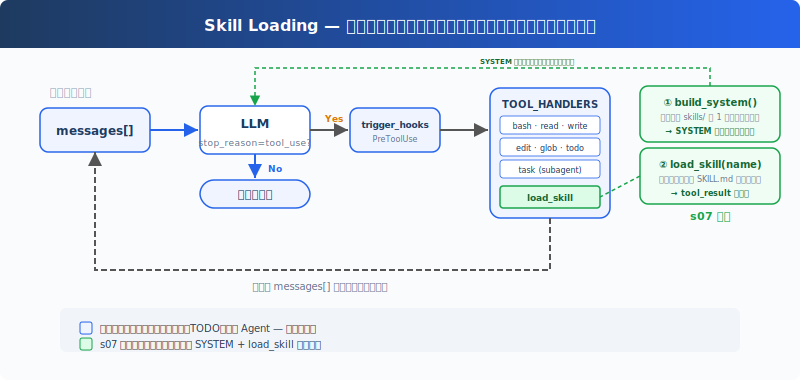

# s07: Skill Loading — 必要なときにだけ読み込む

[中文](README.md) · [English](README.en.md) · [日本語](README.ja.md)

s01 → s02 → s03 → s04 → s05 → s06 → `s07` → [s08](../s08_context_compact/) → s09 → ... → s20
> *"Load when needed, don't stuff the prompt"* — tool_result で注入、system prompt には詰め込まない。
>
> **Harness レイヤー**: 知識 — 必要に応じて読み込み、コンテキストに詰め込まない。

---

## 課題

プロジェクトには React コンポーネント仕様、SQL スタイルガイド、API 設計ドキュメントがある。Agent にこれらの仕様を自動的に守らせたい。最も直接的な方法 — すべて system prompt に詰め込む：

```python
SYSTEM = (
    f"You are a coding agent. "
    + open("docs/react-style.md").read()       # 2000 行
    + open("docs/sql-style.md").read()         # 1500 行
    + open("docs/api-design.md").read()        # 3000 行
)
```

6500 行の system prompt。Agent は LLM を呼び出すたびにこれらのドキュメントを運ぶ — CSS の色を変えるときも SQL クエリを修正するときも。99% の内容が現在のタスクと無関係で、トークンを無駄に消費する。

---

## ソリューション



前章の最小フック構造、`todo_write`、サブ Agent を維持し、本章は新規の `load_skill` ツールに注目する。起動時にスキルカタログを SYSTEM prompt に注入し、実行時に完全な内容を読み込むツールを登録する。使ったときだけトークンを消費。

2 層設計：

| 層 | 場所 | タイミング | コスト |
|---|------|-----------|--------|
| 1. カタログ | system prompt | 起動時に注入（harness が skills/ をスキャン） | ~100 トークン/スキル、毎ターン携帯 |
| 2. 内容 | tool_result | Agent が load_skill を呼び出したとき | ~2000 トークン/スキル、オンデマンド |

ディスパッチ機構は変わらず、`load_skill` は `TOOL_HANDLERS[block.name]` を通じて自動的にディスパッチされる。

---

## 仕組み

**skills/ ディレクトリ**、スキルごとに 1 つのサブディレクトリ、それぞれに `SKILL.md` ファイルを含む：

```
skills/
  agent-builder/SKILL.md
  code-review/SKILL.md
  mcp-builder/SKILL.md
  pdf/SKILL.md
```

**第 1 層：起動時にカタログを注入**：harness は起動時に `_scan_skills()` を呼び出して skills/ ディレクトリをスキャンし、各 SKILL.md の YAML frontmatter（`name`、`description`）を解析して `SKILL_REGISTRY` 辞書に格納する。`list_skills()` はレジストリからカタログを生成し、SYSTEM prompt に注入する。Agent は毎ターン「どのスキルが利用可能か」を確認できる。追加の API 呼び出しは不要：

```python
SKILL_REGISTRY: dict[str, dict] = {}

def _scan_skills():
    if not SKILLS_DIR.exists():
        return
    for d in sorted(SKILLS_DIR.iterdir()):
        if not d.is_dir():
            continue
        manifest = d / "SKILL.md"
        if manifest.exists():
            raw = manifest.read_text()
            meta, body = _parse_frontmatter(raw)
            name = meta.get("name", d.name)
            desc = meta.get("description", raw.split("\n")[0].lstrip("#").strip())
            SKILL_REGISTRY[name] = {"name": name, "description": desc, "content": raw}

_scan_skills()  # runs once at startup

def list_skills() -> str:
    return "\n".join(f"- **{s['name']}**: {s['description']}" for s in SKILL_REGISTRY.values())

def build_system() -> str:
    catalog = list_skills()
    return (
        f"You are a coding agent at {WORKDIR}. "
        f"Skills available:\n{catalog}\n"
        "Use load_skill to get full details when needed."
    )

SYSTEM = build_system()
```

**第 2 層：load_skill**：Agent が「SQL スタイルガイドが必要」と判断し、`load_skill("sql-style")` を呼び出す。レジストリを通じて検索し、ファイルパスを経由しないため、パストラバーサルのリスクがない。内容は `tool_result` を通じて注入される：

```python
def load_skill(name: str) -> str:
    skill = SKILL_REGISTRY.get(name)
    if not skill:
        return f"Skill not found: {name}"
    return skill["content"]
```

重要な違い：スキル内容は system prompt の一部ではなく、ツール結果として現在の messages に入る。後続の呼び出しでは履歴とともに携帯され、コンテキスト圧縮、切り捨て、またはセッション終了まで保持される。これは s08 の compact と自然に接続する：オンデマンド読み込みで「運ぶべきでないものは運ばない」を解決し、compact が「捨てるべきものをどう捨てるか」を解決する。

---

## s06 からの変更点

| コンポーネント | 変更前 (s06) | 変更後 (s07) |
|---------------|-------------|-------------|
| ツール数 | 7 (bash, read, write, edit, glob, todo_write, task) | 8 (+load_skill) |
| 知識読み込み | なし | 2 層：起動時カタログ注入 SYSTEM + 実行時 load_skill |
| SYSTEM プロンプト | 静的文字列 | 起動時に skills/ をスキャンしてカタログ注入 |
| スキルレジストリ | なし | SKILL_REGISTRY（起動時に充填、パストラバーサル防止） |
| ループ | 変更なし | 変更なし（スキルツールは自動ディスパッチ） |

---

## 試してみよう

```sh
cd learn-claude-code
python s07_skill_loading/code.py
```

以下のプロンプトを試してみよう：

1. `What skills are available?`
2. `Load the code-review skill and follow its instructions`
3. `I need to do a code review -- load the relevant skill first`

観察のポイント：Agent は SYSTEM 内のカタログから利用可能なスキルを知っているか？ 完全な手順が必要なときに `[HOOK] load_skill` が表示されるか？ 読み込んだスキルの説明を使って回答しているか？

---

## 次へ

オンデマンド読み込みで「運ぶべきでないものは運ばない」問題は解決した。しかし別の問題が待っている：Agent が 30 分連続で作業すると、messages リストが中間プロセスで埋め尽くされる。古い tool_result、期限切れのファイル内容、コンテキストを占領しているが価値を生まない。

→ s08 Context Compact：4 層圧縮戦略。安価な層を先に実行、高価な層を後に実行。

<details>
<summary>CC ソースコードを深掘り</summary>

> 以下は CC ソースコード `loadSkillsDir.ts`、`SkillTool.ts`、`bundledSkills.ts`、`commands.ts` の分析に基づく。

### 一、スキルソース：skills/ ディレクトリだけではない

教育版はすべてのスキルが `skills/` ディレクトリにあると想定している。CC は実際に複数のファイルに分散したソースから読み込む：`loadSkillsDir.ts` は user/project/`--add-dir` ディレクトリと legacy commands（`.claude/commands/`）を担当、`bundledSkills.ts` は組み込みスキル、`SkillTool.ts` は MCP リモートスキル、`commands.ts` はコマンド集約を担当。タイプには managed/policy skills、user skills（`~/.claude/skills/`）、project skills（`.claude/skills/`）、`--add-dir` skills、legacy commands、dynamic skills、conditional skills（`paths` frontmatter を持ち、ファイルパスでアクティベート）、bundled skills、plugin skills、MCP skills が含まれる。

### 二、SKILL.md Frontmatter の一般的なフィールド

CC の SKILL.md YAML frontmatter は `parseSkillFrontmatterFields()`（`loadSkillsDir.ts`）で解析される。一般的なフィールド：

| フィールド | 用途 |
|-----------|------|
| `name` / `description` | 表示名と説明 |
| `when_to_use` | モデルにいつ呼び出すかを指導 |
| `allowed-tools` | スキルが使用可能なツールの自動許可リスト |
| `context` | `inline`（デフォルト）または `fork`（サブ Agent として実行） |
| `model` | モデルオーバーライド（haiku/sonnet/opus/inherit） |
| `hooks` | スキルレベルのフック設定 |
| `paths` | 条件付きアクティベーションの glob パターン |
| `user-invocable` | ユーザーが `/name` で呼び出し可能 |

完全なフィールドリストはバージョンによって変動する。上記は教育版に関連するコアフィールドのみ。

### 三、2 層読み込みの正確な実装

1. **カタログ（起動時）**：`getSkillDirCommands()` がディレクトリをスキャン → メタデータのみを含む `Command` オブジェクトとして登録。`getSkillListingAttachments()` がスキルリストを添付ファイルとしてフォーマット、コンテキストウィンドウの ~1% を予算とする（上限 8000 文字）。
2. **読み込み（呼び出し時）**：モデルが `Skill` ツールを呼び出す（入力フィールドは `skill` + オプションの `args`、教育版は `name` を使用）→ `getPromptForCommand()` が完全な SKILL.md 内容を展開 → `SkillTool` が返す tool_result の表示テキストは `"Launching skill: {name}"` のみ、実際のスキル内容は `newMessages` を通じて注入される。教育版では両者を「tool_result を通じて注入」として簡略化している。

### 教育版の単純化は意図的

- 複数ファイル・複数ソース → 1 つの `skills/` ディレクトリ：2 層読み込みの核心概念を示すのに十分
- 複数の frontmatter フィールド → name/description のみ解析：解析の複雑さを削減
- forked skills（`context: 'fork'`）→ 省略：教学版では inline skill loading のみ展開する
- `Skill` ツールの入力 `skill`+`args` → 教育版は `name` を使用：追加の引数解析の複雑さを回避

</details>

<!-- translation-sync: zh@v1, en@v1, ja@v1 -->
