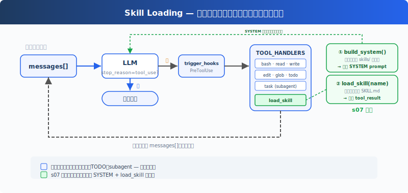

# s07: Skill Loading — 用到的时候才加载

[中文](README.md) · [English](README.en.md) · [日本語](README.ja.md)

s01 → s02 → s03 → s04 → s05 → s06 → `s07` → [s08](../s08_context_compact/) → s09 → ... → s20
> *"用到时再加载, 别全塞 prompt 里"* — 通过 tool_result 注入, 不塞 system prompt。
>
> **Harness 层**: 知识 — 按需加载, 不堆满上下文。

---

## 问题

你的项目有一套 React 组件规范、一份 SQL 风格指南、一份 API 设计文档。你希望 Agent 自动遵守这些规范。最直接的想法，全塞进 system prompt：

```python
SYSTEM = (
    f"You are a coding agent. "
    + open("docs/react-style.md").read()       # 2000 行
    + open("docs/sql-style.md").read()         # 1500 行
    + open("docs/api-design.md").read()        # 3000 行
)
```

6500 行 system prompt。Agent 每次调用 LLM 都带着这些文档——不管是在改 CSS 颜色还是修 SQL 查询。99% 的内容和当前任务无关，白白消耗 token。

---

## 解决方案



保留上一章的最小 hook 结构、`todo_write` 和子 Agent，本章重点转向新增的 `load_skill` 工具。启动时把技能目录注入 SYSTEM prompt，运行时多注册一个工具加载完整内容，用到才花 token。

两层设计：

| 层 | 位置 | 时机 | 代价 |
|---|------|------|------|
| 1. 目录 | system prompt | 启动时注入（harness 扫描 skills/） | ~100 tokens/skill，每轮都带 |
| 2. 内容 | tool_result | Agent 调用 load_skill 时 | ~2000 tokens/skill，按需 |

dispatch 机制不变，load_skill 通过 `TOOL_HANDLERS[block.name]` 分发。

---

## 工作原理

**skills/ 目录**，每个技能一个子目录，包含 `SKILL.md` 文件：

```
skills/
  agent-builder/SKILL.md
  code-review/SKILL.md
  mcp-builder/SKILL.md
  pdf/SKILL.md
```

**第一级：启动时注入目录**：harness 启动时调用 `_scan_skills()` 扫描 skills/ 目录，解析每个 SKILL.md 的 YAML frontmatter（`name`、`description`），存入 `SKILL_REGISTRY` 字典。`list_skills()` 从注册表生成目录，注入 SYSTEM prompt。Agent 每轮都能看到"我有哪些技能可用"，不花额外 API 调用：

```python
SKILL_REGISTRY: dict[str, dict] = {}

def _scan_skills():
    if not SKILLS_DIR.exists():
        return
    for d in sorted(SKILLS_DIR.iterdir()):
        if not d.is_dir():
            continue
        manifest = d / "SKILL.md"
        if manifest.exists():
            raw = manifest.read_text()
            meta, body = _parse_frontmatter(raw)
            name = meta.get("name", d.name)
            desc = meta.get("description", raw.split("\n")[0].lstrip("#").strip())
            SKILL_REGISTRY[name] = {"name": name, "description": desc, "content": raw}

_scan_skills()  # runs once at startup

def list_skills() -> str:
    return "\n".join(f"- **{s['name']}**: {s['description']}" for s in SKILL_REGISTRY.values())

def build_system() -> str:
    catalog = list_skills()
    return (
        f"You are a coding agent at {WORKDIR}. "
        f"Skills available:\n{catalog}\n"
        "Use load_skill to get full details when needed."
    )

SYSTEM = build_system()
```

**第二级：load_skill**：Agent 决定"我需要 SQL 风格指南"，调用 `load_skill("sql-style")`。通过注册表查找，不走文件路径，没有路径遍历风险。内容通过 `tool_result` 注入：

```python
def load_skill(name: str) -> str:
    skill = SKILL_REGISTRY.get(name)
    if not skill:
        return f"Skill not found: {name}"
    return skill["content"]
```

关键区别：技能内容不是 system prompt 的一部分，它作为一次工具结果进入当前 messages。后续调用会随历史一起携带，直到上下文压缩、截断或会话结束。这和 s08 的 compact 自然衔接：按需加载解决了"不该提前带的不要带"，compact 解决"该丢的怎么丢"。

---

## 相对 s06 的变更

| 组件 | 之前 (s06) | 之后 (s07) |
|------|-----------|-----------|
| 工具数量 | 7 (bash, read, write, edit, glob, todo_write, task) | 8 (+load_skill) |
| 知识加载 | 无 | 两级：启动时目录注入 SYSTEM + 运行时 load_skill |
| SYSTEM 提示 | 静态字符串 | 启动时扫描 skills/ 注入目录 |
| 技能注册表 | 无 | SKILL_REGISTRY（启动时填充，防路径遍历） |
| 循环 | 不变 | 不变（skill 工具自动分发） |

---

## 试一下

```sh
cd learn-claude-code
python s07_skill_loading/code.py
```

试试这些 prompt：

1. `What skills are available?`
2. `Load the code-review skill and follow its instructions`
3. `I need to do a code review -- load the relevant skill first`

观察重点：Agent 是否直接从 SYSTEM 里的目录知道有哪些技能？需要完整规范时是否出现 `[HOOK] load_skill`？加载后回答是否使用了对应 skill 的说明？

---

## 接下来

按需加载解决了"不该带的不要带"。但另一个问题来了：Agent 连续工作 30 分钟后，messages 列表塞满了中间过程。旧的 tool_result、过时的文件内容，占着上下文但不产生价值。

s08 Context Compact → 四层压缩策略。便宜的先跑，贵的后跑。

<details>
<summary>深入 CC 源码</summary>

> 以下基于 CC 源码 `loadSkillsDir.ts`、`SkillTool.ts`、`bundledSkills.ts`、`commands.ts` 的分析。

### 一、技能来源：不是只有一个 skills/ 目录

教学版假设所有技能在 `skills/` 目录下。CC 实际从多个来源加载，分布在多个文件中：`loadSkillsDir.ts` 负责从 user/project/`--add-dir` 目录和 legacy commands（`.claude/commands/`）加载；`bundledSkills.ts` 负责内置技能；`SkillTool.ts` 处理 MCP 远程技能；`commands.ts` 负责命令聚合。类型包括 managed/policy skills、user skills（`~/.claude/skills/`）、project skills（`.claude/skills/`）、`--add-dir` skills、legacy commands、dynamic skills、conditional skills（带 `paths` frontmatter，按文件路径激活）、bundled skills、plugin skills、MCP skills。

### 二、SKILL.md Frontmatter 常见字段

CC 的 SKILL.md YAML frontmatter 由 `parseSkillFrontmatterFields()` 解析（`loadSkillsDir.ts`），常见字段包括：

| 字段 | 用途 |
|------|------|
| `name` / `description` | 显示名称和描述 |
| `when_to_use` | 指导模型何时调用 |
| `allowed-tools` | 技能可用工具的自动允许列表 |
| `context` | `inline`（默认）或 `fork`（作为子 Agent 运行） |
| `model` | 模型覆盖（haiku/sonnet/opus/inherit） |
| `hooks` | 技能级别的 hook 配置 |
| `paths` | 条件激活的 glob 模式 |
| `user-invocable` | 用户可以通过 `/name` 调用 |

完整字段列表随版本迭代会变化，以上仅列出教学版涉及的核心字段。

### 三、两级加载的精确实现

1. **Catalog（启动时）**：`getSkillDirCommands()` 扫描目录 → 注册为 `Command` 对象，只包含元数据。`getSkillListingAttachments()` 把技能列表格式化为附件，预算为上下文窗口的 ~1%（上限 8000 字符）。
2. **Load（调用时）**：模型调 `Skill` 工具（输入字段是 `skill` + 可选 `args`，教学版用 `name`）→ `getPromptForCommand()` 展开完整 SKILL.md 内容 → `SkillTool` 返回的 tool_result 展示文本只是 `"Launching skill: {name}"`，真正的技能内容通过 `newMessages` 注入对话。教学版把两者合并为"通过 tool_result 注入"是一种简化。

### 教学版的简化是刻意的

- 多文件多来源 → 1 个 `skills/` 目录：足以展示两级加载的核心概念
- 多个 frontmatter 字段 → 只解析 name/description：减少解析复杂度
- forked skills（`context: 'fork'`）→ 省略：教学版只展开 inline 技能加载
- `Skill` 工具输入 `skill`+`args` → 教学版用 `name`：避免参数解析的额外复杂度

</details>

<!-- translation-sync: zh@v1, en@v1, ja@v1 -->
