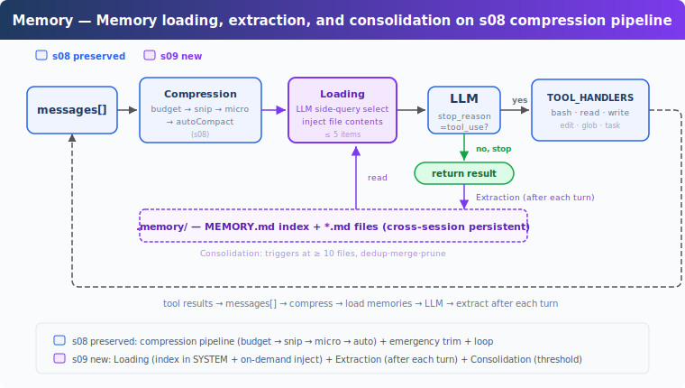
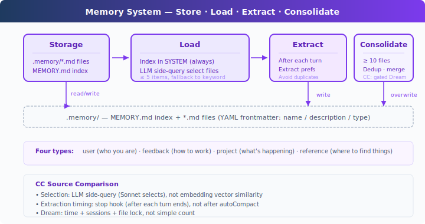

# s09: Memory — Compression Loses Details, Keep a Layer That Doesn't

[中文](README.md) · [English](README.en.md) · [日本語](README.ja.md)

s01 → ... → s07 → s08 → `s09` → [s10](../s10_system_prompt/) → s11 → ... → s20
> *"Compression loses details, keep a layer that doesn't"* — File store + index + on-demand loading, across compactions, across sessions.
>
> **Harness Layer**: Memory — knowledge that survives compaction and sessions.

---

## The Problem

s08's autoCompact preserves current goals, remaining work, and user constraints in the summary, but details get lost: "use tabs not spaces" might get simplified to "user has code style preferences". And when you start a new session, even the summary is gone.

LLMs have no persistent state; all information lives in the context window. When context fills up, it gets compressed, and compression is lossy. What's needed is a storage layer that doesn't participate in compression and persists across sessions.

---

## The Solution



The s08 compression pipeline is preserved, focusing on memory. Storage uses the filesystem: a `.memory/` directory where each memory is a `.md` file with YAML frontmatter (`name` / `description` / `type`). When files accumulate, an index is needed: `MEMORY.md` holds one link per line and gets injected into the SYSTEM.

Key design: the index stays in SYSTEM prompt (cacheable by prompt cache), file content is injected on demand (matched by filename/description to the current conversation, without breaking the cache). Writing has two paths: the user explicitly says "remember", or extraction runs in the background after each turn. When files accumulate, periodic consolidation deduplicates.

Four memory types, each answering a different question:

| Type | Answers | Example |
|------|---------|---------|
| user | Who you are | "Use tabs not spaces" |
| feedback | How to work | "Don't mock the database" |
| project | What's happening | "Auth rewrite is compliance-driven" |
| reference | Where to find things | "Pipeline bugs are in Linear INGEST" |

---

## How It Works



### Storage: Markdown Files + Index

Each memory is a `.md` file with YAML frontmatter for metadata:

```markdown
---
name: user-preference-tabs
description: User prefers tabs for indentation
type: user
---

User prefers using tabs, not spaces, for indentation.
**Why:** Consistency with existing codebase conventions.
**How to apply:** Always use tabs when writing or editing files.
```

`MEMORY.md` is the index, one link per line:

```markdown
- [user-preference-tabs](user-preference-tabs.md) — User prefers tabs for indentation
```

Writing a new memory automatically rebuilds the index:

```python
def write_memory_file(name, mem_type, description, body):
    slug = name.lower().replace(" ", "-")
    filepath = MEMORY_DIR / f"{slug}.md"
    filepath.write_text(
        f"---\nname: {name}\ndescription: {description}\ntype: {mem_type}\n---\n\n{body}\n"
    )
    _rebuild_index()
```

### Loading: Two Paths

**Path 1: Index in SYSTEM.** `build_system()` reads `MEMORY.md` every turn and injects the memory catalog into the SYSTEM prompt. The index in SYSTEM can be cached by prompt cache, avoiding resending it every turn.

**Path 2: Relevant memories on demand.** Before each LLM call, `load_memories()` sends the recent conversation and the memory catalog (name + description) to the LLM as a lightweight side-query, selects relevant filenames, then reads and injects their contents. Capped at 5 to control cost.

```python
def select_relevant_memories(messages, max_items=5):
    files = list_memory_files()
    if not files:
        return []

    # Build catalog: "0: user-preference-tabs — User prefers tabs..."
    catalog = "\n".join(f"{i}: {f['name']} — {f['description']}" for i, f in enumerate(files))

    response = client.messages.create(model=MODEL, messages=[{"role": "user",
        "content": f"Select relevant memory indices. Return JSON array.\n\n"
                   f"Recent conversation:\n{recent}\n\nMemory catalog:\n{catalog}"}],
        max_tokens=200)
    indices = json.loads(re.search(r'\[.*?\]', response.content[0].text).group())
    return [files[i]["filename"] for i in indices if 0 <= i < len(files)]
```

If the side-query fails (API error, JSON parse failure), it falls back to keyword matching on name + description.

### Writing: Extraction After Each Turn

Users don't always say "remember this". Preferences are usually scattered across normal dialogue: "tabs are better than spaces", "let's use single quotes from now on".

`extract_memories()` runs when each turn ends, triggered when the model stops without a tool_use (indicating the conversation has reached a natural break):

```python
# In agent_loop:
if response.stop_reason != "tool_use":
    extract_memories(messages)   # Extract new memories from recent dialogue
    consolidate_memories()       # Check if consolidation is needed
    return
```

Before extraction, existing memories are checked to avoid duplicates. The extraction prompt asks the LLM to return a JSON array of `{name, type, description, body}`, writing files only when genuinely new information is found.

```python
def extract_memories(messages):
    dialogue = format_recent_messages(messages[-10:])
    existing = "\n".join(f"- {m['name']}: {m['description']}" for m in list_memory_files())

    prompt = (
        "Extract user preferences, constraints, or project facts.\n"
        "Return JSON array: [{name, type, description, body}].\n"
        "If nothing new or already covered, return [].\n\n"
        f"Existing memories:\n{existing}\n\nDialogue:\n{dialogue[:4000]}"
    )
    # ... parse response, write files ...
```

### Consolidation: Low-Frequency Deduplication

Memory files accumulate. `consolidate_memories()` triggers when the file count reaches a threshold (default 10), asking the LLM to deduplicate, merge contradictions, and prune stale memories:

```python
CONSOLIDATE_THRESHOLD = 10

def consolidate_memories():
    files = list_memory_files()
    if len(files) < CONSOLIDATE_THRESHOLD:
        return  # Too few, not worth consolidating
    # Send all memories to LLM, get back deduplicated list
    # Replace all files with consolidated results
```

CC calls this process **Dream**, with four gates in practice: time interval, scan throttle, session count, file lock. The teaching version simplifies to a file-count threshold.

### What Memory Stores

Memory stores information that remains useful across sessions: user preferences, recurring feedback, project background, common entry points, and investigation clues. It focuses on "what will be useful later" and brings that information back through an index plus on-demand loading.

Session memory focuses on continuity inside one session: what context should survive after compaction. The two work together: Memory handles long-term knowledge; session memory handles the current session across compaction.

---

## Changes From s08

| Component | Before (s08) | After (s09) |
|-----------|-------------|-------------|
| Memory capability | None (preferences degrade with compaction) | Storage + loading + extraction + consolidation |
| New functions | — | write_memory_file, select_relevant_memories, load_memories, extract_memories, consolidate_memories |
| Storage | — | .memory/MEMORY.md index + .memory/*.md files |
| Tools | bash, read, write, edit, glob, todo_write, task, load_skill, compact (9) | bash, read_file, write_file, edit_file, glob, task (6) |
| Loop | Only compression each turn | Memory injection + compression + post-turn extraction + periodic consolidation |

---

## Try It

```sh
cd learn-claude-code
python s09_memory/code.py
```

Try these prompts (enter across multiple turns, observe memory accumulation and loading):

1. `I prefer using tabs for indentation, not spaces. Remember that.`
2. `Create a Python file called test.py` (observe whether the Agent uses tabs)
3. `What did I tell you about my preferences?` (observe whether the Agent remembers)
4. `I also prefer single quotes over double quotes for strings.`

What to watch for: Does `[Memory: extracted N new memories]` appear after each turn? Are `.md` files generated in `.memory/`? Is `MEMORY.md` index updated? Does the Agent automatically load previous memories in new conversations?

---

## What's Next

Memory, compression, and tools are all in place. But the system prompt is still a hardcoded string. Adding a new tool means manually adding a description; switching projects means rewriting the whole prompt. Prompts should be assembled at runtime.

s10 System Prompt → segments + runtime assembly. Different projects, different tools, different prompts.

<details>
<summary>Deep Dive Into CC Source Code</summary>

> The following is based on analysis of CC source code under `src/` in `memdir/`, `services/`, `utils/`, `query/`. Line numbers verified against source.

### Source Code Paths

| File | Lines | Responsibility |
|------|-------|---------------|
| `memdir/memdir.ts` | 507 | Core: MEMORY.md definition (`34-38`), memory behavior instructions distinguishing memory/plan/tasks (`199-266`), `loadMemoryPrompt()` three paths (`419-490`) |
| `memdir/findRelevantMemories.ts` | 141 | Sonnet side-query memory selection (`18-24` system prompt, `97-122` call logic) |
| `memdir/memoryTypes.ts` | 271 | Type definitions, frontmatter fields |
| `memdir/memoryScan.ts` | — | Scan .md files, exclude MEMORY.md, read frontmatter, max 200 files, sorted by mtime desc (`35-94`) |
| `services/extractMemories/extractMemories.ts` | 615 | Forked agent extraction, restricted permissions, `skipTranscript: true`, `maxTurns: 5` (`371-427`) |
| `services/autoDream/autoDream.ts` | 324 | Dream consolidation, four-layer gating (`63-66` defaults, `130-190` gating, `224-233` forked agent) |
| `services/SessionMemory/sessionMemory.ts` | 495 | Session-level memory management |
| `services/compact/sessionMemoryCompact.ts` | — | Session memory lightweight summary, thresholds 10K/5/40K (`56-61`) |
| `utils/attachments.ts` | — | Injection budget: 200 lines / 4096 bytes per file, 60KB per session (`269-288`); find relevant memory by query (`2196-2241`) |
| `query.ts` | — | Memory prefetch at start of each user turn (`301-304`), non-blocking collection (`1592-1614`) |
| `query/stopHooks.ts` | — | Stop hook fire-and-forget triggers extraction and Dream (`141-155`) |

### Memory Selection: LLM, Not Embedding

CC uses **Sonnet itself to select** (`findRelevantMemories.ts`), not embedding vector similarity:

1. `memoryScan.ts` scans all `.md` files in `.memory/` (excluding MEMORY.md), max 200 files, sorted by mtime descending
2. Lists all memory files' `name` + `description` as a catalog
3. Sends to Sonnet side-query: "Select truly useful memories by name and description (max 5). Skip if unsure."
4. Sonnet returns `{ selected_memories: ["file1.md", ...] }`
5. Selected files' full contents are read (≤ 200 lines / 4096 bytes per file) and injected. Total session budget: 60KB

At the start of each user turn, `query.ts:301-304` starts memory prefetch (async); after tool execution, `1592-1614` collects completed results non-blocking.

### Extraction Timing: Stop Hook, Not After autoCompact

Trigger location (`stopHooks.ts:141-155`): inside `handleStopHooks()`, fire-and-forget triggers extraction and Dream. The teaching version places extraction in the `stop_reason != "tool_use"` branch, matching the direction.

CC's extraction runs via forked agent (`extractMemories.ts:371-427`): restricted permissions, `skipTranscript: true`, `maxTurns: 5`. Also has overlap protection: if the main Agent already wrote memory files, extraction is skipped.

### Memory File Format

CC uses Markdown + YAML frontmatter, consistent with the teaching version. Four types: `user`, `feedback`, `project`, `reference`.

`memdir.ts:34-38` defines index constraints: `MEMORY.md` max 200 lines / 25KB. `memdir.ts:199-266` builds memory behavior instructions, explicitly distinguishing memory from plan and tasks. Storage location: `~/.claude/projects/<sanitized-git-root>/memory/`.

### Dream: Four-Layer Gating

Not "triggered when idle" or "consolidate when count is enough", but four gates (`autoDream.ts`, defaults `63-66`, gating logic `130-190`):

1. **Time gate**: ≥ 24 hours since last consolidation
2. **Scan throttle**: Avoid frequent filesystem scans
3. **Session gate**: ≥ 5 session transcripts modified since last consolidation
4. **Lock gate**: No other process currently consolidating (`.consolidate-lock` file)

The merge itself runs via forked agent (`224-233`): locate → collect recent signals → merge and write files → prune and update index. Lock file mtime serves as lastConsolidatedAt. Crash recovery: lock auto-expires after 1 hour.

### User Memory vs Session Memory

| | User Memory | Session Memory |
|---|---|---|
| Persistence | Cross-session | Single session |
| Storage | Multiple .md files in `memory/` | `session-memory/<id>/memory.md` |
| Loaded into | system prompt | compact summary |
| Purpose | Cross-session knowledge accumulation | Cross-compact context continuity |

sessionMemoryCompact (mentioned in s08) uses Session Memory: before autoCompact, it reads the session memory file and, if sufficient (≥ 10K tokens, ≥ 5 text messages, ≤ 40K tokens, `sessionMemoryCompact.ts:56-61`), uses it as a summary without calling the LLM.

### Where the Real Implementation Is More Complex

- **Feature flags**: Memory features have multiple feature gate layers
- **Team memory**: Shared team memories, `loadMemoryPrompt()` has a dedicated path (not covered in teaching version)
- **KAIROS**: Timing-aware memory extraction strategy, daily-log mode in `loadMemoryPrompt()`
- **Prompt cache**: Memory injection must account for prompt cache TTL, avoiding full system prompt rewrites each turn
- **File locks**: Concurrency control for multi-process scenarios
- **Memory prefetch**: Async prefetch, non-blocking main flow

### Teaching Version Simplifications Are Intentional

- LLM side-query → LLM side-query + keyword fallback: teaching version keeps LLM selection, adds fallback path
- Memory JSON → Markdown + frontmatter: teaching version matches CC
- Stop hook trigger → `stop_reason != "tool_use"` branch: same direction
- Four-layer gating → file-count threshold: teaching version lacks transcript system and multi-session concepts
- Forked agent + restricted permissions → direct call: teaching version has no subprocess isolation

</details>

<!-- translation-sync: zh@v1, en@v1, ja@v1 -->
