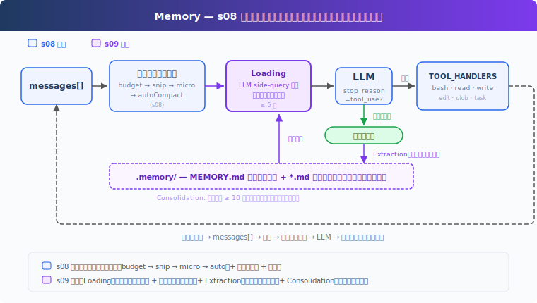
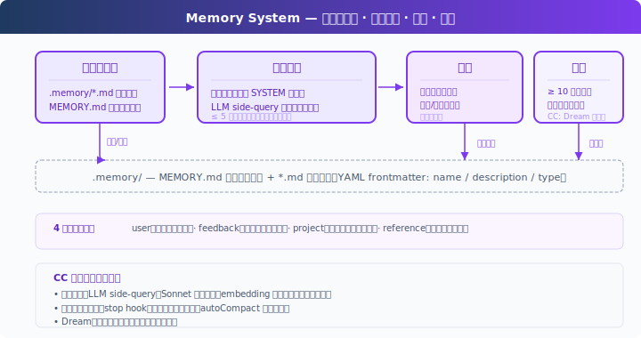

# s09: Memory — 圧縮は詳細を失う、失わない層が必要

[中文](README.md) · [English](README.en.md) · [日本語](README.ja.md)

s01 → ... → s07 → s08 → `s09` → [s10](../s10_system_prompt/) → s11 → ... → s20
> *"圧縮は詳細を失う、失わない層が必要"* — ファイルストア + インデックス + オンデマンド読み込み。圧縮を越え、セッションを越えて。
>
> **Harness レイヤー**: 記憶 — 圧縮とセッションを越える知識の蓄積。

---

## 課題

s08 の autoCompact は現在の目標、残りの作業、ユーザーの制約をサマリに保持するが、詳細は失われる：「タブでインデント、スペース不可」が「ユーザーにコードスタイルの好みあり」と簡略化される。そして新しいセッションを開始すると、サマリすらない。

LLM には永続状態がなく、すべての情報はコンテキストウィンドウ内にある。コンテキストが満杯になれば圧縮され、圧縮は非可逆。圧縮に参加せず、セッションを越えて保持されるストレージ層が必要。

---

## ソリューション



s08 の圧縮パイプラインを維持し、記憶に焦点を当てる。ストレージにはファイルシステムを採用：`.memory/` ディレクトリに各記憶を `.md` ファイルとして保存、YAML frontmatter（`name` / `description` / `type`）付き。ファイルが増えたらインデックスが必要：`MEMORY.md` に 1 行 1 リンクを記録し、SYSTEM に注入。

重要な設計：インデックスは SYSTEM prompt に常駐（prompt cache でキャッシュ可能）、ファイル内容はオンデマンド注入（filename/description で現在の会話にマッチ、cache を破壊しない）。書き込みは 2 つのパス：ユーザーが明示的に「覚えて」と言うか、毎ターン終了後にバックグラウンドで抽出。ファイルが蓄積されたら、定期的に整理して重複排除。

4 種類の記憶、それぞれ異なる質問に答える：

| タイプ | 何に答えるか | 例 |
|--------|-------------|-----|
| user | あなたは誰か | "タブでスペース不可" |
| feedback | どう作業するか | "DB をモックしない" |
| project | 何が起きているか | "auth 書き直しはコンプライアンス主導" |
| reference | どこで探すか | "パイプラインのバグは Linear INGEST" |

---

## 仕組み



### ストレージ：Markdown ファイル + インデックス

各記憶は `.md` ファイル、YAML frontmatter でメタデータを記録：

```markdown
---
name: user-preference-tabs
description: User prefers tabs for indentation
type: user
---

User prefers using tabs, not spaces, for indentation.
**Why:** Consistency with existing codebase conventions.
**How to apply:** Always use tabs when writing or editing files.
```

`MEMORY.md` はインデックス、1 行に 1 リンク：

```markdown
- [user-preference-tabs](user-preference-tabs.md) — User prefers tabs for indentation
```

新しい記憶を書き込むとインデックスを自動再構築：

```python
def write_memory_file(name, mem_type, description, body):
    slug = name.lower().replace(" ", "-")
    filepath = MEMORY_DIR / f"{slug}.md"
    filepath.write_text(
        f"---\nname: {name}\ndescription: {description}\ntype: {mem_type}\n---\n\n{body}\n"
    )
    _rebuild_index()
```

### 読み込み：2 つのパス

**パス 1：インデックスを SYSTEM に常駐。** `build_system()` は毎ターン SYSTEM を再構築する際に `MEMORY.md` を読み込み、記憶カタログを注入。SYSTEM prompt 内のインデックスは prompt cache でキャッシュ可能で、毎ターン再送不要。

**パス 2：関連記憶をオンデマンド注入。** 各 LLM 呼び出し前、`load_memories()` は最近の会話と記憶カタログ（name + description）を LLM に軽量 side-query として送信し、関連するファイル名を選択、ファイル内容を読み込んで注入。上限 5 件でコストを制御。

```python
def select_relevant_memories(messages, max_items=5):
    files = list_memory_files()
    if not files:
        return []

    # Build catalog: "0: user-preference-tabs — User prefers tabs..."
    catalog = "\n".join(f"{i}: {f['name']} — {f['description']}" for i, f in enumerate(files))

    response = client.messages.create(model=MODEL, messages=[{"role": "user",
        "content": f"Select relevant memory indices. Return JSON array.\n\n"
                   f"Recent conversation:\n{recent}\n\nMemory catalog:\n{catalog}"}],
        max_tokens=200)
    indices = json.loads(re.search(r'\[.*?\]', response.content[0].text).group())
    return [files[i]["filename"] for i in indices if 0 <= i < len(files)]
```

side-query が失敗した場合（API エラー、JSON パース失敗）、name + description のキーワードマッチにフォールバック。

### 書き込み：毎ターン終了後の抽出

ユーザーが毎回「これを覚えて」と言うわけではない。好みは通常、通常の会話の中に散らばっている：「タブの方がスペースより良い」「これからはシングルクォートにしよう」。

`extract_memories()` は各ターン終了時に実行、モデルが tool_use なしで停止した場合にトリガー（会話が自然な区切りに達したことを示す）：

```python
# In agent_loop:
if response.stop_reason != "tool_use":
    extract_memories(messages)   # 最近の会話から新しい記憶を抽出
    consolidate_memories()       # 整理が必要かチェック
    return
```

抽出前に既存の記憶を確認し、重複を回避。抽出プロンプトは LLM に `{name, type, description, body}` の JSON 配列を要求、本当に新しい情報がある場合のみファイルに書き込む。

```python
def extract_memories(messages):
    dialogue = format_recent_messages(messages[-10:])
    existing = "\n".join(f"- {m['name']}: {m['description']}" for m in list_memory_files())

    prompt = (
        "Extract user preferences, constraints, or project facts.\n"
        "Return JSON array: [{name, type, description, body}].\n"
        "If nothing new or already covered, return [].\n\n"
        f"Existing memories:\n{existing}\n\nDialogue:\n{dialogue[:4000]}"
    )
    # ... parse response, write files ...
```

### 整理：低頻度の重複排除

記憶ファイルは蓄積される。`consolidate_memories()` はファイル数が閾値（デフォルト 10）に達した時にトリガー、LLM に重複排除、矛盾の統合、古い記憶の剪定を依頼：

```python
CONSOLIDATE_THRESHOLD = 10

def consolidate_memories():
    files = list_memory_files()
    if len(files) < CONSOLIDATE_THRESHOLD:
        return  # 少なすぎる、整理する価値なし
    # Send all memories to LLM, get back deduplicated list
    # Replace all files with consolidated results
```

CC はこのプロセスを **Dream** と呼び、実際には 4 層のゲートがある：時間間隔、スキャンスロットル、セッション数、ファイルロック。教学版はファイル数閾値に簡略化。

### Memory に保存するもの

Memory はセッションを越えて有用な情報を保存する：ユーザーの好み、繰り返し出るフィードバック、プロジェクト背景、よく使う入口、調査の手がかりなど。「あとでまた使うもの」を対象にし、インデックス + オンデマンド読み込みで現在の会話に戻す。

session memory は 1 つのセッション内の連続性を扱う：compact 後も現在の会話に残すべき文脈を保持する。両者は役割が分かれている。Memory は長期知識を扱い、session memory は現在のセッションを compact 越しにつなぐ。

---

## s08 からの変更点

| コンポーネント | 変更前 (s08) | 変更後 (s09) |
|-----------|-------------|-------------|
| 記憶能力 | なし（圧縮後、好みはサマリと共に劣化） | ストレージ + 読み込み + 抽出 + 整理 |
| 新規関数 | — | write_memory_file, select_relevant_memories, load_memories, extract_memories, consolidate_memories |
| ストレージ | — | .memory/MEMORY.md インデックス + .memory/*.md ファイル |
| ツール | bash, read, write, edit, glob, todo_write, task, load_skill, compact (9) | bash, read_file, write_file, edit_file, glob, task (6) |
| ループ | 毎ターン圧縮のみ | 記憶注入 + 圧縮 + ターン終了後の抽出 + 定期整理 |

---

## 試してみよう

```sh
cd learn-claude-code
python s09_memory/code.py
```

以下のプロンプトを試してみてください（複数ターンに分けて入力し、記憶の蓄積と読み込みを観察）：

1. `I prefer using tabs for indentation, not spaces. Remember that.`
2. `Create a Python file called test.py`（Agent がタブを使用したか観察）
3. `What did I tell you about my preferences?`（Agent が覚えているか観察）
4. `I also prefer single quotes over double quotes for strings.`

観察のポイント：各ターン終了後に `[Memory: extracted N new memories]` が表示されるか？`.memory/` ディレクトリに `.md` ファイルが生成されたか？`MEMORY.md` インデックスが更新されたか？新しい会話で Agent が以前の記憶を自動的に読み込んだか？

---

## 次へ

記憶、圧縮、ツールはすべて揃った。しかし system prompt はまだハードコードされた文字列。新しいツールを追加するには手動で説明を書き、プロジェクトを変えるにはプロンプト全体を書き直す。プロンプトは実行時に組み立てられるべき。

s10 System Prompt → セグメント + 実行時組み立て。異なるプロジェクト、異なるツール、異なるプロンプト。

<details>
<summary>CC ソースコードの詳細</summary>

> 以下は CC ソースコード `src/` 下の `memdir/`、`services/`、`utils/`、`query/` の分析に基づく。行番号はソースコードと照合済み。

### ソースコードパス

| ファイル | 行数 | 職責 |
|------|------|------|
| `memdir/memdir.ts` | 507 | 核心：MEMORY.md 定義（`34-38`）、記憶動作指示で memory/plan/tasks を区別（`199-266`）、`loadMemoryPrompt()` 3 パス（`419-490`） |
| `memdir/findRelevantMemories.ts` | 141 | Sonnet side-query で記憶選択（`18-24` システムプロンプト、`97-122` 呼び出しロジック） |
| `memdir/memoryTypes.ts` | 271 | 型定義、frontmatter フィールド |
| `memdir/memoryScan.ts` | — | .md ファイルをスキャン、MEMORY.md を除外、frontmatter を読み取り、最大 200 ファイル、mtime 降順（`35-94`） |
| `services/extractMemories/extractMemories.ts` | 615 | forked agent で記憶を抽出、制限付き権限、`skipTranscript: true`、`maxTurns: 5`（`371-427`） |
| `services/autoDream/autoDream.ts` | 324 | Dream 整理、4 層ゲート（`63-66` デフォルト値、`130-190` ゲート、`224-233` forked agent） |
| `services/SessionMemory/sessionMemory.ts` | 495 | セッションレベルの記憶管理 |
| `services/compact/sessionMemoryCompact.ts` | — | session memory 軽量サマリ、閾値 10K/5/40K（`56-61`） |
| `utils/attachments.ts` | — | 注入予算：200 行 / 4096 バイト/ファイル、60KB/セッション（`269-288`）；query で関連記憶を検索（`2196-2241`） |
| `query.ts` | — | memory prefetch を毎ターン開始時に起動（`301-304`）、非ブロッキング収集（`1592-1614`） |
| `query/stopHooks.ts` | — | stop hook fire-and-forget で抽出と Dream をトリガー（`141-155`） |

### 記憶選択：embedding ではなく LLM

CC は **Sonnet 自身で選択**（`findRelevantMemories.ts`）、embedding ベクトル類似度ではない：

1. `memoryScan.ts` が `.memory/` 下のすべての `.md` ファイルをスキャン（MEMORY.md を除外）、最大 200 ファイル、mtime 降順
2. `name` + `description` をカタログとしてリスト化
3. Sonnet side-query に送信：「名前と説明から本当に有用な記憶を選択（最大 5 件）。不明ならスキップ。」
4. Sonnet が `{ selected_memories: ["file1.md", ...] }` を返却
5. 選択されたファイルの完全な内容を読み込み（≤ 200 行 / 4096 バイト/ファイル）、注入。セッション総予算：60KB

毎ターンのユーザー turn 開始時、`query.ts:301-304` が memory prefetch を起動（非同期）；ツール実行後、`1592-1614` が非ブロッキングで結果を収集。

### 抽出タイミング：stop hook、autoCompact 後ではない

トリガー位置（`stopHooks.ts:141-155`）：`handleStopHooks()` 内で、fire-and-forget で抽出と Dream をトリガー。教学版は `stop_reason != "tool_use"` 分岐に抽出を配置、方向は一致。

CC の抽出は forked agent で実行（`extractMemories.ts:371-427`）：制限付き権限、`skipTranscript: true`、`maxTurns: 5`。重複保護もある：メイン Agent が既に記憶ファイルを書き込んだ場合、抽出をスキップ。

### 記憶ファイル形式

CC は Markdown + YAML frontmatter を使用、教学版と一致。4 種類：`user`、`feedback`、`project`、`reference`。

`memdir.ts:34-38` がインデックス制約を定義：`MEMORY.md` 最大 200 行 / 25KB。`memdir.ts:199-266` が記憶動作指示を構築、memory と plan と tasks を明確に区別。保存場所：`~/.claude/projects/<sanitized-git-root>/memory/`。

### Dream：4 層ゲート

「アイドル時にトリガー」や「数が足りたら統合」ではなく、4 層のゲート（`autoDream.ts`、デフォルト値 `63-66`、ゲートロジック `130-190`）：

1. **時間ゲート**：前回の統合から ≥ 24 時間
2. **スキャンスロットル**：頻繁なファイルシステムスキャンを回避
3. **セッションゲート**：前回の統合以降 ≥ 5 セッションの transcript が変更された
4. **ロックゲート**：他のプロセスが統合中でない（`.consolidate-lock` ファイル）

統合自体は forked agent で実行（`224-233`）：定位 → 直近のシグナル収集 → 統合してファイル書き込み → 剪定してインデックス更新。ロックファイルの mtime が lastConsolidatedAt。クラッシュリカバリ：1 時間後にロックが自動期限切れ。

### User Memory vs Session Memory

| | User Memory | Session Memory |
|---|---|---|
| 永続性 | セッション間 | 単一セッション |
| ストレージ | `memory/` 下の複数 .md ファイル | `session-memory/<id>/memory.md` |
| 注入先 | system prompt | compact サマリ |
| 目的 | セッション間の知識蓄積 | compact を越えたコンテキストの連続性 |

sessionMemoryCompact（s08 で触れた仕組み）は Session Memory を活用：autoCompact の前に session memory ファイルを読み込み、内容が十分であれば（≥ 10K token、≥ 5 テキストメッセージ、≤ 40K token、`sessionMemoryCompact.ts:56-61`）、LLM を呼び出さずにサマリとして使用。

### 実際の実装が教学版より複雑な点

- **Feature flags**：記憶関連機能には複数の feature gate 層がある
- **Team memory**：チーム共有記憶、`loadMemoryPrompt()` に専用パスあり（教学版では未カバー）
- **KAIROS**：タイミング認識型の記憶抽出戦略、`loadMemoryPrompt()` の daily-log モード
- **Prompt cache**：記憶注入は prompt cache の TTL を考慮する必要があり、毎ターン system prompt の大部分を書き直すことを避ける
- **ファイルロック**：マルチプロセス時の並行制御
- **Memory prefetch**：非同期プレフェッチ、メインフローをブロックしない

### 教学版の簡略化は意図的

- LLM side-query → LLM side-query + キーワードフォールバック：教学版は LLM 選択を維持し、フォールバックパスを追加
- 記憶 JSON → Markdown + frontmatter：教学版は CC と一致
- stop hook トリガー → `stop_reason != "tool_use"` 分岐：方向は一致
- 4 層ゲート → ファイル数閾値：教学版には transcript システムやマルチセッションの概念がない
- forked agent + 制限付き権限 → 直接呼び出し：教学版にはサブプロセス分離がない

</details>

<!-- translation-sync: zh@v1, en@v1, ja@v1 -->
