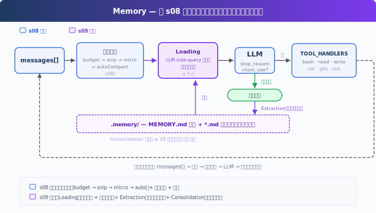
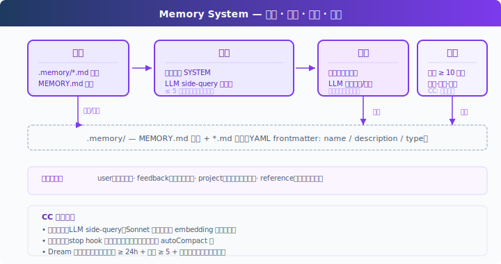

# s09: Memory — 压缩会丢细节，要有一层不丢的

[中文](README.md) · [English](README.en.md) · [日本語](README.ja.md)

s01 → ... → s07 → s08 → `s09` → [s10](../s10_system_prompt/) → s11 → ... → s20
> *"压缩会丢细节, 要有一层不丢的"* — 文件仓库 + 索引 + 按需加载，跨压缩、跨会话。
>
> **Harness 层**: 记忆 — 跨压缩、跨会话的知识积累。

---

## 问题

s08 的 autoCompact 会把当前目标、剩余工作、用户约束写进摘要，但细节会丢失："用 tab 缩进不要用空格"可能被简化成"用户有代码风格偏好"。而且新开一个会话，连摘要也没了。

LLM 没有持久状态，所有信息都在上下文窗口里。上下文满了要压缩，压缩就有损。需要一层不参与压缩、跨会话保留的存储。

---

## 解决方案



s08 的压缩管线保留，聚焦记忆。存储选文件系统：`.memory/` 目录下，每个记忆一个 `.md` 文件，带 YAML frontmatter（`name` / `description` / `type`）。文件多了需要索引：`MEMORY.md` 一行一个链接，注入 SYSTEM。

关键设计：索引常驻 SYSTEM prompt（可被 prompt cache 缓存），文件内容按需注入到当前 user turn（按 filename/description 匹配当前对话，不破坏 cache）。写入由每轮结束后的提取器完成：用户显式说"记住"或表达稳定偏好时，提取器会保存为记忆。文件积累多了，定期整理去重。

四类记忆，各有用途：

| 类型 | 回答什么 | 示例 |
|------|---------|------|
| user | 你是谁 | "用 tab 不用空格" |
| feedback | 怎么做事 | "别 mock 数据库" |
| project | 正在发生什么 | "auth 重写是合规驱动" |
| reference | 东西在哪找 | "pipeline bug 在 Linear INGEST" |

---

## 工作原理



### 存储：Markdown 文件 + 索引

每个记忆是一个 `.md` 文件，YAML frontmatter 记录元数据：

```markdown
---
name: user-preference-tabs
description: User prefers tabs for indentation
type: user
---

User prefers using tabs, not spaces, for indentation.
**Why:** Consistency with existing codebase conventions.
**How to apply:** Always use tabs when writing or editing files.
```

`MEMORY.md` 是索引，一行一个链接：

```markdown
- [user-preference-tabs](user-preference-tabs.md) — User prefers tabs for indentation
```

写入新记忆时自动重建索引：

```python
def write_memory_file(name, mem_type, description, body):
    slug = name.lower().replace(" ", "-")
    filepath = MEMORY_DIR / f"{slug}.md"
    filepath.write_text(
        f"---\nname: {name}\ndescription: {description}\ntype: {mem_type}\n---\n\n{body}\n"
    )
    _rebuild_index()
```

### 加载：两条路径

**路径一：索引常驻 SYSTEM。** `build_system()` 每轮重建 SYSTEM 时读取 `MEMORY.md`，把记忆清单注入。SYSTEM prompt 中的索引可以被 prompt cache 缓存，不需要每轮重新发送。

**路径二：相关记忆按需注入。** 每轮调用前，`load_memories()` 把最近对话和记忆目录（name + description）一起发给 LLM 做一次轻量 side-query，选出相关的文件名，再读文件内容临时注入到当前 user turn。最多 5 条，控制开销。

```python
def select_relevant_memories(messages, max_items=5):
    files = list_memory_files()
    if not files:
        return []

    # Build catalog: "0: user-preference-tabs — User prefers tabs..."
    catalog = "\n".join(f"{i}: {f['name']} — {f['description']}" for i, f in enumerate(files))

    response = client.messages.create(model=MODEL, messages=[{"role": "user",
        "content": f"Select relevant memory indices. Return JSON array.\n\n"
                   f"Recent conversation:\n{recent}\n\nMemory catalog:\n{catalog}"}],
        max_tokens=200)
    text = extract_text(response.content).strip()
    indices = json.loads(re.search(r'\[.*?\]', text).group())
    return [files[i]["filename"] for i in indices if 0 <= i < len(files)]
```

如果 side-query 失败（API 错误、JSON 解析失败），降级到关键词匹配 name + description。

### 写入：每轮结束后提取

用户不会每次都说"记住这个"。偏好通常散落在正常对话中："用 tab 比空格好"、"以后都用单引号"。

`extract_memories()` 在每轮结束时运行，条件是模型停止且没有 tool_use（说明对话告一段落）：

```python
# In agent_loop:
if response.stop_reason != "tool_use":
    extract_memories(pre_compress)   # 从压缩前快照提取新记忆
    consolidate_memories()       # 检查是否需要整理
    return
```

提取前先检查已有记忆，避免重复。提取 prompt 要求 LLM 返回 `{name, type, description, body}` 的 JSON 数组，只有确实有新信息时才写文件。

```python
def extract_memories(messages):
    dialogue = format_recent_messages(messages[-10:])
    existing = "\n".join(f"- {m['name']}: {m['description']}" for m in list_memory_files())

    prompt = (
        "Extract user preferences, constraints, or project facts.\n"
        "Return JSON array: [{name, type, description, body}].\n"
        "If nothing new or already covered, return [].\n\n"
        f"Existing memories:\n{existing}\n\nDialogue:\n{dialogue[:4000]}"
    )
    # ... parse response, write files ...
```

### 整理：低频合并去重

记忆文件会积累。`consolidate_memories()` 在文件数达到阈值（默认 10）时触发，让 LLM 去重、合并矛盾、淘汰过时记忆：

```python
CONSOLIDATE_THRESHOLD = 10

def consolidate_memories():
    files = list_memory_files()
    if len(files) < CONSOLIDATE_THRESHOLD:
        return  # 太少，不值得整理
    # Send all memories to LLM, get back deduplicated list
    # Replace all files with consolidated results
```

CC 把这个过程叫 Dream，实际有四层门控：时间间隔、扫描节流、会话数、文件锁。教学版简化为文件数阈值。

### Memory 适合保存什么

Memory 保存跨会话仍然有用的信息：用户偏好、反复出现的反馈、项目背景、常用入口和排查线索。它关注“以后还会用到什么”，并通过索引 + 按需加载把这些信息带回当前对话。

session memory 关注同一会话内的连续性：compact 之后，当前会话还需要保留哪些上下文。两者配合使用：Memory 管长期知识，session memory 管当前会话的压缩续接。

---

## 相对 s08 的变更

| 组件 | 之前 (s08) | 之后 (s09) |
|------|-----------|-----------|
| 记忆能力 | 无（压缩后偏好随摘要退化） | 存储 + 加载 + 提取 + 整理 |
| 新函数 | — | write_memory_file, select_relevant_memories, load_memories, extract_memories, consolidate_memories |
| 存储 | — | .memory/MEMORY.md 索引 + .memory/*.md 文件 |
| 工具 | bash, read, write, edit, glob, todo_write, task, load_skill, compact (9) | bash, read_file, write_file, edit_file, glob, task (6) |
| 循环 | 每轮只做压缩 | 每轮注入记忆 + 压缩 + 每轮结束后提取 + 定期整理 |

---

## 试一下

```sh
cd learn-claude-code
python s09_memory/code.py
```

试试这些 prompt（分多轮输入，观察记忆的累积和加载）：

1. `I prefer using tabs for indentation, not spaces. Remember that.`
2. `Create a Python file called test.py`（观察 Agent 是否用了 tab）
3. `What did I tell you about my preferences?`（观察 Agent 是否记得）
4. `I also prefer single quotes over double quotes for strings.`

观察重点：每轮结束后是否出现 `[Memory: extracted N new memories]`？`.memory/` 目录下是否生成了 `.md` 文件？`MEMORY.md` 索引是否更新？新一轮对话时 Agent 是否自动加载了之前的记忆？

---

## 接下来

记忆、压缩、工具都已就绪。但 system prompt 还是硬编码的一大段字符串。加了新工具要手动加描述，换了项目要重写整个 prompt。prompt 应该运行时组装。

s10 System Prompt → 分段 + 运行时组装。不同项目、不同工具，拼出不同的 prompt。

<details>
<summary>深入 CC 源码</summary>

> 以下基于 CC 源码 `src/` 下 `memdir/`、`services/`、`utils/`、`query/` 的分析，行号已对照核实。

### 源码路径

| 文件 | 行数 | 职责 |
|------|------|------|
| `memdir/memdir.ts` | 507 | 核心：MEMORY.md 定义（`34-38`）、记忆行为指令区分 memory/plan/tasks（`199-266`）、`loadMemoryPrompt()` 三条路径（`419-490`） |
| `memdir/findRelevantMemories.ts` | 141 | Sonnet side-query 选记忆（`18-24` 系统提示、`97-122` 调用逻辑） |
| `memdir/memoryTypes.ts` | 271 | 类型定义，frontmatter 字段 |
| `memdir/memoryScan.ts` | — | 扫描 .md 文件，排除 MEMORY.md，读 frontmatter，最多 200 个，按 mtime 降序（`35-94`） |
| `services/extractMemories/extractMemories.ts` | 615 | forked agent 提取记忆，受限权限，`skipTranscript: true`，`maxTurns: 5`（`371-427`） |
| `services/autoDream/autoDream.ts` | 324 | Dream 整理，四层门控（`63-66` 默认值、`130-190` 门控、`224-233` forked agent） |
| `services/SessionMemory/sessionMemory.ts` | 495 | 会话级记忆管理 |
| `services/compact/sessionMemoryCompact.ts` | — | session memory 轻量摘要，阈值 10K/5/40K（`56-61`） |
| `utils/attachments.ts` | — | 注入预算：200 行 / 4096 字节每文件，60KB 每 session（`269-288`）；按 query 找相关 memory（`2196-2241`） |
| `query.ts` | — | memory prefetch 每轮启动（`301-304`），非阻塞收集（`1592-1614`） |
| `query/stopHooks.ts` | — | stop hook fire-and-forget 触发提取和 Dream（`141-155`） |

### 记忆选择：LLM 选，不是 embedding

CC 用 **Sonnet 本身来选**（`findRelevantMemories.ts`），不是 embedding 向量相似度：

1. `memoryScan.ts` 扫描 `.memory/` 下所有 `.md` 文件（排除 MEMORY.md），最多 200 个，按 mtime 降序
2. 把 `name` + `description` 列成清单
3. 发给 Sonnet side-query："根据名称和描述选出真正有用的记忆（最多 5 个）。不确定就不要选。"
4. Sonnet 返回 `{ selected_memories: ["file1.md", ...] }`
5. 选中文件读取完整内容（每文件 ≤ 200 行 / 4096 字节），注入上下文。单 session 总预算 60KB

每轮用户 turn 开始时，`query.ts:301-304` 启动 memory prefetch（异步）；工具执行后 `1592-1614` 非阻塞收集结果，不卡主流程。

### 提取时机：stop hook，不是 autoCompact 后

触发位置（`stopHooks.ts:141-155`）：在 `handleStopHooks()` 中，fire-and-forget 触发提取和 Dream。教学版把提取放在 `stop_reason != "tool_use"` 分支里，方向一致。

CC 的提取通过 forked agent 执行（`extractMemories.ts:371-427`）：受限权限、`skipTranscript: true`、`maxTurns: 5`。还有重叠保护：如果主 Agent 已经写入了记忆文件，跳过提取。

### 记忆文件格式

CC 用 Markdown + YAML frontmatter，和教学版一致。四种类型：`user`、`feedback`、`project`、`reference`。

`memdir.ts:34-38` 定义索引约束：`MEMORY.md` 最多 200 行 / 25KB。`memdir.ts:199-266` 构建记忆行为指令，明确区分 memory、plan、tasks。存储位置：`~/.claude/projects/<sanitized-git-root>/memory/`。

### Dream：四层门控

不是"空闲时触发"或"数量够了就合并"，而是四层门控（`autoDream.ts`，默认值 `63-66`，门控逻辑 `130-190`）：

1. **时间门控**：距上次合并 ≥ 24 小时
2. **扫描节流**：避免频繁扫描文件系统
3. **会话门控**：自上次合并以来修改了 ≥ 5 个会话 transcript
4. **锁门控**：没有其他进程正在合并（`.consolidate-lock` 文件）

合并本身通过 forked agent 执行（`224-233`）：定位 → 收集近期信号 → 合并写文件 → 剪枝更新索引。锁文件 mtime 就是 lastConsolidatedAt。崩溃恢复：1 小时后锁自动过期。

### User Memory vs Session Memory

| | User Memory | Session Memory |
|---|---|---|
| 持久性 | 跨会话 | 单会话 |
| 存储 | `memory/` 下多个 .md 文件 | `session-memory/<id>/memory.md` |
| 加载到 | system prompt | compact 摘要 |
| 用途 | 跨会话的知识积累 | 跨 compact 的上下文连续性 |

sessionMemoryCompact（s08 中提到的机制）正是使用了 Session Memory：autoCompact 前先读 session memory 文件，如果内容足够（≥ 10K token、≥ 5 条文本消息、≤ 40K token，`sessionMemoryCompact.ts:56-61`），就用它做摘要，不调 LLM。

### 真实实现比教学版复杂的地方

- **Feature flags**：记忆相关功能有多层 feature gate 控制
- **Team memory**：团队共享记忆，`loadMemoryPrompt()` 有专门路径（教学版未涉及）
- **KAIROS**：时机感知的记忆提取策略，`loadMemoryPrompt()` 中 daily-log 模式
- **Prompt cache**：记忆注入需要考虑 prompt cache 的 TTL，避免每次都重写 system prompt 的大段内容
- **文件锁**：多进程并发时的锁机制
- **Memory prefetch**：异步预取，不阻塞主流程

### 教学版的简化是刻意的

- LLM side-query → LLM side-query + 关键词降级：教学版保留了 LLM 选择，加了降级路径
- 记忆 JSON → Markdown + frontmatter：教学版与 CC 一致
- stop hook 触发 → `stop_reason != "tool_use"` 分支：方向一致
- 四层门控 → 文件数阈值：教学版没有 transcript 系统和多会话概念
- forked agent + 受限权限 → 直接调用：教学版没有子进程隔离

</details>

<!-- translation-sync: zh@v1, en@v1, ja@v1 -->
