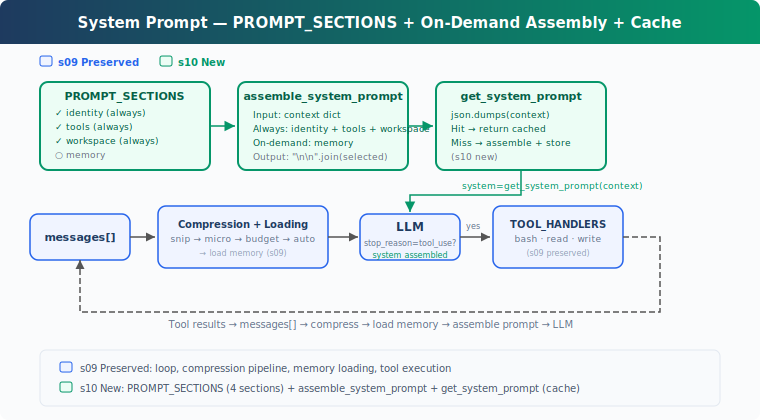

# s10: System Prompt — Assembled at Runtime, Never Hardcoded

[中文](README.md) · [English](README.en.md) · [日本語](README.ja.md)

s01 → ... → s08 → s09 → `s10` → [s11](../s11_error_recovery/) → s12 → ... → s20
> *"prompt is assembled, not hardcoded"* — Sections + on-demand assembly + caching.
>
> **Harness Layer**: Prompt — assembled at runtime, never hardcoded.

---

## The Problem

From s01 to s09, the system prompt was always one hardcoded line:

```python
SYSTEM = f"You are a coding agent at {WORKDIR}. Use tools to solve tasks."
```

That worked for s01 — only bash, read, write. But by s09, the agent has memory, compression, skill loading. The prompt needs to describe more and more capabilities:

```python
SYSTEM = (
    f"You are a coding agent at {WORKDIR}. "
    "Use tools to solve tasks. Act, don't explain. "
    "Before starting any multi-step task, use todo_write. "
    "Skills are available via list_skills and load_skill. "
    "Relevant memories are injected below when available. "
    # ... add a capability, add a line
)
```

Three problems:

1. **Switching projects requires rewriting the entire prompt** — no way to know what to change and what to keep
2. **One change can break others** — adding a tool description might conflict with earlier instructions
3. **Every request carries everything** — even when the current conversation doesn't need certain sections, they waste tokens

The system prompt should be a configuration assembled at runtime based on current state: which tools are enabled, which context is visible, which memories are relevant, and which content must remain stable to hit prompt cache.

---

## The Solution



s10 focuses on prompt assembly. It builds on the s08-s09 capabilities but doesn't re-implement compression or memory. The core change: split the hardcoded `SYSTEM` into independent sections, assemble them at runtime based on real state, and cache the result.

Four sections, two loading strategies:

| Section | Strategy | Content | Condition |
|---------|----------|---------|-----------|
| identity | always | who you are, how to work | always present |
| tools | always | available tool list | `enabled_tools` |
| workspace | always | working directory | always present |
| memory | on-demand | relevant memory content | whether `.memory/MEMORY.md` exists |

Key design: whether a section loads depends on real state (tools exist, files exist), not keywords in messages.

---

## How It Works

### PROMPT_SECTIONS: Topic-Keyed Fragments

Split the monolithic string into a dictionary, each key is a topic:

```python
PROMPT_SECTIONS = {
    "identity": "You are a coding agent. Act, don't explain.",
    "tools": "Available tools: bash, read_file, write_file.",
    "workspace": f"Working directory: {WORKDIR}",
    "memory": "Relevant memories are injected below when available.",
}
```

Each section is maintained independently. Changing `tools` doesn't affect `identity`; adding `memory` doesn't touch `workspace`.

### assemble_system_prompt: On-Demand Assembly

Not every section is needed every turn. No memory files? Loading the memory section just wastes tokens. Assembly is based on real state in context:

```python
def assemble_system_prompt(context: dict) -> str:
    sections = []

    # Always loaded
    sections.append(PROMPT_SECTIONS["identity"])
    sections.append(PROMPT_SECTIONS["tools"])
    sections.append(PROMPT_SECTIONS["workspace"])

    # On-demand — based on real state, not keywords
    memories = context.get("memories", "")
    if memories:
        sections.append(f"Relevant memories:\n{memories}")

    return "\n\n".join(sections)
```

"Always loaded" sections are needed every turn: identity, tools, workspace. "On-demand" sections are only useful under specific conditions.

Why not load everything? Tokens have cost (system prompt is billed every turn), and fewer instructions means more focused output (irrelevant instructions are noise).

### get_system_prompt: Cache to Avoid Re-Assembly

When context hasn't changed (multiple LLM calls in the same turn with the same context), re-assembling is wasteful. Use deterministic serialization to detect changes and return cached result:

```python
def get_system_prompt(context: dict) -> str:
    global _last_context_key, _last_prompt
    key = json.dumps(context, sort_keys=True, ensure_ascii=False, default=str)
    if key == _last_context_key and _last_prompt:
        return _last_prompt
    _last_context_key = key
    _last_prompt = assemble_system_prompt(context)
    return _last_prompt
```

`json.dumps` instead of `hash()`: Python's built-in `hash()` has process randomization (unsuitable for stable cache keys) and throws `unhashable type` on nested dicts/lists.

Note: this cache only avoids redundant string assembly within a process. It's not the same as CC's API prompt cache, which uses `SYSTEM_PROMPT_DYNAMIC_BOUNDARY` to separate static and dynamic parts — the static parts hit global cache and don't invalidate when dynamic content changes.

### context: Real State, Not Keyword Guessing

Context reflects the actual runtime state:

```python
def update_context(context: dict, messages: list) -> dict:
    memories = ""
    if MEMORY_INDEX.exists():
        content = MEMORY_INDEX.read_text().strip()
        if content:
            memories = content
    return {
        "enabled_tools": list(TOOL_HANDLERS.keys()),
        "workspace": str(WORKDIR),
        "memories": memories,
    }
```

`enabled_tools` lists actually registered tools. `memories` checks whether `.memory/MEMORY.md` exists. Section loading is based on this real state, not searching for keywords in messages.

### Putting It Together

```python
def agent_loop(messages: list, context: dict):
    system = get_system_prompt(context)
    while True:
        response = client.messages.create(
            model=MODEL, system=system, messages=messages,
            tools=TOOLS, max_tokens=8000)
        # ... tool execution ...
        context = update_context(context, messages)
        system = get_system_prompt(context)
```

At the start of each loop iteration, get the system prompt. If context changed, re-assemble; if not, return cached version.

---

## Changes From s09

| Component | Before (s09) | After (s10) |
|-----------|-------------|-------------|
| prompt | Hardcoded SYSTEM string | PROMPT_SECTIONS + assemble_system_prompt |
| caching | None | get_system_prompt (json.dumps detection + cache) |
| new functions | — | assemble_system_prompt, get_system_prompt, update_context |
| tools | bash, read_file, write_file (3) | bash, read_file, write_file (3) — unchanged |
| loop | Uses fixed SYSTEM | Uses get_system_prompt(context) |

---

## Try It

```sh
cd learn-claude-code
python s10_system_prompt/code.py
```

What to watch for:

1. Output shows which sections were loaded (`[assembled] sections: ...` label)
2. Cache hits show `[cache hit]` during continued conversation
3. Creating `.memory/MEMORY.md` makes the memory section appear on the next turn

Try these prompts:

1. `Read the file README.md` (observe the three always-loaded sections)
2. `Create a file called .memory/MEMORY.md with content "- [test](test.md) — test memory"` (write a memory index)
3. `Read the file code.py` (observe whether the memory section appears)

---

## What's Next

System prompts can now be assembled at runtime. But the agent still crashes on errors. Network hiccups, API rate limits, truncated output, context overflow — these aren't bugs, they're normal.

s11 Error Recovery → four recovery paths. Upgrade tokens, compress context, exponential backoff, switch models.

<details>
<summary>Deep Dive Into CC Source Code</summary>

> The following is based on analysis of CC source code `constants/prompts.ts` (914 lines), `constants/systemPromptSections.ts` (68 lines), `context.ts` (189 lines), `utils/api.ts` (718 lines), `utils/systemPrompt.ts` (123 lines), and `bootstrap/state.ts`.

### How many sections does CC's system prompt have?

The count varies based on feature flags, output style, KAIROS/Proactive mode, user type, token budget, etc. Roughly two categories:

**Static sections** (always loaded): identity, system, doing_tasks, actions, using_tools, tone_style, output_efficiency, etc.

**Dynamic sections** (loaded by state): session_guidance, memory, ant_model_override, env_info_simple, language, output_style, mcp_instructions, scratchpad, frc, summarize_tool_results, numeric_length_anchors, token_budget, brief, etc.

`mcp_instructions` is the only volatile section (created via `DANGEROUS_uncachedSystemPromptSection()`), because MCP servers can connect and disconnect between turns.

### Assembly Function

```typescript
getSystemPrompt(tools, model, additionalWorkingDirs?, mcpClients?): Promise<string[]>
```

Returns `string[]` (each element is a section), separated by `SYSTEM_PROMPT_DYNAMIC_BOUNDARY` between static and dynamic parts.

### cache scope

When global cache boundary is enabled, static sections are merged into one global cache block, and dynamic sections don't use global cache (`cacheScope: null`). Only paths without boundary or skipping global cache fall back to org scope.

The teaching version's cache only avoids redundant string assembly. CC's three-layer cache:

1. **lodash memoize**: `getSystemContext` and `getUserContext` cached per session (`context.ts`)
2. **Section registry cache**: `STATE.systemPromptSectionCache` caches dynamic section results, cleared on `/clear` or `/compact`
3. **API-level cache**: `splitSysPromptPrefix()` (`api.ts`) splits prompt into blocks with different cache scopes via boundary

### getUserContext vs getSystemContext

| | getSystemContext | getUserContext |
|---|---|---|
| Content | gitStatus, cacheBreaker | CLAUDE.md content, currentDate |
| Injection | appended to system prompt array | prepended as `<system-reminder>` user message |
| When skipped | custom system prompt | always runs |

### How modes change the prompt

- **CLAUDE_CODE_SIMPLE**: entire prompt is 2 lines
- **Proactive/KAIROS**: compact prompt replaces all standard sections
- **Coordinator**: coordinator-specific prompt fully replaces default
- **Agent mode**: agent-defined prompt replaces or appends to default

### Total size

Standard interactive mode system prompt core is ~20-30KB text. CLAUDE_CODE_SIMPLE is ~150 characters. User context (CLAUDE.md) and system context (git status) add on top.

</details>

<!-- translation-sync: zh@v1, en@v1, ja@v1 -->
