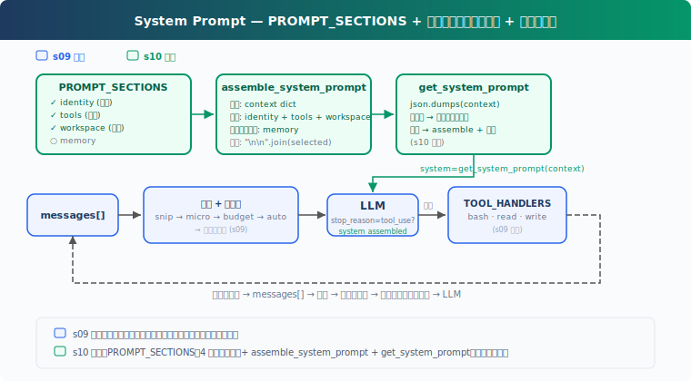

# s10: System Prompt — 実行時アセンブリ、ハードコードなし

[中文](README.md) · [English](README.en.md) · [日本語](README.ja.md)

s01 → ... → s08 → s09 → `s10` → [s11](../s11_error_recovery/) → s12 → ... → s20
> *"prompt は組み立てるもの、固定するものではない"* — セグメント + オンデマンド結合 + キャッシュ。
>
> **Harness レイヤー**: プロンプト — 実行時組み立て、ハードコードなし。

---

## 課題

s01 から s09 まで、system prompt は常に 1 行のハードコード：

```python
SYSTEM = f"You are a coding agent at {WORKDIR}. Use tools to solve tasks."
```

s01 では十分だった。bash、read、write の 3 ツールのみ。しかし s09 では、Agent に記憶、圧縮、スキル読み込みがある。prompt が説明すべき能力が増え続ける：

```python
SYSTEM = (
    f"You are a coding agent at {WORKDIR}. "
    "Use tools to solve tasks. Act, don't explain. "
    "Before starting any multi-step task, use todo_write. "
    "Skills are available via list_skills and load_skill. "
    "Relevant memories are injected below when available. "
    # ... 能力を追加するたびに 1 行増える
)
```

3 つの問題：

1. **プロジェクトを変えるには prompt 全体を書き直す**必要がある。何を変え、何を残すべきか不明
2. **一箇所の変更が全体に影響する**。ツール説明を追加すると、前の指示と矛盾する可能性
3. **毎回のリクエストが全内容を送信する**。現在の会話で不要なセクションも token を無駄に消費

System prompt は、実行時の現在状態に基づいて組み立てられる設定であるべき：どのツールが有効か、どのコンテキストが可視か、どの記憶が関連するか、どの内容を prompt cache に命中させるために安定させるべきか。

---

## ソリューション



s10 は prompt アセンブリ機構に焦点を当てる。s08-s09 の能力を背景とするが、圧縮や記憶システムは再実装しない。核心の変更：ハードコードされた `SYSTEM` を独立セクションに分割し、実行時に実際の状態に基づいてオンデマンドで組み立て、結果をキャッシュして再組み立てを回避。

4 つのセクション、2 つの読み込み戦略：

| セクション | 戦略 | 内容 | 判断基準 |
|-----------|------|------|---------|
| identity | 常に | あなたは誰か、どう作業するか | 常に存在 |
| tools | 常に | 利用可能ツール一覧 | `enabled_tools` |
| workspace | 常に | 作業ディレクトリ | 常に存在 |
| memory | オンデマンド | 関連記憶内容 | `.memory/MEMORY.md` が存在するか |

重要な設計：セクションをロードするかどうかは実際の状態（ツールが存在するか、ファイルが存在するか）で決まり、メッセージ内のキーワードではない。

---

## 仕組み

### PROMPT_SECTIONS: トピック別フラグメント

単一の文字列を辞書に分割、各キーがトピック：

```python
PROMPT_SECTIONS = {
    "identity": "You are a coding agent. Act, don't explain.",
    "tools": "Available tools: bash, read_file, write_file.",
    "workspace": f"Working directory: {WORKDIR}",
    "memory": "Relevant memories are injected below when available.",
}
```

各セクションは独立して管理。`tools` を変更しても `identity` に影響しない。`memory` を追加しても `workspace` はそのまま。

### assemble_system_prompt: オンデマンド組み立て

すべてのセクションが毎ターン必要なわけではない。記憶ファイルがなければ、memory セクションをロードしても token の無駄。context の実際の状態に基づいて組み立てる：

```python
def assemble_system_prompt(context: dict) -> str:
    sections = []

    # 常にロード
    sections.append(PROMPT_SECTIONS["identity"])
    sections.append(PROMPT_SECTIONS["tools"])
    sections.append(PROMPT_SECTIONS["workspace"])

    # オンデマンド — 実際の状態に基づく、キーワードではない
    memories = context.get("memories", "")
    if memories:
        sections.append(f"Relevant memories:\n{memories}")

    return "\n\n".join(sections)
```

「常にロード」は毎ターン必要なもの：アイデンティティ、ツール、作業ディレクトリ。「オンデマンド」は特定条件下でのみ有用。

なぜ全部ロードしないのか？token にはコストがあり（system prompt は毎ターン課金）、情報が少ないほど LLM は集中する（無関係な指示はノイズ）。

### get_system_prompt: キャッシュで再組み立てを回避

コンテキストが変わっていない時（同じターン内で複数の LLM 呼び出し、context が同じ）、再組み立ては無駄。確定的シリアライズで変化を検出し、キャッシュヒット時は即座に返却：

```python
def get_system_prompt(context: dict) -> str:
    global _last_context_key, _last_prompt
    key = json.dumps(context, sort_keys=True, ensure_ascii=False, default=str)
    if key == _last_context_key and _last_prompt:
        return _last_prompt
    _last_context_key = key
    _last_prompt = assemble_system_prompt(context)
    return _last_prompt
```

`hash()` ではなく `json.dumps` を使用：Python 組み込みの `hash()` にはプロセスランダム化があり（安定したキャッシュキーに不適切）、list/dict で `unhashable type` エラーになる。

注意：このキャッシュは「プロセス内での文字列再組み立ての回避」のみ。CC の API prompt cache とは別物。CC の prompt cache は `SYSTEM_PROMPT_DYNAMIC_BOUNDARY` で静的/動的部分を分離し、静的部分が global cache に命中する。動的内容が変化しても静的部分は無効化されない。

### context: 実際の状態、キーワード推測ではない

context は現在の実行時状態の実際の状態を反映：

```python
def update_context(context: dict, messages: list) -> dict:
    memories = ""
    if MEMORY_INDEX.exists():
        content = MEMORY_INDEX.read_text().strip()
        if content:
            memories = content
    return {
        "enabled_tools": list(TOOL_HANDLERS.keys()),
        "workspace": str(WORKDIR),
        "memories": memories,
    }
```

`enabled_tools` は実際に登録されたツールを一覧。`memories` は `.memory/MEMORY.md` が存在するかを確認。セクションの読み込みはこの実際の状態に基づき、メッセージ内のキーワード検索ではない。

### 組み合わせて実行

```python
def agent_loop(messages: list, context: dict):
    system = get_system_prompt(context)
    while True:
        response = client.messages.create(
            model=MODEL, system=system, messages=messages,
            tools=TOOLS, max_tokens=8000)
        # ... ツール実行 ...
        context = update_context(context, messages)
        system = get_system_prompt(context)
```

各ループ反復の開始時に system prompt を取得。context が変わっていれば再組み立て、変わっていなければキャッシュを返却。

---

## s09 からの変更点

| コンポーネント | 変更前 (s09) | 変更後 (s10) |
|-----------|-------------|-------------|
| prompt | ハードコード SYSTEM 文字列 | PROMPT_SECTIONS + assemble_system_prompt |
| キャッシュ | なし | get_system_prompt（json.dumps 検出 + キャッシュ） |
| 新規関数 | — | assemble_system_prompt, get_system_prompt, update_context |
| ツール | bash, read_file, write_file (3) | bash, read_file, write_file (3) — 変更なし |
| ループ | 固定 SYSTEM を使用 | get_system_prompt(context) を使用 |

---

## 試してみよう

```sh
cd learn-claude-code
python s10_system_prompt/code.py
```

観察のポイント：

1. 出力にロードされたセクションが表示される（`[assembled] sections: ...` ラベル）
2. 継続会話でキャッシュヒット時は `[cache hit]` と表示
3. `.memory/MEMORY.md` を作成すると、次のターンで memory セクションが自動ロード

以下のプロンプトを試してみてください：

1. `Read the file README.md`（常にロードされる 3 つのセクションを観察）
2. `Create a file called .memory/MEMORY.md with content "- [test](test.md) — test memory"`（記憶インデックスを書き込み）
3. `Read the file code.py`（memory セクションが表示されるか観察）

---

## 次へ

System prompt を実行時に組み立てられるようになった。しかし Agent はエラーでまだクラッシュする。ネットワークの不安定性、API レート制限、出力の切り詰め、コンテキスト超過、これらはバグではなく日常。

s11 Error Recovery → 4 つのリカバリパス。token のアップグレード、コンテキスト圧縮、指数バックオフ、モデル切り替え。

<details>
<summary>CC ソースコードの詳細</summary>

> 以下は CC ソースコード `constants/prompts.ts`（914 行）、`constants/systemPromptSections.ts`（68 行）、`context.ts`（189 行）、`utils/api.ts`（718 行）、`utils/systemPrompt.ts`（123 行）、`bootstrap/state.ts` の分析に基づく。

### CC の system prompt にはいくつのセクションがあるか？

数は固定されておらず、feature flag、output style、KAIROS/Proactive モード、ユーザータイプ、token 予算などに影響される。大まかに 2 つのカテゴリ：

**静的セクション**（常にロード）：identity、system、doing_tasks、actions、using_tools、tone_style、output_efficiency など。

**動的セクション**（状態に応じてロード）：session_guidance、memory、ant_model_override、env_info_simple、language、output_style、mcp_instructions、scratchpad、frc、summarize_tool_results、numeric_length_anchors、token_budget、brief など。

`mcp_instructions` は唯一の揮発性セクション（`DANGEROUS_uncachedSystemPromptSection()` で作成）。MCP server はターン間で接続・切断可能なため。

### 組み立て関数

```typescript
getSystemPrompt(tools, model, additionalWorkingDirs?, mcpClients?): Promise<string[]>
```

`string[]`（各要素がセクション）を返却。`SYSTEM_PROMPT_DYNAMIC_BOUNDARY` で静的/動的部分を分離。

### cache scope

global cache boundary が有効な場合、静的セクションは 1 つの global cache block にマージされ、動的セクションは global cache を使用しない（`cacheScope: null`）。boundary なしまたは global cache をスキップするパスでのみ org scope にフォールバック。

教学版のキャッシュは文字列の再組み立てを回避するのみ。CC の 3 層キャッシュ：

1. **lodash memoize**: `getSystemContext` と `getUserContext` がセッション中キャッシュ（`context.ts`）
2. **セクション登録キャッシュ**: `STATE.systemPromptSectionCache` が動的セクションの結果をキャッシュ、`/clear` や `/compact` でクリア
3. **API レベルキャッシュ**: `splitSysPromptPrefix()`（`api.ts`）が boundary を通じて異なる cache scope のブロックに分割

### getUserContext vs getSystemContext

| | getSystemContext | getUserContext |
|---|---|---|
| 内容 | gitStatus、cacheBreaker | CLAUDE.md 内容、currentDate |
| 注入方式 | system prompt 配列に追加 | `<system-reminder>` ユーザーメッセージとして先頭に配置 |
| スキップ条件 | カスタム system prompt 時 | 常に実行 |

### モードによる prompt の変化

- **CLAUDE_CODE_SIMPLE**: prompt 全体が 2 行のみ
- **Proactive/KAIROS**: コンパクト版 prompt が標準セクション全体を置換
- **Coordinator**: コーディネータ専用 prompt がデフォルトを完全に置換
- **Agent モード**: Agent 定義の prompt がデフォルトを置換または追加

### 総サイズ

標準インタラクティブモードの system prompt コアは約 20-30KB テキスト。CLAUDE_CODE_SIMPLE は約 150 文字。ユーザーコンテキスト（CLAUDE.md）とシステムコンテキスト（git status）がこれに加算。

</details>

<!-- translation-sync: zh@v1, en@v1, ja@v1 -->
