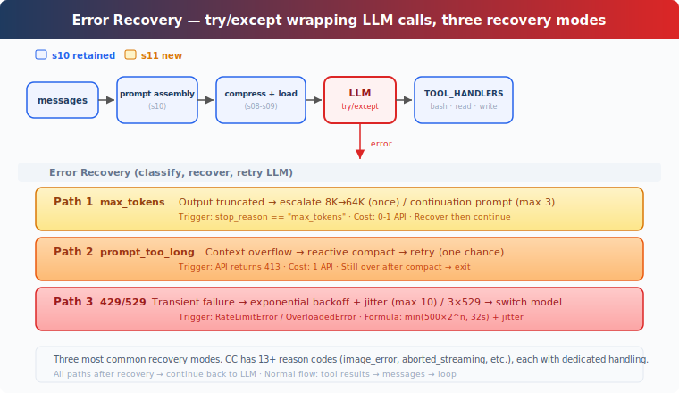

# s11: Error Recovery — Errors aren't the end, they're the start of a retry

[中文](README.md) · [English](README.en.md) · [日本語](README.ja.md)

s01 → ... → s09 → s10 → `s11` → [s12](../s12_task_system/) → s13 → ... → s20
> *"Errors aren't the end, they're the start of a retry"* — escalate tokens, compact context, switch models.
>
> **Harness layer**: Resilience — classify and recover when the main loop hits errors.

---

## The Problem

The Agent is running along and then errors out:

```
Error: 529 overloaded
```

The Agent crashes. It doesn't retry, doesn't switch models, doesn't reduce context — it just crashes.

In production, API errors are the norm. The three most common failure modes: **truncated output** (the model runs out of tokens mid-sentence), **context overflow** (still too long even after compaction), and **transient failures** (429 rate limiting / 529 overload). An Agent that doesn't handle errors is like a car that stalls at the slightest touch.

---

## Solution



The loop and prompt assembly from s10 are fully preserved. The only change: the LLM call is wrapped in try/except, with different recovery paths based on error type. After recovery, `continue` loops back to the top to call the LLM again.

The three most common recovery patterns (the teaching version only handles 429/529; real systems also cover connection errors, timeouts, cloud vendor credential caches, etc. CC actually has 13+ reason codes; see the Deep Dive for the rest):

| Pattern | Trigger | Recovery Action |
|----------|---------|-----------------|
| Output truncated | `max_tokens` | Escalate 8K→64K / continuation prompt |
| Context overflow | `prompt_too_long` | Reactive compact → retry |
| Transient failure | 429 / 529 | Exponential backoff + jitter, fallback model on consecutive 529 |

---

## How It Works

### Path 1: Output Truncated

The model runs out of tokens mid-sentence — `max_tokens` is exhausted. The default 8000 tokens isn't enough for a complete response.

On the first occurrence, escalate `max_tokens` from 8K to 64K (8x the space) and retry the same request — the truncated output is NOT appended to messages, keeping the original request intact. If 64K is still not enough, save the truncated output and inject a continuation prompt telling the model to pick up where it left off, up to 3 times:

```python
if response.stop_reason == "max_tokens":
    # First escalation: don't append truncated output, retry same request
    if not state.has_escalated:
        max_tokens = ESCALATED_MAX_TOKENS
        state.has_escalated = True
        continue  # messages unchanged, same request with more tokens
    # 64K still truncated: save output + continuation prompt
    messages.append({"role": "assistant", "content": response.content})
    if state.recovery_count < MAX_RECOVERY_RETRIES:
        messages.append({"role": "user", "content":
            "Output token limit hit. Resume directly — "
            "no apology, no recap. Pick up mid-thought."})
        state.recovery_count += 1
        continue
    return  # still truncated after 3 continuations
# Normal: append after max_tokens check
messages.append({"role": "assistant", "content": response.content})
```

Escalation gets one chance; continuation gets up to 3. After that, exit — further continuations won't produce meaningful output.

### Path 2: Context Overflow

The LLM says "your context is too long" (`prompt_too_long`). All four compaction layers from s08 have already run, and it's still over the limit.

Trigger reactive compact — more aggressive than auto compact. The teaching version keeps only the last 5 messages to simulate compaction; real CC generates a compact summary via LLM, then retries with the compacted message list. Retry after compacting. But if it's still over the limit after one compaction, the only option is to exit — compacting again won't make it any smaller:

```python
except PromptTooLongError:
    if not state.has_attempted_reactive_compact:
        messages[:] = reactive_compact(messages)
        state.has_attempted_reactive_compact = True
        continue
    return  # Already compacted and still over limit — must exit
```

### Path 3: Transient Failures

Network blips, 429 rate limiting, 529 overload — these aren't bugs, they're normal in distributed systems.

Both 429 and 529 use exponential backoff + jitter: wait 0.5 seconds on the first attempt, 1 second on the second, 2 seconds on the third, up to 10 retries. Random jitter prevents concurrent requests from all retrying at the same instant. Three consecutive 529 overload errors → switch to the fallback model (if `FALLBACK_MODEL_ID` environment variable is configured):

```python
def retry_delay(attempt, retry_after=None):
    if retry_after:
        return retry_after
    base = min(500 * (2 ** attempt), 32000) / 1000
    return base + random.uniform(0, base * 0.25)

def with_retry(fn, state, max_retries=10):
    for attempt in range(max_retries):
        try:
            return fn()
        except (RateLimitError, OverloadedError):
            delay = retry_delay(attempt)
            time.sleep(delay)
            if is_overloaded:
                state.consecutive_529 += 1
                if state.consecutive_529 >= 3 and FALLBACK_MODEL:
                    state.current_model = FALLBACK_MODEL
    raise MaxRetriesExceeded()
```

Backoff formula: `min(500 × 2^attempt, 32000) + random(0~25%)`. If the server returns a `Retry-After` header, that value takes priority.

### Putting It All Together

```python
def agent_loop(messages, context):
    system = get_system_prompt(context)
    state = RecoveryState()
    max_tokens = 8000

    while True:
        try:
            response = with_retry(
                lambda: client.messages.create(
                    model=state.current_model, system=system,
                    messages=messages, tools=TOOLS,
                    max_tokens=max_tokens),
                state)
        except Exception as e:
            if is_prompt_too_long_error(e):
                if not state.has_attempted_reactive_compact:
                    messages[:] = reactive_compact(messages)
                    state.has_attempted_reactive_compact = True
                    continue
                return
            log_error(e)
            return

        # max_tokens check BEFORE appending to messages
        if response.stop_reason == "max_tokens":
            if not state.has_escalated:
                max_tokens = 64000
                state.has_escalated = True
                continue  # retry same request, messages unchanged
            # save truncated output + continuation prompt
            messages.append({"role": "assistant", "content": response.content})
            messages.append({"role": "user", "content": CONTINUATION_PROMPT})
            continue
        # Normal completion
        messages.append({"role": "assistant", "content": response.content})

        if response.stop_reason != "tool_use":
            return
        # ... tool execution ...
```

The outer try/except catches API exceptions (prompt_too_long, etc.), `with_retry` handles transient errors (429/529), and `stop_reason` checks handle truncation. Three recovery mechanisms, each handling its own error type.

---

## Changes from s10

| Component | Before (s10) | After (s11) |
|-----------|-------------|-------------|
| Error handling | None (crashes on any error) | Three recovery patterns + exponential backoff |
| New constants | — | ESCALATED_MAX_TOKENS=64000, MAX_RETRIES=10, BASE_DELAY_MS=500, FALLBACK_MODEL |
| New functions | — | with_retry, retry_delay, reactive_compact, is_prompt_too_long_error, RecoveryState |
| Tools | bash, read_file, write_file (3) | bash, read_file, write_file (3) — unchanged |
| Loop | Bare LLM call | Wrapped in try/except + continue retry |

---

## Try It

```sh
cd learn-claude-code
python s11_error_recovery/code.py
```

Try these prompts:

1. Ask the Agent to generate a very long piece of code, and observe whether it automatically continues after truncation (look for the `[max_tokens] escalating` log)
2. Read many files consecutively to bloat the context, and observe reactive compact
3. If you encounter 429/529, observe the exponential backoff log output

---

## What's Next

The Agent can now automatically recover from errors. But the tasks it handles are still one-shot — you give it a task, it finishes, it's done.

What if the Agent could manage a **task list** — with dependencies, persisted to disk, resumable across sessions? A TODO list is not a task system.

s12 Task System → Tasks form a dependency graph with state and persistence. This is the foundation for multi-Agent collaboration.

<details>
<summary>Deep Dive into CC Source</summary>

> The following is based on CC source code: `query.ts` (1729 lines), `services/api/withRetry.ts` (822 lines), `query/tokenBudget.ts` (93 lines), and `utils/tokenBudget.ts` (73 lines).

### 1. A Dozen-Plus Reason/Transition Codes (Not Just 3)

The teaching version covers 3 of the most common recovery patterns. CC actually has a dozen-plus reason/transition codes, evaluated after every LLM call:

| Reason/Transition | Teaching Version | CC Behavior |
|---|---|---|
| `completed` | Normal completion | Return result |
| `next_turn` | Normal tool call | Continue to next tool execution round |
| `max_output_tokens_escalate` | Path 1 | 8K→64K escalation |
| `max_output_tokens_recovery` | Path 1 continuation | Continuation prompt (up to 3 times) |
| `reactive_compact_retry` | Path 2 | Reactive compact → retry |
| `prompt_too_long` | Path 2 | Same as above |
| `collapse_drain_retry` | Not covered | Context collapse — commit staged content first |
| `model_error` | Not covered | Retry |
| `image_error` | Not covered | `ImageSizeError` / `ImageResizeError` handled specifically |
| `aborted_streaming` | Not covered | Streaming abort recovery |
| `aborted_tools` | Not covered | Tool abort |
| `stop_hook_blocking` | Not covered | Inject blocking error → model self-corrects |
| `stop_hook_prevented` | Not covered | Hooks prevent execution |
| `hook_stopped` | Not covered | Hook stopped execution |
| `token_budget_continuation` | Not covered | Continue when token usage < 90% |
| `blocking_limit` | Not covered | Blocking limit reached |
| `max_turns` | Not covered | Maximum turns reached |

The teaching version only expands on the first 5 (most common); each of the rest has its own dedicated handling logic.

### 2. Precise Exponential Backoff Formula

CC's backoff delay (`withRetry.ts:530-548`):

```
delay = min(500 × 2^(attempt-1), 32000) + random(0~25%)
```

| Attempt | Base Delay | + Jitter |
|---------|-----------|----------|
| 1 | 500ms | 0-125ms |
| 2 | 1000ms | 0-250ms |
| 4 | 4000ms | 0-1000ms |
| 7+ | 32000ms (cap) | 0-8000ms |

If the server returns a `Retry-After` header, that value takes priority.

### 3. Original CONTINUATION Prompt

CC's continuation prompt (`query.ts:1225-1227`):

```
Output token limit hit. Resume directly — no apology, no recap of what
you were doing. Pick up mid-thought if that is where the cut happened.
Break remaining work into smaller pieces.
```

Token budget nudge prompt (`tokenBudget.ts:72`):

```
Stopped at {pct}% of token target. Keep working — do not summarize.
```

### 4. Streaming Error Handling

In CC's streaming path, recoverable errors (413, max_tokens, media errors) are **withheld from display** during streaming (`query.ts:788-822`) — SDK consumers don't see them, only the recovery logic does. After streaming ends, the system determines whether recovery is needed.

### 5. 529 → Fallback Model Switch

After 3 consecutive 529 overload errors (`MAX_529_RETRIES = 3`), CC automatically switches to the fallback model (e.g., Opus → Sonnet). On switch, all pending messages and tool results are cleared, and the user sees "Switched to {model} due to high demand".

### 6. Diminishing Returns Detection

Token budget "continuations" aren't unlimited. When there are 3 consecutive continuations with a token increment < 500, the system determines "continuing won't produce meaningful output" and stops continuation (`tokenBudget.ts:60-62`).

</details>

<!-- translation-sync: zh@v1, en@v1, ja@v1 -->
