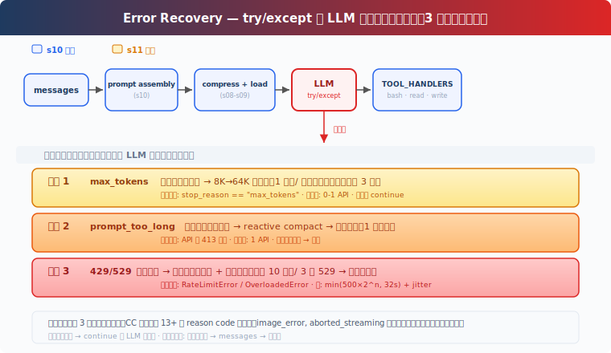

# s11: Error Recovery — エラーは終わりではなく、リトライの始まり

[中文](README.md) · [English](README.en.md) · [日本語](README.ja.md)

s01 → ... → s09 → s10 → `s11` → [s12](../s12_task_system/) → s13 → ... → s20
> *"エラーは終わりではなく、リトライの始まり"* — トークン拡張、コンテキスト圧縮、モデル切り替え。
>
> **Harness 層**: 耐障害性 — メインループのエラーを分類し復旧。

---

## 課題

Agent が動いている途中でエラーが出た：

```
Error: 529 overloaded
```

Agent がクラッシュした。リトライもしない、モデルも切り替えない、コンテキストも減らさない——そのままクラッシュ。

本番環境では API エラーが日常茶飯事。最も一般的な 3 つの障害パターン：**出力の切り詰め**（モデルが途中まで出力して token が尽きた）、**コンテキスト超過**（圧縮後も長すぎる）、**一時的障害**（429 レート制限 / 529 過負荷）。エラーを処理しない Agent は、一度触れただけで止まる車のようなものだ。

---

## 解決策



s10 のループ、prompt 組み立てはすべてそのまま。唯一の変更点：LLM 呼び出しを try/except で包み、エラータイプに応じて異なる復旧パスに振り分ける。復旧後は `continue` でループ先頭に戻り、再度 LLM を呼び出す。

最も一般的な 3 つの復旧パターン（教学版は 429/529 のみ対応；実際のシステムは接続エラー、タイムアウト、クラウドベンダーの認証キャッシュ等もカバー。CC には実際 13 以上の reason code があるが、残りは Deep dive で解説）：

| パターン | トリガー | 復旧アクション |
|----------|----------|---------------|
| 出力切り詰め | `max_tokens` | 8K→64K に拡張 / 続きのプロンプト注入 |
| コンテキスト超過 | `prompt_too_long` | reactive compact → リトライ |
| 一時的障害 | 429 / 529 | 指数バックオフ + ジッター、連続 529 でフォールバックモデルに切り替え可能 |

---

## 仕組み

### パス 1: 出力が切り詰められた

モデルが途中まで出力して、`max_tokens` に達した。デフォルトの 8000 token では完全な回答を出力しきれない。

初回発生時、`max_tokens` を 8K から 64K に拡張（8 倍の空間）し、同じリクエストをリトライする——この時、切り詰められた出力は messages に追加せず、元のリクエストをそのまま維持する。64K でも足りない場合にのみ、切り詰められた出力を保存し、続きのプロンプトを注入してモデルに先ほどの続きを出力させる。最大 3 回まで：

```python
if response.stop_reason == "max_tokens":
    # First escalation: don't append truncated output, retry same request
    if not state.has_escalated:
        max_tokens = ESCALATED_MAX_TOKENS
        state.has_escalated = True
        continue  # messages unchanged, same request with more tokens
    # 64K still truncated: save output + continuation prompt
    messages.append({"role": "assistant", "content": response.content})
    if state.recovery_count < MAX_RECOVERY_RETRIES:
        messages.append({"role": "user", "content":
            "Output token limit hit. Resume directly — "
            "no apology, no recap. Pick up mid-thought."})
        state.recovery_count += 1
        continue
    return  # still truncated after 3 continuations
# Normal: append after max_tokens check
messages.append({"role": "assistant", "content": response.content})
```

拡張は 1 回だけ、続きの出力は最大 3 回。超過したら終了——これ以上続けても実質的な出力は得られない。

### パス 2: コンテキスト超過

LLM が「コンテキストが長すぎる」と返す（`prompt_too_long`）。s08 の 4 層圧縮をすべて実行したのに、まだ超えている。

reactive compact をトリガー——auto compact よりも積極的。教学版は最後の 5 メッセージだけを残して圧縮をシミュレート；実際の CC は LLM で compact サマリを生成してからリトライする。圧縮後にリトライ。ただし、一度圧縮してもまだ超過している場合は終了するしかない——再度圧縮しても小さくはならない：

```python
except PromptTooLongError:
    if not state.has_attempted_reactive_compact:
        messages[:] = reactive_compact(messages)
        state.has_attempted_reactive_compact = True
        continue
    return  # 圧縮済みでも超過、終了するしかない
```

### パス 3: 一時的障害

ネットワークの揺らぎ、429 レート制限、529 過負荷——これらはバグではなく、分散システムの日常だ。

429 と 529 は統一して指数バックオフ + ジッターを使用：1 回目は 0.5 秒待機、2 回目は 1 秒、3 回目は 2 秒、最大 10 回。ランダムジッターを加えることで、並行リクエストが同時にリトライするのを防ぐ。3 回連続で 529 過負荷 → フォールバックモデルに切り替え（`FALLBACK_MODEL_ID` 環境変数が設定されている場合）：

```python
def retry_delay(attempt, retry_after=None):
    if retry_after:
        return retry_after
    base = min(500 * (2 ** attempt), 32000) / 1000
    return base + random.uniform(0, base * 0.25)

def with_retry(fn, state, max_retries=10):
    for attempt in range(max_retries):
        try:
            return fn()
        except (RateLimitError, OverloadedError):
            delay = retry_delay(attempt)
            time.sleep(delay)
            if is_overloaded:
                state.consecutive_529 += 1
                if state.consecutive_529 >= 3 and FALLBACK_MODEL:
                    state.current_model = FALLBACK_MODEL
    raise MaxRetriesExceeded()
```

バックオフの公式：`min(500 × 2^attempt, 32000) + random(0~25%)`。サーバーが `Retry-After` ヘッダーを返した場合、その値を優先して使用する。

### 統合して実行

```python
def agent_loop(messages, context):
    system = get_system_prompt(context)
    state = RecoveryState()
    max_tokens = 8000

    while True:
        try:
            response = with_retry(
                lambda: client.messages.create(
                    model=state.current_model, system=system,
                    messages=messages, tools=TOOLS,
                    max_tokens=max_tokens),
                state)
        except Exception as e:
            if is_prompt_too_long_error(e):
                if not state.has_attempted_reactive_compact:
                    messages[:] = reactive_compact(messages)
                    state.has_attempted_reactive_compact = True
                    continue
                return
            log_error(e)
            return

        # max_tokens check BEFORE appending to messages
        if response.stop_reason == "max_tokens":
            if not state.has_escalated:
                max_tokens = 64000
                state.has_escalated = True
                continue  # retry same request, messages unchanged
            # save truncated output + continuation prompt
            messages.append({"role": "assistant", "content": response.content})
            messages.append({"role": "user", "content": CONTINUATION_PROMPT})
            continue
        # Normal completion
        messages.append({"role": "assistant", "content": response.content})

        if response.stop_reason != "tool_use":
            return
        # ... tool execution ...
```

外側の try/except が API 例外（prompt_too_long 等）を捕捉し、`with_retry` が一時的エラー（429/529）を処理し、`stop_reason` のチェックが切り詰めを処理する。3 つの復旧メカニズムがそれぞれ異なるエラータイプを担当する。

---

## s10 からの変更点

| コンポーネント | 変更前 (s10) | 変更後 (s11) |
|---------------|-------------|-------------|
| エラー処理 | なし（エラーで即クラッシュ） | 3 つの復旧パターン + 指数バックオフ |
| 新規定数 | — | ESCALATED_MAX_TOKENS=64000, MAX_RETRIES=10, BASE_DELAY_MS=500, FALLBACK_MODEL |
| 新規関数 | — | with_retry, retry_delay, reactive_compact, is_prompt_too_long_error, RecoveryState |
| ツール | bash, read_file, write_file (3) | bash, read_file, write_file (3) — 変更なし |
| ループ | LLM を直接呼び出し | try/except で包み + continue でリトライ |

---

## 試してみる

```sh
cd learn-claude-code
python s11_error_recovery/code.py
```

以下の prompt を試してみよう：

1. Agent に長いコードを生成させ、切り詰め後に自動で続きが出力されるか観察する（`[max_tokens] escalating` ログを確認）
2. 連続して大量のファイルを読み込みコンテキストを肥大化させ、reactive compact の動作を観察する
3. 429/529 が発生した場合、指数バックオフのログ出力を観察する

---

## 次のステップ

Agent はエラーから自動的に復旧できるようになった。しかし、まだ処理するタスクは「使い捨て」だ——タスクを与えると実行し、終わる。

Agent に**タスクリスト**を管理させられないだろうか——依存関係があり、ディスクに永続化され、セッションをまたいで復旧できる？TODO リストはタスクシステムではない。

s12 Task System → タスクとは依存関係があり、状態があり、永続化されたグラフだ。これはマルチ Agent 協調の基盤となる。

<details>
<summary>CC ソースコード深掘り</summary>

> 以下は CC ソースコード `query.ts`（1729 行）、`services/api/withRetry.ts`（822 行）、`query/tokenBudget.ts`（93 行）、`utils/tokenBudget.ts`（73 行）の分析に基づく。

### 一、十数種の reason/transition（3 つだけではない）

教学版では最も一般的な 3 つの復旧パターンを解説した。CC には実際十数種の reason/transition があり、毎回の LLM 呼び出し後に判定される：

| reason/transition | 教学版の対応 | CC の動作 |
|---|---|---|
| `completed` | 正常終了 | 結果を返す |
| `next_turn` | 通常のツール呼び出し | 次のツール実行ラウンドへ |
| `max_output_tokens_escalate` | パス 1 | 8K→64K に拡張 |
| `max_output_tokens_recovery` | パス 1 続き出力 | 続きのプロンプト注入（最大 3 回） |
| `reactive_compact_retry` | パス 2 | reactive compact → リトライ |
| `prompt_too_long` | パス 2 | 同上 |
| `collapse_drain_retry` | 未展開 | context collapse 時にまず保留中の内容をコミット |
| `model_error` | 未展開 | リトライ |
| `image_error` | 未展開 | `ImageSizeError` / `ImageResizeError` の専用処理 |
| `aborted_streaming` | 未展開 | ストリーミング中断の復旧 |
| `aborted_tools` | 未展開 | ツール中断 |
| `stop_hook_blocking` | 未展開 | blocking error を注入 → モデルが自己修正 |
| `stop_hook_prevented` | 未展開 | hooks によるブロック |
| `hook_stopped` | 未展開 | hook による実行停止 |
| `token_budget_continuation` | 未展開 | token 使用量 < 90% の時に継続 |
| `blocking_limit` | 未展開 | ブロック制限 |
| `max_turns` | 未展開 | 最大ターン数に到達 |

教学版では最初の 5 つ（最も一般的なもの）だけを展開した。残りはそれぞれ専用の処理ロジックを持つ。

### 二、指数バックオフの正確な公式

CC のバックオフ遅延（`withRetry.ts:530-548`）：

```
delay = min(500 × 2^(attempt-1), 32000) + random(0~25%)
```

| 試行 | 基本遅延 | + ジッター |
|------|---------|-----------|
| 1 | 500ms | 0-125ms |
| 2 | 1000ms | 0-250ms |
| 4 | 4000ms | 0-1000ms |
| 7+ | 32000ms（上限） | 0-8000ms |

サーバーが `Retry-After` ヘッダーを返した場合、その値を優先して使用する。

### 三、CONTINUATION プロンプト原文

CC の続き出力プロンプト（`query.ts:1225-1227`）：

```
Output token limit hit. Resume directly — no apology, no recap of what
you were doing. Pick up mid-thought if that is where the cut happened.
Break remaining work into smaller pieces.
```

Token budget のナッジプロンプト（`tokenBudget.ts:72`）：

```
Stopped at {pct}% of token target. Keep working — do not summarize.
```

### 四、ストリーミングエラー処理

CC のストリーミングパスでは、復旧可能なエラー（413、max_tokens、media error）はストリーミング中**表示を保留される**（`query.ts:788-822`）——SDK コンシューマーには見えず、復旧ロジックだけが認識できる。ストリーミング終了後に復旧が必要かどうかを判断する。

### 五、529 → フォールバックモデル切り替え

3 回連続で 529 過負荷エラーが発生した後（`MAX_529_RETRIES = 3`）、CC は自動的にフォールバックモデルに切り替える（例：Opus → Sonnet）。切り替え時にすべての保留中のメッセージと tool 結果をクリアし、ユーザーに "Switched to {model} due to high demand" と表示する。

### 六、収穫逓減の検出

Token budget の「継続」は無限ではない。連続 3 回の continuation で token 増分が 500 未満の場合、システムは「続けても実質的な出力は得られない」と判断し、continuation を停止する（`tokenBudget.ts:60-62`）。

</details>

<!-- translation-sync: zh@v1, en@v1, ja@v1 -->
