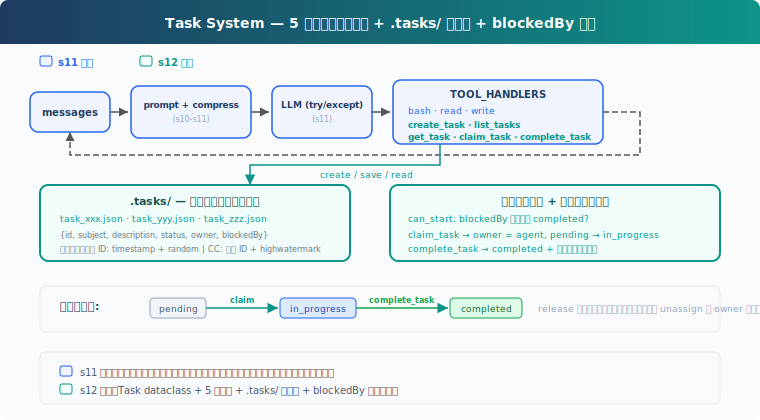
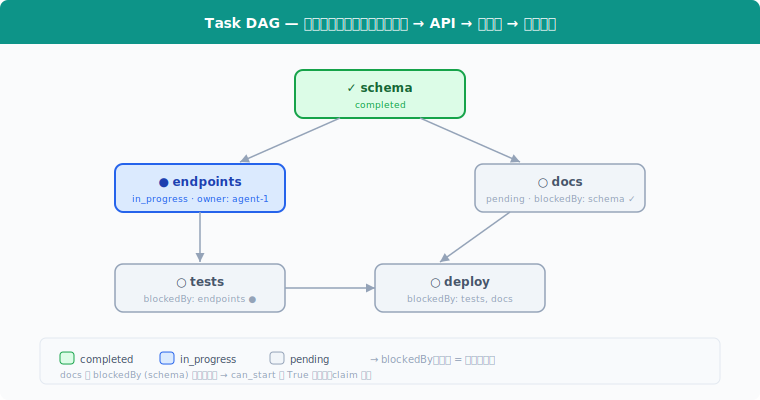

# s12: Task System — 大きな目標を小さなタスクに分割

[中文](README.md) · [English](README.en.md) · [日本語](README.ja.md)

s01 → ... → s10 → s11 → `s12` → [s13](../s13_background_tasks/) → s14 → ... → s20

> *"大きな目標を小さなタスクに分け、順序付け、永続化"* — ファイル永続化タスクグラフ、マルチ Agent 協調の基盤。
>
> **Harness 層**: タスク — 永続化された目標、復旧可能な進捗。

---

## 課題

Agent がプロジェクトを受けた：データベース構築、API 実装、テスト追加。s05 の TodoWrite でリストを作り、まず API を書き始め、途中でデータベーステーブルがないことに気づいて戻る。テスト追加時に API インターフェースのシグネチャがまた変わっている...

屋根を先に建てて基礎を後から打つことはできない。タスクには順序がある。タスクの依存関係は有向非巡回グラフ（DAG）を形成すべき；教学版は `blockedBy` チェックのみをデモし、循環検出は実装していない。

s05 の TodoWrite は現在のタスクの実行チェックリストで、セッションメモリに保持される。ここで必要なのは**タスクシステム**：各タスクは JSON ファイル、タスク間に `blockedBy` 依存関係、ディスク上でセッションをまたいで永続化。

---

## ソリューション



教学版は基本 agent loop を維持し、タスクシステムに集中するため S11 の完全なエラーリカバリ（RecoveryState、バックオフ、エスカレーション、reactive compact、フォールバックモデル）を省略。追加：5 つの新規タスクツール + `.tasks/` ディレクトリによる永続化 + `blockedBy` 依存チェック。タスクシステムとエラーリカバリは独立したレイヤー：CC ソースコードでは `utils/tasks.ts` は CRUD のみ、`query.ts` の with_retry/RecoveryState がエラーリカバリを担当し、互いに非結合。

TodoWrite vs Task System：

| | TodoWrite (s05) | Task System (s12) |
|---|---|---|
| 位置づけ | 現在のタスクの実行チェックリスト | 復旧可能なタスクシステム |
| ストレージ | プロセス内 / セッション状態 | `.tasks/{id}.json` |
| 依存関係 | なし | `blockedBy` / `blocks` グラフ |
| ライフサイクル | 現在のセッション / 現在のタスク | セッション横断 |
| 分担 | タスク認識を扱わない | `owner` / claim |
| ステータス | pending / in_progress / completed | pending / in_progress / completed |
| 粒度 | Agent 自身の手順 | 認識・追跡・アンロックできるタスク |

---

## 仕組み



### Task: データ構造

各タスクは JSON ファイル、`.tasks/` ディレクトリに保存：

```python
@dataclass
class Task:
    id: str
    subject: str
    description: str
    status: str          # pending | in_progress | completed
    owner: str | None    # Agent 名（マルチ Agent シナリオ）
    blockedBy: list[str] # 依存タスク ID のリスト
```

ID は `timestamp + random hex` で生成、シンプルだが十分。CC は順次 ID + highwatermark ファイルで ID 再利用を防止する、より厳密な設計。

### create_task: タスク作成

```python
def create_task(subject: str, description: str = "",
                blockedBy: list[str] | None = None) -> Task:
    task = Task(
        id=f"task_{int(time.time())}_{random_hex(4)}",
        subject=subject, description=description,
        status="pending", owner=None,
        blockedBy=blockedBy or [],
    )
    save_task(task)
    return task
```

作成時に自動的に `save_task` で `.tasks/{id}.json` に書き込み。`blockedBy` で依存を宣言、例えば "API を書く" の `blockedBy` は `["task_schema"]`。

### can_start: 依存チェック

タスクは `blockedBy` が**すべて completed** になってからでないと開始できない：

```python
def can_start(task_id: str) -> bool:
    task = load_task(task_id)
    for dep_id in task.blockedBy:
        if not _task_path(dep_id).exists():
            return False  # missing dependency = blocked
        dep = load_task(dep_id)
        if dep.status != "completed":
            return False
    return True
```

`can_start` は `claim_task` の事前チェック：`blockedBy` に一つでも completed でないものがあれば、認識不可。存在しない依存は blocked として扱い、誤った ID 参照時のクラッシュを防ぐ。

### claim_task: タスク認識

Agent がタスクに取り掛かる時、`claim_task` を呼び出し：`owner` を設定、ステータスを `pending` → `in_progress` に変更。`owner` フィールドは誰が作業中かを記録し、マルチ Agent シナリオで重複認識を防止：

```python
def claim_task(task_id: str, owner: str = "agent") -> str:
    task = load_task(task_id)
    if task.status != "pending":
        return f"Task {task_id} is {task.status}, cannot claim"
    if not can_start(task_id):
        deps = [d for d in task.blockedBy
                if load_task(d).status != "completed"]
        return f"Blocked by: {deps}"
    task.owner = owner
    task.status = "in_progress"
    save_task(task)
    return f"Claimed {task_id} ({task.subject})"
```

タスクが既に他者に認識されている（`status != "pending"`）、または依存が未完了（`can_start` が False）の場合、認識を拒否。

### complete_task: 完了とアンロック

タスク完了後、`completed` に設定。同時に他の全タスクを走査し、**直前にアンロックされた**下流タスクを特定：

```python
def complete_task(task_id: str) -> str:
    task = load_task(task_id)
    task.status = "completed"
    save_task(task)
    # アンロックされた下流タスクを検索
    unblocked = [t.subject for t in list_tasks()
                 if t.status == "pending" and t.blockedBy
                 and can_start(t.id)]
    msg = f"Completed {task_id} ({task.subject})"
    if unblocked:
        msg += f"\nUnblocked: {', '.join(unblocked)}"
    return msg
```

"schema" 完了後、"endpoints" と "docs" の `can_start` が True を返し、開始可能になる。

### get_task: 完全な詳細を確認

`list_tasks` は 1 行サマリのみ表示。`get_task` は description と依存関係の詳細を含む完全なタスク JSON を返す。セッションをまたいで復旧する際、Agent は完全な説明を読んで作業を継続する必要がある：

```python
def get_task(task_id: str) -> str:
    task = load_task(task_id)
    return json.dumps(asdict(task), indent=2)
```

### 状態マシン: 2 つのアクション、3 つの状態

```
pending ──claim──→ in_progress ──complete──→ completed
```

ここで `claim` / `complete` はアクション、`pending` / `in_progress` / `completed` は状態：

- **claim_task**: `pending` → `in_progress`。owner を設定し、作業を開始。
- **complete_task**: `in_progress` → `completed`。タスクを完了済みにし、下流をアンロック。

CC には `in_progress → pending` の release パスがない。teammate が終了または shutdown した場合、CC は未完了タスクの owner をクリアし、status を `pending` にリセットし、他の agent が再認識できるようにする。教学版はこの復旧パスを省略。

### 組み合わせて実行

```python
# 依存関係のあるタスクを作成
schema = create_task("setup database schema")
endpoints = create_task("create API endpoints", blockedBy=[schema.id])
tests = create_task("write tests", blockedBy=[endpoints.id])
docs = create_task("write docs", blockedBy=[schema.id])

# Agent が最初に実行可能なタスクを認識
claim_task(schema.id)       # ✓ Claimed（依存なし）
complete_task(schema.id)    # ✓ Completed → endpoints, docs をアンロック

claim_task(endpoints.id)    # ✓ Claimed（schema 完了済み）
complete_task(endpoints.id) # ✓ Completed → tests をアンロック

claim_task(docs.id)         # ✓ Claimed（schema 完了済み）
complete_task(docs.id)      # ✓ Completed

claim_task(tests.id)        # ✓ Claimed（endpoints 完了済み）
complete_task(tests.id)     # ✓ Completed
```

各 `create_task` が JSON ファイルを書き込み、各 `claim_task` / `complete_task` がファイルを更新。セッションをまたいでも `.tasks/` ディレクトリが残り、Agent はファイルを読んで進捗を復旧。

---

## s11 からの変更

| コンポーネント | 変更前 (s11) | 変更後 (s12) |
|--------------|------------|------------|
| タスク管理 | なし | Task dataclass + 5 ツール |
| 新規型 | — | Task（id, subject, description, status, owner, blockedBy） |
| ストレージ | 永続化なし | `.tasks/{id}.json` セッション横断 |
| 依存関係 | なし | `blockedBy` グラフ + `can_start` チェック |
| ツール | bash, read_file, write_file (3) | + create_task, list_tasks, get_task, claim_task, complete_task (8) |
| ライフサイクル | — | pending → in_progress → completed（release ロールバックなし） |

---

## 試してみる

```sh
cd learn-claude-code
python s12_task_system/code.py
```

以下のプロンプトを試してください：

1. `Create tasks: setup database schema, create API endpoints (depends on schema), write tests (depends on endpoints), write docs (depends on schema)`
2. `List all tasks and their statuses`
3. `Claim the first unblocked task and complete it`
4. `List tasks again — which ones are now unblocked?`

観察ポイント：`.tasks/` ディレクトリに JSON ファイルが生成されているか？タスク完了後、ブロックされていたタスクがアンロックされているか？

---

## 次の章

タスクグラフができた。しかし、一部のタスクは長時間かかる — 全テスト実行やサーバーデプロイなど。Agent は LLM をトークン課金で呼び出しており、遅い操作を待つ余裕はない。

s13 Background Tasks → 遅い操作はバックグラウンドへ。Agent は他のタスクの処理を続け、バックグラウンドの完了を通知で受け取る。

<details>
<summary>CC ソースコード深掘り</summary>

> 以下は CC ソースコード `utils/tasks.ts`（862 行）、`tools/TaskCreateTool/TaskCreateTool.ts`（138 行）、`tools/TaskUpdateTool/TaskUpdateTool.ts`（406 行）、`tools/TaskGetTool/TaskGetTool.ts`（128 行）、`tools/TaskListTool/TaskListTool.ts`（116 行）、`hooks/useTaskListWatcher.ts`（221 行）の完全分析に基づく。

### 一、TaskRecord の完全フィールド

チュートリアルでは id、subject、status、owner、blockedBy のみ解説。CC は実際に 9 フィールドを持つ（`utils/tasks.ts:76-89`）：

| フィールド | 型 | 用途 |
|------|------|------|
| `id` | string | 昇順整数 ID |
| `subject` | string | 短いタイトル |
| `description` | string | 自由形式の説明 |
| `activeForm` | string? | 現在進行形、in_progress 時にスピナーに表示 |
| `owner` | string? | 割り当てられた agent ID |
| `status` | pending/in_progress/completed | ライフサイクル |
| `blocks` | string[] | このタスクがブロックするタスク ID（下流） |
| `blockedBy` | string[] | このタスクをブロックするタスク ID（上流） |
| `metadata` | Record? | 任意の拡張キーバリューペア |

保存場所：`~/.claude/tasks/{taskListId}/{id}.json`。タスクごとに 1 ファイル。

### 二、TodoWrite のアップグレードではなく、2 つの独立システム

CC では Task System と TodoWrite **は共存**し、`isTodoV2Enabled()` で切り替え（`utils/tasks.ts:133`）— 対話セッションはデフォルトで Task (V2)、非対話/SDK セッションは TodoWrite。環境変数 `CLAUDE_CODE_ENABLE_TASKS` で Task を強制有効化可能。Task は TodoWrite にない機能を持つ：ファイルロック並行保護、依存関係強制、ownership、fs.watch リアクティブ監視、ライフサイクルフック。

### 三、並行認識のロック機構

`claimTask()`（`utils/tasks.ts:541-612`）は二重ロックで競合を防止：

**タスクファイルロック**：`proper-lockfile` で `{taskId}.json` をロック（最大 30 リトライ、指数バックオフ 5-100ms）。ロック内：
1. タスクを再読込（TOCTOU 防止）
2. 既に他者が認識済み → `already_claimed`
3. 既に完了済み → `already_resolved`
4. 上流が未完了 → `blocked`
5. owner を設定

**リストレベルロック**（agent busy チェック時）：`.lock` ファイル、全タスクを原子的に走査し該当 agent が他の open task を持つか確認。

注意：教学版は認識と作業開始を 1 ステップに統合（claim = owner 設定 + in_progress）；実際の CC の `claimTask` は主に owner 競合を解決し、owner のみを設定して status は変更しない。status の更新は `TaskUpdate` が担当。

### 四、高水位標による ID 再利用防止

`.highwatermark` ファイルが過去に割り当てられた最大タスク ID を記録。タスクが削除されても ID は再利用されない。

### 五、4 つの Task ツール

CC のタスクシステムは 4 つのツールを持つ（チュートリアルの汎用 Task ツールとは異なる）：`TaskCreate`、`TaskGet`、`TaskUpdate`、`TaskList`。すべて `isConcurrencySafe: true` と `shouldDefer: true` が設定（ツールスキーマは初期プロンプトに含まれず、ToolSearch 後にのみ可視）。

教学版の `create_task(blockedBy=...)` は作成時に直接依存を宣言する合理な簡略化。実際の CC の `TaskCreate` は subject/description/activeForm/metadata のみを受け付け、依存関係は `TaskUpdate` の `addBlocks/addBlockedBy` で管理される。

</details>

<!-- translation-sync: zh@v1, en@v1, ja@v1 -->
