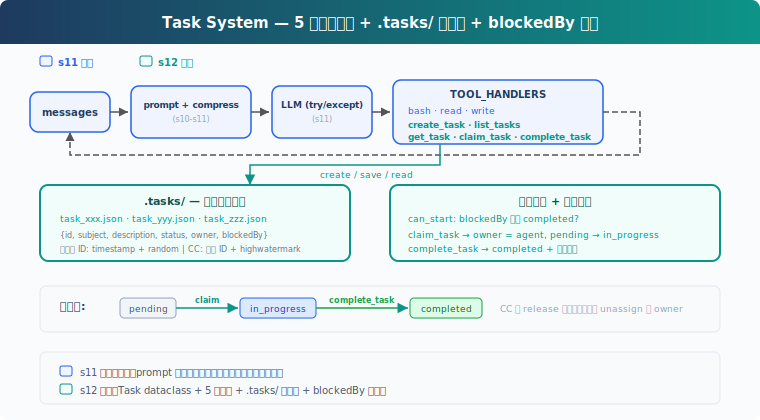
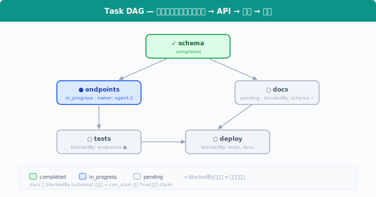

# s12: Task System — 目标太大，拆成小任务

[中文](README.md) · [English](README.en.md) · [日本語](README.ja.md)

s01 → ... → s10 → s11 → `s12` → [s13](../s13_background_tasks/) → s14 → ... → s20

> *"大目标拆成小任务, 排好序, 持久化"* — 文件持久化的任务图, 多 agent 协作的基础。
>
> **Harness 层**: 任务 — 持久化的目标, 可恢复的进度。

---

## 问题

Agent 接到一个项目：搭数据库、写 API、加测试。它用 s05 的 TodoWrite 列了一张清单，然后开始写 API，写到一半发现没数据库表，回头补；加测试时发现 API 接口签名又变了...

盖房子不能先盖屋顶再打地基。任务之间有先后。任务依赖应该形成有向无环图（DAG）；教学版只演示 `blockedBy` 检查，没有实现环检测。

s05 的 TodoWrite 是当前任务的执行清单，保存在会话内存中。这里需要的是**任务系统**：每个任务是一个 JSON 文件，任务之间有 `blockedBy` 依赖，跨会话持久化在磁盘上。

---

## 解决方案



教学代码保留基础 agent loop，为聚焦任务系统省略了 S11 的完整错误恢复（RecoveryState、退避、升级、reactive compact、fallback model）。新增 5 个任务工具 + `.tasks/` 目录持久化 + `blockedBy` 依赖检查。任务系统与错误恢复是独立层：CC 源码中 `utils/tasks.ts` 只管 CRUD，`query.ts` 的 with_retry/RecoveryState 管错误恢复，互不耦合。

TodoWrite vs Task System：

| | TodoWrite (s05) | Task System (s12) |
|---|---|---|
| 定位 | 当前任务的执行清单 | 可恢复的任务系统 |
| 存储 | 进程内 / 会话状态 | `.tasks/{id}.json` |
| 依赖 | 无 | `blockedBy` / `blocks` 依赖图 |
| 生命周期 | 当前会话 / 当前任务 | 跨会话保留 |
| 分工 | 不负责任务认领 | `owner` / claim |
| 状态 | pending / in_progress / completed | pending / in_progress / completed |
| 粒度 | Agent 自己的步骤 | 可被认领、追踪、解锁的任务 |

---

## 工作原理



### Task: 数据结构

每个任务是一个 JSON 文件，存于 `.tasks/` 目录：

```python
@dataclass
class Task:
    id: str
    subject: str
    description: str
    status: str          # pending | in_progress | completed
    owner: str | None    # Agent 名（多 Agent 场景）
    blockedBy: list[str] # 依赖的任务 ID 列表
```

ID 用 `timestamp + random hex` 生成，简单但够用。CC 用顺序 ID + highwatermark 文件防止 ID 重用，是更严谨的设计。

### create_task: 创建任务

```python
def create_task(subject: str, description: str = "",
                blockedBy: list[str] | None = None) -> Task:
    task = Task(
        id=f"task_{int(time.time())}_{random_hex(4)}",
        subject=subject, description=description,
        status="pending", owner=None,
        blockedBy=blockedBy or [],
    )
    save_task(task)
    return task
```

创建时自动 `save_task` 到 `.tasks/{id}.json`。`blockedBy` 声明依赖，比如 "写 API" 的 `blockedBy` 是 `["task_schema"]`。

### can_start: 依赖检查

一个任务只能在它的 `blockedBy` **全部 completed** 之后才能开始：

```python
def can_start(task_id: str) -> bool:
    task = load_task(task_id)
    for dep_id in task.blockedBy:
        if not _task_path(dep_id).exists():
            return False  # missing dependency = blocked
        dep = load_task(dep_id)
        if dep.status != "completed":
            return False
    return True
```

`can_start` 是 `claim_task` 的前置检查：`blockedBy` 里有任何一个不是 completed，就不能认领。不存在的依赖视为 blocked，避免引用错误 ID 时崩溃。

### claim_task: 认领任务

Agent 开始做一个任务时，调用 `claim_task`：设置 `owner`，状态从 `pending` → `in_progress`。`owner` 字段记录谁在做这个任务，多 Agent 场景下防止重复认领：

```python
def claim_task(task_id: str, owner: str = "agent") -> str:
    task = load_task(task_id)
    if task.status != "pending":
        return f"Task {task_id} is {task.status}, cannot claim"
    if not can_start(task_id):
        deps = [d for d in task.blockedBy
                if load_task(d).status != "completed"]
        return f"Blocked by: {deps}"
    task.owner = owner
    task.status = "in_progress"
    save_task(task)
    return f"Claimed {task_id} ({task.subject})"
```

如果任务已被别人认领（`status != "pending"`），或者依赖没完成（`can_start` 返回 False），拒绝认领。

### complete_task: 完成与解锁

任务做完后，设为 `completed`。同时扫描所有其他任务，找出**刚刚被解锁**的下游任务：

```python
def complete_task(task_id: str) -> str:
    task = load_task(task_id)
    task.status = "completed"
    save_task(task)
    # 找出被解锁的下游任务
    unblocked = [t.subject for t in list_tasks()
                 if t.status == "pending" and t.blockedBy
                 and can_start(t.id)]
    msg = f"Completed {task_id} ({task.subject})"
    if unblocked:
        msg += f"\nUnblocked: {', '.join(unblocked)}"
    return msg
```

完成 "schema" 后，"endpoints" 和 "docs" 的 `can_start` 返回 True，它们可以开始。

### get_task: 查看完整细节

`list_tasks` 只显示一行摘要。`get_task` 返回完整的任务 JSON，包括 description 和依赖细节。跨会话恢复时，Agent 需要读取完整描述才能继续工作：

```python
def get_task(task_id: str) -> str:
    task = load_task(task_id)
    return json.dumps(asdict(task), indent=2)
```

### 状态机: 两个动作，三个状态

```
pending ──claim──→ in_progress ──complete──→ completed
```

这里的 `claim` / `complete` 是动作，`pending` / `in_progress` / `completed` 是状态：

- **claim_task**: `pending` → `in_progress`。设置 owner，开始工作。
- **complete_task**: `in_progress` → `completed`。把任务标记为完成，并解锁下游。

CC 没有 `in_progress → pending` 的 release 路径。如果 teammate 终止或 shutdown，CC 会把它未完成的任务 unassign（清除 owner），并将 status 重置为 `pending`，方便其他 agent 重新认领。教学版省略了这一恢复路径。

### 合起来跑

```python
# 创建有依赖的任务
schema = create_task("setup database schema")
endpoints = create_task("create API endpoints", blockedBy=[schema.id])
tests = create_task("write tests", blockedBy=[endpoints.id])
docs = create_task("write docs", blockedBy=[schema.id])

# Agent 认领第一个可做的任务
claim_task(schema.id)       # ✓ Claimed (无依赖)
complete_task(schema.id)    # ✓ Completed → 解锁 endpoints, docs

claim_task(endpoints.id)    # ✓ Claimed (schema 已完成)
complete_task(endpoints.id) # ✓ Completed → 解锁 tests

claim_task(docs.id)         # ✓ Claimed (schema 已完成)
complete_task(docs.id)      # ✓ Completed

claim_task(tests.id)        # ✓ Claimed (endpoints 已完成)
complete_task(tests.id)     # ✓ Completed
```

每个 `create_task` 写一个 JSON 文件，每个 `claim_task` / `complete_task` 更新文件。跨会话时，`.tasks/` 目录还在，Agent 读文件就能恢复进度。

---

## 相对 s11 的变更

| 组件 | 之前 (s11) | 之后 (s12) |
|------|-----------|-----------|
| 任务管理 | 无 | Task dataclass + 5 个工具 |
| 新类型 | — | Task（id, subject, description, status, owner, blockedBy） |
| 存储 | 无持久化 | `.tasks/{id}.json` 跨会话 |
| 依赖 | 无 | `blockedBy` 图 + `can_start` 检查 |
| 工具 | bash, read_file, write_file (3) | + create_task, list_tasks, get_task, claim_task, complete_task (8) |
| 生命周期 | — | pending → in_progress → completed（无 release 回退） |

---

## 试一下

```sh
cd learn-claude-code
python s12_task_system/code.py
```

试试这些 prompt：

1. `Create tasks: setup database schema, create API endpoints (depends on schema), write tests (depends on endpoints), write docs (depends on schema)`
2. `List all tasks and their statuses`
3. `Claim the first unblocked task and complete it`
4. `List tasks again — which ones are now unblocked?`

观察重点：`.tasks/` 目录下是否生成了 JSON 文件？完成任务后，被阻塞的任务是否解锁？

---

## 接下来

任务图有了。但有些任务要跑很久——比如全量测试、部署到服务器。Agent 调 LLM 按量计费，不能干等一个慢操作。

s13 Background Tasks → 慢操作放后台。Agent 继续处理其他任务，后台跑完了通知它。

<details>
<summary>深入 CC 源码</summary>

> 以下基于 CC 源码 `utils/tasks.ts`（862 行）、`tools/TaskCreateTool/TaskCreateTool.ts`（138 行）、`tools/TaskUpdateTool/TaskUpdateTool.ts`（406 行）、`tools/TaskGetTool/TaskGetTool.ts`（128 行）、`tools/TaskListTool/TaskListTool.ts`（116 行）、`hooks/useTaskListWatcher.ts`（221 行）的分析。

### 一、TaskRecord 的完整字段

教学版只讲了 id、subject、status、owner、blockedBy。CC 实际有 9 个字段（`utils/tasks.ts:76-89`）：

| 字段 | 类型 | 用途 |
|------|------|------|
| `id` | string | 递增整数 ID |
| `subject` | string | 简短标题 |
| `description` | string | 自由格式描述 |
| `activeForm` | string? | 进行时态，in_progress 时在 spinner 显示 |
| `owner` | string? | 分配的 agent ID |
| `status` | pending/in_progress/completed | 生命周期 |
| `blocks` | string[] | 此任务阻塞的任务 ID（下游） |
| `blockedBy` | string[] | 阻塞此任务的任务 ID（上游） |
| `metadata` | Record? | 任意扩展键值对 |

存储位置：`~/.claude/tasks/{taskListId}/{id}.json`。每个任务一个文件。

### 二、不是 TodoWrite 的升级，是两个独立系统

CC 中 Task System 和 TodoWrite **同时存在**，通过 `isTodoV2Enabled()` 切换（`utils/tasks.ts:133`）——交互式会话默认启用 Task（V2），非交互式/SDK 默认用 TodoWrite。环境变量 `CLAUDE_CODE_ENABLE_TASKS` 可强制启用 Task。Task 有 TodoWrite 没有的：文件锁并发保护、依赖强制执行、ownership、fs.watch 响应式监听、生命周期 hooks。

### 三、并发认领的锁机制

`claimTask()`（`utils/tasks.ts:541-612`）用双重锁防竞争：

**任务文件锁**：`proper-lockfile` 锁住 `{taskId}.json`（最多重试 30 次，指数退避 5-100ms）。锁内：
1. 重新读取任务（防 TOCTOU）
2. 检查已被他人认领 → `already_claimed`
3. 检查已完成 → `already_resolved`
4. 检查上游未完成 → `blocked`
5. 设置 owner

**列表级锁**（agent busy 检查时）：`.lock` 文件，原子性扫描所有任务并检查该 agent 是否已有其他 open task。

注意：教学版把 claim 和开始工作合成一步（claim = set owner + in_progress）；真实 CC 的 `claimTask` 主要解决 owner 竞争，只设 owner 不改 status，状态更新由 `TaskUpdate` 完成。

### 四、高水位标防 ID 重用

`.highwatermark` 文件记录曾分配过的最高任务 ID。即使任务被删除，ID 也不会被重用。

### 五、四个 Task 工具

CC 的任务系统有四个工具（不是教学版的一个通用 Task 工具）：`TaskCreate`、`TaskGet`、`TaskUpdate`、`TaskList`。全部设置 `isConcurrencySafe: true` 和 `shouldDefer: true`（工具 schema 不在初始 prompt 中，需 ToolSearch 后才可见）。

教学版的 `create_task(blockedBy=...)` 在创建时直接声明依赖，是合理简化。真实 CC 的 `TaskCreate` 只接受 subject/description/activeForm/metadata，依赖关系由 `TaskUpdate` 的 `addBlocks/addBlockedBy` 维护。

</details>

<!-- translation-sync: zh@v1, en@v1, ja@v1 -->
