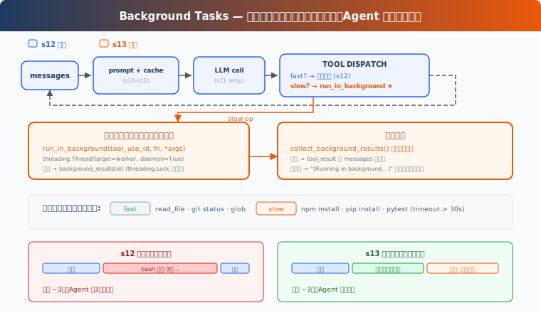

# s13: Background Tasks — 遅い操作はバックグラウンドへ

[中文](README.md) · [English](README.en.md) · [日本語](README.ja.md)

s01 → ... → s11 → s12 → `s13` → [s14](../s14_cron_scheduler/) → s15 → ... → s20

> *"遅い操作はバックグラウンドへ、agent は処理を継続"* — バックグラウンドスレッドでコマンドを実行、完了時に通知を注入。
>
> **Harness 層**: バックグラウンド — 非同期実行、メインループをブロックしない。

---

## 課題

洗濯機を使ったことがあるか？衣類を入れ、スタートを押し、他のことをする——料理、メッセージ返信、論文読み。30 分後に洗濯機が「ピッピッ」と知らせる：完了。30 分間立って待つ人はいない。

Agent の bash ツールも同じ。`pip install torch` は 10 分、`npm run build` は 3 分かかる。これらのコマンドが実行中、Agent は bash の戻りを待ち、その時間を他のタスクの処理に使えない。

ファイル読み込みはミリ秒、待たない。`git status` は 1 秒以内に戻る、待たない。しかし `npm install` は？分単位。Agent は 10 分間何もせず待ち、LLM 呼び出しはトークン課金、アイドル時間は無駄。

---

## ソリューション



教学版は S12 の簡易タスクシステムとプロンプト組み立てを踏襲。バックグラウンドタスクに集中するため、完全なエラーリカバリ、メモリ、スキルシステムは省略。唯一の変更：遅い操作をバックグラウンドスレッドに投げ、Agent はループを継続、バックグラウンド完了時に通知を注入。

同期 vs バックグラウンド：

| | 同期 (s12) | バックグラウンド (s13) |
|---|---|---|
| 遅い操作 | Agent が待機 | バックグラウンドスレッドで実行 |
| Agent アイドル | はい | いいえ、処理を継続 |
| 結果 | 即時返却 | 次ターンで通知を注入 |
| 判断基準 | — | `run_in_background` パラメータ（モデル明示的リクエスト）、ヒューリスティックフォールバック |

---

## 仕組み

### should_run_background: 明示的リクエスト優先、ヒューリスティックフォールバック

モデルは bash ツールの `run_in_background` パラメータで明示的にバックグラウンド実行をリクエストする。モデルが指定しない場合、教学版はキーワードヒューリスティックにフォールバック：

```python
def is_slow_operation(tool_name: str, tool_input: dict) -> bool:
    """Fallback heuristic: commands likely to take > 30s."""
    if tool_name != "bash":
        return False
    cmd = tool_input.get("command", "").lower()
    slow_keywords = ["install", "build", "test", "deploy", "compile",
                     "docker build", "pip install", "npm install",
                     "cargo build", "pytest", "make"]
    return any(kw in cmd for kw in slow_keywords)

def should_run_background(tool_name: str, tool_input: dict) -> bool:
    """Model explicit request takes priority; fallback to heuristic."""
    if tool_input.get("run_in_background"):
        return True
    return is_slow_operation(tool_name, tool_input)
```

CC の bash ツールスキーマには `run_in_background: boolean` パラメータがある（`BashTool.tsx:241`）。モデルがどのコマンドをバックグラウンドにするかを決定、キーワード推測ではない。教学版はヒューリスティックをフォールバックとして残すが、主パスはモデルの明示的リクエスト。

### start_background_task: バックグラウンド実行とライフサイクル

ツール呼び出しをワーカー関数にラップし、daemon スレッドにディスパッチ。各バックグラウンドタスクは一意 ID を持ち、`background_tasks` 辞書で状態を追跡：

```python
_bg_counter = 0
background_tasks: dict[str, dict] = {}   # bg_id → {tool_use_id, command, status}
background_results: dict[str, str] = {}   # bg_id → output
background_lock = threading.Lock()

def start_background_task(block) -> str:
    """Run tool in a daemon thread. Returns background task ID."""
    global _bg_counter
    _bg_counter += 1
    bg_id = f"bg_{_bg_counter:04d}"

    def worker():
        result = execute_tool(block)
        with background_lock:
            background_tasks[bg_id]["status"] = "completed"
            background_results[bg_id] = result

    with background_lock:
        background_tasks[bg_id] = {
            "tool_use_id": block.id,
            "command": block.input.get("command", ""),
            "status": "running",
        }
    thread = threading.Thread(target=worker, daemon=True)
    thread.start()
    return bg_id
```

`[Running in background...]` ではなく `bg_id` を返す。`daemon=True` で Agent プロセス終了時にスレッドも終了。教学版はメモリ内辞書で追跡。実際の CC は `LocalShellTaskState` を持ち、出力をファイルにリダイレクト、タスク停止や継続出力読み取りを含む完全なライフサイクルを備える。

### collect_background_results: 通知収集

バックグラウンドタスク完了時、結果を収集して `<task_notification>` メッセージとしてフォーマット：

```python
def collect_background_results() -> list[str]:
    """Collect completed results as task_notification messages."""
    with background_lock:
        ready_ids = [bid for bid, task in background_tasks.items()
                     if task["status"] == "completed"]
    notifications = []
    for bg_id in ready_ids:
        with background_lock:
            task = background_tasks.pop(bg_id)
            output = background_results.pop(bg_id, "")
        notifications.append(
            f"<task_notification>\n"
            f"  <task_id>{bg_id}</task_id>\n"
            f"  <status>completed</status>\n"
            f"  <command>{task['command']}</command>\n"
            f"  <summary>{output[:200]}</summary>\n"
            f"</task_notification>")
    return notifications
```

通知は元の `tool_use_id` を再利用しない。元のツール呼び出しはプレースホルダー `tool_result` で応答済み。バックグラウンド完了は独立したイベントで、`task_notification` 形式で注入する。これは Messages API のツールペアリングに従う：1 つの `tool_use` に対して正確に 1 つの `tool_result`。

### ループ統合

agent_loop でツール実行は 2 つのパスに分かれる。通知と結果は 1 つの user メッセージに統合：

```python
results = []
for block in response.content:
    if block.type != "tool_use":
        continue
    if should_run_background(block.name, block.input):
        bg_id = start_background_task(block)
        results.append({"type": "tool_result",
            "tool_use_id": block.id,
            "content": f"[Background task {bg_id} started] "
                       f"Result will be available when complete."})
    else:
        output = execute_tool(block)
        results.append({"type": "tool_result",
            "tool_use_id": block.id, "content": output})

# 通知とツール結果を 1 つの user メッセージに統合
user_content = []
bg_notifications = collect_background_results()
if bg_notifications:
    for notif in bg_notifications:
        user_content.append({"type": "text", "text": notif})
user_content.extend(results)
messages.append({"role": "user", "content": user_content})
```

遅い操作は `bg_id` 付きプレースホルダー tool_result を返し、LLM はコマンドがまだ実行中だと知り、先に他のことをできる。バックグラウンド完了時、通知は独立した text block として現在のターンの tool_result と一緒に 1 つの user メッセージを構成する。

教学版は agent loop が継続実行中にバックグラウンド結果をポーリングする。実際の CC は通知キュー（`messageQueueManager.ts`）でバックグラウンド完了イベントを後続ターンに配信、ツールループを待つ必要はない。

### 組み合わせて実行

```
Turn 1:
  LLM → bash "npm install" (run_in_background=true)
  → start_background_task → bg_0001
  → tool_result: "[Background task bg_0001 started]..."
  → LLM: "OK, I'll check later. Let me also read the config."

Turn 2:
  LLM → read_file "package.json" (fast, sync)
  → tool_result: file content
  → collect: bg_0001 done! inject <task_notification>
  → LLM sees: config file + install notification in one message
```

Agent は待たなかった。npm install がバックグラウンドで実行中に、設定ファイルを読んだ。

---

## s12 からの変更

| コンポーネント | 変更前 (s12) | 変更後 (s13) |
|--------------|------------|------------|
| 実行モデル | すべて同期 | 遅い操作はバックグラウンドスレッド + 通知注入 |
| bash スキーマ | `command` | `command` + `run_in_background` |
| 新規関数 | — | `should_run_background`, `is_slow_operation`, `start_background_task`, `collect_background_results` |
| 新規型 | — | `background_tasks: dict`, `background_results: dict`, `background_lock: Lock` |
| 通知形式 | — | `<task_notification>`（tool_use_id を再利用しない） |
| ループ動作 | ツール直列実行 | 遅い操作は非同期、速い操作は同期、通知は毎ターン収集 |
| ツール | 8 (s12) | 8（変更なし、実行戦略が変更） |

---

## 試してみる

```sh
cd learn-claude-code
python s13_background_tasks/code.py
```

以下のプロンプトを試してください：

1. `Run pip list in the background and find all Python files in this directory`
2. `Run npm install (use run_in_background) and while waiting, read package.json`
3. `Create a task to setup the project, then run pip list in the background`

観察ポイント：遅い操作はバックグラウンドにディスパッチされているか？`bg_id` は返されているか？バックグラウンド通知は `<task_notification>` 形式で注入されているか？

---

## 次の章

バックグラウンドタスクは「遅い操作がブロックしない」を解決した。しかし、定期的に何かをしたい場合は？例えば「毎朝 9 時にテストを実行」「5 分ごとにサーバーステータスを確認」。

s14 Cron Scheduler → Agent にアラームクロックを付ける。

<details>
<summary>CC ソースコード深掘り</summary>

> 以下は CC ソースコード `query.ts`（211, 1054-1060, 1411-1482 行）、`services/toolUseSummary/toolUseSummaryGenerator.ts`（L15 プロンプトテキスト）、`LocalShellTask.tsx`（L24-25 定数, L59-98 ウォッチドッグロジック）、`messageQueueManager.ts`（通知キュー）、`utils/task/framework.ts`（L267 `enqueueTaskNotification`）の完全分析に基づく。

### 一、pendingToolUseSummary：Haiku バックグラウンド生成

CC は各ツール実行バッチの後、Haiku サイドクエリを開始してツール使用サマリを生成。開始コードは `query.ts:1411-1482`、プロンプトテキストは `services/toolUseSummary/toolUseSummaryGenerator.ts:15`（変数 `TOOL_USE_SUMMARY_SYSTEM_PROMPT`）。プロンプトは "Write a short summary label... think git-commit-subject, not sentence"、過去形、約 30 文字。

Haiku サマリ（~1s）はメインモデルのストリーミング出力（5-30s）中に完了。次のターン開始前にサマリを yield。SDK コンシューマーはこれらのサマリをモバイル進捗表示に使用。

### 二、スレッドモデル：本当のスレッドはない

CC は Node.js/Bun のシングルスレッドイベントループで動作。「バックグラウンド」は単に「await しない」こと。`ShellCommand.background(taskId)` は stdout/stderr をファイルにリダイレクトし、プロセスを独立実行。

### 三、7 種のバックグラウンドタスク型

CC は 7 種のバックグラウンドタスク型を定義（`Task.ts:7-13`）：`local_bash`、`local_agent`、`remote_agent`、`in_process_teammate`、`local_workflow`、`monitor_mcp`、`dream`。それぞれ独自の登録、ライフサイクル、通知メカニズムを持つ。

### 四、通知注入：コマンドキュー

バックグラウンドタスク完了時、`enqueueTaskNotification`（`utils/task/framework.ts:267`）または `enqueuePendingNotification`（`messageQueueManager.ts`）で共有コマンドキューにエンキュー。通知形式は構造化 XML：

```xml
<task_notification>
  <status>completed</status>
  <summary>Background command "npm test" completed (exit code 0)</summary>
</task_notification>
```

優先度は `next` > `later`（`messageQueueManager.ts`）。バックグラウンドタスクはデフォルト `later`（ユーザー入力をブロックしない）。消費点は `query.ts:1566-1593`。

### 五、停滞ウォッチドッグ

バックグラウンド bash タスクにはウォッチドッグがある（`LocalShellTask.tsx` L24-25 定数, L59-98 ロジック）。出力の停滞を定期チェックし、45 秒間増加がない場合にインタラクティブプロンプト（`(y/n)` 等）を検出、バックグラウンドタスクが無応答のインタラクティブダイアログでスタックするのを防ぐ。

### 六、同時実行制限

フォアグラウンドツール呼び出し：`CLAUDE_CODE_MAX_TOOL_USE_CONCURRENCY`（デフォルト 10 同時実行安全ツール）。バックグラウンド bash タスク：ハードリミットなし、独立したサブプロセス。

</details>

<!-- translation-sync: zh@v1, en@v1, ja@v1 -->
