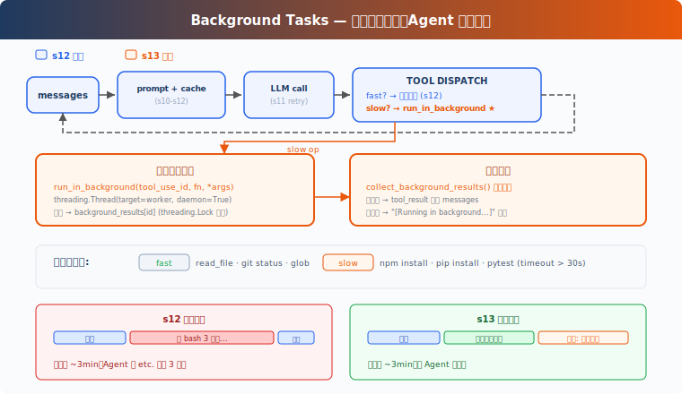

# s13: Background Tasks — 慢操作放后台

[中文](README.md) · [English](README.en.md) · [日本語](README.ja.md)

s01 → ... → s11 → s12 → `s13` → [s14](../s14_cron_scheduler/) → s15 → ... → s20

> *"慢操作丢后台, agent 继续处理"* — 后台线程跑命令, 完成后注入通知。
>
> **Harness 层**: 后台 — 异步执行, 不阻塞主循环。

---

## 问题

你用过洗衣机吗？把衣服扔进去，按下启动，然后去干别的——做饭、回消息、看论文。30 分钟后洗衣机"滴滴滴"提醒你：好了。你不会站在洗衣机前面干等 30 分钟。

Agent 的 bash 工具也一样。`pip install torch` 要 10 分钟，`npm run build` 要 3 分钟。这些命令一跑，Agent 就在等 bash 工具返回，没法利用这段时间处理别的任务。

读文件是毫秒级，不等。`git status` 一秒内返回，不等。但 `npm install`？分钟级。Agent 等 10 分钟什么都不做，而 LLM 按 token 计费，空转就是浪费。

---

## 解决方案



教学代码沿用 S12 的简化任务系统和 prompt 组装；为了聚焦后台任务，省略完整错误恢复、记忆和技能系统。唯一的变动：慢操作扔到后台线程，Agent 继续跑循环，后台完成后把通知注入到对话里。

同步 vs 后台：

| | 同步 (s12) | 后台 (s13) |
|---|---|---|
| 慢操作 | Agent 干等 | 后台线程执行 |
| Agent 空闲 | 是 | 否，继续处理 |
| 结果 | 立即返回 | 下轮注入通知 |
| 判断标准 | — | `run_in_background` 参数（模型显式请求），启发式兜底 |

---

## 工作原理

### should_run_background: 显式请求优先，启发式兜底

模型通过 bash 工具的 `run_in_background` 参数显式请求后台执行。如果模型没指定，教学版用关键词启发式兜底：

```python
def is_slow_operation(tool_name: str, tool_input: dict) -> bool:
    """Fallback heuristic: commands likely to take > 30s."""
    if tool_name != "bash":
        return False
    cmd = tool_input.get("command", "").lower()
    slow_keywords = ["install", "build", "test", "deploy", "compile",
                     "docker build", "pip install", "npm install",
                     "cargo build", "pytest", "make"]
    return any(kw in cmd for kw in slow_keywords)

def should_run_background(tool_name: str, tool_input: dict) -> bool:
    """Model explicit request takes priority; fallback to heuristic."""
    if tool_input.get("run_in_background"):
        return True
    return is_slow_operation(tool_name, tool_input)
```

CC 的 bash 工具 schema 里有 `run_in_background: boolean` 参数（`BashTool.tsx:241`）。模型自己决定哪些命令丢后台，不靠关键词猜。教学版保留启发式作为兜底，但主路径是模型显式请求。

### start_background_task: 后台执行与生命周期

把工具调用包装成 worker 函数，扔到 daemon 线程里执行。每个后台任务有唯一 ID，状态存在 `background_tasks` 字典里：

```python
_bg_counter = 0
background_tasks: dict[str, dict] = {}   # bg_id → {tool_use_id, command, status}
background_results: dict[str, str] = {}   # bg_id → output
background_lock = threading.Lock()

def start_background_task(block) -> str:
    """Run tool in a daemon thread. Returns background task ID."""
    global _bg_counter
    _bg_counter += 1
    bg_id = f"bg_{_bg_counter:04d}"

    def worker():
        result = execute_tool(block)
        with background_lock:
            background_tasks[bg_id]["status"] = "completed"
            background_results[bg_id] = result

    with background_lock:
        background_tasks[bg_id] = {
            "tool_use_id": block.id,
            "command": block.input.get("command", ""),
            "status": "running",
        }
    thread = threading.Thread(target=worker, daemon=True)
    thread.start()
    return bg_id
```

返回 `bg_id` 而不是只返回 `[Running in background...]`。`daemon=True` 确保 Agent 进程退出时线程跟着退出。教学版用内存字典追踪状态；真实 CC 有 `LocalShellTaskState`，输出重定向到文件，支持停止任务、读取后续输出等完整生命周期。

### collect_background_results: 通知收集

后台任务完成后，收集结果并格式化为 `<task_notification>` 通知：

```python
def collect_background_results() -> list[str]:
    """Collect completed results as task_notification messages."""
    with background_lock:
        ready_ids = [bid for bid, task in background_tasks.items()
                     if task["status"] == "completed"]
    notifications = []
    for bg_id in ready_ids:
        with background_lock:
            task = background_tasks.pop(bg_id)
            output = background_results.pop(bg_id, "")
        notifications.append(
            f"<task_notification>\n"
            f"  <task_id>{bg_id}</task_id>\n"
            f"  <status>completed</status>\n"
            f"  <command>{task['command']}</command>\n"
            f"  <summary>{output[:200]}</summary>\n"
            f"</task_notification>")
    return notifications
```

通知不复用原始 `tool_use_id`。原始 tool call 已经用占位 `tool_result` 回复了，后台完成是独立事件，用 `task_notification` 格式注入。这符合 Messages API 的工具配对语义：一个 `tool_use` 只对应一个 `tool_result`。

### 循环中的集成

agent_loop 里，工具执行分两条路，通知和结果合并为一条 user 消息：

```python
results = []
for block in response.content:
    if block.type != "tool_use":
        continue
    if should_run_background(block.name, block.input):
        bg_id = start_background_task(block)
        results.append({"type": "tool_result",
            "tool_use_id": block.id,
            "content": f"[Background task {bg_id} started] "
                       f"Result will be available when complete."})
    else:
        output = execute_tool(block)
        results.append({"type": "tool_result",
            "tool_use_id": block.id, "content": output})

# 通知和工具结果合入同一条 user 消息
user_content = []
bg_notifications = collect_background_results()
if bg_notifications:
    for notif in bg_notifications:
        user_content.append({"type": "text", "text": notif})
user_content.extend(results)
messages.append({"role": "user", "content": user_content})
```

慢操作先回一个带 `bg_id` 的占位 tool_result，LLM 知道这个命令还在跑，可以先做别的事。后台完成后，通知作为独立 text block 和当前轮的 tool_result 一起组成 user 消息。

教学版在 agent loop 继续运行时轮询后台结果。真实 CC 通过通知队列（`messageQueueManager.ts`）把后台完成事件送入后续 turn，不需要等工具循环。

### 合起来跑

```
Turn 1:
  LLM → bash "npm install" (run_in_background=true)
  → start_background_task → bg_0001
  → tool_result: "[Background task bg_0001 started]..."
  → LLM: "OK, I'll check later. Let me also read the config."

Turn 2:
  LLM → read_file "package.json" (fast, sync)
  → tool_result: file content
  → collect: bg_0001 done! inject <task_notification>
  → LLM sees: config file + install notification in one message
```

Agent 没干等，npm install 跑后台的时候，它去读了配置文件。

---

## 相对 s12 的变更

| 组件 | 之前 (s12) | 之后 (s13) |
|------|-----------|-----------|
| 执行模型 | 全部同步 | 慢操作后台线程 + 通知注入 |
| bash schema | `command` | `command` + `run_in_background` |
| 新函数 | — | `should_run_background`, `is_slow_operation`, `start_background_task`, `collect_background_results` |
| 新类型 | — | `background_tasks: dict`, `background_results: dict`, `background_lock: Lock` |
| 通知格式 | — | `<task_notification>`（不复用 tool_use_id） |
| 循环行为 | 工具串行执行 | 慢操作异步，快操作同步，通知每轮收集 |
| 工具 | 8 (s12) | 8（不变，执行策略变了） |

---

## 试一下

```sh
cd learn-claude-code
python s13_background_tasks/code.py
```

试试这些 prompt：

1. `Run pip list in the background and find all Python files in this directory`
2. `Run npm install (use run_in_background) and while waiting, read package.json`
3. `Create a task to setup the project, then run pip list in the background`

观察重点：慢操作有没有被送到后台？`bg_id` 是否返回？后台通知有没有以 `<task_notification>` 格式注入？

---

## 接下来

后台任务解决了"慢操作不阻塞"。但如果想定时做某件事呢？比如"每天早上 9 点跑测试"、"每 5 分钟检查一次服务器状态"。

s14 Cron Scheduler → 给 Agent 装一个闹钟。

<details>
<summary>深入 CC 源码</summary>

> 以下基于 CC 源码 `query.ts`（211, 1054-1060, 1411-1482 行）、`services/toolUseSummary/toolUseSummaryGenerator.ts`（L15 prompt 文本）、`LocalShellTask.tsx`（L24-25 常量, L59-98 看门狗逻辑）、`messageQueueManager.ts`（通知队列）、`utils/task/framework.ts`（L267 `enqueueTaskNotification`）的完整分析。

### 一、pendingToolUseSummary：Haiku 后台生成

CC 在每批工具执行完后，启动一个 Haiku side-query 生成工具使用摘要。发起代码在 `query.ts:1411-1482`，prompt 文本定义在 `services/toolUseSummary/toolUseSummaryGenerator.ts:15`（变量名 `TOOL_USE_SUMMARY_SYSTEM_PROMPT`）。提示是 "Write a short summary label... think git-commit-subject, not sentence"，过去时态，约 30 字符。

Haiku 摘要（~1s）在主模型流式生成（5-30s）期间完成。下一轮开始前，把摘要 yield 出去。SDK 消费这些摘要做移动端进度展示。

### 二、线程模型：没有真正的线程

CC 运行在 Node.js/Bun 单线程事件循环中。"后台"只是 "不 await"。`ShellCommand.background(taskId)` 把 stdout/stderr 重定向到文件，让进程独立运行。

### 三、七种后台任务类型

CC 定义了 7 种后台任务（`Task.ts:7-13`）：`local_bash`、`local_agent`、`remote_agent`、`in_process_teammate`、`local_workflow`、`monitor_mcp`、`dream`。每种有自己的注册、生命周期和通知机制。

### 四、通知注入：命令队列

后台任务完成后通过 `enqueueTaskNotification`（`utils/task/framework.ts:267`）或 `enqueuePendingNotification`（`messageQueueManager.ts`）入队到共享命令队列。通知格式是结构化的 XML：

```xml
<task_notification>
  <status>completed</status>
  <summary>Background command "npm test" completed (exit code 0)</summary>
</task_notification>
```

优先级分 `next` > `later`（`messageQueueManager.ts`）。后台任务默认 `later`（不阻塞用户输入）。消费点在 `query.ts:1566-1593`。

### 五、停滞看门狗

后台 bash 任务有一个看门狗（`LocalShellTask.tsx` L24-25 常量, L59-98 逻辑），定期检查输出是否停滞，45 秒无增长后检测交互式提示（`(y/n)` 等），防止后台任务卡在无人响应的交互式对话框。

### 六、并发限制

前台工具调用：`CLAUDE_CODE_MAX_TOOL_USE_CONCURRENCY`（默认 10 个并发安全工具）。后台 bash 任务：没有硬性限制，它们是独立的子进程。

</details>

<!-- translation-sync: zh@v1, en@v1, ja@v1 -->
