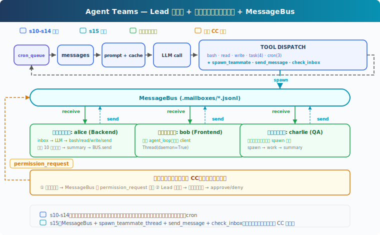
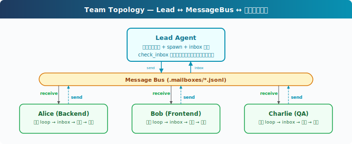

# s15: Agent Teams — 一人では無理、チームを組もう

[中文](README.md) · [English](README.en.md) · [日本語](README.ja.md)

s01 → ... → s13 → s14 → `s15` → [s16](../s16_team_protocols/) → s17 → s18 → s19 → s20
> *"一人では無理、チームを組もう"* — ファイル受信箱 + チームメイトスレッド。
>
> **Harness 層**: チーム — マルチ Agent 協調、メッセージバス。

---

## 課題

「バックエンド全体をリファクタリング」は認証モジュール、データベース層、API ルート、テストに及ぶ。一つの Agent が API ルートを修正中、認証モジュールの詳細はコンテキストから外れている。コンテキストウィンドウには限界があり、単一 Agent の注意は全モジュールをカバーできない。

s06 のサブ Agent は臨時スタッフ、一つの仕事を終えたら去る。だが、通信でき、協力できるチームメイトが必要なタスクもある。

---

## ソリューション



教学版は S14 の能力（プロンプト組み立て、タスクシステム、バックグラウンド実行、cron スケジューリング）を踏襲。チーム機構に集中するため、完全なエラーリカバリ、メモリ、スキルシステムは省略。追加：**MessageBus**（ファイル受信箱）、**spawn_teammate_thread**（チームメイトスレッド起動）、**inbox 注入**（Lead がチームメイトメッセージを受信し history に注入）。

サブ Agent vs チームメイト：

| | s06 サブ Agent | s15 チームメイト |
|---|---|---|
| ライフサイクル | 一回きり、終了後に破棄 | マルチターン（教学版は 10 ラウンド制限、真实 CC は idle loop） |
| 通信 | 結果のみ返却 | 非同期受信箱、いつでも通信可能 |
| コンテキスト | 完全に隔離 | メッセージで情報共有 |
| 数 | メイン Agent + たまにサブ Agent | 1 Lead + 複数チームメイト |

---

## 仕組み



### MessageBus: ファイル受信箱

各 Agent（Lead とチームメイトを含む）には `.jsonl` 受信箱がある。メッセージ送信 = 相手のファイルに 1 行 JSON を append。メッセージ読み取り = ファイル読み込み + 削除（消費式）：

```python
class MessageBus:
    def send(self, from_agent: str, to_agent: str,
             content: str, msg_type: str = "message"):
        msg = {"from": from_agent, "to": to_agent,
               "content": content, "type": msg_type,
               "ts": time.time()}
        inbox = MAILBOX_DIR / f"{to_agent}.jsonl"
        with open(inbox, "a") as f:
            f.write(json.dumps(msg) + "\n")

    def read_inbox(self, agent: str) -> list[dict]:
        inbox = MAILBOX_DIR / f"{agent}.jsonl"
        if not inbox.exists():
            return []
        msgs = [json.loads(line) for line in inbox.read_text().splitlines()]
        inbox.unlink()  # 消費式：読んだら削除
        return msgs
```

なぜファイルか、メモリキューではなく？教学版がファイルを選ぶ理由は、直感的でスレッドをまたいで観察可能だから。真实 CC もファイル受信箱（`~/.claude/teams/{team}/inboxes/`）を使うが、`proper-lockfile` で並行書き込みの安全性を確保。教学版の `read_inbox` には read + unlink の競合状態があり、マルチスレッド同時読みでメッセージを損失する可能性があるが、教学目的には許容範囲。

### spawn_teammate_thread: チームメイト起動

Lead が `spawn_teammate` ツールを呼び出してチームメイトを起動。チームメイトは独自の daemon スレッドで動作、独自の system prompt、messages、簡易ツールセットを持つ：

```python
def spawn_teammate_thread(name: str, role: str, prompt: str) -> str:
    system = f"You are '{name}', a {role}. Use tools to complete tasks."

    def run():
        messages = [{"role": "user", "content": prompt}]
        sub_tools = [bash, read_file, write_file, send_message]
        for _ in range(10):           # 最大 10 ラウンド
            inbox = BUS.read_inbox(name)
            if inbox:
                messages.append({"role": "user",
                    "content": f"<inbox>{json.dumps(inbox)}</inbox>"})
            response = client.messages.create(
                model=MODEL, system=system, messages=messages[-20:],
                tools=sub_tools, max_tokens=8000)
            # ... ツール実行、結果処理
        # 完了後 summary を Lead に送信
        BUS.send(name, "lead", summary, "result")

    threading.Thread(target=run, daemon=True).start()
```

重要な設計：
- **チームメイトの簡易ツールセット**：bash、read、write、send_message。教学版は通信機構に集中するためタスクと cron を省略。真实 CC のチームメイトには TaskCreate、TaskUpdate 等のツールもあり、タスクシステムはチーム全体で共有
- **教学版は 10 ラウンド制限**：無限ループを防止。真实 CC は idle loop：1 ラウンド終了後に `idle_notification` を送信、inbox メッセージを待機、到着後に再開、`shutdown_request` でのみ終了
- **完了時自動報告**：`BUS.send(name, "lead", summary)` で最終結果を Lead の受信箱に送信

### Lead の inbox 注入

Lead はメインループの各反復後に受信箱を確認。チームメイトからのメッセージを history に注入し、LLM が確認して反応できるようにする：

```python
# メインループ反復後
inbox = BUS.read_inbox("lead")
if inbox:
    inbox_text = "\n".join(
        f"From {m['from']}: {m['content'][:200]}" for m in inbox)
    history.append({"role": "user",
                    "content": f"[Inbox]\n{inbox_text}"})
```

教学版はユーザー入力ループ内で注入。真实 CC はより精密、Lead の `useInboxPoller` が毎秒チェックし、ユーザー入力を待たずにメッセージを新しい turn として送信。

### 権限バブリング

教学版は権限バブリングを省略。真实 CC のフロー（`permissionSync.ts`、`useSwarmPermissionPoller.ts`）：

1. チームメイトが承認が必要な操作に遭遇 → `permission_request` を Lead の受信箱に送信
2. Lead の `useInboxPoller` がリクエストを検出 → 承認キューにルーティング
3. ユーザーが承認 → Lead が `permission_response` をチームメイトに返信
4. チームメイトの `useSwarmPermissionPoller`（500ms ごとにポーリング）が返信を受信 → 続行または拒否

### 組み合わせて実行

```
1. Lead: "バックエンド構築：一人では無理、チームを組もう"
2. Lead → spawn_teammate("alice", "backend dev", "データベーススキーマを作成")
3. Lead → spawn_teammate("bob", "frontend dev", "API クライアントを作成")
4. alice スレッド起動 → 独自の LLM 呼び出し → bash "python manage.py migrate"
5. bob スレッド起動 → 独自の LLM 呼び出し → write_file("client.ts", ...)
6. alice 完了 → BUS.send("alice", "lead", "Schema done: users, orders tables")
7. bob 完了 → BUS.send("bob", "lead", "Client written with types")
8. Lead 次回反復 → inbox を history に注入 → LLM が alice と bob の結果を確認
```

2 人のチームメイトが並行作業。

---

## s14 からの変更

| コンポーネント | 変更前 (s14) | 変更後 (s15) |
|--------------|------------|------------|
| Agent 数 | 1 | 1 Lead + N チームメイトスレッド |
| 通信 | なし | MessageBus + .mailboxes/*.jsonl |
| 新規クラス | — | MessageBus, active_teammates dict |
| 新規関数 | — | spawn_teammate_thread, run_send_message, run_check_inbox |
| Lead ツール | 11 (s14) | + spawn_teammate, send_message, check_inbox (14) |
| チームメイトツール | — | bash, read_file, write_file, send_message (4) |
| 権限 | ローカル判断 | 教学版は省略（真实 CC はバブリング機構あり） |

---

## 試してみる

```sh
cd learn-claude-code
python s15_agent_teams/code.py
```

以下のプロンプトを試してください：

1. `Spawn alice as a backend developer. Ask her to create a file called schema.sql with a users table.`
2. `Check your inbox for alice's result.`
3. `Spawn bob as a tester. Ask him to check if schema.sql exists and list its contents.`

観察ポイント：Lead はチームメイトをどう起動するか？`.mailboxes/` ディレクトリの JSONL ファイルの中身は？チームメイト完了後、Lead の inbox は history に注入されているか？

---

## 次の章

チームメイトは仕事をし、通信できる。しかし、Lead が Alice にシャットダウンを頼む場合、スレッドを強制終了すると書きかけのファイルが残る。丁寧なシャットダウンプロトコルが必要：Lead が shutdown_request を送信、チームメイトは收尾後に終了。

s16 Team Protocols → シャットダウンハンドシェイクとメッセージの取り決め。

<details>
<summary>CC ソースコード深掘り</summary>

> 以下は CC ソースコード `spawnMultiAgent.ts`、`useInboxPoller.ts`（969 行）、`useSwarmPermissionPoller.ts`（330 行）、`teammateMailbox.ts`、`teamHelpers.ts` の完全分析に基づく。

### 一、中央メッセージバスはない、ファイルシステム

教学版は `MessageBus` クラスでメッセージを送受信。真实 CC はもっと直接的、各 Agent が他の Agent の受信箱ファイルに直接書き込む。

受信箱パス：`~/.claude/teams/{teamName}/inboxes/{agentName}.json`

書き込み時は `proper-lockfile` で並行安全性を確保（最大 10 回リトライ）。各ファイルは JSON 配列、append 時に読み取り→追加→書き戻し。

### 二、15 種のメッセージ型

CC のチーム通信には 15 種の構造化メッセージ（`teammateMailbox.ts`）がある：

| 型 | 方向 | 用途 |
|------|------|------|
| `plain text` | 双方向 | 通常のチームメイト間通信 |
| `idle_notification` | チームメイト→Lead | チームメイトが 1 ターン完了、アイドル状態に |
| `permission_request` | チームメイト→Lead | 操作承認が必要 |
| `permission_response` | Lead→チームメイト | Lead の承認結果 |
| `plan_approval_request` | チームメイト→Lead | 計画提出、審査待ち |
| `plan_approval_response` | Lead→チームメイト | Lead の計画審査 |
| `shutdown_request` | Lead→チームメイト | 丁寧なシャットダウン要求 |
| `shutdown_approved` | チームメイト→Lead | シャットダウン確認 |
| `shutdown_rejected` | チームメイト→Lead | シャットダウン拒否（理由付き） |
| `task_assignment` | Lead→チームメイト | タスク割り当て |
| `team_permission_update` | Lead→チームメイト | 権限変更のブロードキャスト |
| `mode_set_request` | Lead→チームメイト | チームメイトの権限モード変更 |
| `sandbox_permission_*` | 双方向 | ネットワーク権限リクエスト/返信 |
| `teammate_terminated` | システム | チームメイト削除通知 |

テキストメッセージは `<teammate-message>` XML タグでラップされモデルに配信。

### 三、権限バブリング：双方向ポーリング

教学版は権限バブリングを省略。真实 CC のフロー（`permissionSync.ts`）：

1. **チームメイト**が承認が必要な操作に遭遇 → `permission_request` を Lead の受信箱に送信
2. **Lead** の `useInboxPoller`（1 秒ごとにポーリング）がリクエストを検出 → `ToolUseConfirmQueue` にルーティング
3. Lead の UI にチームメイト名と色付きの承認ダイアログを表示
4. ユーザー承認後 → Lead が `permission_response` をチームメイトの受信箱に返信
5. **チームメイト**の `useSwarmPermissionPoller`（500ms ごとにポーリング）が返信を受信 → 続行または拒否

### 四、チームメイトライフサイクル

CC のチームメイトは `spawnTeammate()`（`spawnMultiAgent.ts`）で作成：

1. **Spawn**：tmux ペイン（またはプロセス内）を作成、色を割り当て、team config に書き込み
2. **Work**：`useInboxPoller` が毎秒受信箱をチェック → メッセージ到着時に新しい turn として送信
3. **Idle**：Stop hook 発火 → `idle_notification` を Lead に送信
4. **Shutdown**：Lead が `shutdown_request` を送信 → チームメイトが `shutdown_approved` で返信 → Lead がクリーンアップ

### 五、Team Config

チーム登録は `~/.claude/teams/{teamName}/config.json`（`teamHelpers.ts`）：

```json
{
  "name": "my-team",
  "leadAgentId": "lead@my-team",
  "members": [{
    "agentId": "researcher@my-team",
    "name": "researcher",
    "agentType": "general-purpose",
    "color": "blue",
    "isActive": true
  }]
}
```

チームメイトのネストは禁止（`AgentTool.tsx:273` で "teammates spawning other teammates" を明示的に禁止）。

</details>

<!-- translation-sync: zh@v1, en@v1, ja@v1 -->
