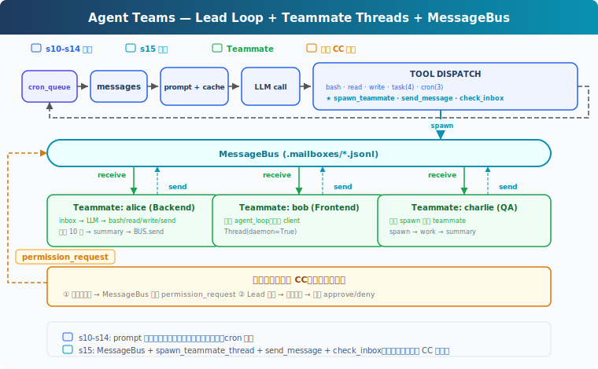

# s15: Agent Teams — 一个搞不定，组队来

[中文](README.md) · [English](README.en.md) · [日本語](README.ja.md)

s01 → ... → s13 → s14 → `s15` → [s16](../s16_team_protocols/) → s17 → s18 → s19 → s20
> *"一个搞不定, 组队来"* — 文件收件箱 + 队友线程。
>
> **Harness 层**: 团队 — 多 Agent 协作, 消息总线。

---

## 问题

"重构整个后端"涉及认证模块、数据库层、API 路由、测试。一个 Agent 在修 API 路由时，认证模块的细节已经不在上下文里了。上下文窗口就那么大，单个 Agent 的注意力覆盖不了所有模块。

s06 的子 Agent 是临时工，叫来干一件事就走了。但有些任务需要能通信、能协作的队友。

---

## 解决方案



教学代码沿用 S14 的能力（prompt 组装、任务系统、后台执行、cron 调度）。为了聚焦团队机制，省略了完整错误恢复、记忆和技能系统。新增三样：**MessageBus**（文件收件箱）、**spawn_teammate_thread**（启动队友线程）、**inbox 注入**（Lead 接收队友消息并注入 history）。

子 Agent vs 队友：

| | s06 子 Agent | s15 队友 |
|---|---|---|
| 生命周期 | 一次性，用完销毁 | 多轮（教学版限 10 轮，真实 CC 用 idle loop） |
| 通信 | 只回传结论 | 异步收件箱，随时通信 |
| 上下文 | 完全隔离 | 通过消息共享信息 |
| 数量 | 一个主 Agent + 偶尔子 Agent | 一个 Lead + 多个队友 |

---

## 工作原理


### MessageBus: 文件收件箱

每个 Agent（包括 Lead 和队友）有一个 `.jsonl` 邮箱。发消息 = 往对方的文件里 append 一行 JSON。读消息 = 读文件 + 删除（消费式）：

```python
class MessageBus:
    def send(self, from_agent: str, to_agent: str,
             content: str, msg_type: str = "message"):
        msg = {"from": from_agent, "to": to_agent,
               "content": content, "type": msg_type,
               "ts": time.time()}
        inbox = MAILBOX_DIR / f"{to_agent}.jsonl"
        with open(inbox, "a") as f:
            f.write(json.dumps(msg) + "\n")

    def read_inbox(self, agent: str) -> list[dict]:
        inbox = MAILBOX_DIR / f"{agent}.jsonl"
        if not inbox.exists():
            return []
        msgs = [json.loads(line) for line in inbox.read_text().splitlines()]
        inbox.unlink()  # 消费式：读完删除
        return msgs
```

为什么用文件而不是内存队列？教学版选文件是因为直观、跨线程可观察。真实 CC 也用文件收件箱（`~/.claude/teams/{team}/inboxes/`），但加了 `proper-lockfile` 防并发写冲突。教学版的 `read_inbox` 有 read + unlink 竞态，多线程同时读可能丢消息，对教学场景可以接受。

### spawn_teammate_thread: 启动队友

Lead 调用 `spawn_teammate` 工具启动一个队友。队友跑在自己的 daemon 线程里，有自己的 system prompt、自己的 messages、自己的简化工具集：

```python
def spawn_teammate_thread(name: str, role: str, prompt: str) -> str:
    system = f"You are '{name}', a {role}. Use tools to complete tasks."

    def run():
        messages = [{"role": "user", "content": prompt}]
        sub_tools = [bash, read_file, write_file, send_message]
        for _ in range(10):           # 最多 10 轮
            inbox = BUS.read_inbox(name)
            if inbox:
                messages.append({"role": "user",
                    "content": f"<inbox>{json.dumps(inbox)}</inbox>"})
            response = client.messages.create(
                model=MODEL, system=system, messages=messages[-20:],
                tools=sub_tools, max_tokens=8000)
            # ... 执行工具、处理结果
        # 完成后发 summary 给 Lead
        BUS.send(name, "lead", summary, "result")

    threading.Thread(target=run, daemon=True).start()
```

关键设计：
- **队友有简化工具集**：bash、read、write、send_message。教学版省略了任务和 cron，聚焦通信机制。真实 CC 的队友也有 TaskCreate、TaskUpdate 等工具，任务系统是团队共享的
- **教学版限 10 轮**：防止队友无限循环。真实 CC 用 idle loop：跑完一轮后发 `idle_notification`，等 inbox 消息，收到后继续，直到 `shutdown_request` 才退出
- **完成后自动汇报**：`BUS.send(name, "lead", summary)` 把最终结果发到 Lead 的收件箱

### Lead 的 inbox 注入

Lead 在每轮主循环结束后检查收件箱。队友发来的消息注入到 history 里，让 LLM 能看到并做出反应：

```python
# 主循环结束后
inbox = BUS.read_inbox("lead")
if inbox:
    inbox_text = "\n".join(
        f"From {m['from']}: {m['content'][:200]}" for m in inbox)
    history.append({"role": "user",
                    "content": f"[Inbox]\n{inbox_text}"})
```

教学版在用户输入循环外注入。CC 更精细，Lead 的 `useInboxPoller` 每 1 秒检查一次，有消息就提交为新的 turn，不需要等用户输入。

### 权限冒泡

教学版省略了权限冒泡。真实 CC 的流程（`permissionSync.ts`、`useSwarmPermissionPoller.ts`）：

1. 队友遇到需要审批的操作 → 发 `permission_request` 到 Lead 收件箱
2. Lead 的 `useInboxPoller` 检测到请求 → 路由到审批队列
3. 用户审批后 → Lead 发 `permission_response` 回队友
4. 队友的 `useSwarmPermissionPoller`（每 500ms 轮询）收到回复 → 继续或拒绝

### 合起来跑

```
1. Lead: "搭建后端：一个人搞不定，组队吧"
2. Lead → spawn_teammate("alice", "backend dev", "创建数据库 schema")
3. Lead → spawn_teammate("bob", "frontend dev", "写 API 客户端")
4. alice 线程启动 → 自己的 LLM 调用 → bash "python manage.py migrate"
5. bob 线程启动 → 自己的 LLM 调用 → write_file("client.ts", ...)
6. alice 完成 → BUS.send("alice", "lead", "Schema done: users, orders tables")
7. bob 完成 → BUS.send("bob", "lead", "Client written with types")
8. Lead 下次循环 → inbox 注入 history → LLM 看到 alice 和 bob 的结果
```

两个队友并行工作。

---

## 相对 s14 的变更

| 组件 | 之前 (s14) | 之后 (s15) |
|------|-----------|-----------|
| Agent 数量 | 1 | 1 Lead + N 队友线程 |
| 通信 | 无 | MessageBus + .mailboxes/*.jsonl |
| 新类 | — | MessageBus, active_teammates dict |
| 新函数 | — | spawn_teammate_thread, run_send_message, run_check_inbox |
| Lead 工具 | 11 (s14) | + spawn_teammate, send_message, check_inbox (14) |
| 队友工具 | — | bash, read_file, write_file, send_message (4) |
| 权限 | 本地决策 | 教学版省略（真实 CC 有冒泡机制） |

---

## 试一下

```sh
cd learn-claude-code
python s15_agent_teams/code.py
```

试试这些 prompt：

1. `Spawn alice as a backend developer. Ask her to create a file called schema.sql with a users table.`
2. `Check your inbox for alice's result.`
3. `Spawn bob as a tester. Ask him to check if schema.sql exists and list its contents.`

观察重点：Lead 如何启动队友？`.mailboxes/` 目录下的 JSONL 文件长什么样？队友完成后 Lead 的 inbox 有没有注入到 history？

---

## 接下来

队友能干活、能通信。但如果 Lead 想让 Alice 关机，直接杀线程会留下写到一半的文件。需要一个体面的关机协议：Lead 发 shutdown_request，队友收尾后退出。

s16 Team Protocols → 关机握手与消息约定。

<details>
<summary>深入 CC 源码</summary>

> 以下基于 CC 源码 `spawnMultiAgent.ts`、`useInboxPoller.ts`（969 行）、`useSwarmPermissionPoller.ts`（330 行）、`teammateMailbox.ts`、`teamHelpers.ts` 的完整分析。

### 一、没有中央消息总线，是文件系统

教学版用 `MessageBus` 类收发消息。CC 的做法更直接，每个 Agent 直接写其他 Agent 的收件箱文件。

收件箱路径：`~/.claude/teams/{teamName}/inboxes/{agentName}.json`

写入时用 `proper-lockfile` 文件锁保证并发安全（最多重试 10 次）。每个文件是一个 JSON 数组，append 新消息时读→追加→写回。

### 二、15 种消息类型

CC 的团队通信有 15 种结构化消息（`teammateMailbox.ts`）：

| 类型 | 方向 | 用途 |
|------|------|------|
| `plain text` | 双向 | 普通队友间通信 |
| `idle_notification` | 队友→Lead | 队友完成一轮工作，进入空闲 |
| `permission_request` | 队友→Lead | 队友需要操作审批 |
| `permission_response` | Lead→队友 | Lead 审批结果 |
| `plan_approval_request` | 队友→Lead | 队友提交计划待审 |
| `plan_approval_response` | Lead→队友 | Lead 审批计划 |
| `shutdown_request` | Lead→队友 | 请求体面关机 |
| `shutdown_approved` | 队友→Lead | 确认关机 |
| `shutdown_rejected` | 队友→Lead | 拒绝关机（附原因） |
| `task_assignment` | Lead→队友 | 分配任务 |
| `team_permission_update` | Lead→队友 | 广播权限变更 |
| `mode_set_request` | Lead→队友 | 修改队友的权限模式 |
| `sandbox_permission_*` | 双向 | 网络权限请求/回复 |
| `teammate_terminated` | 系统 | 队友被移除通知 |

文本消息被包装在 `<teammate-message>` XML 标签中交付给模型。

### 三、权限冒泡：双向轮询

教学版省略了权限冒泡。CC 的实际流程（`permissionSync.ts`）：

1. **队友**遇到需要审批的操作 → 发 `permission_request` 到 Lead 的收件箱
2. **Lead** 的 `useInboxPoller`（每 1 秒轮询）检测到请求 → 路由到 `ToolUseConfirmQueue`
3. Lead 的 UI 显示审批对话框，带队友名字和颜色
4. 用户审批后 → Lead 发 `permission_response` 回队友的收件箱
5. **队友**的 `useSwarmPermissionPoller`（每 500ms 轮询）收到回复 → 继续或拒绝执行

### 四、队友生命周期

CC 的队友由 `spawnTeammate()`（`spawnMultiAgent.ts`）创建：

1. **Spawn**：创建 tmux 窗格（或进程内），分配颜色，写入 team config
2. **Work**：`useInboxPoller` 每 1 秒检查收件箱 → 有消息就提交为新的 turn
3. **Idle**：Stop hook 触发 → 发 `idle_notification` 给 Lead
4. **Shutdown**：Lead 发 `shutdown_request` → 队友回复 `shutdown_approved` → Lead 清理

### 五、Team Config

团队注册表在 `~/.claude/teams/{teamName}/config.json`（`teamHelpers.ts`）：

```json
{
  "name": "my-team",
  "leadAgentId": "lead@my-team",
  "members": [{
    "agentId": "researcher@my-team",
    "name": "researcher",
    "agentType": "general-purpose",
    "color": "blue",
    "isActive": true
  }]
}
```

队友之间不能嵌套（`AgentTool.tsx:273` 明确禁止 "teammates spawning other teammates"）。

</details>

<!-- translation-sync: zh@v1, en@v1, ja@v1 -->
