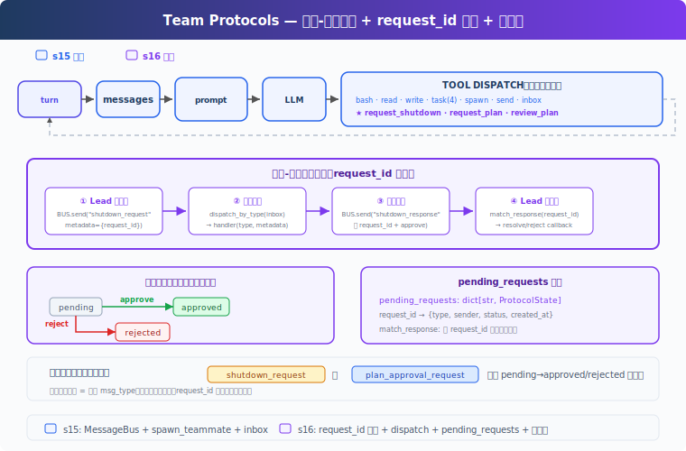

# s16: Team Protocols — 队友之间要有约定

[中文](README.md) · [English](README.en.md) · [日本語](README.ja.md)

s01 → ... → s14 → s15 → `s16` → [s17](../s17_autonomous_agents/) → s18 → s19 → s20
> *"队友之间要有约定"* — request-response 模式驱动协商。
>
> **Harness 层**: 协议 — Agent 之间的结构化握手。

---

## 问题

s15 的队友能干活了，但协调是松散的：Lead 发消息，队友回复，没有结构化的协议。两个场景暴露了问题：

**关机**：Lead 想让 Alice 关机。直接杀线程，Alice 写了一半的文件留在磁盘上。需要握手：Lead 发请求，Alice 确认收尾后关机。

**计划审批**：Bob 想重构认证模块，属于高风险操作。应该先让 Lead 看 Bob 的计划，审批通过后再动手。

这两个场景结构完全一样：一方发请求，另一方给回复，请求和回复通过同一个 ID 关联。有状态机追踪：pending → approved / rejected。

---

## 解决方案



教学代码承接前面章节的 Agent 能力脉络，在 S15 团队通信基础上加入结构化协议。为了聚焦协议机制，省略了完整错误恢复、记忆和技能系统。新增三样：**ProtocolState**（请求状态追踪）、**dispatch_message**（按消息类型路由到处理器）、**match_response**（通过 request_id 关联回复与请求，含类型校验）。

两种协议，一套机制：

| 协议 | 方向 | 用途 |
|------|------|------|
| shutdown_request / response | Lead → 队友 | 体面关机握手 |
| plan_approval_request / response | 队友 → Lead | 计划审批协议示例 |

> 教学版演示了计划审批的请求-响应消息流程，没有实现执行门控（未 approved 时拦截 bash/write_file）。真实 CC 的队友有 permission gating 机制。

---

## 工作原理

### ProtocolState: 请求状态

每个协议请求创建一条状态记录，记录谁发的、发给谁、当前状态、附带内容：

```python
@dataclass
class ProtocolState:
    request_id: str      # 唯一 ID，如 "req_004281"
    type: str            # "shutdown" | "plan_approval"
    sender: str          # 发起方
    target: str          # 接收方
    status: str          # pending | approved | rejected
    payload: str         # 计划文本或关机原因
    created_at: float    # 时间戳

pending_requests: dict[str, ProtocolState] = {}
```

发请求时创建记录，收回复时通过 `request_id` 找到对应记录，更新状态。

### 四步协议流程

以关机为例，完整链路：

```
① Lead 发请求
   req_id = new_request_id()           # "req_004281"
   pending_requests[req_id] = ProtocolState(type="shutdown", status="pending", ...)
   BUS.send("lead", "alice", "shutdown_request", metadata={"request_id": req_id})

② 队友收到 → dispatch
   inbox = BUS.read_inbox("alice")
   msg_type = msg["type"]              # "shutdown_request"
   → 路由到 handle_shutdown_request()

③ 队友回复
   BUS.send("alice", "lead", "shutdown_response",
            metadata={"request_id": req_id, "approve": True})

④ Lead 收响应 → match
   match_response("shutdown_response", req_id, approve=True)
   pending_requests[req_id].status = "approved"
```

`request_id` 是贯穿全链路的关联键，请求带着它出去，回复带着它回来。

> 教学版用 `shutdown_response` 统一命名（approve 字段区分同意/拒绝）。真实源码拆成 `shutdown_approved` 和 `shutdown_rejected` 两种独立消息类型（`teammateMailbox.ts:720-763`）。

### dispatch_message: 按类型路由

队友的 inbox 不只收普通消息，还收协议消息。`handle_inbox_message` 按消息类型分发：

```python
def handle_inbox_message(name, msg, messages):
    msg_type = msg.get("type", "message")
    req_id = msg.get("metadata", {}).get("request_id", "")

    if msg_type == "shutdown_request":
        BUS.send(name, "lead", "Shutting down.", "shutdown_response",
                 {"request_id": req_id, "approve": True})
        return True   # 停止循环

    if msg_type == "plan_approval_response":
        approve = msg["metadata"].get("approve", False)
        messages.append({"role": "user",
            "content": "[Plan approved]" if approve else "[Plan rejected]"})
    return False       # 继续循环
```

新增协议类型只需加新的 `if` 分支。

### match_response: 类型校验

`match_response` 不只按 `request_id` 找状态，还会校验响应类型是否匹配请求类型：

```python
def match_response(response_type, request_id, approve):
    state = pending_requests.get(request_id)
    if not state:
        return
    if state.type == "shutdown" and response_type != "shutdown_response":
        return  # type mismatch, skip
    if state.type == "plan_approval" and response_type != "plan_approval_response":
        return
    if state.status != "pending":
        return  # already resolved, skip duplicate
    state.status = "approved" if approve else "rejected"
```

一个 shutdown_response 不会意外 approve 一个 plan_approval 请求。

### 统一 inbox 消费：consume_lead_inbox

`check_inbox` 工具和主循环末尾都调用同一个 `consume_lead_inbox()` 函数，先路由协议消息再返回剩余内容，避免消息被读走但协议状态没更新：

```python
def consume_lead_inbox(route_protocol=True) -> list[dict]:
    msgs = BUS.read_inbox("lead")
    if route_protocol:
        for msg in msgs:
            meta = msg.get("metadata", {})
            req_id = meta.get("request_id", "")
            msg_type = msg.get("type", "")
            if req_id and msg_type.endswith("_response"):
                match_response(msg_type, req_id, meta.get("approve", False))
    return msgs
```

主循环末尾还会把 inbox 消息注入到 `history`，让 LLM 能看到并做出反应。

### 队友 idle loop：等待而不是退出

s15 的队友跑完 10 轮就退出。s16 的队友在 LLM 返回非 tool_use 后进入 idle 等待：轮询 inbox，收到 shutdown_request 就响应退出，收到新消息就继续工作。

```
LLM 返回非 tool_use
  → idle: 每秒轮询 inbox
  → 收到 shutdown_request → 回复 shutdown_response → 退出
  → 收到新消息 → 注入 messages → 继续 LLM turn
```

教学版省略了 idle_notification 给 Lead 的通知。真实 CC 在 idle 时发 `idle_notification`，Lead 收到后知道队友空闲，可以分配新任务。

### 合起来跑

```
1. Lead: "让 Alice 创建一个文件，然后关机"
2. Lead → spawn_teammate("alice", "backend", "创建 config.py")
3. alice 线程启动 → write_file("config.py", "...") → 完成 → idle
4. Lead → request_shutdown("alice")
   → BUS.send("shutdown_request", {request_id: "req_000142"})
5. alice idle 轮询收到 → handle_shutdown_request
   → BUS.send("shutdown_response", {request_id: "req_000142", approve: True})
6. Lead consume_lead_inbox → match_response("req_000142", approve=True)
   → pending_requests["req_000142"].status = "approved"
   → inbox 消息注入 history，LLM 看到关机结果
```

关机握手完整：请求 → 确认 → 关机。每一步有 `request_id` 追溯。

---

## 相对 s15 的变更

| 组件 | 之前 (s15) | 之后 (s16) |
|------|-----------|-----------|
| 协调方式 | 松散文本消息 | 结构化请求-响应协议 |
| 请求追踪 | 无 | ProtocolState + pending_requests dict |
| 消息路由 | 全部当文本处理 | dispatch_message 按类型分发 |
| 关机 | 自然退出或杀线程 | request_id 握手机制 |
| 计划审批 | 无 | 消息流程示例（未实现执行门控） |
| 新消息类型 | message, result | + shutdown_request/response, plan_approval_request/response |
| 队友生命周期 | 最多 10 轮 | idle loop（等待 inbox 消息） |
| Lead inbox | check_inbox 和主循环分别读 | 统一 consume_lead_inbox |
| Lead 工具 | 14 (s15) | 14（核心工具集加入 request_shutdown, request_plan, review_plan） |
| 队友工具 | 4 (s15) | + submit_plan (5) |

---

## 试一下

```sh
cd learn-claude-code
python s16_team_protocols/code.py
```

试试这些 prompt：

1. `Spawn alice as a backend dev. Ask her to create a file. Then request her shutdown.`
2. `Spawn bob with a refactoring task. Have him submit a plan first. Then review and approve it.`

观察重点：关机握手是否完整（请求 → 确认 → 关机）？`pending_requests` 的状态是否正确转换？`request_id` 是否在请求和响应之间保持一致？队友 idle 后是否能收到 shutdown_request？

---

## 接下来

s15-s16 中，Lead 必须给每个队友分配任务。"Alice 做这个，Bob 做那个"。任务看板上有 10 个未认领的任务，Lead 得手动 assign。

能不能让队友自己看板、自己认领？Lead 只需要创建任务，队友自己发现、自己认领、自己完成。

s17 Autonomous Agents → 队友自组织，不需要领导分配。

<details>
<summary>深入 CC 源码</summary>

CC 的团队协议实现（`teammateMailbox.ts`，1184 行）和教学版在核心结构上一致：request_id + approve/reject 的请求-响应模式。差异在于：

**关机协议**：CC 的 shutdown 是三向通信（`teammateMailbox.ts:720-763`、`SendMessageTool.ts:268-430`）。Lead 发 `shutdown_request`，队友回复 `shutdown_approved`（或 `shutdown_rejected` 附原因），系统发送 `teammate_terminated` 通知所有相关方。关机确认后系统自动清理 pane（tmux/iTerm2）、unassign 任务、从 team config 移除成员（`useInboxPoller.ts:677-800`）。教学版用 `shutdown_response` 统一命名，真实源码拆成 approved/rejected 两种独立消息。

**计划审批**：真实源码里 plan approval request 由 `ExitPlanModeV2Tool.ts:263-312` 在 plan-mode-required 队友退出 plan mode 时产生。`useInboxPoller.ts:599-661` 当前会自动回写 approval，并把请求交给 Lead 作为上下文（regular message）。`SendMessageTool.ts:434-518` 仍保留显式 approve/reject response 能力，审批时可同时设置 `permissionMode`（如"批准但以 plan mode 运行"），响应中可包含 `feedback` 字符串供队友修正后重新提交。不是简单的"Lead 手动 review_plan 工具"流程。

**消息格式**：CC 的协议消息是结构化的 JSON（有 Zod schema 验证），教学版用简单的 type + metadata 字典。字段名也不统一：permission 用 `request_id`（`teammateMailbox.ts:453-462`），shutdown 和 plan approval 用 `requestId`（`teammateMailbox.ts:684-763`）。

**执行门控**：CC 的队友有完整的 permission gating。未获批准的高风险操作会被拦截，不是可选的。教学版只演示了消息流程，没有实现执行拦截。

**通用性**：教学版的一个 FSM（pending → approved | rejected）对应两种协议，这个简化完全正确。CC 的所有协议消息共用同一个 request id 关联机制。

</details>

<!-- translation-sync: zh@v1, en@v1, ja@v1 -->
