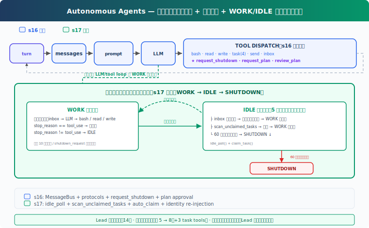

# s17: Autonomous Agents — ボードを見て、自分で認領

[中文](README.md) · [English](README.en.md) · [日本語](README.ja.md)

s01 → ... → s15 → s16 → `s17` → [s18](../s18_worktree_isolation/) → s19 → s20

> *"ボードを見て、自分で認領"* — 空き時にポーリング、仕事があれば開始。
>
> **Harness 層**: 自治 — チームメイトが自己組織化、リーダーの割り当て不要。

---

## 課題

s16 のチームメイトは通信でき、シャットダウンハンドシェイクもできる。しかし各チームメイトは Lead がタスクを割り当てるのを待つ——ボードに 10 個の未認領タスクがあれば、Lead は 10 回手動で assign しなければならない。これはスケールしない。チームメイトは自分でタスクボードを見て、未認領のタスクを見つけて認領し、終わったら次を探すべき。

---

## ソリューション



S16 の教学版 MessageBus とプロトコルツールを踏襲。本章の追加：**idle_poll**（空き時に 5 秒ごとにポーリング）、**scan_unclaimed_tasks**（ボード上の認領可能なタスクをスキャン）、**自動認領**（見つけたら即座に claim、Lead 不要）。

チームメイトのライフサイクルは 2 フェーズから 3 フェーズに：

| フェーズ | 動作 | 終了条件 |
|----------|------|---------|
| WORK | inbox → LLM → ツールループ | `stop_reason != tool_use` |
| IDLE | 5s ポーリング inbox + タスクボード | 60s タイムアウト |
| SHUTDOWN | summary を送信、終了 | — |

---

## 仕組み

### idle_poll: 空き時ポーリング

チームメイトはタスク完了後も終了せず、IDLE フェーズに入る——5 秒ごとに新しい仕事がないか確認：

```python
IDLE_POLL_INTERVAL = 5   # seconds
IDLE_TIMEOUT = 60         # seconds

def idle_poll(agent_name, messages, name, role) -> str:
    """Return 'work', 'shutdown', or 'timeout'."""
    for _ in range(IDLE_TIMEOUT // IDLE_POLL_INTERVAL):
        time.sleep(IDLE_POLL_INTERVAL)

        # ① 受信箱確認（優先）
        inbox = BUS.read_inbox(agent_name)
        if inbox:
            # shutdown_request は即座に処理
            for msg in inbox:
                if msg.get("type") == "shutdown_request":
                    # ... shutdown_response 返信
                    return "shutdown"
            # 通常メッセージ：コンテキストに注入、WORK に戻る
            messages.append(...)
            return "work"

        # ② タスクボードスキャン
        unclaimed = scan_unclaimed_tasks()
        if unclaimed:
            task = unclaimed[0]
            result = claim_task(task["id"], agent_name)
            if "Claimed" in result:
                messages.append(...)
                return "work"
    return "timeout"
```

inbox を優先（shutdown_request 等のプロトコルメッセージの可能性）、タスクボードが次。IDLE フェーズで shutdown_request を受信すると即座に返信して終了し、次の WORK を待つ必要がない。

### scan_unclaimed_tasks: タスクボードスキャン

pending 状態、owner なし、全依存関係完了（`can_start`）のタスクを検索：

```python
def scan_unclaimed_tasks() -> list[dict]:
    unclaimed = []
    for f in sorted(TASKS_DIR.glob("task_*.json")):
        task = json.loads(f.read_text())
        if (task.get("status") == "pending"
                and not task.get("owner")
                and can_start(task["id"])):
            unclaimed.append(task)
    return unclaimed
```

3 つの条件：pending であること、owner がないこと、全 blockedBy 依存が完了していること。`can_start` は依存タスクの状態を確認——依存があるからといってタスクを開始できないわけではなく、未解決の依存のみがブロックする。教学版はファイル名順で最初のものを選択、CC はファイルロックで複数チームメイトの同時認領を防止。

### claim_task: owner チェック

自動認領時に claim 結果を確認し、失敗を成功として扱わない：

```python
def claim_task(task_id: str, owner: str = "agent") -> str:
    task = load_task(task_id)
    if task.status != "pending":
        return f"Task {task_id} is {task.status}, cannot claim"
    if task.owner:
        return f"Task {task_id} already owned by {task.owner}"
    if not can_start(task_id):
        return f"Blocked by: {deps}"
    task.owner = owner
    task.status = "in_progress"
    save_task(task)
    return f"Claimed {task.id} ({task.subject})"
```

教学版にはファイルロックがないため、並行認領で競合する可能性がある。しかし `task.owner` チェックで最も明白な「後書き上書き」問題を回避。CC は `proper-lockfile` でタスクファイルを保護、`claimTask` はファイルロック内で read-modify-write を実行（`utils/tasks.ts:541-612`）。

### チームメイトライフサイクル: WORK → IDLE → SHUTDOWN

s16 のチームメイトはタスク完了後に終了。s17 は IDLE フェーズを追加——外側ループで WORK → IDLE を繰り返す：

```python
# 外側ループ: WORK → IDLE サイクル
while True:
    # WORK フェーズ: 内側ループ（最大 10 ラウンド LLM 呼び出し）
    for _ in range(10):
        # inbox 確認、プロトコルメッセージ処理、LLM 呼び出し、ツール実行
        ...
        if response.stop_reason != "tool_use":
            break  # WORK フェーズ終了

    # IDLE フェーズ
    idle_result = idle_poll(name, messages, name, role)
    if idle_result == "shutdown":
        break
    if idle_result == "timeout":
        break  # 60s タイムアウト → SHUTDOWN

# SHUTDOWN: summary を Lead に送信
BUS.send(name, "lead", summary, "result")
```

主要設計：
- **外側 while True**：WORK と IDLE がタイムアウトまたはシャットダウン要求まで交互に続く
- **内側 for 10**：WORK フェーズは最大 10 ラウンドの LLM 呼び出し（無限ループ防止）
- **IDLE タイムアウト 60 秒**：12 回ポーリング × 5 秒 = 60 秒。タイムアウト後 summary を送信して終了
- **shutdown_request は両フェーズで応答**：WORK フェーズは `handle_inbox_message` でディスパッチ、IDLE フェーズは `idle_poll` が直接確認して返信

### 身份再注入

autoCompact（s08）後、チームメイトの messages リストが要約に圧縮される可能性がある。新しい WORK フェーズに入るたびに確認：

```python
if len(messages) <= 3:
    messages.insert(0, {"role": "user",
        "content": f"<identity>You are '{name}', role: {role}. "
                   f"Continue your work.</identity>"})
```

メッセージが短い場合、圧縮が発生したことを示す——身份情報を再注入。真实 CC では context compaction が system prompt を保持、教学版の簡略実装は手動処理が必要。

### consume_lead_inbox: 統一 inbox コンシューマ

`check_inbox` ツールとメインループ末尾の両方が同じ `consume_lead_inbox()` 関数を呼び出す：プロトコル response を先にルーティングして状態を更新し、全メッセージを Lead の会話履歴に注入。チームメイトからの summary/result は端末に表示されるだけでなく、Lead の LLM も確認して次のステップを調整可能。

### 組み合わせて実行

```
1. Lead: "バックエンド構築——タスクが多すぎる、チームメイトに自己認領させる"
2. Lead → create_task("データベーススキーマを作成")
3. Lead → create_task("API ルートを書く")
4. Lead → create_task("ユニットテストを書く")
5. Lead → spawn_teammate("alice", "backend", "あなたはバックエンド開発者")
6. Lead → spawn_teammate("bob", "backend", "あなたはバックエンド開発者")

7. alice スレッド起動 → WORK: 初期 inbox なし → 空転 → IDLE
8. bob スレッド起動 → WORK: 初期 inbox なし → 空転 → IDLE

9. alice IDLE ポーリング 1 回目 → scan_unclaimed → "データベーススキーマを作成" を発見
10. alice → claim_task → "データベーススキーマを作成" → WORK に戻る
11. bob IDLE ポーリング 1 回目 → scan_unclaimed → "API ルートを書く" を発見
12. bob → claim_task → "API ルートを書く" → WORK に戻る

13. alice WORK: write_file("schema.sql", ...) → complete_task → WORK 終了
14. alice IDLE → scan → "ユニットテストを書く" → claim → WORK
15. alice WORK: write_file("test_api.py", ...) → complete_task → WORK 終了
16. alice IDLE → 60s 新しいタスクなし → SHUTDOWN

17. bob も同様のフロー → 完了 → SHUTDOWN
18. Lead consume_lead_inbox → alice と bob の summary を確認
```

2 人のチームメイトが並行して認領・作業。Lead はタスクを作成してチームメイトを起動するだけで、手動割り当て不要。

---

## s16 からの変更

| コンポーネント | 変更前 (s16) | 変更後 (s17) |
|--------------|------------|------------|
| タスク割り当て | Lead が手動 assign | チームメイトが自動認領（can_start で依存確認） |
| チームメイト状態 | WORK または終了 | WORK → IDLE（60s ポーリング） → SHUTDOWN |
| claim_task | owner チェックなし | 既に owner があるタスクを拒否 |
| IDLE フェーズシャットダウン | shutdown_request を処理しない | 即座にシャットダウンをディスパッチして終了 |
| Lead inbox | 印刷のみ、コンテキストに入らない | consume_lead_inbox で history に注入 |
| 新規関数 | — | idle_poll, scan_unclaimed_tasks, consume_lead_inbox |
| 身份保持 | system prompt のみ | 圧縮後に自動再注入 |
| Lead ツール | 14 (s16) | 14（変更なし） |
| チームメイトツール | 5 | 8（+ list_tasks, claim_task, complete_task） |
| チームメイト終了条件 | タスク完了後即終了 | 60s アイドルタイムアウト後のみ終了 |

---

## 試してみる

```sh
cd learn-claude-code
python s17_autonomous_agents/code.py
```

以下のプロンプトを試してください：

`Create 3 tasks on the board, then spawn alice and bob. Watch them auto-claim and work.`

観察ポイント：チームメイトは未割り当てのタスクを自動認領したか？blockedBy 依存のあるタスクは依存完了後に正しく認領されたか？アイドルタイムアウトでシャットダウンしたか？IDLE フェーズで shutdown_request に即座に応答したか？`.tasks/` ディレクトリのタスク状態はどう変化したか？

---

## 次の章

チームメイトが自己組織化した。しかし Alice も Bob も同じディレクトリで作業——Alice が `config.py` を編集し、Bob も `config.py` を編集して互いに上書きしてしまう。

s18 Worktree Isolation → 各タスクに専用の作業ディレクトリ、競合なし。

<details>
<summary>CC ソースコード深掘り</summary>

> 教学注記：本章の idle_poll + auto-claim 機構は教学設計であり、統一ポーリング関数で「空き時に仕事を探す」をデモ。CC の実際の実装は複数機構の組み合わせだが、目標は同じ——Lead の手動割り当て負担を軽減。

### 一、CC の空き機構：組み合わせ路径、単一ポーリングではない

教学版は 1 つの `idle_poll()` で空き時の inbox 確認とタスク認領を統一処理。CC の実際の実装は 4 つの機構の組み合わせ：

**idle_notification**：チームメイトが 1 ラウンドの作業を完了後、`sendIdleNotification()`（`inProcessRunner.ts:569-589`）が Lead に空き通知を送信。Lead はチームメイトが利用可能であることを知り、新しいタスクを割り当てたりシャットダウンを要求可能。

**mailbox ポーリング**：`waitForNextPromptOrShutdown()`（`inProcessRunner.ts:689-868`）は **500ms ポーリングループ**で、3 つのソースを継続チェック：pending user messages、mailbox ファイルメッセージ、task list。shutdown_request は優先処理（`inProcessRunner.ts:768-804`）、通常メッセージによる飢餓を防止。

**task watcher**：`useTaskListWatcher`（`hooks/useTaskListWatcher.ts:34-189`）が `fs.watch()` で `.claude/tasks/` ディレクトリの変化を監視、1 秒 debounce で新タスク作成や依存アンロック時にチェックをトリガー。依存判断（`L197-207`）は「blockedBy に未完了タスクがない」で、「blockedBy が空」ではない。

**能動 claim**：ポーリングループ内でも `tryClaimNextTask()`（`inProcessRunner.ts:853-860`）を呼び出し——待機中に task list から能動的にタスクを認領。したがって「チームメイトは能動的にタスクをポーリングしない」は不正確、CC は受動通知と能動認領の両方を持つ。

### 二、タスク認領：ファイルロック + 原子操作

`claimTask()`（`utils/tasks.ts:541-612`）は `proper-lockfile` のタスクファイルロックを使用、ロック内で read-check-modify-write を実行。チェック項目：owner が既に存在（`L575-576`）、完了済み（`L580-581`）、blockedBy に未完了タスクがあるか（`L585-594`）。`claimTaskWithBusyCheck()`（`utils/tasks.ts:614-692`）はタスクリストレベルロックを使用、busy check と claim を原子操作にして TOCTOU を回避。

`findAvailableTask()`（`inProcessRunner.ts:595-604`）の依存判断も「全 blockedBy 完了」で、`task.blockedBy.every(id => !unresolvedTaskIds.has(id))` で実装。`tryClaimNextTask()`（`inProcessRunner.ts:624-657`）は認領後 status を `in_progress` に更新、UI に即座に反映。

### 三、教学版 vs CC 対比

| 次元 | 教学版 (s17) | CC |
|------|-------------|-----|
| 空き機構 | idle_poll 統一ポーリング（5s） | idle_notification + 500ms mailbox ポーリング + task watcher |
| タスク発見 | scan_unclaimed_tasks（ポーリング） | useTaskListWatcher（ファイル監視）+ tryClaimNextTask（能動ポーリング） |
| 依存チェック | can_start（全 blockedBy 完了） | findAvailableTask（同じセマンティクス） |
| 並行安全性 | owner チェック（ファイルロックなし） | proper-lockfile タスクロック + タスクリストロック |
| shutdown 処理 | IDLE 直接ディスパッチ、WORK は handle_inbox_message | 500ms ポーリングループで shutdown_request を優先 |
| タイムアウト終了 | 60s 新しいタスクなし | 固定タイムアウトなし、Lead 手動 shutdown |
| 身份保持 | messages 長さ検出 | context compaction が system prompt を保持 |
| claim 失敗処理 | 戻り値を確認、失敗時はスキップ | ファイルロックで原子性を保証 |

教学版の `idle_poll()` は CC の 4 つの機構を 1 つのポーリング関数に統合——核心セマンティクス（空き時に仕事を探す、依存アンロック後に認領、shutdown 優先）が一致するため、合理的な簡略化。

</details>

<!-- translation-sync: zh@v1, en@v1, ja@v1 -->
