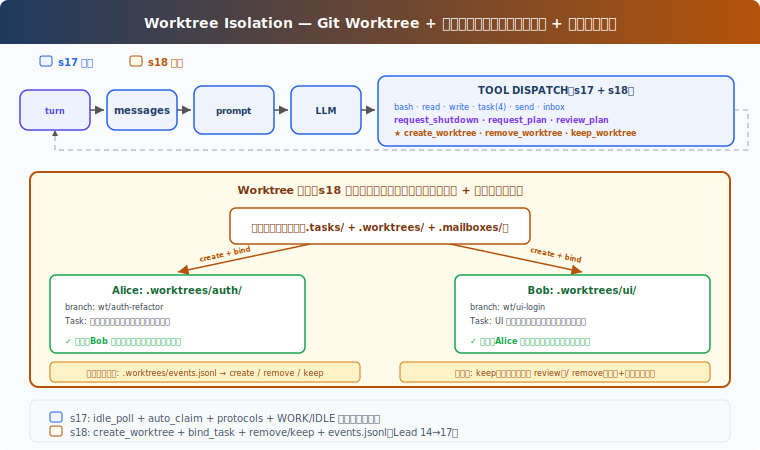

# s18: Worktree Isolation — それぞれのディレクトリ、互いに干渉しない

[中文](README.md) · [English](README.en.md) · [日本語](README.ja.md)

s01 → ... → s16 → s17 → `s18` → [s19](../s19_mcp_plugin/) → s20

> *"それぞれのディレクトリ、互いに干渉しない"* — タスクは目標を管理、worktree はディレクトリを管理、ID で紐付け。
>
> **Harness 層**: 隔離 — 並列実行のディレクトリ分離。

---

## 課題

s17 では、Alice も Bob も同じディレクトリで作業。Alice のタスクは「認証モジュールのリファクタリング」、Bob のタスクは「UI ログインページのリファクタリング」。

Alice が `write_file("config.py", ...)` を呼び出し、Bob も `write_file("config.py", ...)` を呼び出す。両者が同じファイルを編集し、互いに上書き。クリーンなロールバックもできない——どの変更が誰のものか区別できない。

s15-s17 は「誰が何をするか」（タスクシステム）と「どう通信するか」（メッセージバス）を解決したが、「どこで作業するか」は未解決。

---

## ソリューション



Git worktree を使うと、同じリポジトリ内に複数の独立した作業ディレクトリを作成でき、それぞれが独自のブランチを持つ。Alice は `.worktrees/auth-refactor/` で作業、Bob は `.worktrees/ui-login/` で作業——互いに干渉しない。

S17 の教学版 MessageBus、プロトコル、自治認領機構を踏襲。本章の追加：

| 機能 | 目的 |
|------|------|
| create_worktree | タスク用の独立ディレクトリ + 独立ブランチを作成 |
| bind_task_to_worktree | タスクとディレクトリを紐付け（状態は変更しない） |
| remove_worktree / keep_worktree | 完了後のクリーンアップまたは保持 |
| validate_worktree_name | パストラバーサルと不正文字を拒否 |

---

## 仕組み

### 作成：タスク-Worktree 紐付け

```python
def create_worktree(name: str, task_id: str = "") -> str:
    validate_worktree_name(name)       # [A-Za-z0-9._-]{1,64} のみ許可
    path = WORKTREES_DIR / name
    ok, result = run_git(["worktree", "add", str(path), "-b", f"wt/{name}", "HEAD"])
    if not ok:
        return f"Git error: {result}"
    if task_id:
        bind_task_to_worktree(task_id, name)
    log_event("create", name, task_id)
    return f"Worktree '{name}' created at {path}"

def bind_task_to_worktree(task_id: str, worktree_name: str):
    task = load_task(task_id)
    task.worktree = worktree_name       # worktree フィールドのみ書き込み
    save_task(task)                     # 状態は pending のまま、チームメイトの claim を待つ
```

紐付けルール：1 つのタスクに 1 つの worktree を紐付け。紐付けはタスクの状態を変更しない——タスクは `pending` のままで、チームメイトが認領した時に `in_progress` に進む。これにより Lead は事前にタスクと worktree を作成でき、チームメイトは idle 時に自然に worktree 紐付け済みタスクを認領する。

### チームメイトツールの cwd 切り替え

教学版は各チームメイトに `wt_ctx` 辞書を維持し、現在の worktree パスを追跡。チームメイトが worktree 紐付けタスクを認領すると、`wt_ctx` が自動的に worktree パスに設定され、チームメイトの `bash`、`read_file`、`write_file` は worktree ディレクトリで実行される：

```python
# チームメイトスレッド内部
wt_ctx = {"path": None}

def _run_claim_task(task_id):
    result = claim_task(task_id, owner=name)
    if "Claimed" in result:
        task = load_task(task_id)
        if task.worktree:
            wt_ctx["path"] = str(WORKTREES_DIR / task.worktree)
    return result

def _run_bash(command):
    return run_bash(command, cwd=wt_ctx["path"])  # worktree で実行
```

これは教学簡略化。真实 CC の EnterWorktree は `process.chdir()` でプロセス全体のディレクトリを切り替え、AgentTool isolation は `cwdOverride` でサブエージェント実行をラップする。

### クリーンアップ：Keep または Remove

タスク完了後、2 つの選択肢：

```python
def remove_worktree(name: str, discard_changes: bool = False) -> str:
    # 安全チェック：変更がある場合デフォルトで拒否
    if not discard_changes:
        files, commits = _count_worktree_changes(path)
        if files > 0 or commits > 0:
            return "未コミットの変更あり。discard_changes=true で強制削除、または keep_worktree で保持"
    ok, _ = run_git(["worktree", "remove", str(path), "--force"])
    if not ok:
        return "削除失敗"
    run_git(["branch", "-D", f"wt/{name}"])
    log_event("remove", name)

def keep_worktree(name: str) -> str:
    log_event("keep", name)
    return f"Worktree '{name}' kept for review (branch: wt/{name})"
```

Keep = ブランチを保持し、手動 review 後にマージ。Remove = 未コミット変更がある場合デフォルトで拒否、`discard_changes=true` で確認が必要。タスクの自動 complete はしない——タスク完了はチームメイトの `complete_task` で明示的にトリガー。

### イベントログ：監査可能

各ライフサイクル操作はログに記録され、監査に利用：

```python
def log_event(event_type: str, worktree_name: str, task_id: str = ""):
    event = {"type": event_type, "worktree": worktree_name,
             "task_id": task_id, "ts": time.time()}
    # .worktrees/events.jsonl に append
```

イベントタイプ：`create`、`remove`、`keep`。教学版はイベントを記録するだけで手動監査用。完全な復元には index または `git worktree list` スキャンが必要。

### run_git：成功/失敗を返す

```python
def run_git(args: list[str]) -> tuple[bool, str]:
    r = subprocess.run(["git"] + args, cwd=WORKDIR, ...)
    return r.returncode == 0, output
```

`create_worktree` と `remove_worktree` は git コマンド成功後のみイベントログに書き込み、ログが実際の状態を反映することを保証。

---

## s17 からの変更

| コンポーネント | 変更前 (s17) | 変更後 (s18) |
|--------------|------------|------------|
| 作業ディレクトリ | 全 Agent が WORKDIR を共有 | 各タスクが git worktree に紐付け可能 |
| タスクデータ | id/subject/status/owner/blockedBy | + worktree フィールド |
| チームメイトツール cwd | 常に WORKDIR | worktree 紐付けタスク認領時に自動切り替え |
| 新規関数 | — | create_worktree, bind_task_to_worktree, remove_worktree, keep_worktree, validate_worktree_name |
| worktree 安全性 | なし | name 検証 + 変更ありの場合削除拒否 |
| イベントログ | なし | events.jsonl ライフサイクル監査 |
| Lead ツール | 14 (s17) | + create_worktree, remove_worktree, keep_worktree (17) |
| チームメイトツール | 8 (s17) | 8（bash/read/write が worktree cwd で実行） |

---

## 試してみる

```sh
cd learn-claude-code
python s18_worktree_isolation/code.py
```

以下のプロンプトを試してください：

`Create two tasks, then create worktrees for each (bind with task_id). Spawn alice and bob. Watch them auto-claim and work in isolated directories.`

観察ポイント：2 つの worktree の `git status` 出力は異なるブランチを表示しているか？チームメイトが worktree 紐付けタスクを認領後、bash コマンドは worktree ディレクトリで実行されているか？`remove_worktree` は変更がある場合に拒否するか？紐付け後のタスク状態は `pending` のままか？

---

## 次の章

Agent チームが隔離されたワークスペースで自己組織化できるようになった。しかし Agent の能力はツールに制限される——bash、read、write、task...

もしユーザーが独自のツールを持っていたら？例えば社内 Jira API や独自デプロイシステム？

s19 MCP Plugin → Agent にプラグインシステムを追加。外部ツールが標準プロトコルで接続、Agent は誰が書いたか知る必要がない。

<details>
<summary>CC ソースコード深掘り</summary>

CC の worktree システムには 2 つのパスがある：**EnterWorktree**（現在のセッションが切り替え）と **AgentTool isolation**（サブエージェント隔離）。

### EnterWorktree：現在のセッション切り替え

`EnterWorktreeTool.ts:92-97` worktree 作成後、直ちに `process.chdir(worktreePath)`、`setCwd()`、`setOriginalCwd()`、`saveWorktreeState()` を呼び出し。現在のセッションの作業ディレクトリが直接 worktree に切り替わる——プロンプトのヒントではなく、プロセスレベルのディレクトリ変更。

`ExitWorktreeTool.ts:261-320` keep/remove どちらも `restoreSessionToOriginalCwd()` で元のディレクトリに復元。Remove は未コミット変更をチェック（`ExitWorktreeTool.ts:190-220`）、`discard_changes: true` なしでは拒否。

### AgentTool Isolation：サブエージェント隔離

`AgentTool.tsx:590-641` `isolation: "worktree"` の場合、`createAgentWorktree()` を呼び出して worktree を作成し、`cwdOverridePath` でサブエージェント実行をラップ。サブエージェントの全操作が自動的に worktree ディレクトリで実行される。`AgentTool/prompt.ts:272` はモデルに伝える：これは一時的な worktree、変更なしで自動クリーンアップ、変更ありの場合はパスとブランチを返す。

`worktree.ts:902-951` `createAgentWorktree()` はグローバル session cwd を変更せず、サブエージェント専用。`worktree.ts:961-1020` `removeAgentWorktree()` はメインリポジトリルートから削除。

### name 検証

`worktree.ts:76-84` slug を検証：`.`/`..` を拒否、`[a-zA-Z0-9._-]` を許可。`worktree.ts:48` で `VALID_WORKTREE_SLUG_SEGMENT` を定義。教学版の `validate_worktree_name` も同じルールを使用。

### パスとブランチ命名

実際のパスは `.claude/worktrees/`、ブランチ名は `worktree-{slug}`（`worktree.ts:204-227`、スラッシュは `+` に置換）。教学版は `.worktrees/` と `wt/{name}` で簡略化。

作成時は `git worktree add -B`（`worktree.ts:326-328`）を使用し、現在の HEAD より `origin/<defaultBranch>` を優先。

### 状態管理

CC にはタスク-worktree 紐付けがない。Worktree 状態は `PersistedWorktreeSession`（`worktree.ts:756-768`）で管理、フィールドは `originalCwd`、`worktreePath`、`worktreeName`、`worktreeBranch`、`originalBranch`、`originalHeadCommit`、`sessionId` 等を含む——taskId フィールドはない。`saveWorktreeState()`（`sessionStorage.ts:2883-2920`）は `type: 'worktree-state'` で session transcript に書き込み。

教学版はタスクの `worktree` フィールドで紐付けを行う教学簡略化。CC は worktree とタスクを 2 つの独立システムとして扱い、Agent のコンテキスト理解で関連付ける。

</details>

<!-- translation-sync: zh@v1, en@v1, ja@v1 -->
