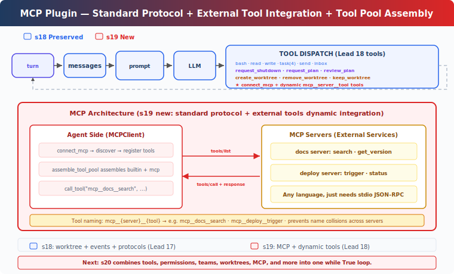

# s19: MCP Tools — External Tools, Standard Protocol

[中文](README.md) · [English](README.en.md) · [日本語](README.ja.md)

s01 → ... → s17 → s18 → `s19` → [s20](../s20_comprehensive/)

> *"External tools, standard protocol"* — Discover, assemble, invoke. Agent doesn't need to know who wrote them.
>
> **Harness layer**: Plugins — External capabilities via a standard protocol.

---

## The Problem

From s01 through s18, every tool the agent uses was hand-written — bash, read, write, task, worktree. Input validation, execution logic, error handling — all written line by line.

Now you have 3 external services to integrate: the company's Jira API (query issues, create tickets), an in-house deployment system (trigger deploys, view logs), and the team's Notion knowledge base (search docs, create pages). You don't want to rewrite tool code for every service.

You need a standard protocol — as long as an external service implements it, the agent can call its tools directly, regardless of what language the service is written in.

---

## The Solution



MCP (Model Context Protocol) defines how agents discover and invoke external tools. Core concepts:

| Concept | Purpose |
|------|------|
| MCPClient | The agent-side client — connects to servers, discovers tools, invokes tools |
| MCP Server | The external service — implements `tools/list` + `tools/call` |
| assemble_tool_pool | Assembles built-in tools and MCP tools into one tool pool |
| mcp\_\_server\_\_tool naming | Prevents tool name collisions across different servers |

Carries forward s18's teaching-version worktree isolation, autonomous claiming, idle polling, and protocol system. This chapter adds: the `connect_mcp` tool — connect to external services, discover tools, add them to the tool pool.

The tutorial uses mock handlers to simulate external servers. The real version would spawn subprocesses and communicate via stdin/stdout JSON-RPC. Mocks let you run the full flow without external dependencies; the tradeoff is you don't see real network communication or process management.

---

## How It Works

### MCPClient: Discovery + Invocation

```python
class MCPClient:
    def __init__(self, name: str):
        self.name = name
        self.tools: list[dict] = []
        self._handlers: dict[str, callable] = {}

    def register(self, tool_defs, handlers):
        """Simulates tools/list discovery."""
        self.tools = tool_defs
        self._handlers = handlers

    def call_tool(self, tool_name: str, args: dict) -> str:
        """Simulates tools/call."""
        handler = self._handlers.get(tool_name)
        if not handler:
            return f"MCP error: unknown tool '{tool_name}'"
        return handler(**args)
```

The tutorial uses Python functions to simulate server tool implementations. The real version communicates with subprocesses via stdio JSON-RPC.

### connect_mcp: Connect + Discover

```python
def connect_mcp(name: str) -> str:
    if name in mcp_clients:
        return f"MCP server '{name}' already connected"
    factory = MOCK_SERVERS.get(name)
    if not factory:
        return f"Unknown server '{name}'. Available: ..."
    mcp_client = factory()
    mcp_clients[name] = mcp_client
    return f"Connected to '{name}'. Discovered: ..."
```

After connecting, the server's tools are immediately available.

### normalize_mcp_name: Name Normalization

```python
_DISALLOWED_CHARS = re.compile(r'[^a-zA-Z0-9_-]')

def normalize_mcp_name(name: str) -> str:
    return _DISALLOWED_CHARS.sub('_', name)
```

All non-`[a-zA-Z0-9_-]` characters are replaced with `_`. Prevents special characters in server or tool names from causing naming conflicts or injection issues.

### assemble_tool_pool: Assemble Tool Pool

```python
def assemble_tool_pool() -> tuple[list[dict], dict]:
    tools = list(BUILTIN_TOOLS)
    handlers = dict(BUILTIN_HANDLERS)
    for server_name, mcp_client in mcp_clients.items():
        safe_server = normalize_mcp_name(server_name)
        for tool_def in mcp_client.tools:
            safe_tool = normalize_mcp_name(tool_def["name"])
            prefixed = f"mcp__{safe_server}__{safe_tool}"
            tools.append(...)
            handlers[prefixed] = (
                lambda *, c=mcp_client, t=tool_def["name"], **kw:
                    c.call_tool(t, kw))
    return tools, handlers
```

The prefix `mcp__{server}__{tool}` prevents tool name collisions across different servers. Names are normalized through `normalize_mcp_name`.

MCP tool descriptions include `(readOnly)` or `(destructive)` annotations — the tutorial uses text annotations, while real CC uses structured tool annotations for the permission system.

### No Cache: Tool Pool Changes, Prompt Changes Too

s10-s18's agent_loop used prompt caching to avoid re-serialization. s19 removes the cache:

```python
def agent_loop(messages, context):
    tools, handlers = assemble_tool_pool()     # Rebuild every time
    system = assemble_system_prompt(context)    # Regenerate every time
    ...
    if any(b.name == "connect_mcp" ...):
        tools, handlers = assemble_tool_pool()  # Rebuild after connection
        system = assemble_system_prompt(context)
```

Reason: after `connect_mcp`, the tool pool changes — new tools like `mcp__docs__search` are added. The cached tool list is stale; continuing to use it means the model can't call the new tools. The tutorial simply removes caching, at the cost of slightly more serialization time.

### MCP Tools: Lead Only

In the tutorial, `connect_mcp` is a Lead tool, and `assemble_tool_pool` only serves the Lead's agent_loop. Teammates still use a fixed 8-tool subset (bash, read_file, write_file, send_message, submit_plan, list_tasks, claim_task, complete_task).

This is a teaching simplification. In real CC, MCP tools are available to both the main agent and sub-agents — sub-agents inherit the parent's MCP configuration.

---

## Changes from s18

| Component | Before (s18) | After (s19) |
|------|-----------|-----------|
| Tool source | All hand-written built-in | Hand-written + MCP external tools with dynamic discovery |
| Tool pool | Fixed BUILTIN_TOOLS | assemble_tool_pool dynamically assembles mcp\_\_ prefixed tools |
| Name safety | None | normalize_mcp_name normalization |
| New type | — | MCPClient class (simulates tools/list + tools/call) |
| Namespace | — | mcp\_\_server\_\_tool prevents collisions |
| Tool descriptions | No annotations | (readOnly)/(destructive) annotations |
| Prompt cache | Yes (since s10) | Removed — tool pool is dynamic, cache goes stale |
| Lead tools | 17 (s18) | 18 (+connect_mcp) |
| Teammate tools | 8 (s18) | 8 (unchanged, MCP tools are Lead-only) |
| Extension method | Write code to add tools | Standard protocol, implement servers in any language |

---

## Try It Out

```sh
cd learn-claude-code
python s19_mcp_plugin/code.py
```

Try these prompts:

1. `Connect to the docs MCP server and search for something`
2. `Connect to the deploy server and trigger a deployment`
3. `Connect both servers — what tools are now available?`

What to observe: After connecting to an MCP server, do tool names have `mcp__docs__` or `mcp__deploy__` prefixes? Are both servers' tools available simultaneously? Do MCP tool descriptions include (readOnly)/(destructive) annotations?

---

## What's Next

The Agent can now connect external tools through a standard protocol. But the first 19 chapters each add one mechanism in isolation; a real Agent does not run as 19 separate demos.

Tools, permissions, hooks, todo, task graph, memory, compact, background work, cron, teams, worktrees, and MCP should all attach to the same loop, not live in separate examples.

s20 Comprehensive Agent → Combine the first 19 chapters into one complete harness. Many mechanisms, one loop.

<details>
<summary>Deep Dive into CC Source</summary>

> The following is based on analysis of CC source: `services/mcp/client.ts`, `auth.ts`, `config.ts`, `channelNotification.ts`.

### 1. Six Transport Types

The tutorial only shows a stdio mock. CC supports 6 transport types (`types.ts:23-25`):

| Transport | Communication method |
|-----------|---------|
| `stdio` | Subprocess stdin/stdout (cross-platform default) |
| `sse` | HTTP Server-Sent Events |
| `http` | Streamable HTTP (POST/SSE bidirectional) |
| `ws` | WebSocket |
| `sse-ide` | IDE-embedded SSE transport |
| `sdk` | In-process SDK transport |

On connection, local (stdio) and remote (http/sse/ws) servers are batched concurrently: local batch of 3, remote batch of 20.

### 2. Tool Pool Merging Algorithm

`assembleToolPool()` (`tools.ts:345-364`):

```typescript
// Dedup with priority: built-in tools win on name collision (sorted first)
return uniqBy(
  [...builtInTools.sort(byName), ...filteredMcpTools.sort(byName)],
  'name',
)
```

Built-in and MCP tools are sorted separately, not together. The reason is CC's `claude_code_system_cache_policy` places a global cache breakpoint after the last built-in tool at a specific position — mixing the sort would break this design.

### 3. Naming Convention: `mcp__server__tool`

`buildMcpToolName()` (`mcpStringUtils.ts:50-52`):

```
mcp__<normalizedServerName>__<normalizedToolName>
```

All non-`[a-zA-Z0-9_-]` characters are replaced with `_` (`normalization.ts:17-23`). The tutorial's `normalize_mcp_name` uses the same rule.

### 4. Permission Checks

CC has a separate permission system for MCP tools. `checkPermissions()` applies different logic for MCP tools than for built-in tools — MCP tools can declare their own permission requirements (readOnly, destructive, etc.), and CC decides whether user confirmation is needed based on the declaration. The tutorial only uses text annotations `(readOnly)` / `(destructive)` in descriptions, without permission enforcement.

### 5. Configuration Sources and Priority

MCP server configuration comes from multiple sources. CC's priority from lowest to highest:

```
claude.ai connectors < plugin < user settings.json < approved project .mcp.json < local settings.local.json
```

`claude.ai` connectors are fetched separately, deduplicated by content signature, and merged at the lowest precedence (`config.ts:1267-1289`). When enterprise `managed-mcp.json` exists, all other configurations are excluded.

The tutorial passes server names directly to the `MOCK_SERVERS` dict, without config merging.

### 6. Channel Notifications: Servers Push Messages Back

The tutorial only covers agent → MCP Server unidirectional calls. CC also supports reverse notifications (`channelNotification.ts`):

1. Server declares `capabilities.experimental['claude/channel']`
2. Server sends messages to agent via MCP notification `notifications/claude/channel`
3. Messages are wrapped in `<channel source="serverName">...</channel>` XML tags
4. Agent is woken up by SleepTool (within 1 second)

Servers can also request permissions: `notifications/claude/channel/permission_request` → Agent replies `notifications/claude/channel/permission`. Users confirm/deny via a 5-letter short ID.

### 7. OAuth Authentication Flow

CC's MCP authentication (`auth.ts`) supports a full OAuth 2.0 + PKCE flow:
- OAuth metadata discovery via public client + PKCE (RFC 8414 / RFC 9728)
- Local callback server receives authorization code
- Tokens persisted via `getSecureStorage()` (macOS Keychain / Linux encrypted file / Windows Credential Manager)
- Auto-refresh 5 minutes before expiry
- Cross-application access (XAA): browser gets id_token → RFC 8693 + RFC 7523 exchange → no repeated browser popups

### 8. Connection Lifecycle Error Handling

CC has fine-grained error classification and retry for MCP connections (`client.ts:1266-1402`):
- Terminal errors (ECONNRESET, ETIMEDOUT, EPIPE, etc.): 3 consecutive failures → close + reconnect
- Tool call 401: Token expired → throw `McpAuthError` → trigger re-authentication
- Tool call timeout: `Promise.race` timeout (configurable, default ~28 hours)
- Stdio disconnect: Kill process in SIGINT → SIGTERM → SIGKILL order

### The Tutorial's Simplifications

- 6 transport types → 1 (mock stdio): Manageable concept count
- Channel reverse notifications → omitted: Tutorial agent is always the initiator
- OAuth flow → omitted: Tutorial assumes servers need no auth
- Multi-layer config priority → omitted: Tutorial passes server name directly
- Complex error classification → omitted: Tutorial uses try/except as fallback
- MCP tools Lead-only → omitted sub-agent inheritance: Simplifies code structure

</details>

<!-- translation-sync: zh@v2, en@v2, ja@v0 -->
