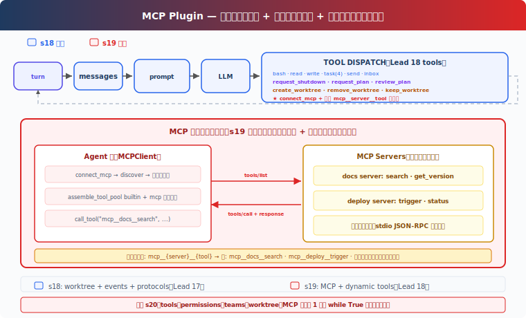

# s19: MCP Tools — 外部ツール、標準プロトコル

[中文](README.md) · [English](README.en.md) · [日本語](README.ja.md)

s01 → ... → s17 → s18 → `s19` → [s20](../s20_comprehensive/)

> *"外部ツール、標準プロトコル"* — 発見、組み立て、呼び出し。Agent はツールを誰が書いたか知る必要がない。
>
> **Harness 層**: プラグイン — 外部能力を標準プロトコルで接続。

---

## 課題

s01 から s18 まで、Agent の全ツールは手書き — bash、read、write、task、worktree。入力検証、実行ロジック、エラーハンドリング、全て一行ずつ書いた。

今、統合したい外部サービスが 3 つある：社内の Jira API（issue 検索、ticket 作成）、独自のデプロイシステム（deploy トリガー、ログ閲覧）、チームの Notion ナレッジベース（ドキュメント検索、ページ作成）。各サービスのためにツールコードを書き直したくない。

標準プロトコルが必要 — 外部サービスがこのプロトコルを実装していれば、サービスが何の言語で書かれていても、Agent は直接そのツールを呼び出せる。

---

## ソリューション



MCP（Model Context Protocol）は、Agent が外部ツールを発見・呼び出しする方法を定義。核心概念：

| 概念 | 目的 |
|------|------|
| MCPClient | Agent 側のクライアント — server に接続、ツールを発見、ツールを呼び出し |
| MCP Server | 外部サービス側 — `tools/list` + `tools/call` を実装 |
| assemble_tool_pool | 組み込みツールと MCP ツールを一つのツールプールに組み立てる |
| mcp\_\_server\_\_tool 命名 | 異なる server 間のツール名衝突を防止 |

s18 の教学版 worktree 隔離、自動認領、空き時ポーリング、プロトコルシステムを踏襲。本章の追加：`connect_mcp` ツール — 外部サービスに接続、ツールを発見、ツールプールに追加。

教学版は mock handler で外部 server をシミュレート。実際の版はサブプロセスを起動し、stdin/stdout で JSON-RPC リクエストを送信。mock の利点は外部サービスなしで完全なフローを実行できること；代償は実際のネットワーク通信やプロセス管理が見えないこと。

---

## 仕組み

### MCPClient：発見 + 呼び出し

```python
class MCPClient:
    def __init__(self, name: str):
        self.name = name
        self.tools: list[dict] = []
        self._handlers: dict[str, callable] = {}

    def register(self, tool_defs, handlers):
        """Simulates tools/list discovery."""
        self.tools = tool_defs
        self._handlers = handlers

    def call_tool(self, tool_name: str, args: dict) -> str:
        """Simulates tools/call."""
        handler = self._handlers.get(tool_name)
        if not handler:
            return f"MCP error: unknown tool '{tool_name}'"
        return handler(**args)
```

教学版は Python 関数で server のツール実装をシミュレート。実際の版は stdio JSON-RPC でサブプロセスと通信。

### connect_mcp：接続 + 発見

```python
def connect_mcp(name: str) -> str:
    if name in mcp_clients:
        return f"MCP server '{name}' already connected"
    factory = MOCK_SERVERS.get(name)
    if not factory:
        return f"Unknown server '{name}'. Available: ..."
    mcp_client = factory()
    mcp_clients[name] = mcp_client
    return f"Connected to '{name}'. Discovered: ..."
```

接続後、server が提供するツールが即座に利用可能。

### normalize_mcp_name：名前の正規化

```python
_DISALLOWED_CHARS = re.compile(r'[^a-zA-Z0-9_-]')

def normalize_mcp_name(name: str) -> str:
    return _DISALLOWED_CHARS.sub('_', name)
```

`[a-zA-Z0-9_-]` 以外の全文字を `_` に置換。server 名やツール名の特殊文字による名前衝突やインジェクション問題を防止。

### assemble_tool_pool：ツールプールの組み立て

```python
def assemble_tool_pool() -> tuple[list[dict], dict]:
    tools = list(BUILTIN_TOOLS)
    handlers = dict(BUILTIN_HANDLERS)
    for server_name, mcp_client in mcp_clients.items():
        safe_server = normalize_mcp_name(server_name)
        for tool_def in mcp_client.tools:
            safe_tool = normalize_mcp_name(tool_def["name"])
            prefixed = f"mcp__{safe_server}__{safe_tool}"
            tools.append(...)
            handlers[prefixed] = (
                lambda *, c=mcp_client, t=tool_def["name"], **kw:
                    c.call_tool(t, kw))
    return tools, handlers
```

プレフィックス `mcp__{server}__{tool}` で異なる server 間のツール名衝突を防止。名前は `normalize_mcp_name` で正規化。

MCP ツールの description に `(readOnly)` または `(destructive)` アノテーションを付与 — 教学版はテキストアノテーション、実際の CC は tool annotations 構造体で権限システムが判断。

### キャッシュなし：ツールプールが変われば、プロンプトも変わる

s10-s18 の agent_loop は prompt cache で再シリアライズを回避。s19 はキャッシュを削除：

```python
def agent_loop(messages, context):
    tools, handlers = assemble_tool_pool()     # 毎回再構築
    system = assemble_system_prompt(context)    # 毎回再生成
    ...
    if any(b.name == "connect_mcp" ...):
        tools, handlers = assemble_tool_pool()  # 接続後に再構築
        system = assemble_system_prompt(context)
```

理由：`connect_mcp` 後にツールプールが変化 — `mcp__docs__search` などの新ツールが追加される。キャッシュ内のツールリストは古く、使い続けるとモデルが新ツールを呼び出せない。教学版はキャッシュを単に削除、代償はシリアライズ時間の若干の増加。

### MCP ツールは Lead のみ利用可能

教学版では、`connect_mcp` は Lead ツール、`assemble_tool_pool` も Lead の agent_loop のみにサービスを提供。チームメイトは引き続き固定の 8 ツールサブセット（bash、read_file、write_file、send_message、submit_plan、list_tasks、claim_task、complete_task）を使用。

これは教学簡略化。実際の CC では、MCP ツールはメイン agent とサブ agent の両方で利用可能 — サブ agent は親の MCP 設定を継承。

---

## s18 からの変更

| コンポーネント | 変更前 (s18) | 変更後 (s19) |
|--------------|------------|------------|
| ツールソース | 全て手書き builtin | 手書き + MCP 外部ツール動的発見 |
| ツールプール | 固定 BUILTIN_TOOLS | assemble_tool_pool が動的に mcp\_\_ プレフィックスツールを組み立てる |
| 名前の安全性 | なし | normalize_mcp_name 正規化 |
| 新規タイプ | — | MCPClient クラス（tools/list + tools/call をシミュレート） |
| 名前空間 | — | mcp\_\_server\_\_tool 衝突防止 |
| ツール説明 | アノテーションなし | (readOnly)/(destructive) アノテーション |
| プロンプトキャッシュ | あり（s10 から） | 削除 — ツールプールが動的、キャッシュが陳腐化 |
| Lead ツール | 17 (s18) | 18 (+connect_mcp) |
| チームメイトツール | 8 (s18) | 8（変更なし、MCP ツールは Lead のみ） |
| 拡張方法 | ツール追加のコードを書く | 標準プロトコル、任意言語で server を実装 |

---

## 試してみる

```sh
cd learn-claude-code
python s19_mcp_plugin/code.py
```

以下のプロンプトを試してください：

1. `Connect to the docs MCP server and search for something`
2. `Connect to the deploy server and trigger a deployment`
3. `Connect both servers — what tools are now available?`

観察ポイント：MCP server 接続後、ツール名に `mcp__docs__` や `mcp__deploy__` プレフィックスが付いているか？両方の server のツールが同時に利用可能か？MCP ツールの description に (readOnly)/(destructive) アノテーションが付いているか？

---

## 次の章

Agent は標準プロトコルで外部ツールに接続できるようになりました。しかし前 19 章は各章で 1 つの仕組みだけを追加しています。実際の Agent は 19 個の demo に分かれて動くわけではありません。

tools、permissions、hooks、todo、task graph、memory、compact、background work、cron、teams、worktree、MCP は、別々の例ではなく同じ loop に接続されるべきです。

s20 Comprehensive Agent → 前 19 章の仕組みを 1 つの完全な harness に統合。仕組みは多く、loop は 1 つ。

<details>
<summary>CC ソースコード深掘り</summary>

> 以下は CC ソースコード `services/mcp/client.ts`、`auth.ts`、`config.ts`、`channelNotification.ts` の分析に基づく。

### 一、6 種の Transport タイプ

教学版は stdio mock のみ。CC は 6 種のトランスポートをサポート（`types.ts:23-25`）：

| Transport | 通信方式 |
|-----------|---------|
| `stdio` | サブプロセス stdin/stdout（クロスプラットフォームデフォルト） |
| `sse` | HTTP Server-Sent Events |
| `http` | Streamable HTTP（POST/SSE 双方向） |
| `ws` | WebSocket |
| `sse-ide` | IDE 内蔵 SSE トランスポート |
| `sdk` | プロセス内 SDK トランスポート |

接続時、ローカル（stdio）とリモート（http/sse/ws）サーバーをバッチで並行処理：ローカルは 3 つずつ、リモートは 20 つずつ。

### 二、ツールプール組み立てアルゴリズム

`assembleToolPool()`（`tools.ts:345-364`）：

```typescript
// 重複排除時に組み込みツールを優先（name が同じ場合、組み込みが先）
return uniqBy(
  [...builtInTools.sort(byName), ...filteredMcpTools.sort(byName)],
  'name',
)
```

組み込みツールと MCP ツールは別々にソート、混ぜてソートしない。理由は CC の `claude_code_system_cache_policy` が最後の組み込みツールの後の特定位置にグローバルキャッシュブレークポイントを置く設計のため — ソートを混ぜるとこの設計が壊れる。

### 三、命名規則：`mcp__server__tool`

`buildMcpToolName()`（`mcpStringUtils.ts:50-52`）：

```
mcp__<normalizedServerName>__<normalizedToolName>
```

`[a-zA-Z0-9_-]` 以外の全文字を `_` に置換（`normalization.ts:17-23`）。教学版の `normalize_mcp_name` も同じルールを使用。

### 四、権限チェック

CC は MCP ツールに対して独立した権限システムを持つ。`checkPermissions()` は MCP ツールに対して組み込みツールとは異なるロジックを適用 — MCP ツールは独自の権限要件（readOnly、destructive 等）を宣言でき、CC は宣言に基づいてユーザー確認が必要かを判断。教学版は description 内のテキストアノテーション `(readOnly)` / `(destructive)` のみで、権限インターセプトは行わない。

### 五、設定ソースと優先度

MCP サーバー設定は複数のソースから。CC の優先度は低い順に：

```
claude.ai コネクタ < プラグイン < ユーザー settings.json < 承認済みプロジェクト .mcp.json < ローカル settings.local.json
```

`claude.ai` コネクタは個別に取得、コンテンツ署名で重複排除し、最低優先度で統合（`config.ts:1267-1289`）。企業 `managed-mcp.json` が存在する場合、他の全設定を完全に除外。

教学版は server 名を直接 `MOCK_SERVERS` 辞書に渡し、設定マージは行わない。

### 六、Channel 通知：サーバーからの逆方向メッセージ

教学版は Agent → MCP Server の一方向呼び出しのみ。CC は逆方向通知もサポート（`channelNotification.ts`）：

1. Server が `capabilities.experimental['claude/channel']` を宣言
2. Server が MCP 通知 `notifications/claude/channel` で Agent にメッセージを送信
3. メッセージは `<channel source="serverName">...</channel>` XML タグでラップ
4. Agent は SleepTool で起床（1 秒以内）

Server は権限リクエストも可能：`notifications/claude/channel/permission_request` → Agent が `notifications/claude/channel/permission` で応答。ユーザーは 5 文字の短い ID で確認/拒否。

### 七、OAuth 認証フロー

CC の MCP 認証（`auth.ts`）は完全な OAuth 2.0 + PKCE フローをサポート：
- 公開クライアント + PKCE で OAuth メタデータを発見（RFC 8414 / RFC 9728）
- ローカルコールバックサーバーが認可コードを受信
- トークンは `getSecureStorage()` で永続化（macOS Keychain / Linux 暗号化ファイル / Windows 資格情報マネージャー）
- 有効期限 5 分前に自動リフレッシュ
- クロスアプリケーションアクセス（XAA）：ブラウザが id_token を取得 → RFC 8693 + RFC 7523 交換 → 繰り返しブラウザポップアップ不要

### 八、接続ライフサイクルのエラーハンドリング

CC は MCP 接続にきめ細かいエラー分類とリトライを行う（`client.ts:1266-1402`）：
- 終局エラー（ECONNRESET、ETIMEDOUT、EPIPE 等）：連続 3 回 → クローズ + 再接続
- ツール呼び出し 401：トークン期限切れ → `McpAuthError` スロー → 再認証トリガー
- ツール呼び出しタイムアウト：`Promise.race` タイムアウト（設定可能、デフォルト約 28 時間）
- Stdio 切断：SIGINT → SIGTERM → SIGKILL の順でプロセスを kill

### 教学版の簡略化

- 6 種のトランスポート → 1 種（mock stdio）：概念量を管理可能に
- Channel 逆方向通知 → 省略：教学版 Agent は常にイニシエータ
- OAuth フロー → 省略：教学版は server が認証不要と仮定
- 多層設定優先度 → 省略：教学版は直接 server 名を渡す
- 複雑なエラー分類 → 省略：教学版は try/except でフォールバック
- MCP ツールは Lead のみ → サブ agent 継承を省略：コード構造を簡略化

</details>

<!-- translation-sync: zh@v2, en@v2, ja@v2 -->
