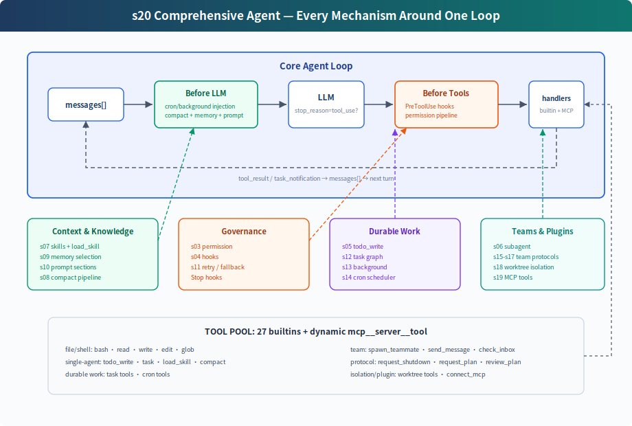

# s20: Comprehensive Agent — All Mechanisms, One Loop

[中文](README.md) · [English](README.en.md) · [日本語](README.ja.md)

s01 → ... → s18 → s19 → `s20`

> *"Many mechanisms, one loop"* — tools, permissions, memory, tasks, teams, and plugins all hang off the same `while True`.
>
> **Harness layer**: Comprehensive — put the previous 19 mechanisms back into one runnable system.

---

## Problem

The first 19 chapters add one mechanism at a time. That is the right way to learn, but a real agent does not run with only one mechanism enabled.

A long-running coding agent needs all of these at once:

- tool dispatch and permission boundaries
- hook extension points
- todo planning and task graphs
- skills, memory, and runtime system prompt assembly
- compaction and error recovery
- background tasks and cron scheduling
- teams, protocols, autonomous claiming
- worktree isolation
- MCP external tool integration

The hard part is not piling up features. The hard part is seeing where each mechanism belongs around the loop. S20 is the endpoint chapter: every component is placed back into one harness.

---

## Solution



S20 does not invent a new mechanism. It merges the teaching components from the earlier chapters into one complete harness:

```text
user input
  → UserPromptSubmit hooks
  → cron/background notification injection
  → context compact
  → memory + skills + MCP state assemble the system prompt
  → LLM
  → has tool_use block?
      no  → Stop hooks → return
      yes → PreToolUse hooks + permission
          → TOOL_HANDLERS / MCP handlers / background dispatch
          → PostToolUse hooks
          → tool_result / task_notification back to messages
          → next round
```

The loop is still the same structure: call the model, check whether the response contains a `tool_use` block, execute tools, append results back to `messages`. CC source does not directly trust `stop_reason == "tool_use"`; the actual presence of a tool_use block is the continuation signal. What changed is that the harness around the loop is now complete.

---

## Where Each Component Sits

| Position | Component | Role |
|----------|-----------|------|
| Around user input | `UserPromptSubmit` hooks | Log, inject, or audit user input |
| Before LLM | cron queue | Inject scheduled prompts into `messages` |
| Before LLM | background notifications | Inject completed background work as `<task_notification>` |
| Before LLM | compaction pipeline | Budget large outputs, trim history, compact old tool results, summarize when needed |
| Before LLM | memory / skills / MCP state | Assemble the system prompt so the model sees current capabilities and long-term context |
| LLM call | error recovery | Retry 429/529, escalate `max_tokens`, compact on prompt-too-long |
| Before tool execution | `PreToolUse` hooks + permission | Block dangerous commands, out-of-bounds writes, destructive MCP tools |
| Tool dispatch | `assemble_tool_pool` | Assemble built-in tools and dynamic MCP tools |
| During tool execution | background dispatch | Move slow bash work into a daemon thread and return a placeholder result |
| After tool execution | `PostToolUse` hooks | Large-output warnings, logs, post-processing |
| Back to loop | tool_result | One `tool_result` per `tool_use`, then the next model round |
| No tool_use this round / on stop | `Stop` hooks | Stats, cleanup, audit |

---

## What code.py Contains

### Tools and Dispatch

The built-in tool pool contains 27 tools:

```text
bash, read_file, write_file, edit_file, glob
todo_write, task, load_skill, compact
create_task, list_tasks, get_task, claim_task, complete_task
schedule_cron, list_crons, cancel_cron
spawn_teammate, send_message, check_inbox
request_shutdown, request_plan, review_plan
create_worktree, remove_worktree, keep_worktree
connect_mcp
```

`assemble_tool_pool()` assembles these every round:

```text
BUILTIN_TOOLS + connected MCP tools
BUILTIN_HANDLERS + mcp__server__tool handlers
```

After `connect_mcp("docs")`, the next round exposes tools like `mcp__docs__search`.

### Permissions and Hooks

Permission is not hardcoded into the tool execution line. It is a `PreToolUse` hook:

```python
blocked = trigger_hooks("PreToolUse", block)
if blocked:
    results.append(tool_result(block.id, blocked))
    continue
```

That means permission, logging, and audit logic all attach to the same hook point. After execution, `PostToolUse` hooks run.

### Planning and Tasks

S20 keeps two planning layers:

- `todo_write`: lightweight plan for the current session, kept in memory
- task graph: cross-session, dependency-aware, claimable task files under `.tasks/task_*.json`

The first keeps a single agent from drifting. The second supports team coordination.

### Subagents and Teams

S20 has two kinds of delegation:

- `task`: one-shot subagent. It uses an isolated `messages[]`, discards intermediate context, and returns only a final summary.
- `spawn_teammate`: persistent teammate thread. It communicates through `MessageBus`, polls the task board while idle, and can claim work autonomously.

One-shot subagents solve context isolation. Persistent teammates solve long-running parallel collaboration.

### Memory, Skills, and Prompt

`assemble_system_prompt(context)` assembles each round from:

- identity and tool guidance
- workspace
- skills catalog
- `.memory/MEMORY.md`
- connected MCP servers

Skills only put their catalog into the system prompt. Full content is loaded on demand through `load_skill(name)`.

### Compaction and Recovery

Before the LLM call, S20 runs the compaction pipeline:

```text
tool_result_budget → snip_compact → micro_compact → compact_history
```

The model call is wrapped with recovery:

- 429: exponential backoff retry
- 529: exponential backoff, optionally switch to fallback model after repeated failures
- `max_tokens`: raise max tokens, then request continuation
- prompt too long: reactive compact and retry

### Background and Cron

Slow bash work does not block the main loop:

```text
should_run_background → start_background_task → placeholder tool_result
background done → task_notification → next round injects messages
```

The cron scheduler runs as a daemon thread and checks once per second. The CLI watches `cron_queue`; when a job fires, it injects `[Scheduled] ...` and runs one agent turn automatically.

### Worktree and MCP

Worktree isolation owns directories:

- `create_worktree(name, task_id)` creates an isolated branch and directory
- the task `worktree` field binds a task to that directory
- when a teammate claims a task with a worktree, its bash/read/write tools run in that directory

MCP owns external capability:

- `connect_mcp(name)` connects a mock server
- `assemble_tool_pool()` assembles MCP tools into the tool pool
- tool names use `mcp__server__tool`

---

## Changes from s19

| Component | s19 | s20 |
|-----------|-----|-----|
| tool pool | built-in + MCP | built-in + MCP, with s01-s18 tools restored |
| permission | omitted in teaching body | runs inside `PreToolUse` hook |
| hooks | omitted | UserPromptSubmit / PreToolUse / PostToolUse / Stop |
| todo | omitted | `todo_write` + reminder |
| skill | omitted | catalog in system prompt + `load_skill` |
| compact | omitted | pre-LLM compaction + `compact` tool + reactive compact |
| error recovery | simple try/except | retry / max_tokens / prompt too long |
| background | omitted | slow-operation thread + task notification |
| cron | omitted | daemon scheduler + durable jobs |
| multi-agent | kept | kept; teammates use basic tools in isolated directories |
| worktree | kept | kept |
| MCP | new | kept as part of the final tool pool |

---

## Try It

```sh
cd learn-claude-code
python s20_comprehensive/code.py
```

Try:

1. `Create a todo list for inspecting this repo, then list Python files`
2. `Connect to the docs MCP server and search for agent loop`
3. `Create two tasks, create worktrees for them, then spawn alice and bob. Ask them to submit plans before claiming tasks.`
4. `remind me of the meeting in 3 minutes.`
5. `Run npm install in the background and continue reading README.md`

Watch for:

- whether each tool call passes through hooks/permission
- whether MCP tools appear on the next round after `connect_mcp`
- whether slow operations return a background placeholder
- whether cron automatically reminds you when the time arrives
- whether teammates submit plans and pause before approval
- whether teammates can claim tasks after plan approval
- whether teammates switch to the bound worktree directory

---

## The End Is the Beginning

From s01 to s20, the code gets more capable, but the core remains unchanged:

```python
while True:
    response = LLM(messages, tools)
    if not has_tool_use(response.content):
        return
    results = execute_tools(response.content)
    messages.append(tool_results)
```

Claude Code's complexity is not "another agent brain." It is the complexity of a mature harness. The model decides and chooses actions; the harness organizes environment, tools, permissions, memory, teams, and external capabilities.

This is the endpoint of the course: many mechanisms, one loop.
