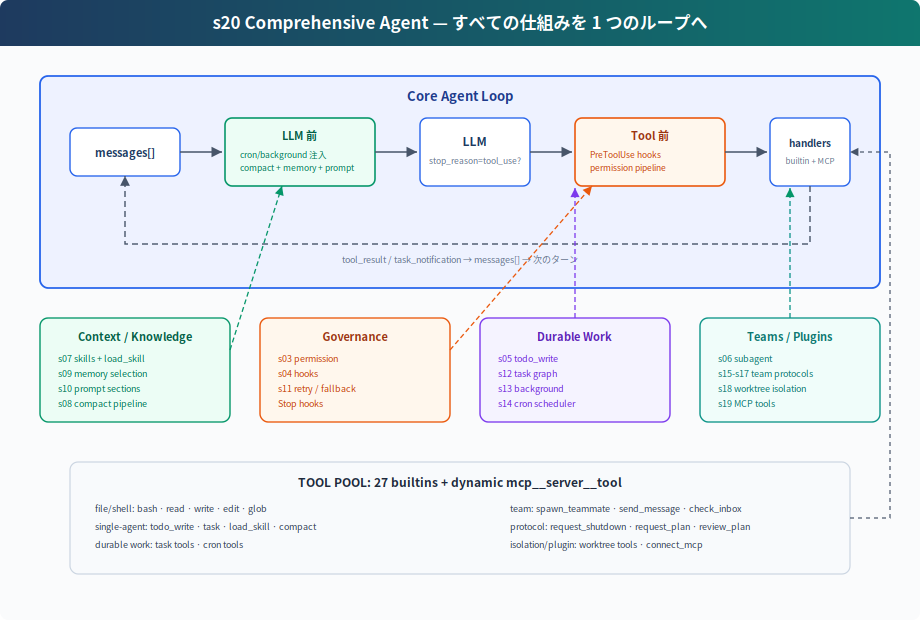

# s20: Comprehensive Agent — すべての仕組みを 1 つのループへ

[中文](README.md) · [English](README.en.md) · [日本語](README.ja.md)

s01 → ... → s18 → s19 → `s20`

> *"仕組みは多い、ループは 1 つ"* — tools、permissions、memory、tasks、teams、plugins はすべて同じ `while True` に接続される。
>
> **Harness レイヤー**: 総合 — 前 19 章の仕組みを 1 つの実行可能なシステムへ戻す。

---

## 問題

前 19 章では、各章が 1 つの仕組みだけを追加した。学習にはその形が適している。しかし実際の agent は、1 つの仕組みだけで動くわけではない。

長時間動く coding agent には、同時に次のものが必要になる：

- tool dispatch と permission boundary
- hook extension point
- todo plan と task graph
- skill、memory、runtime system prompt assembly
- compaction と error recovery
- background task と cron scheduling
- team、protocol、autonomous claiming
- worktree isolation
- MCP external tool integration

難しいのは機能を積み上げることではない。それぞれの仕組みが loop のどこに接続されるかを見抜くことだ。S20 は終点章であり、すべての component を 1 つの harness に戻す。

---

## 解決策



S20 は新しい単独 mechanism を発明しない。前章までの teaching component を 1 つの完全な harness に統合する：

```text
user input
  → UserPromptSubmit hooks
  → cron/background notification injection
  → context compact
  → memory + skills + MCP state で system prompt を組み立てる
  → LLM
  → has tool_use block?
      no  → Stop hooks → return
      yes → PreToolUse hooks + permission
          → TOOL_HANDLERS / MCP handlers / background dispatch
          → PostToolUse hooks
          → tool_result / task_notification を messages へ戻す
          → next round
```

loop 自体は同じ構造のままだ。model を呼び、response に `tool_use` block があるかを見て、tool を実行し、結果を `messages` に戻す。CC source でも `stop_reason == "tool_use"` を直接信頼せず、実際に tool_use block が出たかを continuation signal として扱う。変わったのは、loop の周囲の harness が完成形になったことだけ。

---

## 各 Component の位置

| 位置 | Component | 役割 |
|------|-----------|------|
| user input 周辺 | `UserPromptSubmit` hooks | user input の記録、注入、監査 |
| LLM 前 | cron queue | scheduled prompt を `messages` へ注入 |
| LLM 前 | background notifications | 完了した background work を `<task_notification>` として注入 |
| LLM 前 | compaction pipeline | 大きな出力を予算化し、履歴を切り、古い tool_result を圧縮し、必要なら要約 |
| LLM 前 | memory / skills / MCP state | current capabilities と long-term context を system prompt に組み込む |
| LLM call | error recovery | 429/529 retry、`max_tokens` escalation、prompt-too-long compact |
| tool 実行前 | `PreToolUse` hooks + permission | 危険な command、範囲外 write、destructive MCP tool を止める |
| tool dispatch | `assemble_tool_pool` | built-in tools と dynamic MCP tools を組み立てる |
| tool 実行中 | background dispatch | 遅い bash work を daemon thread に逃がし、placeholder result を返す |
| tool 実行後 | `PostToolUse` hooks | large-output warning、log、後処理 |
| loop へ戻る | tool_result | 1 つの `tool_use` に 1 つの `tool_result`、そして次の model round |
| tool_use がない round / stop 時 | `Stop` hooks | 統計、cleanup、audit |

---

## code.py に含まれるもの

### Tools と Dispatch

built-in tool pool には 27 個の tool がある：

```text
bash, read_file, write_file, edit_file, glob
todo_write, task, load_skill, compact
create_task, list_tasks, get_task, claim_task, complete_task
schedule_cron, list_crons, cancel_cron
spawn_teammate, send_message, check_inbox
request_shutdown, request_plan, review_plan
create_worktree, remove_worktree, keep_worktree
connect_mcp
```

`assemble_tool_pool()` は毎 round で次を組み立てる：

```text
BUILTIN_TOOLS + connected MCP tools
BUILTIN_HANDLERS + mcp__server__tool handlers
```

`connect_mcp("docs")` のあと、次の round では `mcp__docs__search` のような tool が出現する。

### Permission と Hooks

permission は tool 実行行に直接埋め込まない。`PreToolUse` hook として扱う：

```python
blocked = trigger_hooks("PreToolUse", block)
if blocked:
    results.append(tool_result(block.id, blocked))
    continue
```

これにより permission、logging、audit が同じ hook point に接続できる。実行後には `PostToolUse` hook が走る。

### Plan と Task

S20 には 2 層の plan がある：

- `todo_write`: current session 用の軽量 plan。メモリに保持。
- task graph: cross-session、dependency-aware、claimable な task file。`.tasks/task_*.json` に保存。

前者は単独 agent の drift を防ぐ。後者は team coordination の土台になる。

### Subagent と Team

S20 には 2 種類の delegation がある：

- `task`: one-shot subagent。独立した `messages[]` を使い、中間 context を捨て、final summary だけ返す。
- `spawn_teammate`: persistent teammate thread。`MessageBus` で通信し、idle 中に task board を polling して自律的に claim できる。

one-shot subagent は context isolation を解決する。persistent teammate は長期並列協作を解決する。

### Memory、Skills、Prompt

`assemble_system_prompt(context)` は毎 round 次を組み立てる：

- identity と tool guidance
- workspace
- skills catalog
- `.memory/MEMORY.md`
- connected MCP servers

skills は system prompt には catalog だけ置く。全文は `load_skill(name)` で必要な時に読む。

### Compaction と Recovery

LLM call の前に compaction pipeline を走らせる：

```text
tool_result_budget → snip_compact → micro_compact → compact_history
```

model call は recovery で包む：

- 429: exponential backoff retry
- 529: exponential backoff、連続失敗時は fallback model へ切替可能
- `max_tokens`: max tokens を上げ、その後 continuation を要求
- prompt too long: reactive compact 後に retry

### Background と Cron

遅い bash work は main loop を止めない：

```text
should_run_background → start_background_task → placeholder tool_result
background done → task_notification → next round injects messages
```

cron scheduler は daemon thread として動き、1 秒ごとに確認する。CLI は `cron_queue` を監視し、発火した job を `[Scheduled] ...` として注入して Agent を 1 turn 自動実行する。

### Worktree と MCP

worktree isolation は directory を担当する：

- `create_worktree(name, task_id)` が isolated branch と directory を作る
- task の `worktree` field が task と directory を紐付ける
- teammate が worktree 付き task を claim すると、bash/read/write はその directory で実行される

MCP は external capability を担当する：

- `connect_mcp(name)` が mock server に接続する
- `assemble_tool_pool()` が MCP tools を tool pool に組み立てる
- tool name は `mcp__server__tool` 形式に統一する

---

## s19 からの変化

| Component | s19 | s20 |
|-----------|-----|-----|
| tool pool | built-in + MCP | built-in + MCP、s01-s18 の tool を補完 |
| permission | teaching body では省略 | `PreToolUse` hook で実行 |
| hooks | 省略 | UserPromptSubmit / PreToolUse / PostToolUse / Stop |
| todo | 省略 | `todo_write` + reminder |
| skill | 省略 | system prompt の catalog + `load_skill` |
| compact | 省略 | LLM 前 compaction + `compact` tool + reactive compact |
| error recovery | simple try/except | retry / max_tokens / prompt too long |
| background | 省略 | slow-operation thread + task notification |
| cron | 省略 | daemon scheduler + durable jobs |
| multi-agent | 維持 | 維持。teammate は isolated directory 上の basic tools を使う |
| worktree | 維持 | 維持 |
| MCP | 新規 | final tool pool の一部として維持 |

---

## 試す

```sh
cd learn-claude-code
python s20_comprehensive/code.py
```

試す prompt：

1. `Create a todo list for inspecting this repo, then list Python files`
2. `Connect to the docs MCP server and search for agent loop`
3. `Create two tasks, create worktrees for them, then spawn alice and bob. Ask them to submit plans before claiming tasks.`
4. `remind me of the meeting in 3 minutes.`
5. `Run npm install in the background and continue reading README.md`

見るポイント：

- tool call の前に hooks/permission を通るか
- `connect_mcp` 後の次 round で MCP tool が出るか
- 遅い operation が background placeholder を返すか
- cron が時刻到達時に自動で reminder を返すか
- teammate が plan を提出し、approval 前に停止するか
- plan approval 後、teammate が task を claim できるか
- worktree binding 後、teammate が対応 directory に切り替わるか

---

## 終わりは始まり

s01 から s20 まで、コードの能力は増えていく。しかし中心は変わらない：

```python
while True:
    response = LLM(messages, tools)
    if not has_tool_use(response.content):
        return
    results = execute_tools(response.content)
    messages.append(tool_results)
```

Claude Code の複雑さは「別の agent brain」ではない。成熟した harness の複雑さだ。model は判断と action selection を担当する。harness は environment、tools、permissions、memory、teams、external capabilities を整理する。

これが本コースの終点だ：仕組みは多い、ループは 1 つ。
