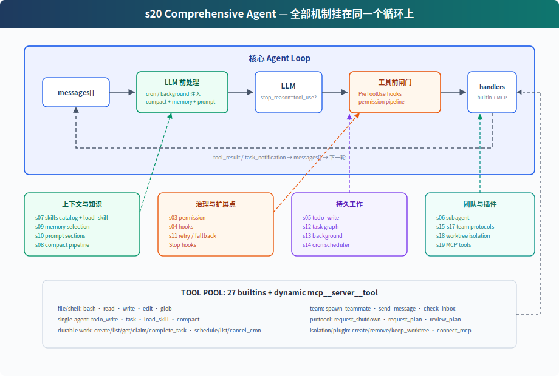

# s20: Comprehensive Agent — 全部机制，归到一个循环

[中文](README.md) · [English](README.en.md) · [日本語](README.ja.md)

s01 → ... → s18 → s19 → `s20`

> *"机制很多，循环一个"* — 工具、权限、记忆、任务、团队、插件都挂在同一个 while True 上。
>
> **Harness 层**: 综合 — 把前 19 章的机制放回同一个可运行系统。

---

## 问题

前 19 章每章只加一个机制。这样适合学习，但真实 Agent 不会只带一个机制运行。

一个能长期工作的 coding agent 需要同时拥有：

- 工具分发和权限边界
- hooks 扩展点
- todo 计划和任务图
- 技能、记忆、系统 prompt 组装
- 压缩和错误恢复
- 后台任务和 cron 调度
- 团队、协议、自治认领
- worktree 隔离
- MCP 外部工具接入

难点不是把功能堆起来，而是看清楚它们都挂在循环的哪个位置。S20 就是终点章：把所有组件归位。

---

## 解决方案



S20 不是再发明一个新机制，而是把前面的教学组件合成一个完整 harness：

```text
用户输入
  → UserPromptSubmit hooks
  → cron/background 通知注入
  → context compact
  → memory + skills + MCP 状态组装 system prompt
  → LLM
  → has tool_use block?
      否 → Stop hooks → 返回
      是 → PreToolUse hooks + permission
          → TOOL_HANDLERS / MCP handlers / background dispatch
          → PostToolUse hooks
          → tool_result / task_notification 回 messages
          → 下一轮
```

循环本身仍然是同一个结构：调用模型，检查响应里是否出现 `tool_use` block，执行工具，把结果追加回 `messages`。CC 源码里也不直接信任 `stop_reason == "tool_use"`，而是以实际出现的 tool_use block 作为是否继续工具轮的信号。变化的是循环周围的 harness 变完整了。

---

## 组件在循环中的位置

| 位置 | 组件 | 作用 |
|------|------|------|
| 用户输入前后 | `UserPromptSubmit` hooks | 记录、注入、审计用户输入 |
| LLM 前 | cron queue | 把定时触发的 prompt 注入 `messages` |
| LLM 前 | background notifications | 后台任务完成后以 `<task_notification>` 注入 |
| LLM 前 | compaction pipeline | 先压大输出，再裁历史，再压旧 tool_result，必要时摘要 |
| LLM 前 | memory / skills / MCP state | 组装 system prompt，让模型看到当前能力和长期上下文 |
| LLM 调用 | error recovery | 429/529 重试，`max_tokens` 升级，prompt too long 触发 reactive compact |
| 工具执行前 | `PreToolUse` hooks + permission | 拦截危险命令、写越界、破坏性 MCP 工具 |
| 工具分发 | `assemble_tool_pool` | 组装内置工具和 MCP 动态工具 |
| 工具执行时 | background dispatch | 慢 bash 操作放 daemon thread，主循环先返回占位结果 |
| 工具执行后 | `PostToolUse` hooks | 大输出告警、日志等后处理 |
| 返回循环 | tool_result | 每个 `tool_use` 对应一个 `tool_result`，再回到下一轮 |
| 本轮没有 tool_use / 停止时 | `Stop` hooks | 统计、清理、审计 |

---

## code.py 包含什么

### 工具与分发

内置工具池包含 27 个工具：

```text
bash, read_file, write_file, edit_file, glob
todo_write, task, load_skill, compact
create_task, list_tasks, get_task, claim_task, complete_task
schedule_cron, list_crons, cancel_cron
spawn_teammate, send_message, check_inbox
request_shutdown, request_plan, review_plan
create_worktree, remove_worktree, keep_worktree
connect_mcp
```

`assemble_tool_pool()` 每轮组装：

```text
BUILTIN_TOOLS + connected MCP tools
BUILTIN_HANDLERS + mcp__server__tool handlers
```

所以 `connect_mcp("docs")` 后，下一轮工具池里会出现 `mcp__docs__search`。

### 权限和 hooks

权限不写死在工具执行行里，而是作为 `PreToolUse` hook：

```python
blocked = trigger_hooks("PreToolUse", block)
if blocked:
    results.append(tool_result(block.id, blocked))
    continue
```

这样 permission、log、审计都可以挂在同一个 hook 点上。执行后再触发 `PostToolUse`。

### 计划与任务

S20 同时保留两层计划：

- `todo_write`：当前会话内的轻量计划，保存在内存中
- task graph：跨会话、可依赖、可认领的任务文件，写入 `.tasks/task_*.json`

前者帮助单个 Agent 不漂移；后者支撑团队协作。

### 子 agent 与团队

S20 有两种 delegation：

- `task`：一次性 subagent。独立 `messages[]`，中间过程丢弃，只返回最终摘要。
- `spawn_teammate`：持久队友线程。通过 MessageBus 收发消息，能 idle 轮询任务板并自动认领。

一次性 subagent 解决“上下文隔离”；持久队友解决“长期并行协作”。

### 记忆、技能和 prompt

`assemble_system_prompt(context)` 每轮组装：

- 身份和工具说明
- workspace
- skills catalog
- `.memory/MEMORY.md`
- 已连接 MCP server

技能只在 system prompt 里放目录。完整内容通过 `load_skill(name)` 按需加载。

### 压缩和恢复

LLM 前先跑压缩管线：

```text
tool_result_budget → snip_compact → micro_compact → compact_history
```

调用模型时再包一层恢复：

- 429：指数退避重试
- 529：指数退避，连续失败可切 fallback model
- `max_tokens`：先提高 max_tokens，再要求 continuation
- prompt too long：reactive compact 后重试

### 后台和 cron

慢 bash 操作不会阻塞主循环：

```text
should_run_background → start_background_task → placeholder tool_result
后台完成 → task_notification → 下一轮注入 messages
```

cron 调度器独立 daemon thread 每秒检查一次。CLI 会监听 `cron_queue`，命中后主动把 `[Scheduled] ...` 注入并运行一轮 Agent。

### worktree 与 MCP

worktree 负责隔离目录：

- `create_worktree(name, task_id)` 创建独立分支和目录
- task 的 `worktree` 字段绑定目录
- 队友 claim 到带 worktree 的 task 后，bash/read/write 自动在对应目录下执行

MCP 负责外部能力：

- `connect_mcp(name)` 连接 mock server
- `assemble_tool_pool()` 把 MCP 工具组装进工具池
- 工具名统一为 `mcp__server__tool`

---

## 相对 s19 的变化

| 组件 | s19 | s20 |
|------|-----|-----|
| 工具池 | 内置 + MCP | 内置 + MCP，补齐 s01-s18 的工具 |
| 权限 | 教学主体省略 | `PreToolUse` hook 中执行 |
| hooks | 省略 | UserPromptSubmit / PreToolUse / PostToolUse / Stop |
| todo | 省略 | `todo_write` + reminder |
| skill | 省略 | catalog in system prompt + `load_skill` |
| compact | 省略 | LLM 前压缩 + `compact` 工具 + reactive compact |
| error recovery | 简化 try/except | retry / max_tokens / prompt too long |
| background | 省略 | 慢操作后台线程 + task notification |
| cron | 省略 | daemon scheduler + durable jobs |
| multi-agent | 保留 | 保留；队友使用隔离目录下的基础工具 |
| worktree | 保留 | 保留 |
| MCP | 新增 | 保留，作为最终工具池的一部分 |

---

## 试一下

```sh
cd learn-claude-code
python s20_comprehensive/code.py
```

可以试：

1. `Create a todo list for inspecting this repo, then list Python files`
2. `Connect to the docs MCP server and search for agent loop`
3. `Create two tasks, create worktrees for them, then spawn alice and bob. Ask them to submit plans before claiming tasks.`
4. `remind me of the meeting in 3 minutes.`
5. `Run npm install in the background and continue reading README.md`

观察重点：

- 工具调用前是否经过 hooks/permission
- `connect_mcp` 后下一轮是否出现 MCP 工具
- 慢操作是否返回 background placeholder
- 到点是不是自动提醒开会
- 队友是否提交 plan，并在 approval 前暂停
- plan 批准后，队友是否能认领任务
- worktree 绑定后，队友是否切到对应目录

---

## 结束亦是开始

从 s01 到 s20，代码表面越来越复杂，但核心始终没变：

```python
while True:
    response = LLM(messages, tools)
    if not has_tool_use(response.content):
        return
    results = execute_tools(response.content)
    messages.append(tool_results)
```

Claude Code 的复杂性不是“另一个 agent 大脑”，而是一个成熟 harness 的复杂性。模型负责判断和行动选择；harness 负责把环境、工具、权限、记忆、团队和外部能力组织好。

这就是全书的终点：机制很多，循环一个。
